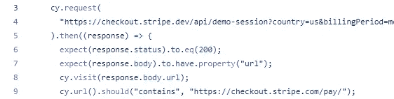
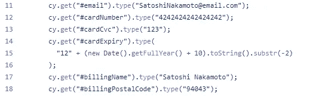
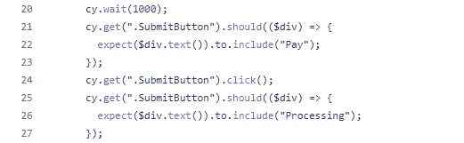

# 如何用 Cypress 测试你的条纹检出

> 原文：<https://javascript.plainenglish.io/how-to-test-your-stripe-checkout-with-cypress-972a663b33f7?source=collection_archive---------7----------------------->

## 在这篇文章中，我们将研究如何测试一个使用条纹结帐的网站，为您的电子商务带来更多的测试！

[https://github.com/riccardogiorato/cypress-for-everything/tree/main/examples/stripe](https://github.com/riccardogiorato/cypress-for-everything/tree/main/examples/stripe)

# 介绍

Stripe Checkout 是一个预建的托管支付页面，针对转换进行了优化。它自动连接到您的 Stripe 帐户，能够创建完整的电子商务产品，而无需编码或维护结帐。

像应用程序的其他部分一样，你也可以用 Cypress 测试 Stripe Checkout！

在本教程中，我们将使用通过使用 Stripe APIs 直接创建的登台演示环境，这些 API 是我们从官方演示页面中找到的:

*   [检验条带 devi api 演示会话](https://checkout.stripe.dev/api/demo-session?country=us&billingPeriod=monthly&hasBgColor=false&hasBillingAndShipping=false&hasCoupons=false&hasFreeTrial=false&hasShippingRate=false&hasTaxes=false&mode=payment&wallet=googlePay&hasPolicies=false&billingType=flat)

# 插入信用卡信息和帐单

在前 3 行中，从第 3 行到第 5 行，我们从 stripe API 中获取一个新的演示 URL，我们将只在这个演示中使用它，在真实环境中，在前面的用户步骤之后，您只需使用
cy.visit 来加载您的结账页面。

测试 Stripe Checkout 的美妙之处在于，您不需要像使用 Stripe 元素那样学习使用 iFrames 或其他插件。
( [Stripe 元素使用内嵌在页面中的 iFrame，这让测试变得有点困难](https://github.com/riccardogiorato/cypress-for-everything/tree/main/examples/stripe#stripe-elements))

在这种情况下，我们只需运行第 11 行到第 18 行，插入不同的字段，如“email”或“cardNumber”等。

作为最后一步，我们等待 1 秒或 1000 毫秒，然后继续这些步骤，我们这样做是为了让 Stripe Api 处理输入，因为与人相比，Cypress 执行前面的步骤往往太快，在许多情况下，Stripe 可能仍然在加载或验证字段。

然后我们通过点击“提交按钮”结束结帐过程！

# 结论

构建 E2E 测试没有对错之分。您应该关心的唯一事情是构建一个适当的测试来自动化您的手动操作。

> 更少的时间做手工测试，更多的时间享受构建其他东西的乐趣！

请在评论中告诉我们你希望下一次看到哪种考试！

# 资源

*   Stripe Checkout 示例:[https://github . com/riccardogiorato/cypress-for-everything/blob/main/examples/stripe/cypress/integration/stripe-check out . ts](https://github.com/riccardogiorato/cypress-for-everything/blob/main/examples/stripe/cypress/integration/stripe-checkout.ts)
*   柏树示例目录:[柏树万能#示例](https://github.com/riccardogiorato/cypress-for-everything#examples)
*   条纹元素示例:[https://github . com/riccardogiorato/cypress-for-everything/blob/main/examples/stripe/cypress/integration/stripe-Elements . ts](https://github.com/riccardogiorato/cypress-for-everything/blob/main/examples/stripe/cypress/integration/stripe-elements.ts)
*   条纹示例:[https://github . com/riccardogiorato/cypress-for-everything/tree/main/examples/stripe](https://github.com/riccardogiorato/cypress-for-everything/tree/main/examples/stripe)

*更多内容请看*[***plain English . io***](http://plainenglish.io/)