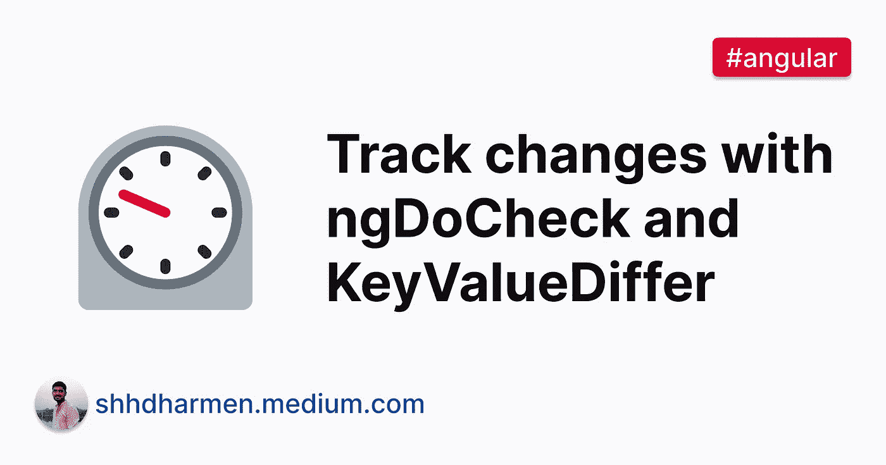
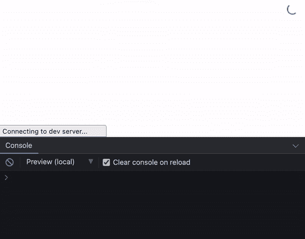
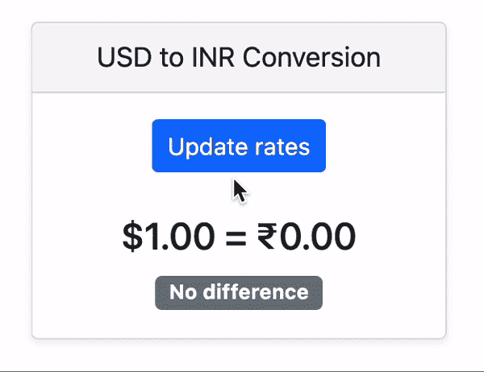
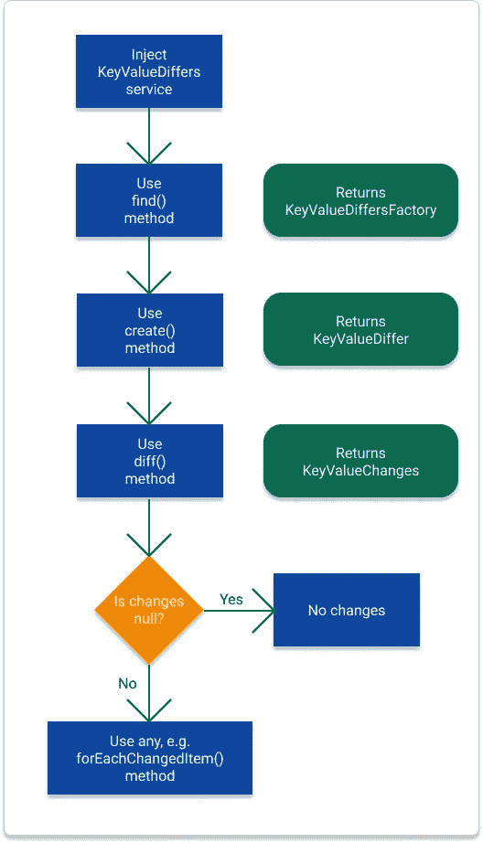

# 如何使用 KeyValueDiffer 跟踪 ngDoCheck 中的更改

> 原文：<https://javascript.plainenglish.io/how-to-track-changes-in-ngdocheck-with-keyvaluediffer-6667ed7a1dad?source=collection_archive---------5----------------------->

当我们使用`ngDoCheck`来检测变化时，我们需要确保我们的实现是极其轻量级和快速的，以便它不会影响用户体验。在本教程中，我们将学习如何使用`KeyValueDiffer`有效地跟踪和处理这些变更。

# `ngDoCheck`生命周期挂钩

这个生命周期挂钩的官方定义是这样的:

*“检测 Angular 自身无法或不愿检测到的变化并采取相应措施。每次运行更改检测时，在 ngOnChanges()之后立即调用，第一次运行时，在 ngOnInit()之后立即调用。*

简单地说，角度跟踪通过对象引用绑定输入。这意味着如果一个对象引用没有改变，绑定改变不会被检测到，改变检测也不会被执行。这就是我们需要`[ngDoCheck](https://angular.io/api/core/DoCheck)`的地方。

# 实际用法

理解在处理代码时何时使用`ngDoCheck`生命周期钩子以及它与`ngOnChanges`有何不同是非常重要的。

例如，我们将考虑两个组件:

1.  `my-app` -具有基本布局和`rates`属性，表示一段时间内 1 美元的印度卢比汇率。
2.  `app-rates` -接受`rates`的单个`@Input`

我们的目标是跟踪`rates.inr`的变化并在`app-rates`中显示。让我们从编码开始:

`my-app`的代码是基本的。它只显示`rates`，我们也给出了一个`button`，它将通过调用`updateRates`来更新`rates`。

让我们看看`app-rates`的代码:

`app-rates`的模板只显示`diff`，代表`rates.inr`从上次开始变化了多少。而如果没有变化，就会显示“没有区别”的文字。

现在，为了简单地得到`diff`，我们需要计算新值和旧值之间的差值。

我们可能会想到用`ngOnChanges`来做这件事。让我们先来看看在生命周期挂钩中我们得到了什么变化:

现在，让我们留意控制台，并单击“更新率”按钮:

请注意，`ngOnChanges`只有在第一次分配`rates`时才会被调用。这是因为我们没有通过从`my-app`引用来改变`rates`对象。如果我们在`my-app`中写下如下内容，那么`ngOnChanges`将捕捉到这些变化:

与`ngOnChanges`不同的是，`ngDoCheck`跟踪所有的变化，无论它们是否被引用，甚至更多。让我们在例子中利用它:

在上面的代码中，我们引入了一个名为`oldRate`的新属性。在`ngDoCheck`中，我们检查新的`rates.inr`是否与`oldRate`不同，然后它应该更新`diff`。现在让我们看看输出:

*要了解更多关于* `*ngDoCheck*` *的内容，我推荐您阅读文章:* [*如果您认为*](https://indepth.dev/posts/1131/if-you-think-ngdocheck-means-your-component-is-being-checked-read-this-article) `[*ngDoCheck*](https://indepth.dev/posts/1131/if-you-think-ngdocheck-means-your-component-is-being-checked-read-this-article)` [*意味着您的组件正在被检查——阅读这篇文章——Angular depth*](https://indepth.dev/posts/1131/if-you-think-ngdocheck-means-your-component-is-being-checked-read-this-article)*。*

该示例可在 [stackblitz](https://stackblitz.com/edit/angular-ivy-tcrchs?file=src/app/rates/rates.component.ts) 上找到。这段代码给出了预期的结果。但是 Angular 很少提供有效跟踪对象随时间变化的工具。让我们调查一下。

# 键值差异和实用程序

当我们想使用`KeyValueDiffer`时，会涉及到一些接口和一个服务。下面的插图涵盖了所有这些内容:

以下是摘要:

1.  我们将注入服务`[KeyValueDiffers](https://angular.io/api/core/KeyValueDiffers)`并使用它的方法获得一个`KeyValueDifferFactory`
2.  接下来，我们将使用`[KeyValueDifferFactory](https://angular.io/api/core/KeyValueDifferFactory)`的方法创建`[KeyValueDiffer](https://angular.io/api/core/KeyValueDiffer)`
3.  我们将通过`KeyValueDiffer`的方法跟踪变化。它返回`KeyValueChanges`
4.  最后，我们将使用`[KeyValueChanges](https://angular.io/api/core/KeyValueChanges)`的[方法之一](https://angular.io/api/core/KeyValueChanges#methods)来分析【】的变化，例如`[forEachChangedItem](https://angular.io/api/core/KeyValueChanges#foreachchangeditem)`
5.  所有方法都提供对变更记录的访问`KeyValueChangeRecord`
6.  `[KeyValueChangeRecord](https://angular.io/api/core/KeyValueChangeRecord)`界面是表示项目变更信息的记录

# 实际用法

我们将在之前创建的`app-rates`中使用上述实用程序。我们将从空白`ngDoCheck`开始:

我们的目标是用`KeyValueDiffer`工具跟踪对`rates`属性所做的更改。

让我们首先创建一个`differ`:

由于`rates`对象有类型`string`的键和类型`number`的值，我们用`KeyValueDiffer`分别传递两种类型`string`和`number`。您可以根据自己的需要进行更改。

接下来，让我们注入`KeyValueDiffers`服务:

是时候从服务中初始化`differ`了。我们将在`ngOnInit`做生命周期挂钩:

在上面的代码中，首先，我们调用了`find()`方法。这个方法首先在内部检查作为参数传递的对象是不是一个`Map`或者 JSON，如果检查成功，那么它返回`KeyValueDiffersFactory`。你可以在 [GitHub](https://github.com/angular/angular/blob/b1c028677f45e704342e81d7957d024c137340ce/packages/core/src/change_detection/differs/keyvalue_differs.ts#L179) 上查看它的源代码，但总的来说，下面是它的样子:

在`find()`之后，我们正在调用`KeyValueDiffersFactory`的`create()`方法，它创建了一个`KeyValueDiffer`对象。

接下来，我们将使用`differ`并在`ngDoCheck`中调用它的`diff()`方法:

`diff()`方法返回`KeyValueChanges`或`null`。如前所述，`KeyValueChanges`提供了跟踪所有变更、添加和删除的方法。

在我们的例子中，我们需要跟踪对`rates`所做的更改，所以我们将使用`forEachChangedItem()`并计算`diff`:

`app-rates`的最终代码如下所示:

这个例子在 [stackblitz](https://stackblitz.com/edit/angular-ivy-nwzydo?file=src/app/rates/rates.component.ts) 上也有。

# 结论

我们首先从一个简短的介绍开始。然后我们学习了跟踪变更所需的实用程序，即接口`[KeyValueDiffer](https://angular.io/api/core/KeyValueDiffer)`、`[KeyValueChanges](https://angular.io/api/core/KeyValueChanges)`、`[KeyValueChangeRecord](https://angular.io/api/core/KeyValueChangeRecord)`和`[KeyValueDifferFactory](https://angular.io/api/core/KeyValueDifferFactory)`以及`[KeyValueDiffers](https://angular.io/api/core/KeyValueDiffers)`服务。

最后，我们在代码中实现了这一切，并使用`[KeyValueChanges.forEachChangedItem](https://angular.io/api/core/KeyValueChanges#forEachChangedItem)`跟踪了对`rates`对象的更改。

Angular 的内置指令也使用了这种策略，你可以在 [GitHub](https://github.com/angular/angular/blob/master/packages/common/src/directives/ng_style.ts) 上查看它的代码。

在本教程中，我们学习了跟踪对对象所做的更改。还可以跟踪对数组所做的更改。为此，您将需要以同样的方式使用`[IterableDiffers](https://angular.io/api/core/IterableDiffers)`服务和相关接口。关于它的更多信息，请查看 GitHub 上的代码，Angular 团队已经在那里使用了 T3。

*最初发表于*[*depth . dev*](https://indepth.dev/tutorials/angular/track-changes-in-ngdocheck-with-keyvaluediffers)*。*

*更多内容请看*[***plain English . io***](http://plainenglish.io/)