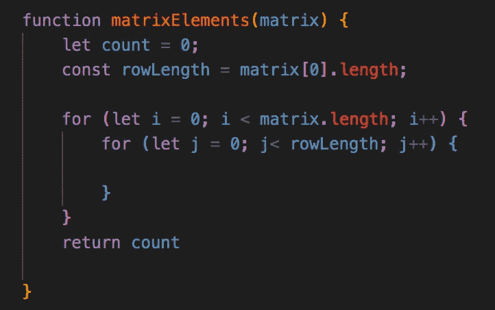
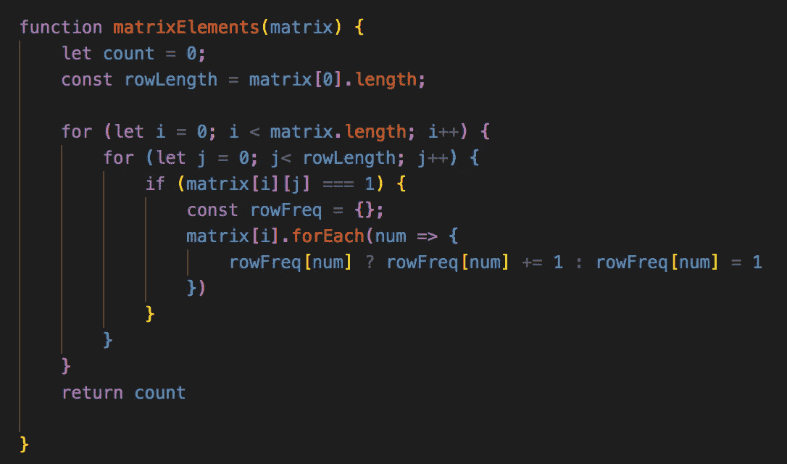
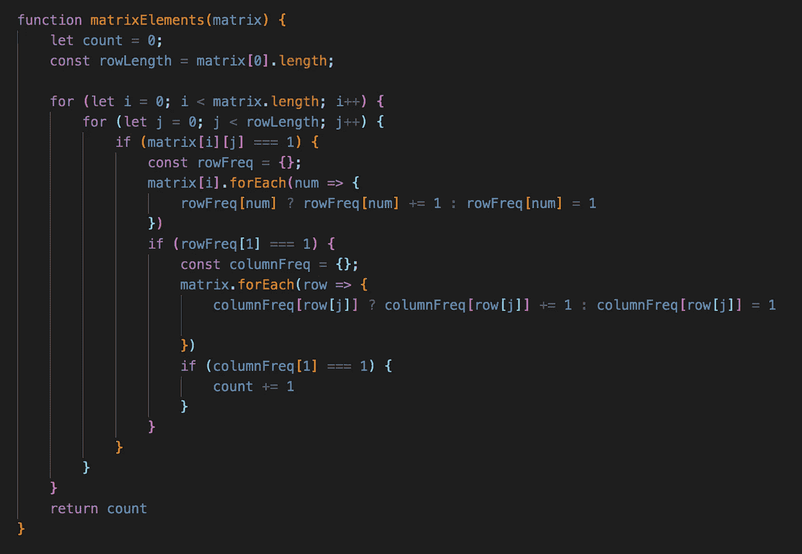

# 如何遍历矩阵:行和列中的最大元素

> 原文：<https://javascript.plainenglish.io/how-to-traverse-a-matrix-largest-elements-in-their-rows-columns-e48621ce1f6e?source=collection_archive---------4----------------------->

## 演示如何处理包含 0 和 1 的二维整数列表，并使用 JavaScript 中的频率计数器查找最大的元素

欢迎来到矩阵。不，*不是那个矩阵*，很遗憾。

当我在 Leetcode，或者在这种情况下，binarysearch.com 的页面上徘徊时，我倾向于回避我不熟悉的输入。我很容易被吓到(这不是骗人的！)

矩阵也不例外。到目前为止，如果我看到一个矩阵作为输入，我会立即转向另一个问题。然而，今天我不得不勇敢地面对我的恐惧，因为我和我的朋友在一次结对编程中遇到了这个问题。不出所料，我很难想象如何处理这样的输入，更不用说尝试解决问题了。

我的朋友，以典型的方式，开始不停地编码&在我理解问题之前就找到了解决方案。然而，当我开始一步一步地解决问题&开始以一种不同的方式可视化矩阵时，事情开始变得明朗起来&突然间，问题和解决方案变得有意义了。

我希望这篇文章能帮助你实现那个时刻。事不宜迟，让我们跳进自己的矩阵世界，解决这个问题。


Which will it be?

# 什么是矩阵？

这是我们的第一个障碍。让我们来看一个简单的矩阵:

```
matrix = [
    [0, 0, 1],
    [1, 0, 0],
    [0, 1, 0]
]
```

乍一看，它可能看起来令人望而生畏。我花了几分钟对自己思考，*我到底该怎么做？*

但如果你仔细观察，我们的矩阵只是一个数组的数组。让我们把矩阵改写成不那么可怕的东西:

```
matrix = [ [0, 0, 1], [1, 0, 0], [0, 1, 0] ]
```

好吧，这个小小的调整让事情变得稍微好了一点(这可能也是我反应迟钝的原因)。但是矩阵到底是什么？

在我们的例子中，矩阵是数字的平方，或者是数字的 2D 矩阵。换句话说，子数组在数组中必须包含相同数量的元素。在上面的例子中，我们的每个数组都有三个整数。如果其中一个有 4 或 2 个元素，它就不再是一个矩阵。

现在我们对矩阵有了更好的理解，让我们引入一个问题来学习如何遍历矩阵。

# 问题是

问题陈述:

*给你一个二维的整数列表* `*matrix*` *，包含* `*1*` *s 和* `*0*` *s，返回* `*matrix*` *中元素的个数如下:*

*   `*matrix[r][c] = 1*`
*   `*matrix[r][j] = 0*` *为每* `*j ≠ c*` *和* `*matrix[i][c] = 0*` *为每* `*i ≠ r*`

哇哦。好吧——我从哪里开始理解这一点呢？

让我们再看看上面的例子:

```
matrix = [
    [0, 0, 1],
    [1, 0, 0],
    [0, 1, 0]
]
```

看我们的第一个要点，我们想找到`*matrix[r][c] = 1.*`

记住，我们的矩阵是数组的数组。因此，r 表示行，即矩阵中的三个子数组，c 表示列，即每个子数组中的三个整数。

我们在寻找 1 的值。然而，在我们的第二个要点中，我们有几个额外的事情要考虑。

*   `*matrix[r][j] = 0*` *为每一个* `*j ≠ c*`

这意味着在我们找到 1 的那一行中，所有其他值都必须等于 0。

*   `*matrix[i][c] = 0*` *为每一个* `*i ≠ r*`

这意味着，在我们找到 1 的列(或索引)中，该索引中的所有其他子数组都必须是 0。

让我们再来看看我们的样本矩阵:

```
matrix = [
    [0, 0, 1],
    [1, 0, 0],
    [0, 1, 0]
]
```

我们可以看到，在我们的第一排，我们有一个*一个* 1(与第二个&第三排相同)。然后我们检查它们各自的列中是否有 1，在这种情况下没有。因此，本例的预期输出是 3。我们有`matrix[0][2]`、`matrix[1][0]`和`matrix[2][1]`符合标准。

让我们看另一个例子:

```
matrix = [
    [0, 0, 1],
    [1, 0, 0],
    [1, 0, 0]
]
```

我们可以看到每排有*一个* 1。然而，当我们检查它们各自的列中是否有 1 时，我们看到第 2 个&第 3 行在第 0 个索引中都包含 1。只有`matrix[0][2]`符合标准。其他两个`1`共享同一列，因此我们的预期输出是 1。

在这一点上，我们应该感觉很好。我们终于很好地理解了这个问题&我们想要的输出应该是什么。我们已经通过对矩阵的理解取得了重大进展——也许我们应该稍微变通一下？


Maybe my back isn’t ready for this after all…

# 方法

让我们谈谈我们将如何处理这个问题。记住，我们的矩阵本质上是一个数组的数组。我们不仅需要迭代我们的矩阵数组，还需要迭代每个子数组的单个元素，以计算其行和列中 1 的数量。

也就是说，我认为我们可以建立一个外部 for 循环来迭代我们的三个数组。然后，我们可以设置一个内部 for 循环来迭代子数组的每个元素。

这就是我们使用频率计数器发挥作用的地方。当我们找到一个 1 时，我们可以计算这一行中 1 的数量。如果不止一个，那么我们知道这不算数&我们继续迭代。然而，如果 1 的频率计数仅仅是 1，那么我们可以进行第二个频率计数器来计数其他数组中该索引中 1 的数量。如果 1 的频率计数在这种情况下也是 1，我们可以得出结论，矩阵[r][c]满足我们所有的标准，我们可以将计数增加 1。

咻——我知道这很复杂&用一种混乱的方式来解决这个问题，但是和我在一起吧！

# 伪代码

在我们开始之前，让我们先做一点伪代码&用简单的英语看看我们的代码会是什么样子:

1.  实例化一个名为 count 的变量。这将是我们函数结束时的输出
2.  建立一个外部 for 循环，它将迭代矩阵的长度，换句话说，就是数组中子数组的数量
3.  建立一个内部 for 循环，它将迭代一个子数组的长度(记住，我们所有的子数组都有相同的长度)
4.  如果矩阵[i][j]等于 1，我们将需要计算该子数组中 1 的总数。我们将把频率计数器存储在一个名为 rowFreq 的散列中。
5.  如果 rowFreq[1](即该行中 1 的总频率)等于 1，我们将需要计算每个子数组的索引中 1 的总数。我们将把频率计数器存储在一个名为 columnFreq 的散列中。
6.  如果我们的 columnFreq[1]等于 1，我们可以得出结论，它是该行&该列中唯一的 1，并将我们的计数增加 1

# 解决方案

太好了——让我们开始写代码吧。在上面的伪代码中，我们已经有了路线图，所以让我们一步步来:



在上面的代码片段中，我们实例化了 count 变量，并设置了每个子数组的长度。我们设置了两个 for 循环，外部的 for 循环迭代矩阵数组的长度，内部的 for 循环迭代子数组的长度。



在上面的代码片段中，我们检查子数组中是否有 1。如果我们找到 1，我们为该行设置一个频率计数器，以确定该子数组中 0 和 1 的数量。



在上面的代码片段中，如果 rowFreq[1]的频率是 1，那么我们必须计算所有其他子数组的相同索引中 1 和 0 的频率。如果 columnFreq[1]的值是 1，那么我们将计数增加 1。

# 结论

我希望这个演练能让你更好地理解什么是矩阵，以及我们如何使用外部和内部 for 循环遍历它。在我们的具体练习中，我们需要遍历矩阵来检查矩阵的行和列中 1 的频率。

虽然我承认这肯定不是解决这个问题的最干净的方法，但对于我们这些刚刚接触这些新概念的新手来说，这是一个很好的入门。我欢迎您的意见——如果您对矩阵有其他方法或问题，请随时联系我们，并在下面留下您的评论。

下次见！

*更多内容看*[***plain English . io***](http://plainenglish.io)