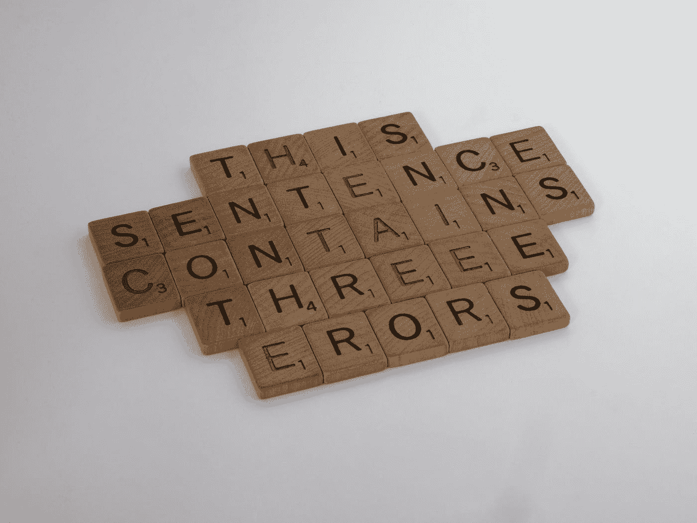

# 如何在 JavaScript 中将数组变成不带逗号的字符串

> 原文：<https://javascript.plainenglish.io/how-to-turn-an-array-into-a-string-without-commas-in-javascript-241598bb054b?source=collection_archive---------5----------------------->

## 如果您需要将所有数组项转换成一个没有逗号分隔的字符串，那么您需要将空字符串`""`作为参数传递给 array `.join()`方法。

Photo by [Brett Jordan](https://unsplash.com/@brett_jordan?utm_source=medium&utm_medium=referral) on [Unsplash](https://unsplash.com?utm_source=medium&utm_medium=referral)

# 将数组转换成不带逗号的字符串

当你不带参数调用 JavaScript 的`.join()` ( `[Array.prototype.join()](https://developer.mozilla.org/en-US/docs/Web/JavaScript/Reference/Global_Objects/Array/join)`)方法时，你实际上使用了一个逗号。

`.join()`的默认行为是[将一个数组转换成一个带逗号](https://medium.com/coding-at-dawn/how-to-convert-an-array-to-a-string-with-commas-in-javascript-79e212506c2) 的字符串**，所以和显式调用`.join(",")`是一样的。**

当您调用`.join(",")`时，您指定您想要一个[字符串](https://medium.com/javascript-in-plain-english/how-to-check-for-a-string-in-javascript-a16b196915ff)文字`","`作为分隔符，它将出现在每个元素之间。但是和`.join()`一样完全没有争论。

如果您使用空字符串`""`调用`.join("")`，那么所有的元素将被连接在一起**而没有逗号****。**

**我们可以用`.split()`方法(`[String.prototype.split()](https://developer.mozilla.org/en-US/docs/Web/JavaScript/Reference/Global_Objects/String/split)`)来演示这种行为，该方法拆分一个字符串并返回一个[数组](https://medium.com/javascript-in-plain-english/how-to-check-for-an-array-in-javascript-6ad20f7a0e21)。`.split()`方法也采用分隔符。**

**默认情况下，没有参数的`.split()`根本不会拆分字符串，所以从这个意义上说，它不是`.join()`的完美镜像。但是`.split(",")`和`.join()`是等价的。**

**`.join()`和`.split()`都可以与任何长度的任何字符串一起用作分隔符，但您会经常看到使用单个逗号，就像创建. csv(逗号分隔值)文件时一样。**

**在下面的代码示例中，我们将采用逗号分隔的字符串，将它转换为单个字符的数组，然后将该数组连接成不带逗号的字符串。**

****

**[View raw code](https://gist.github.com/DoctorDerek/3d413e3476053cd0beca671b0ecb2a12) as a GitHub Gist**

**在下一个例子中，我使用了一个仅包含表情符号的字符串:**

****

**[View raw code](https://gist.github.com/DoctorDerek/3d413e3476053cd0beca671b0ecb2a12) as a GitHub Gist**

**在最后一个例子中，我使用了不同的替换字符串:**

****

**[View raw code](https://gist.github.com/DoctorDerek/3d413e3476053cd0beca671b0ecb2a12) as a GitHub Gist**

**在代码示例中，我们通过对字符串调用`.split(",")`，将一个带逗号的字符串转换成一个不带逗号的数组。**

**在生成的数组中，每个元素都是一个包含一个字符的字符串，因此我们通过使用空字符串`""`作为分隔符来调用`.join("")`，而不是没有参数的`.join()`，来反转这个过程。**

**当我们没有表情符号时，我们可以使用空字符串`.split("")`将一个字符串拆分成单独的字符。然而，表情符号在幕后各有两个角色，因此`.split("")`将每个表情符号拆分成结果数组中的两个元素。这就是代码示例中逗号分隔的表情符号列表和纯文本之间存在差异的原因。**

# **结论:用`.join("")`连接，不用逗号**

**现在我们已经看到了如何获取一个带逗号的字符串输入和创建一个不带逗号的字符串，所有这些都没有使用`[.replace()](https://developer.mozilla.org/en-US/docs/Web/JavaScript/Reference/Global_Objects/String/replace)` ( `String.prototype.replace()`)方法。**

**在 JavaScript 中，`.replace()`方法用于将一个字符(或一组字符)替换为另一个字符，因此`string.replace(",","")`将删除字符串中的所有逗号。**

**我认为使用`.join()`和`.split(",")`显示不带逗号的字符串与数组之间的转换会更有帮助，而不是直接用字符串替换逗号。**

**要记住如何以没有逗号的字符串形式加入数组，只需记住空字符串`""`表示没有逗号，请:`.join("")`。**

**当然，你可以用任何你想要的其他字符`|`、表情符号`😂`或字符串`🍌BANANAS`来替换逗号`,`。**

**得到的字符串将没有逗号，因为逗号将被您传递给`.join()`的字符串替换。**

**而且，因为根本没有分隔符，而是逗号，导致一个巨大的字符串，不要忘记我们亲爱的朋友`.join("")`。**

****快乐编码！** `😂🍌✈🛫🛬🛩`**

**德里克·奥斯汀博士是《职业编程:如何在 6 个月内成为成功的 6 位数程序员》一书的作者，该书现已在亚马逊上出售。**