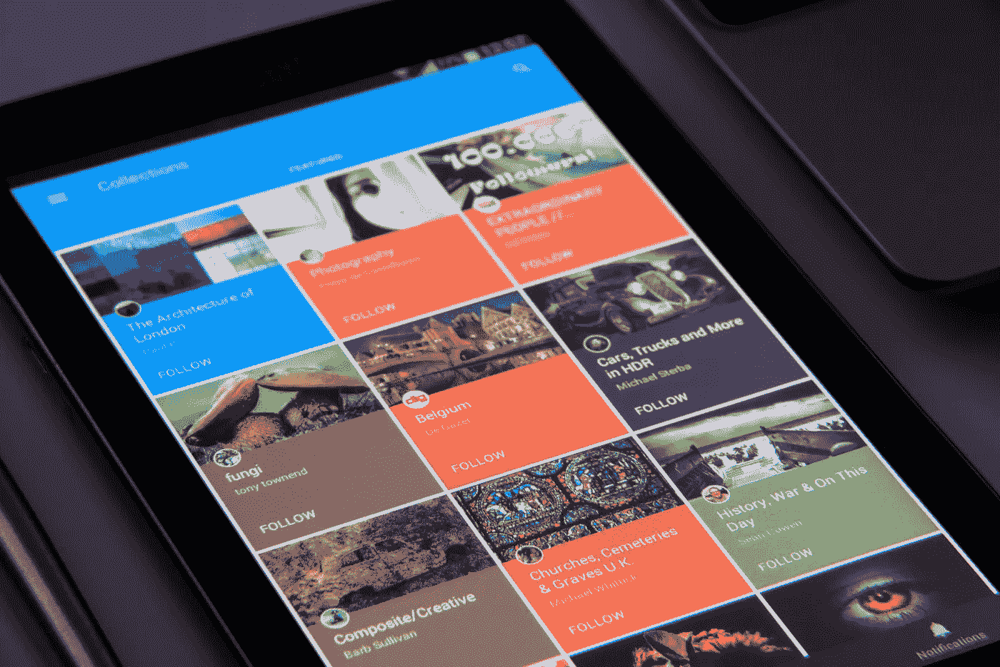
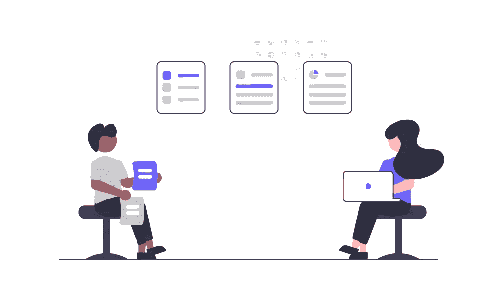
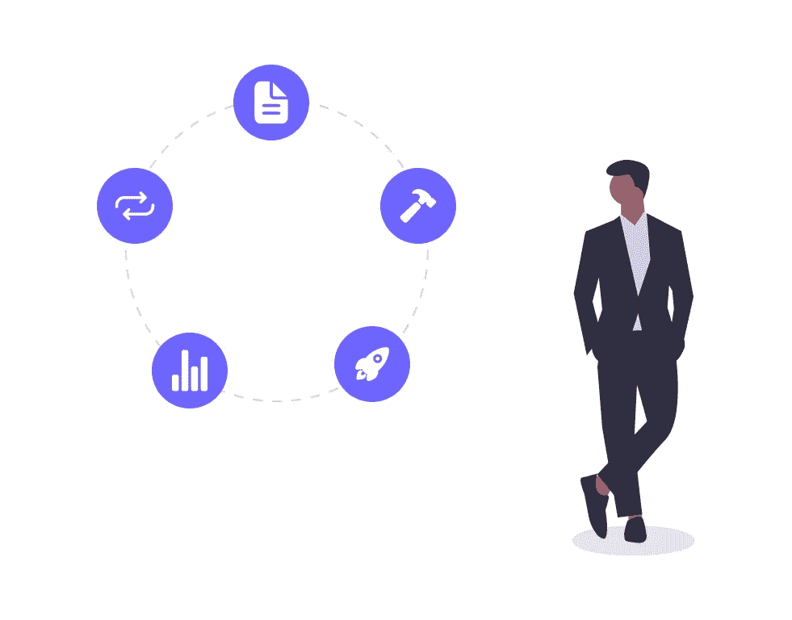
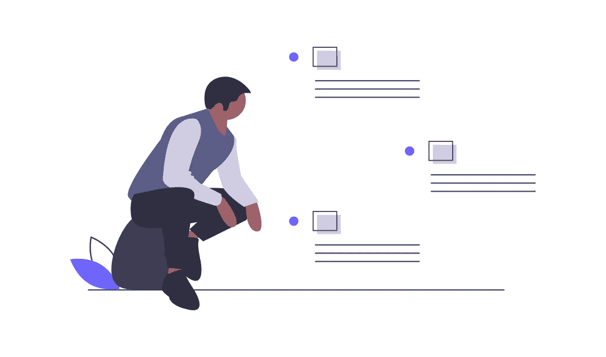
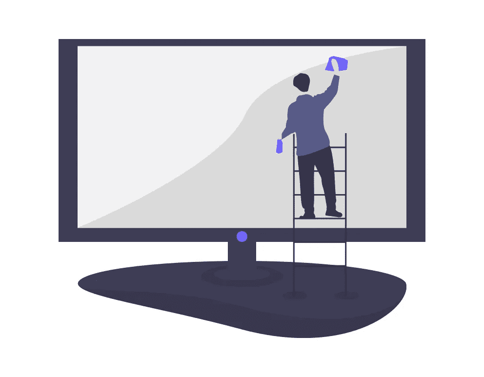

# 如何将想法转化为应用程序

> 原文：<https://javascript.plainenglish.io/how-to-turn-an-idea-into-an-app-b7970048f87a?source=collection_archive---------13----------------------->

## 创建成功应用程序的简单步骤

Photo by [PhotoMIX Company](https://www.pexels.com/es-es/@wdnet?utm_content=attributionCopyText&utm_medium=referral&utm_source=pexels) on [Pexels](https://www.pexels.com/es-es/foto/telefono-encendido-con-libro-de-colecciones-242492/?utm_content=attributionCopyText&utm_medium=referral&utm_source=pexels)

和其他学科一样，在软件世界里，棘手的事情是没有一个想法；困难的是实现它。在本文中，我将列出我开发应用程序所采取的步骤，从客户告诉我一个想法到开发的最后阶段。

请记住，开发应用程序的最终目标必须是为客户提供一些好处，比如通过提高生产率降低成本，获得新的收入，或者改善您与客户的关系。

# 启动

By [https://undraw.co](https://undraw.co/search)

## 1.满足客户需求

我们发展的目的是什么，它会给客户带来什么利润？他们想建造一些东西，因为它很时尚吗？还是因为他们的竞争对手有类似的东西？这是一个新想法吗？他们需要吗？

在第一次会议上要问的其他有用问题:

*   预算是多少？
*   截止日期是什么时候(真正的截止日期)？根据经验，我可以向您保证，在新项目开始时，他们总是会告诉您一个不真实的日期，因为他们认为如果催您，您会更快完成。
*   它将在哪里举办？
*   该应用的盈利战略是什么？
*   目标用户是谁？

## 2.确定应用程序可以解决的问题

该应用程序必须以这样或那样的方式为客户提供价值，无论是直接还是通过使用它的用户间接提供。

## 3.定义一组基本功能

与客户就最低可行产品(MPV)达成协议是很重要的，以开发必要的功能，为用户提供价值。您总是可以在未来改进它并添加新功能。

## 4.定义隐私和法律要求

这一点目前至关重要。应用程序需要什么 cookies？它收集哪些数据？我们要在哪里举办呢？我们该如何处理他的私人数据？所有这些都必须从一开始就考虑进去，因为它会极大地改变应用程序的整个开发和部署。

## 5.创建应用程序的模型

创建低保真度原型展示给客户，以确保他们和您一样理解。使用原型也比直接开始编码更容易和更快。

一个好的工具可以是[moqups.com](https://app.moqups.com/sign-up)。

## 6.定义他们将在哪里以及如何使用它

决定应用程序将在哪些设备上使用，并选择将开发它的技术:混合、本机应用程序。

确定将在何处托管/部署:在云中、专有物理环境中，或者像应用商店或谷歌游戏商店这样的商店。

请记住，创建一个网络应用程序比创建一个应用程序(混合应用程序或本地应用程序)要容易得多，因为为不同的商店上传和更新它总是需要时间。相反，如果你把它上传到像应用商店或谷歌游戏商店这样的商店，赚钱就更容易了。

如果您要开发一个将在 IOS 中使用的应用程序，您将需要一台带有 IOS 的计算机来进行开发和测试。对安卓来说，这更容易，因为任何一台电脑都可以。

## 7.建立与客户定期和频繁会面的时间表

你可以称之为敏捷方法论，或者任何你想要的东西，但是第二次会议的日期必须与第一次会议要达成的明确目标一起确定。然后在会议中建立一个周期，在这里你将决定在每个迭代中做什么。会议结束时，将演示所开发的产品。

客户将始终拥有在生产环境中开发的产品，在这种环境中，他将能够测试已完成的所有工作并查看进度。

## 8.完成的定义

明确定义“完成”的含义。done (DoD)的定义是指软件产品必须满足的所有条件或接受标准都已满足并准备好由客户接受。

如果你问一个软件开发者什么时候一件事情完成了，然后问客户，你一定会得到一个惊喜，发现它是不一样的。

# 必需品

By [https://undraw.co](https://undraw.co/search)

## 7.从零分钟开始定义生产环境

我已经开发了许多项目，在开始的时候，我们都是在本地环境中完成的(每个人都在他的电脑上)。我们从开发人员的电脑向客户展示了这些演示。最后，当我们认为一切都已完成时，我们不得不投入额外的时间来投入生产，因为总是会出现一些问题。

现在我们反过来做。我们从一开始就解决了所有的技术问题:它将在哪里托管，它将如何部署和自动化，或者将使用哪个领域；这样，我们总是在一个真实的生产环境中工作和部署，在最后的 Demo 中，一切都准备好了，只剩下一些时间留给一小部分真实用户的最后测试阶段。

顺便说一句，把它放在最终的生产环境中不是问题。只有我们授权的人才能使用它。一个简单的登录屏幕就能解决这个问题。

## 8.定义非功能性需求

非功能性需求指定用于评估信息技术服务的操作的规则，这与指定特定行为的功能性需求相反。一般来说，实现非功能性需求的计划在系统架构中详细说明，而功能性需求的计划在设计中设置。

这不是我第一次看到在初始阶段如何忽略非功能性需求。这可能会导致巨大的项目成本，因为许多事情可能必须重做，甚至产品体系结构的重要部分可能必须更改，请小心这一点。

要考虑的一些非功能性要求包括:

*   可量测性
*   证券
*   有效性
*   隐私
*   可维护性
*   容错

## 9.在生产环境中自动实现和部署“hello world”

对于第一个演示，构建一个简单的“hello world ”,并配置项目的管道，以便当您将代码上传到存储库中时，在生产环境中构建和部署应用程序( [Github](https://github.com/) 、 [BitBucket](https://bitbucket.org/product) )。

您必须做所有必要的事情，让您的应用程序从零时刻开始在一个真实的生产环境中工作，这样客户端就可以在第一个演示的最终环境中看到“hello world”。

我向你保证，要做到这一点，即使上面的步骤看起来很简单，很多事情都会发生。

## 10.对客户进行第一次演示

向客户解释，新特性将直接添加到每个迭代的生产环境中，以查看和测试它们。记住七点:建立一个频繁和定期会议的时间表。

# 重复

By [https://undraw.co](https://undraw.co/search)

## 11.保持简单

从一开始就这样做，不要找借口，将来你会感谢自己的。每当你完成一个特性时，重构它，让代码尽可能简单。
保持代码尽可能简单和松散耦合的一个简单方法是使用 [TDD](http://agiledata.org/essays/tdd.html) 并从头开始应用 [SOLID](https://en.wikipedia.org/wiki/SOLID) 原理。

从一开始就应用好的实践是不可或缺的。

## 12.强调应用的 UX/用户界面

设计应用程序是应用程序在市场上成功的一个重要因素。请记住，一个好的 UI-UX 意味着良好的可发现性，并且用户会使用它。

开始构建移动第一应用的一个很好的网站可能是使用 [Bootstrap](https://getbootstrap.com/) 或类似工具。

## 13.提供方便的导航并保持其可访问性

允许用户在尽可能少的点击中得到想要的信息。

# 监视

By [https://undraw.co](https://undraw.co/search)

## 14.捕获度量以了解用户行为

软件质量指标帮助您更好地了解代码的可靠性和安全性，并确定用户是否按照最初的意图使用应用程序，以及是否可以改进。

## 15.使用实时警报监控错误

错误监视系统解决了发现、修复软件错误并确定其优先级的难题。有了实时捕捉错误的错误监控工具，您可以节省大量时间，并在出现妨碍应用正确运行的重大错误时立即做出反应。

有两种主要类型的错误:后端错误和前端错误。对于前端错误(发生在客户端的错误)，建议使用[滚动条](https://rollbar.com/)、[哨兵、](https://sentry.io/welcome/)或[日志摇杆、](https://logrocket.com/)等工具。

这些监控工具可以记录客户端的 HTTP 请求和后端以发现错误，其优点是即使请求没有到达后端(如果之前发生了任何错误)，错误也会被记录。

# 维护

By [https://undraw.co](https://undraw.co/search)

## 16.使应用程序保持最新

过时的应用程序可能是一个重大的安全漏洞，尤其是如果您已经创建了一个使用了 [npm](https://www.npmjs.com/) 包的混合应用程序。建议不时检查它们是否存在漏洞。像运行< npm audit >命令这样简单的事情可以让你摆脱很多麻烦。

## 结论

这是我在公司开发新应用时遵循的方法论的一个小总结。我希望您发现这很有用！

*更多内容请看*[***plain English . io***](https://plainenglish.io/)