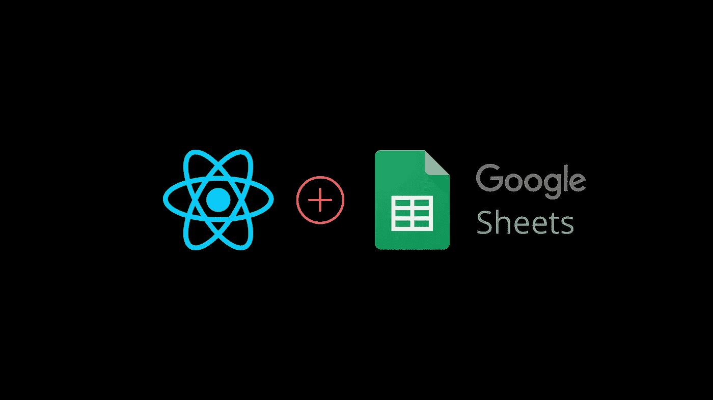
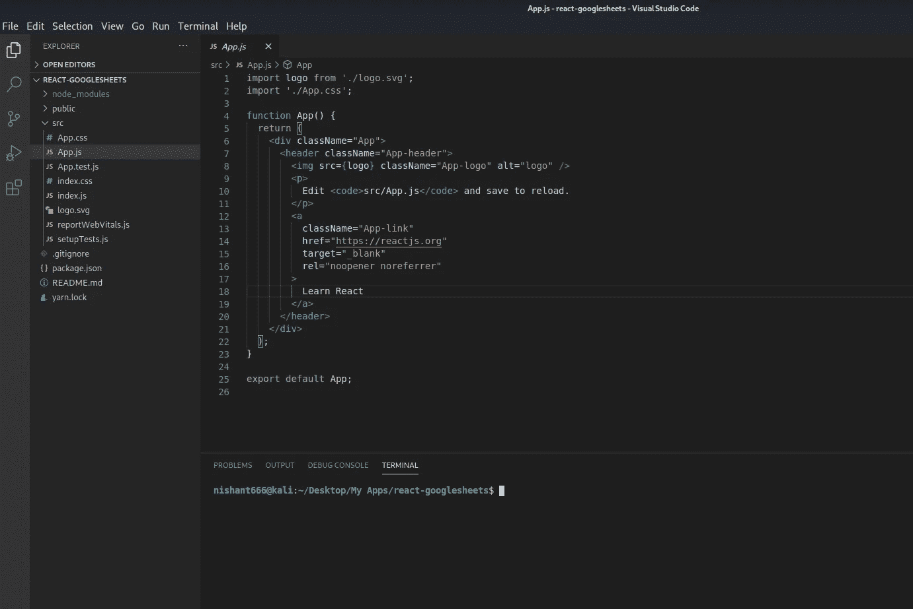
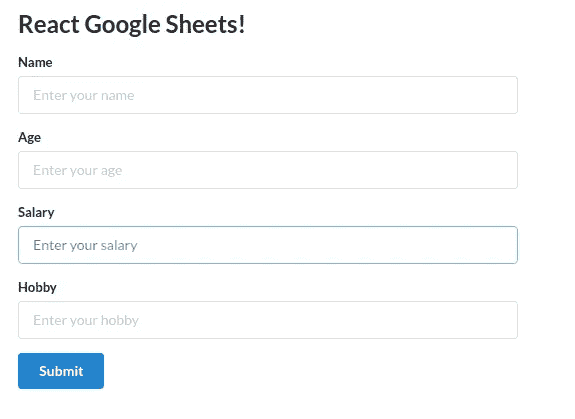
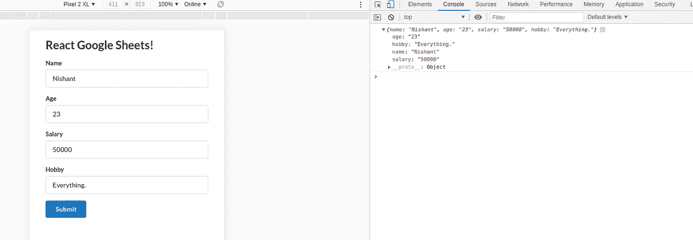
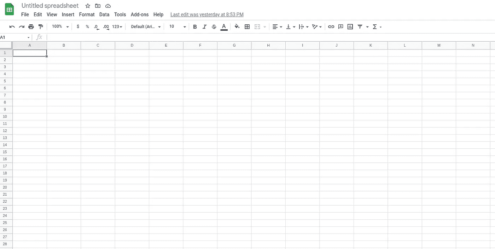
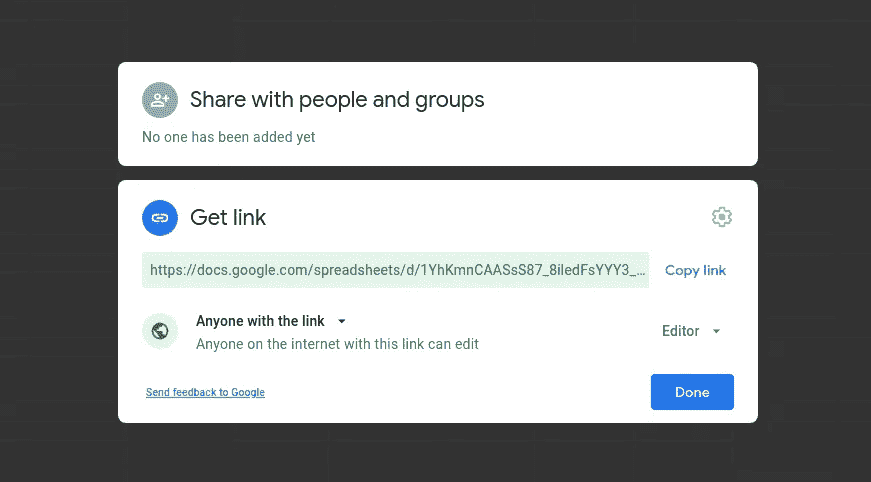
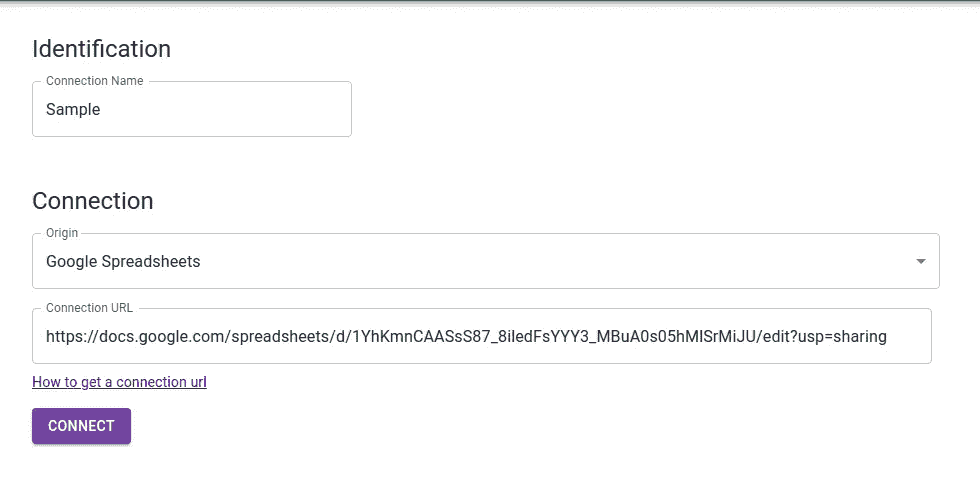
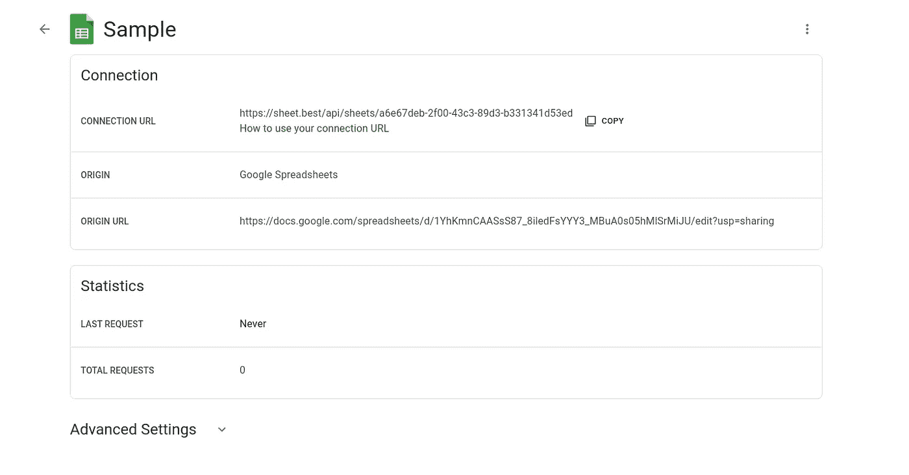
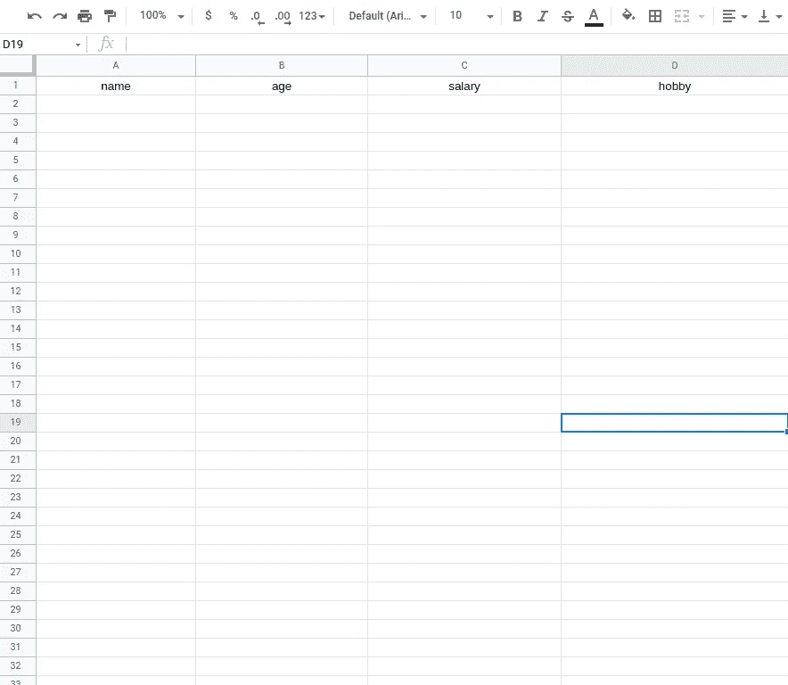
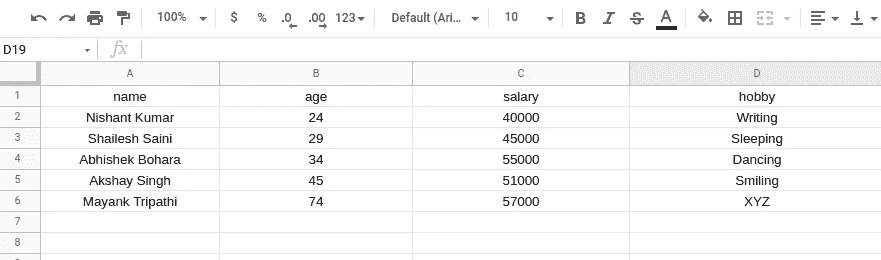

# 将 Google Sheets 转换成 REST API，并与 React 一起使用

> 原文：<https://javascript.plainenglish.io/how-to-turn-google-sheets-into-a-rest-api-and-use-it-with-react-application-1823a585320?source=collection_archive---------4----------------------->

向 API 发布数据从来都不容易。但是您使用过 React 将表单数据发布到 Google Sheets 吗？如果没有，那么这个教程是给你的。



今天，我们将讨论如何像 REST APIs 一样将表单数据从 React 发布到 Google Sheets。

# 创建 React 应用程序

要开始，键入`npx create-react-app react-googlesheets`来设置项目目录。



让我们清除 ***app.js*** 文件中一些不必要的代码。

```
import './App.css';function App() {
  return (
    <div className="App">
      <header className="App-header">

      </header>
    </div>
  );
}export default App;
```

将以下代码粘贴到您的 ***app.js*** 文件中。

# 安装语义用户界面

语义 UI 是一个框架，用于设计和开发美观且响应迅速的布局。它有按钮、容器、列表、输入等组件。

要在 React 应用程序中安装语义 UI，请使用以下命令。

```
npm install semantic-ui-react semantic-ui-css
```

安装完成后，打开 index.js 文件，将下面的导入粘贴到顶部。

```
import 'semantic-ui-css/semantic.min.css'
```

现在，使用命令 ***npm start 运行应用程序。***

# 创建一些输入框

让我们创建一个表单和输入框，从 React 应用程序中获取姓名、年龄、工资和爱好等信息。

这里，我们从 *semantic-ui-react* 库中导入按钮、表单、容器和标题，并创建表单字段。

```
import React, { Component } from 'react'
import { Button, Form, Container, Header } from 'semantic-ui-react'
import './App.css';export default class App extends Component {
  render() {
    return (
      <Container fluid className="container">
        <Header as='h2'>React Google Sheets!</Header>
        <Form className="form">
          <Form.Field>
            <label>Name</label>
            <input placeholder='Enter your name' />
          </Form.Field>
          <Form.Field>
            <label>Age</label>
            <input placeholder='Enter your age' />
          </Form.Field>
          <Form.Field>
            <label>Salary</label>
            <input placeholder='Enter your salary' />
          </Form.Field>
          <Form.Field>
            <label>Hobby</label>
            <input placeholder='Enter your hobby' />
          </Form.Field>

          <Button color="blue" type='submit'>Submit</Button>
        </Form>
      </Container>
    )
  }
} 
```



这是我们的产出。

现在，我们完成了用户界面。让我们添加一些功能。

首先，让我们在构造函数中为我们的四个表单字段创建状态。

```
import React, { Component } from 'react'
import { Button, Form, Container, Header } from 'semantic-ui-react'
import './App.css';export default class App extends Component {
  constructor(props) {
    super(props)

    this.state = {
       name: '',
       age: '',
       salary: '',
       hobby: ''
    }
  }changeHandler = (e) => {
    this.setState({[e.target.name] : e.target.value})
  }submitHandler = e => {
    e.preventDefault();
    console.log(this.state);
  }

  render() {
    const { name, age, salary, hobby } = this.state;    (*)
    return (
      <Container fluid className="container">
        <Header as='h2'>React Google Sheets!</Header>
        <Form className="form" onSubmit={this.submitHandler}>
          <Form.Field>
            <label>Name</label>
            <input placeholder='Enter your name' type="text" name = "name" value = {name} onChange={this.changeHandler}/>
          </Form.Field>
          <Form.Field>
            <label>Age</label>
            <input placeholder='Enter your age' type="number" name = "age" value = {age} onChange={this.changeHandler}/>
          </Form.Field>
          <Form.Field>
            <label>Salary</label>
            <input placeholder='Enter your salary' type="number" name = "salary" value = {salary} onChange={this.changeHandler}/>
          </Form.Field>
          <Form.Field>
            <label>Hobby</label>
            <input placeholder='Enter your hobby' type="text" name = "hobby" value = {hobby} onChange={this.changeHandler}/>
          </Form.Field>

          <Button color="blue" type='submit'>Submit</Button>
        </Form>
      </Container>
    )
  }
}
```

这里，我们有四个表单域和它们各自的状态。我们还有一个 changeHandler 方法来跟踪输入值的变化。

让我们在 render 方法中析构状态，并将它们的值添加到输入的 value 属性中(行*)。

我们最不需要的是 onSubmit 处理程序。在 form 标记上，添加 onSubmit 事件并分配 submitHandler 方法。

填写表格并单击提交。你将在控制台中输入数据。

就是这样，我们有一个表单，将姓名、年龄、工资和爱好记录到控制台中。



# 将数据发布到 Google Sheets

让我们把 Google sheets 改成 REST API。

我们将把数据作为 REST API 发布到 Google Sheets，为此，我们需要安装 *Axios* 。它是一个可以用来向 API 发送请求的库，就像 *fetch 一样。*

在文件、新建和电子表格下打开一个新的电子表格。



将工作表重命名为您选择的任何名称。

单击屏幕右上角的共享按钮，并将权限编辑为公开。



复制链接并前往[https://sheet.best/](https://sheet.best/)创建你的免费账户。

创建一个新连接，并将复制的 URL 粘贴到连接 URL 框中。



点击连接。您将被重定向到您的连接页面。在这里，你可以看到你所有的连接。单击新连接的详细信息。



复制*连接网址*。此 URL 将用作发送 POST 请求的端点。

现在，让我们安装一个 *xios* 。在您的终端中键入`npm install axios`来安装该软件包。

安装完成后，将其导入到文件的顶部。我们将在`submitHandler`函数中发出 POST 请求。

```
submitHandler = e => {
    e.preventDefault();
    console.log(this.state);axios.post('url', this.state)
    .then(response => {
      console.log(response);
    })
  }
```

用上面的代码替换`submitHandler`函数。这里，我们使用 ***axios*** 将数据发送到 URL，并使用`.*then*`关键字在控制台中获取响应。

粘贴从 ***sheet.best*** 中复制的 URL 端点，并粘贴在 URL 的位置。

```
submitHandler = e => {
    e.preventDefault();
    console.log(this.state);axios.post('[https://sheet.best/api/sheets/a6e67deb-2f00-43c3-89d3-b331341d53ed'](https://sheet.best/api/sheets/a6e67deb-2f00-43c3-89d3-b331341d53ed'), this.state)
    .then(response => {
      console.log(response);
    })
  }
```

现在，打开 Google Sheets，将一些空白字段重命名为下图。



现在，运行 React 应用程序并填写输入字段。您将看到数据正在被填充到您的 Google Sheets 中。



## 结论

*那都是乡亲们。现在您知道如何将 Google Sheets 转换成 REST API 了。现在，你可以在谷歌表单中输入数据并做出反应。*

或者，您可以在 Github 上找到代码并进行实验。

github:[https://github.com/nishant-666/React-GoogleSheets](https://github.com/nishant-666/React-GoogleSheets)

快乐学习。