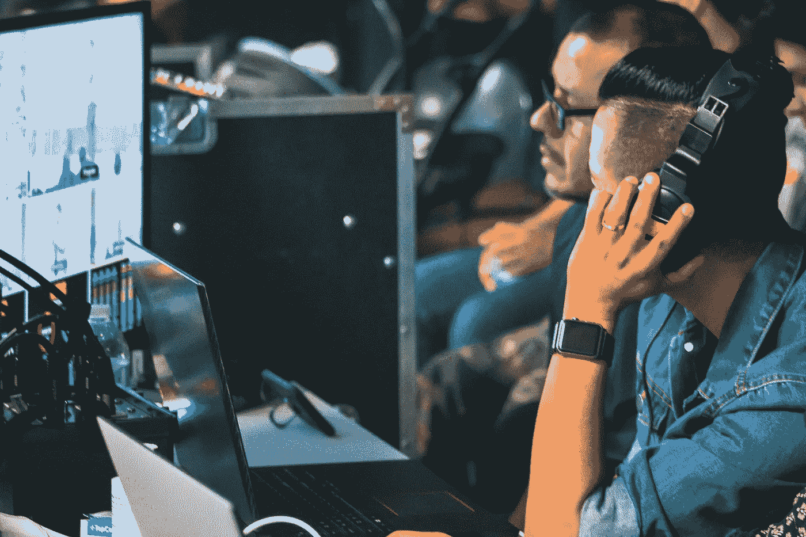
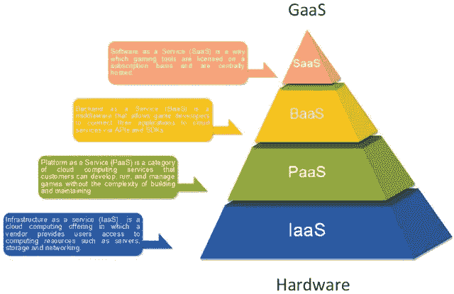
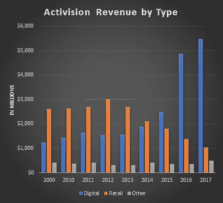
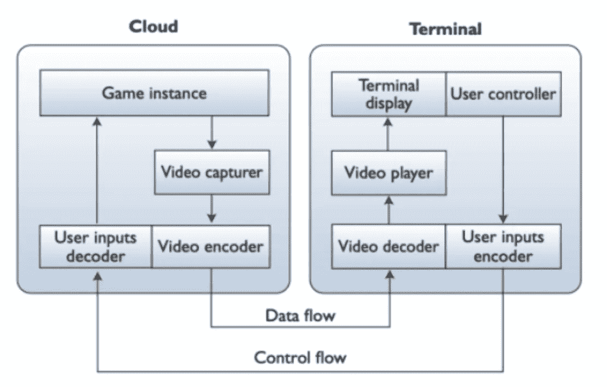
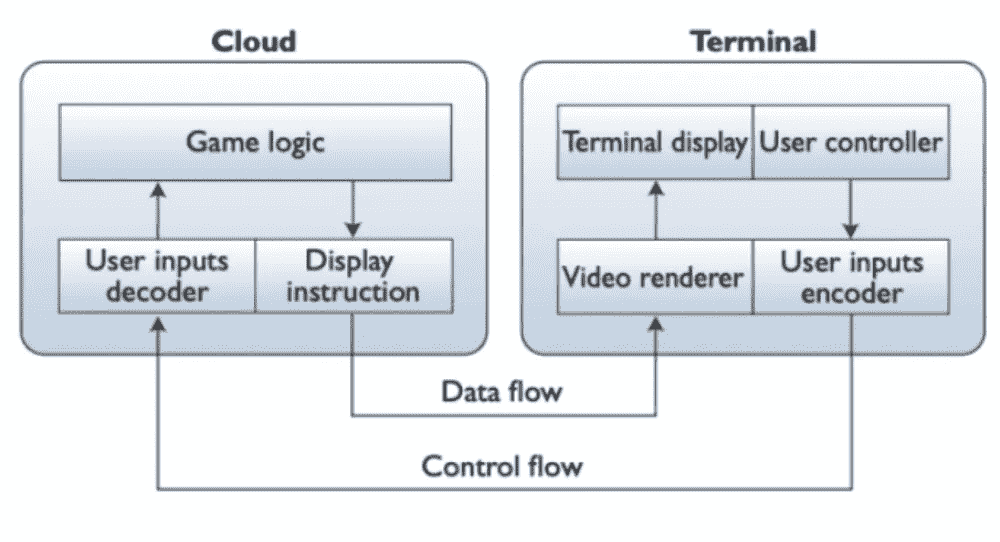

# 如何理解 GaaS 作为一种商业模式？

> 原文：<https://javascript.plainenglish.io/how-to-understand-gaas-as-a-business-model-235685c398fe?source=collection_archive---------9----------------------->

## 游戏即服务(GaaS)是一个即将到来的商业趋势！

## 了解您是否可以构建自己的 GaaS！

Photo by [Elissa Garcia](https://unsplash.com/@2blightpix?utm_source=unsplash&utm_medium=referral&utm_content=creditCopyText) on [Unsplash](https://unsplash.com/s/photos/gaming-as-as-service?utm_source=unsplash&utm_medium=referral&utm_content=creditCopyText)

*游戏即服务(GaaS)是游戏行业即将到来的商业趋势。在这篇文章中，我描述了 GaaS 的组成部分以及可以作为长期战略的四种不同的商业模式。我还研究了 GaaS 基础设施，其中我简要描述了 GaaS 要求和游戏云的两种架构框架及其优缺点。*

# 介绍

随着技术的进步，企业正在将他们的产品和服务结合起来。 [Shankar、Berry 和 Dotzel](https://hbr.org/2009/11/a-practical-guide-to-combining-products-and-services) 得出结论，产品和服务这两个组成部分的混合有利于公司，因为它基于互补和独立的特性增加了商品的综合经济价值。

然而，随着公司改变他们在视频游戏中结合混合产品和服务的方法，一种新的商业模式开始被称为**游戏即服务**。

当我们比较 SaaS 和 GaaS 模型时，有一些关键的区别。SaaS 商业模式试图出售产品的定期订阅，就像 Adobe 或微软对他们的服务(Adobe Tools，MS Office)所做的那样。然而，GaaS 继续超越月订阅或年订阅，并以多种方式应用基于服务的定价概念。

这种上升趋势在由最有影响力的发行商如 Rockstar Games、Electronic Arts、Ubisoft 和 Activision Blizzard 开发直播服务游戏(又名“直播游戏”)时达到高潮。这些类型的游戏是发行商获得经常性收入的一种方式。

Figure 1\. Levels of gaming services in the cloud computing (source: [ResearchGate](https://www.researchgate.net/publication/333062914_A_Large-Scale_Infrastructure_for_Serious_Games_Services))

让事情运转起来。我们必须合并一些其他服务。第一种服务是基础设施即服务(IaaS)，这是核心基础。其他服务按以下顺序进行:

*   平台即服务(PaaS)，
*   后端即服务(BaaS)，
*   软件即服务(SaaS)。

正如我们所看到的，SaaS 与 GaaS 相关联，因为 GaaS 是 SaaS 的一个亚型。

DFC Intelligence 最近的[调查](http://www.dfcint.com/dossier/electronic-arts-and-activision-blizzard-focus-on-games-as-a-service/)揭示了基于 GaaS 的游戏如何在过去几年推动视频游戏市场的增长。该报告指出，业内领先的动视暴雪公司在客户需求方面经历了令人兴奋的增长。

2016 年数字收入增长 94%，2017 年增长 13%。移动收入增长了 24%，令人印象深刻。暴雪在 2017 年没有重大产品发布，但仍提供了高收入和收入流。

Figure 2\. Activision Blizzard’s revenue by type of demand (source: [DFC Intelligence](http://www.dfcint.com/dossier/electronic-arts-and-activision-blizzard-focus-on-games-as-a-service/))

# GaaS 作为一种商业模式

近年来，我们见证了游戏行业对游戏即服务的日益关注。各种各样的现象，如持续的游戏世界、微交易、内容更新或玩家创造的内容，已经激发了行业代表宣布游戏相关服务业务的兴起。因为他们受到盗版的限制，发行商不再做休闲游戏。

通过采用 GaaS 模型，他们可以克服对利润的负面影响，主要是剽窃的影响。

## 不同的方法

根据 SaaS 专家 [D. Horowitz](https://www.hp.com/us-en/shop/tech-takes/what-is-a-live-service-game-games-as-a-service-gaas) 的说法，我们区分了游戏发行商实施 GaaS 模型并保持其玩家群活跃、确保长期收入的四种最重要的方式。

## 1.游戏订阅

现在，游戏订阅是常见的 MMORPG 游戏，如最终幻想十四。经常性的订阅费每月给开发者钱用于服务器维护和更新。大多数主要的直播服务游戏使用 F2P(免费游戏)模式，可以订阅优质内容。

## 2.游戏订阅服务

游戏订阅服务是最突出的游戏分支。最常见的方法是为特定平台开发尽可能多的独家游戏。例如，微软有一个 Xbox 游戏通行证，每月订阅该游戏平台的独家游戏。

## 3.微交易

微交易是发行商支持其直播服务游戏的最受欢迎的方式之一。这些微交易往往是对角色的化妆品游戏内变化。战利品盒是一种轮盘式的微交易方式，不允许玩家购买他们想要的东西。

## 4.季票和战斗票

季票和战票模式就像单机版可下载内容(DLC)概念。这些模型包含了游戏更新和一些物品，玩家可以保留并在以后的游戏中使用。许多游戏也练习在季票中加入故事内容，但这并没有改变游戏的核心机制。

# 综合基础设施

没有官方的数字游戏开发基础设施。现有的云基础设施不能完全针对游戏开发进行定制，这意味着它们不具备跨平台游戏或 VR 支持等所有游戏功能。

为了在现实世界中工作，我们必须满足游戏基础设施必须满足的要求，这些要求是:

*   **可扩展性**:游戏基础设施必须管理大量用户。
*   **持续性**(游戏状态的稳定性):可共享的游戏模式(多人)即使在玩家不玩的时候也是可靠的。-
*   **玩家对玩家的交互** : P2P 交互意味着玩家可以影响彼此玩游戏的体验，基础设施应该能够接纳这些交互[6]。
*   **可用性**:通过添加一些低成本的服务器或基础设施发行版，可以获得额外的可用性保证。
*   **延迟**(游戏可接受性中的敏感问题):网络游戏最大的担忧是延迟问题的解决，延迟问题严重影响游戏接受度和生产力。
*   **吞吐量**:基础设施应该具有高吞吐量，因为有时需要传输大量数据。

其他影响游戏基础设施质量的需求:**性能**，**可用性**，**兼容性**，**可靠性**，**安全性**，**可维护性**，**可移植性**。

## 建筑框架

根据[科学研究](https://ieeexplore.ieee.org/document/6818918)，我们在设计一个在线游戏引擎时，确定了两种类型的云设计框架。

如果终端只包含输入模块，云托管所有剩余的模块和组件，并且渲染的视频是实时流，我们就说 GaaS (RR-GaaS)的**远程渲染。**

当输入和渲染模块在终端执行，而其他模块在云中运行时，我们将这种方法称为**本地渲染 GaaS** (LR-GaaS)。

## **砷化镓的远程渲染**

Figure 3\. Remote rendering gaming-as-a-service (source: [Toward Gaming as a Service](https://ieeexplore.ieee.org/document/6818918))

在 RR-GaaS 中，一旦收到玩家的连接请求，云就会虚拟化一个执行环境并初始化一个游戏实例(图 3)。在这种模式中，游戏终端是一个轻型客户端，本质上充当输入接收器、帧解码器和视频播放器。这意味着硬件规格可以忽略不计，因为它们没有复杂的视频渲染、游戏逻辑和实时玩家互动。

## 砷化镓的局部渲染

Figure 4\. Local rendering gaming-as-a-service (source: [Toward Gaming as a Service](https://ieeexplore.ieee.org/document/6818918))

在 LR-GaaS 的情况下，云服务器不再准备游戏视频。相反，游戏逻辑生成一组指令来呈现游戏图形，并通过互联网将它们发送到游戏终端。LR-GaaS 系统最突出的优势是云服务器不再需要传输实时游戏视频帧，大大降低了网络工作负载。然而，它与 LR-GaaS 具有相同的优势，因此在实现跨平台等流行功能方面没有限制，包括点击播放和反盗版系统。

# 结论

从行业的角度来看，维护和支持 GaaS 有利有弊。主要目标是留住用户，从而延长游戏寿命。

如果你获得持续的收入，这意味着你可以更早地发布你的游戏。在这种情况下，开发者可以收集反馈，并根据用户的需求调整他们的游戏。因此，早期版本鼓励独立开发者更有创造力，减少对一次性游戏购买的依赖。

*更多内容看* [***说白了。报名参加我们的***](http://plainenglish.io/) **[***免费每周简讯在这里***](http://newsletter.plainenglish.io/) ***。*****