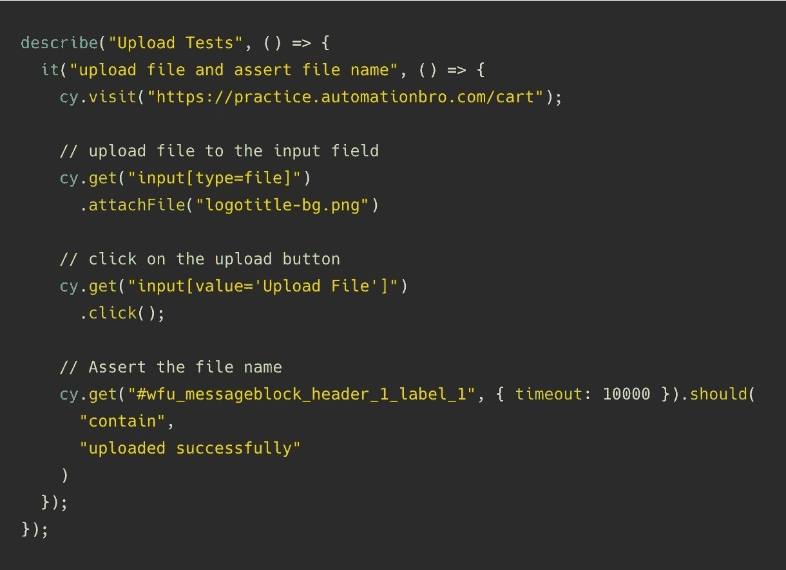
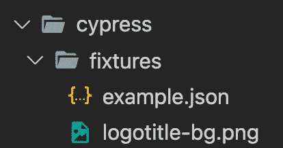
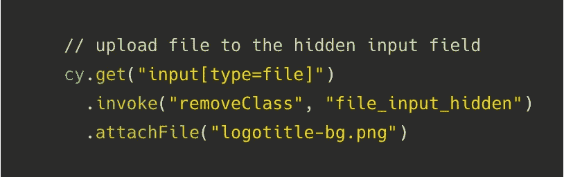

# 如何在赛普拉斯上传文件

> 原文：<https://javascript.plainenglish.io/how-to-upload-a-file-in-cypress-e6b2beafec8c?source=collection_archive---------4----------------------->


Cypress Upload File

在本教程中，我们将学习如何使用 [*柏树-文件-上传*](https://www.npmjs.com/package/cypress-file-upload) NPM 软件包在柏树上上传文件。赛普拉斯目前没有本地支持上传文件；然而，这是他们[计划在未来增加的](https://github.com/cypress-io/cypress/issues/170)。

# 装置

因为我们需要使用第三方库来上传文件，所以我们需要安装和设置该库，使其与柏树一起工作。

## 安装 NPM 软件包

您需要做的第一件事是安装软件包——

```
npm install --save-dev cypress-file-upload
```

## 设置自定义命令

cypress-file-upload 库提供了一个自定义命令，我们可以在设置后使用。为此，我们需要在自定义命令文件(cypress/support/commands.js)中导入库，如下所示——

```
import 'cypress-file-upload';
```

然后，确保该`commands.js`是在`cypress/support/index.js`中导入的(可能是注释):

```
import './commands';
```

# 上传文件测试

现在，我们已经安装了软件包，我们可以继续并开始使用自定义命令。在下面的例子中，我将在我的测试网站上上传一个文件。



cypress file upload example

在上面的例子中，重点关注的是由我们安装的助手库添加的`.attachFile()`命令。它引入了一个参数，即文件名，该参数应包含在`fixtures`文件夹中，如下所示。



cypress fixtures folder

# 使用隐藏的输入字段

通常情况下,`.attachFile()`命令会在`input[type=file]`元素难以处理的情况下发挥作用。然而，如果元素是隐藏的，那么您将需要进行必要的更改，以使元素再次可见和难以处理。您可以在赛普拉斯`.invoke()`功能的帮助下完成，如下所示——



Cypress .invoke function

在这个例子中，我使用 jQuery `removeClass`函数移除了隐藏的类，这使得我的元素再次变得难以处理。

**如需了解更多关于如何在柏树上传文件的信息，请查看下面的视频** —

希望你喜欢读这篇文章！

*多内容于* [***浅显易懂***](http://plainenglish.io/)