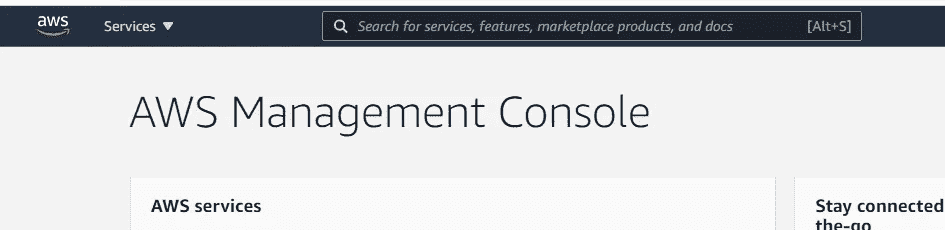
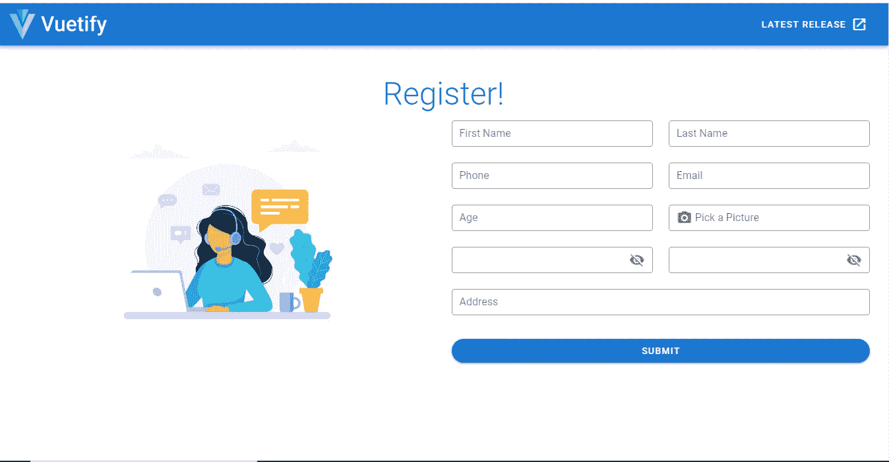

# 如何将文件上传到 Vue.js 应用中的 S3 桶并保存到 MongoDB(初学者指南)

> 原文：<https://javascript.plainenglish.io/how-to-upload-files-to-an-s3-bucket-in-a-vue-js-app-and-save-to-mongodb-a-beginners-guide-dfada815b7eb?source=collection_archive---------1----------------------->

## 使用 Multer 和 Express 将文件上传到具有 Node.js 后端和 Vue.js 前端的 S3 bucket，并将它们保存在数据库中——在本例中是 MongoDB。


## 介绍

在构建 web 应用程序时，您的用户可能需要在前端上传文件。要查看这些文件，您需要在后端实现一个 API 和一个数据库来接收它们。使用 Node.js 框架 [Express](https://expressjs.com/) 和中间件 [Multer](https://www.npmjs.com/package/multer) ，您可以在一个设置中建立文件和图像上传。

在本文中，您将学习如何使用 Multer 和 Express 将文件上传到具有 Node.js 后端和 Vue.js 前端的 S3 bucket，并将图像名称保存到数据库——在本例中是 MongoDB。

## 要求

*   创建一个 AWS 帐户。
*   创建 IAM 组并附加策略。
*   将 IAM 用户添加到创建的组中。
*   在 AWS S3 中创建一个存储桶来存储我的静态文件。
*   设置 MongoDB。
*   使用 Node.js 和 Express 设置后端 API 或端点，它们将通过 SDK 访问 AWS S3 桶。
*   创建我们的 Vue.js 应用程序。

## AWS IAM

**我是什么？**

AWS 身份和访问管理(IAM)是一个 web 服务，可帮助您安全地控制对 AWS 资源的访问。您使用 IAM 来控制谁被验证(登录)和授权(有权限)使用资源。

当您第一次创建 AWS 帐户时，您从单一登录身份开始，该身份拥有对帐户中所有 AWS 服务和资源的完全访问权限。这个身份被称为 AWS 帐户 *root 用户*，通过使用您创建帐户时使用的电子邮件地址和密码登录即可访问。

AWS 强烈建议您不要在日常工作中使用 root 用户，即使是管理工作。相反，坚持使用 root 用户创建您的第一个 IAM 用户的[最佳实践。然后安全地锁定根用户凭据，并使用它们来执行少量的帐户和服务管理任务。](https://docs.aws.amazon.com/IAM/latest/UserGuide/best-practices.html#create-iam-users)

**什么是 IAM 组？**

IAM 组是 IAM 用户的集合。组允许您为多个用户指定权限，这使得管理这些用户的权限更加容易。例如，您可以有一个名为 *Admins* 的组，并授予该组管理员通常需要的权限类型。该组中的任何用户都自动拥有分配给该组的权限。如果新用户加入您的组织并需要管理员权限，您可以通过将该用户添加到该组来分配适当的权限。

同样，如果一个人在您的组织中更改了职务，您可以将他或她从旧组中删除，并将其添加到适当的新组中，而不是编辑该用户的权限。

在基于资源的策略中，不能将组标识为主体。组是一种一次将策略附加到多个用户的方式。当您将基于身份的策略附加到某个组时，该组中的所有用户都将从该组获得权限。有关这些策略类型的更多信息，请参见[基于身份的策略和基于资源的策略](https://docs.aws.amazon.com/IAM/latest/UserGuide/access_policies_identity-vs-resource.html)。

以下是组的一些重要特征:

*   一个组可以包含许多用户，一个用户可以属于多个组。
*   组不能嵌套；它们只能包含用户，不能包含其他组。
*   没有默认群组会自动包含 AWS 帐户中的所有用户。如果您希望有一个这样的组，您需要创建它并为其分配每个新用户。
*   AWS 帐户中 IAM 资源的数量和大小是有限的。有关更多信息，请参见 [IAM 和 STS 配额](https://docs.aws.amazon.com/IAM/latest/UserGuide/reference_iam-quotas.html)。

## 在 Aws 上创建帐户

使用此[链接](https://portal.aws.amazon.com/billing/signup#/start)在 AWS 上创建一个帐户，并按照此[指南](https://aws.amazon.com/premiumsupport/knowledge-center/create-and-activate-aws-account/)激活您的帐户。

## 创建管理员 IAM 用户和组(控制台)

此过程描述了如何使用 AWS 管理控制台为您自己创建 IAM 用户，并将该用户添加到对附加的受管策略拥有管理权限的组中。

**按照以下步骤为您自己创建一个管理员用户，并将该用户添加到管理员组(控制台)。**

1.  通过选择**根用户**并输入您的 AWS 帐户电子邮件地址，作为帐户所有者登录到 [IAM 控制台](https://console.aws.amazon.com/iam/)。在下一页上，输入您的密码。
2.  为您将创建的 IAM 管理员用户启用对计费数据的访问权限，如下所示:
3.  在导航栏上，选择您的帐户名称，然后选择**我的帐户**。
4.  在 **IAM 用户和角色访问计费信息**旁边，选择**编辑**。您必须以 root 用户身份登录，此部分才会显示在帐户页面上。
5.  选择复选框**激活 IAM 访问**并选择**更新**。
6.  在导航栏上选择**服务**，然后选择 **IAM** 返回 IAM 仪表盘。
7.  在导航窗格中，选择**用户**，然后选择**添加用户**。
8.  在**详细信息**页面上，执行以下操作:
9.  对于**用户名**，输入**管理员**。或者**或者任何你想给**起的名字
10.  选中 **AWS 管理控制台访问**的复选框，选择**自定义密码**，然后在文本框中输入新密码。
11.  默认情况下，AWS 会强制新用户在首次登录时创建新密码。您可以选择清除**旁边的复选框“用户必须在下次登录**时创建新密码”，以允许新用户在登录后重置密码。
12.  选择**下一步:权限**。
13.  在**权限**页面，执行以下操作:
14.  选择**将用户添加到组**。
15.  选择**创建组**。
16.  在**创建组**对话框中，为**组名**键入**管理员**。
17.  选中**管理员访问**策略的复选框。
18.  选择**创建组**。
19.  返回到包含组列表的页面，选中新组的复选框。如果在列表中未看到新组，请选择**刷新**。
20.  选择**下一个:标签**。
21.  (可选)在**标记**页面上，通过将标记作为键值对附加给用户来添加元数据。有关详细信息，请参阅[标记 IAM 资源](https://docs.aws.amazon.com/IAM/latest/UserGuide/id_tags.html)。
22.  选择**下一步:查看**。验证要添加到新用户的组成员身份。准备继续时，选择**创建用户**。
23.  (可选)在**完成**页面，可以下载带有用户登录信息的. csv 文件，也可以发送带有登录说明的电子邮件给用户。

## 在 AWS S3 创建一个存储我的静态文件的存储桶

使用新创建的用户登录到 AWS 控制台。在导航栏的顶部，单击服务，如下图所示。将出现一个下拉列表，其中包含 AWS 服务的列表。



在下拉列表中，单击 S3。这将引导您进入一个页面，您可以在其中创建一个新的存储桶。


如果你注意到了，我们还没有桶。这是因为我们的帐户刚刚创建。

要开始，点击**创建存储桶**，并填写所需信息。现在，记住我们希望任何人都可以访问我们的 bucket 中的内容，所以我们必须取消选中***block public access***复选框。应该是这样的。


点击页面底部的**创建存储桶**。

## 设置 MongoDB

Mongo DB 可以有不同的使用方式。我们可以决定将它安装在我们的本地开发机器上，或者我们使用或云服务器，或者我们可以决定使用数据库即服务(Atlas)，由 MongoDB 提供。

要在您的服务器或本地机器上安装 MongoDB，请遵循 [**MongoDB 文档**](https://docs.mongodb.com/manual/installation/) **中的说明。**如果你决定使用数据库作为服务，比如[**MongoDB atlas**](https://www.mongodb.com/cloud/atlas)**，**你可以按照 [MongoDB docs](https://docs.atlas.mongodb.com/getting-started/) [](https://docs.mongodb.com/manual/installation/)中的说明开始。

## 创建 Node.js 应用程序

既然我们已经创建了 S3 桶和数据库，那么是时候创建 Node.js 应用程序了。

第一个要求是在我们的计算机上安装 Node.js。

[**Node.js**](https://nodejs.org/en/) 是一个开源、跨平台、后端的 JavaScript 运行时环境，运行在 V8 引擎上，在 web 浏览器之外执行 JavaScript 代码。你可以在这里阅读更多关于它的[。](https://nodejs.org/en/)

要在你的电脑上安装 Node，请按照这个[链接](https://www.freecodecamp.org/news/how-to-install-node-js-and-npm-on-windows/)操作 Windows，这个[链接](https://treehouse.github.io/installation-guides/mac/node-mac.html)操作 Mac，这个[链接](https://linuxconfig.org/install-npm-on-linux)操作 Linux。

要检查 Node.js 安装是否成功，请在终端中运行以下命令:

`node -v`

要验证节点程序包管理器(npm)是否已成功安装，请在终端中键入`npm -v`。

这应该会打印版本号。你会看到这样的东西`6.4.`

## 创建项目

要开始一个新项目，请打开终端，将 cd 放入工作区文件夹。用您的后端项目名创建一个新目录。对于本教程，我们的项目名称是`vue-multers3-backend`。现在，我们进入新创建的项目目录。然后，我们通过键入以下命令来初始化我们的项目:

`npm init`

填写完必要的信息后，应该会为您创建一个 **package.json** 文件。然后用下面的命令安装下面的`npm`包:

```
npm install --save express multer dotenv cors body-parser mongodb multer-s3 aws-sdk
```

[***Express***](https://www.npmjs.com/package/express)***——***快速、无人化、极简的 web 框架为 [**节点**](http://nodejs.org/) **。js** 。

[***Multer***](https://www.npmjs.com/package/multer)***——****Multer 是一个处理多部分/表单数据的 Node.js 中间件，主要用于上传文件。它写在 [**之上，以获得最大效率。**](https://github.com/mscdex/busboy)*

*[***Dotenv***](https://www.npmjs.com/package/dotenv)—Dotenv 是一个零依赖模块，将环境变量从. env 文件加载到 [**process.env**](https://nodejs.org/docs/latest/api/process.html#process_process_env) 中。*

*[***【CORS】***](https://www.npmjs.com/package/cors)***—***CORS 是一个 Node.js 包，用于提供一个[**Connect**](http://www.senchalabs.org/connect/)/[**Express**](http://expressjs.com/)中间件，该中间件可用于启用跨源资源共享([](http://en.wikipedia.org/wiki/Cross-origin_resource_sharing)****)**。***

***[***body-parser***](https://www.npmjs.com/package/body-parser)—node . js body 解析中间件。***

***[***MongoDBg***](https://www.npmjs.com/package/mongodb)***—***node . js 的官方 [**MongoDB**](https://www.mongodb.com/) 驱动程序在 [**mongodb-core**](https://www.npmjs.com/package/mongodb-core) 的基础上提供了一个面向最终用户的高级 API。***

***[***multer-S3***](https://www.npmjs.com/package/multer-s3)***—***适用于 AWS S3 的流式 multer 存储引擎。***

***[***aws-SDK***](https://www.npmjs.com/package/aws-sdk)***—***AWS-SDK 通过提供一组一致且熟悉的库，让 JavaScript 开发人员可以轻松使用 AWS 服务。***

## ***创建我们的 Express 服务器***

***首先，我们创建一个名为`index.js`的文件，并输入以下代码。这将是我们应用程序的起点。***

```
***const express = require('express')
const bodyParser = require('body-parser')
const cors = require('cors')
const dotenv = require('dotenv')
dotenv.config()
const app = express()
//middleWare
app.use(bodyParser.json())
app.use(bodyParser.urlencoded({ extended: true }))
app.use(cors())

app.get('/', async (req, res) => {
  res.status(200).send('S3 Upload Backend')
})

const port = process.env.PORT || 5000
app.listen(port, () => {
  console.log(`server started on port ${port}`)
});***
```

***在根文件夹中，创建一个**。gitignore** 和**。env** 文件。你的**。gitignore** 文件应该是这样的:***

```
***.DS_Store
node_modules
/dist

#local env files
.env.local
.env.*.local

#Log files
npm-debug.log*
yarn-debug.log*
yarn-error.log*
pnpm-debug.log*

#Editor directories and files
.idea
.vscode
*.suo
*.ntvs*
*.njsproj
*.sln
*.sw?***
```

***然后，在我们的**里。env** 文件，我们设置我们的环境变量。***

```
***DATABASE=mongodb://127.0.0.1:27017/
PORT=5005
AWSAccessKeyId=your_aws_accesskey
AWSSecretKey=your_aws_secret_key
AWSRegion=your_aws_region
AWSBucket=your_aws_bucket***
```

***如果您记得清楚，当我们在 AWS 帐户上创建用户时，我们下载了一些凭证。在下载的凭证中是您的秘密密钥和访问密钥。如果您放错了地方，您可以随时从您的仪表板创建另一个。***

***为了启动我们的服务器，我们运行下面的命令。***

```
***node index.js***
```

***我们应该在终端上看到这个。***

******

***当我们在浏览器中访问 localhost:5005 时，我们会看到这个页面。***

******

## ***我们的上传中间件***

```
***const aws = require('aws-sdk')
const multer = require('multer')
const multerS3 = require('multer-s3')

aws.config.update({
  apiVersion: "2006-03-01",
  accessKeyId: process.env.AWSAccessKeyId,
  secretAccessKey: process.env.AWSSecretKey,
  region: process.env.AWSRegion
})const s3 = new aws.S3()

const upload = multer({
  storage: multerS3({
    s3: s3,
    bucket: process.env.AWSBucket,
    acl: "public-read",
    contentType: multerS3.AUTO_CONTENT_TYPE,
    metadata: (req, file, cb) => {
      cb(null, { fieldName: file.fieldname})
    },
    key: (req, file, cb) => {
      cb(null, Date.now().toString() + file.originalname)
    }
  })
})***
```

## ***路线***

```
***const mongodb = require('mongodb')app.post('/', upload.single('photo'), async (req, res) => {
  try {
    const users = await loadUsersCollection();
    await users.insertOne({
      first_name: req.body.first_name,
      last_name: req.body.last_name,
      phone: req.body.phone,
      email: req.body.email,
      gender: req.body.gender,
      photo: req.file.location,
    })
    res.status(201).send('success')
    }
    catch (err) {
      res.status(500).send({
        error: 'error occured creating user'
      })
    }
  })

async function loadUsersCollection () {
  const client = await mongodb.MongoClient.connect(process.env.DATABASE, {
   useNewUrlParser: true,
   useUnifiedTopology: true
  })
  return client.db('vue-multers3').collection('users')
}***
```

## ***创建我们的前端应用***

***对于本教程，我们将使用 Vuetify 作为我们的 UI 框架。点击[这里的链接](https://vuetifyjs.com/en/getting-started/installation/)开始学习如何在你的 Vue.js 项目中使用 Vue 化。***

***首先，我们需要在全球范围内安装 Vue-cli。***

***`npm install -g @vue/cli`***

***安装后，我们用下面的命令在工作区中创建一个空白的前端项目。***

***`vue create vue-multers3-frontend`***

***其中`vue-multers3-frontend`是我们的应用程序名称。***

***要将`vuetify`添加到我们的项目中，我们必须将`cd`添加到我们的项目目录中:***

***`cd vue-multers3-frontend`***

***然后运行以下命令:***

***`vue add vuetify`***

***一旦 Vuetify 安装成功，我们就可以运行:***

***`npm run serve`***

******

***如果我们在浏览器中访问本地的`url`,我们应该会看到这个页面。***

******

## ***创建注册组件***

***让我们在组件文件夹中创建我们的`Register.vue`组件，并添加这个代码片段。***

***然后我们将这个组件导入到`App.vue`中。***

***在保存时，如果我们刷新浏览器，我们应该会看到显示我们的注册组件。***

******

***要通过 API 请求将我们的数据发送到后端，我们需要安装 **axios。**
**Axios** 是一个基于 Promise 的 HTTP 客户端，用于浏览器和 Node.js.
运行下面的命令来安装 Axios。请确保您在前端文件夹中。***

```
***npm install axios***
```

***现在让我们将提交功能添加到注册组件中。***

***当我们提交表单时，我们应该在控制台中看到一条成功消息。***

******

***如果我们检查我们的数据库，我们可以看到我们在 S3 桶文件的 url 已被保存。***

******

***感谢您的阅读。我希望你已经发现这是有用的。你可以在这里找到后端代码[的链接，在这里](https://github.com/faithfulojebiyi/vue-multers3-backend)找到前端代码[。](https://github.com/faithfulojebiyi/vue-multers3-backend)***

***编码快乐！***

****更多内容请看*[*plain English . io*](http://plainenglish.io/)***