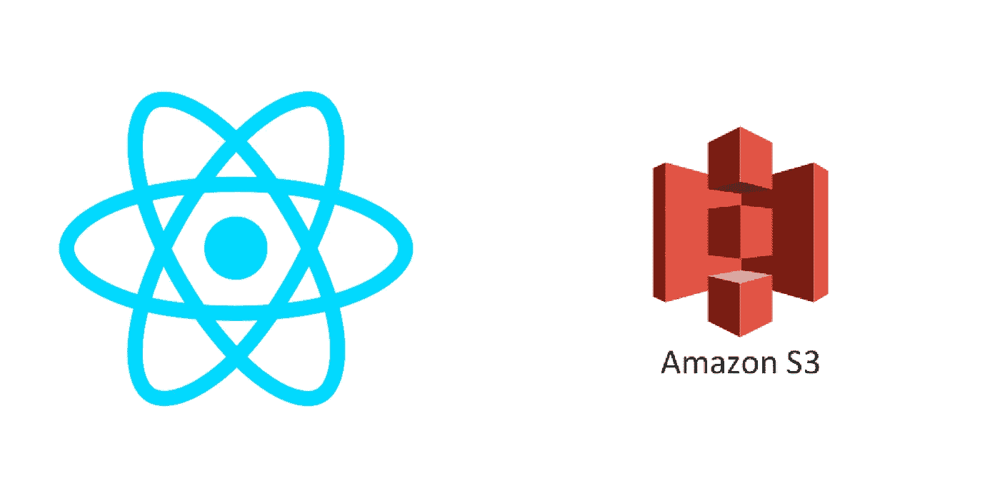
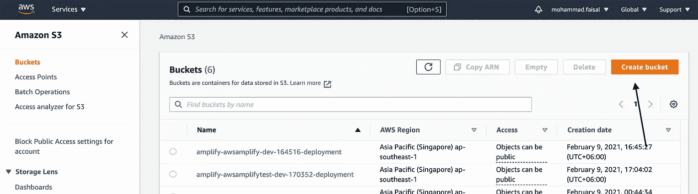
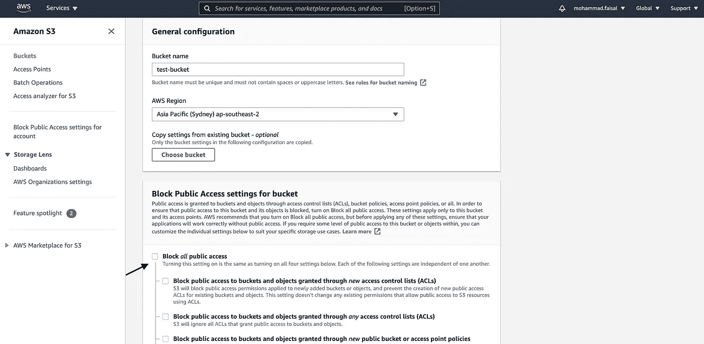
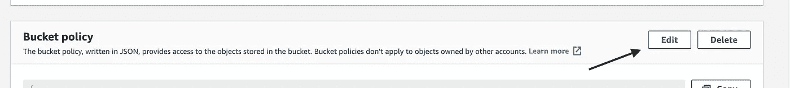
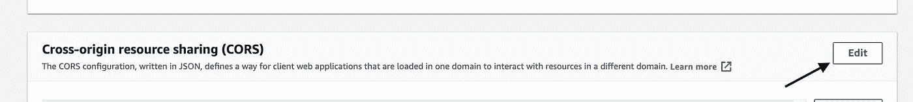

# 如何在 React 中将文件上传到 AWS S3

> 原文：<https://javascript.plainenglish.io/how-to-upload-files-to-aws-s3-in-react-591e533d615e?source=collection_archive---------0----------------------->

## 以两种不同的方式



Credit: Google

如今，有了 AWS 和 Firebase 等一些令人敬畏的无服务器云解决方案，上传文件已经变得轻而易举。

今天，我们将了解如何快速创建一个 S3 存储桶，并直接从我们的前端 React 应用程序上传文件。

## 先决条件

1.  AWS 帐户
2.  对反应堆的基本理解

我们开始吧！

## 第一步。创建 S3 存储桶

登录到您的 aws 控制台。搜索`Amazon S3`，点击`Create bucket`。



aws-console

然后给它一个名字并选择合适的区域。然后暂时取消选中`Block all public access`(在生产中必须保持不选中)。



create-s3-bucket

点击`Create Bucket`，你会在列表中看到你的新桶。

## 第二步。编辑存储桶策略

现在，我们将设置存储桶策略。点击桶名并转到`properties`选项卡。

向下滚动一点，您会看到一个名为`Bucket Policy`的部分



bucket-policy

点击`Edit`按钮。并加上下面的`json`。

这将允许公众暂时访问该文件夹的内容。

## 第三步。编辑 CORS 策略

再向下滚动一点，您将看到一个可以编辑`CORS`策略的部分。由于我们将从另一个端点上传文件，我们需要确保我们的 bucket 不会阻止`cors`的上传



cors-policy

然后将下面的`.json`文件添加到策略中

现在，我们准备将文件上传到我们的 AWS S3 存储桶。现在继续前端部分。

## 第四步。设置 React 项目

为了跟进，您将需要一个基本的 React 项目设置。你可以很容易地做到这一点

```
npx create-react-app s3-upload
```

它将为您搭建一个基本的应用程序。

## 第五步。通过原生 SDK 上传文件

如果我们在项目中使用其他 aws 服务，那么我们有一个名为`[aws-sdk](https://www.npmjs.com/package/aws-sdk)`的特殊 npm 包。我们可以应付过去

```
yarn add aws-sdk
```

然后创建一个名为`UploadImageToS3WithNativeSdk`的新组件，并在其中添加以下代码

UploadImageToS3WithNativeSdk.ts

这是一个简单的组件，其中有一个文件输入，并使用本机`aws-sdk`上传文件。

> 用您自己的值替换`BUCKET_NAME`、`REGION_NAME`、`SECRET_KEY`、`ACCESS_KEY`

## 第六步。通过 S3 React 上传文件

如果您没有使用其他 AWS 服务，那么您不需要完整的`aws-sdk`，这将不必要地增加您的包大小。

我们将使用另一个名为`[react-s3](https://www.npmjs.com/package/react-s3)`的库。首先，安装它

```
yarn add react-s3
```

然后创建一个名为`UploadImageToS3WithReactS3`的新组件，并添加以下代码

UploadImageToS3WithReactS3.ts

这个组件将与前一个组件做同样的事情。它将一个文件作为输入，并上传到 S3 桶。

另外，不要忘记更改参数值。

## 结论

这就对了。下面是如何将任何文件上传到 s3 bucket 的方法。根据您的需要，浏览文档进行更多的定制。

# **更新:**

阅读下面的文章，了解如何安全地做到这一点。

[](/how-to-access-private-s3-buckets-securely-87778efd93bd) [## 如何安全地访问私有 S3 存储桶

### 使用预签名的 URL

javascript.plainenglish.io](/how-to-access-private-s3-buckets-securely-87778efd93bd) 

祝您愉快！:D

```
**Get in touch with me via** [**LinkedIn**](https://www.linkedin.com/in/56faisal/) **or my** [**Personal Website**](https://www.mohammadfaisal.dev/)**.**
```

[](https://betterprogramming.pub/21-best-practices-for-a-clean-react-project-df788a682fb) [## 清洁 React 项目的 21 个最佳实践

### 提高代码质量的实用建议

better 编程. pub](https://betterprogramming.pub/21-best-practices-for-a-clean-react-project-df788a682fb) [](https://betterprogramming.pub/how-to-use-aws-dynamodb-in-react-70b55ffff93e) [## 如何在 React 中使用 AWS DynamoDB

### 让我们尝试从 React 应用程序访问 DynamoDB

better 编程. pub](https://betterprogramming.pub/how-to-use-aws-dynamodb-in-react-70b55ffff93e) [](/20-essential-parts-of-any-large-scale-react-app-ee4bd35436a0) [## 任何大型 React 应用程序的 20 个基本部分

### 如果您正在编写企业级代码，您需要了解这一点

javascript.plainenglish.io](/20-essential-parts-of-any-large-scale-react-app-ee4bd35436a0) [](/45-npm-packages-to-solve-16-react-problems-a9ab18946224) [## 45 个 NPM 软件包解决 16 个 React 问题

### 关于如何选择完美的 npm 包的深入指导

javascript.plainenglish.io](/45-npm-packages-to-solve-16-react-problems-a9ab18946224)