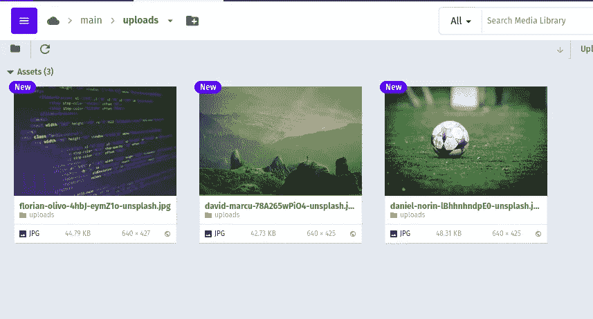

# 如何用 Node.js 上传图片到 Cloudinary

> 原文：<https://javascript.plainenglish.io/how-to-upload-single-multiple-image-to-cloudinary-using-node-js-ae9db9f4a0b9?source=collection_archive---------2----------------------->


Photo by [Christopher Gower](https://unsplash.com/@cgower?utm_source=medium&utm_medium=referral) on [Unsplash](https://unsplash.com?utm_source=medium&utm_medium=referral)

# 介绍

作为一个初学者，我总是想知道图像数据是如何存储的。它是像一个包含成千上万张图片的文件夹，还是以字符串形式存储在数据库中？

答案是图像文件存储在一些云存储服务上，如 [Cloudinary](https://cloudinary.com/) 或 [AWS S3](https://aws.amazon.com/s3/) ，图像的 url 存储在数据库中。

在这篇博客中，我们将看到如何在云存储服务(Cloudinary)上保存图像并使用图像的 url，而不是将图像存储在本地文件夹中。

我们将使用 Cloudinary，因为它需要最少的设置，并且易于使用。

***我也将很快在*** [***上发表***](https://www.geeksforgeeks.org/)

# 先决条件

在我之前的[博客](https://rugved-bongale.medium.com/how-to-upload-image-using-multer-in-node-js-f3aeffb90657)中，我们已经看到了如何使用 multer 库上传图片到服务器(我们的电脑)上的上传文件夹。

[](https://rugved-bongale.medium.com/how-to-upload-image-using-multer-in-node-js-f3aeffb90657) [## 如何在 node.js 中使用 multer 上传图片？

### 每当你做一个网站，像社交媒体应用或博客应用，你很可能会有这样的功能，你会…

rugved-bongale.medium.com](https://rugved-bongale.medium.com/how-to-upload-image-using-multer-in-node-js-f3aeffb90657) 

如果你想继续，你可以克隆下面提到的包含我以前的[博客](https://rugved-bongale.medium.com/how-to-upload-image-using-multer-in-node-js-f3aeffb90657)代码的库。

[https://github.com/RugvedB/Nodejs-Multer-File](https://github.com/RugvedB/Nodejs-Multer-File)

# 我们要建造什么？

在这篇博客中，我们将看到如何上传图像到云存储(Cloudinary ),可以在全球范围内访问。上传成功后，我们将获得图像的 url 作为响应，我们将使用它来显示存储在 Cloudinary 上的图像。

# 理解流程

让我们首先通过一个例子来理解它是如何工作的。

例如，假设我们想把 sample.jpg T21 上传到 Cloudinary。

1.  我们选择一个文件，并使用 multer 库将其保存到本地计算机文件夹中的“ **uploads** ”文件夹。(我们在我之前的[博客](https://rugved-bongale.medium.com/how-to-upload-image-using-multer-in-node-js-f3aeffb90657)中已经看到了这一点)

***图像的本地路径= "uploads/sample.jpg"***

2.我们将编写一个函数，使用上述图像的本地路径，并将它上传到云服务器。

3.如果上传到云的过程是成功的，它将提供一个我们需要的图像 url 的一堆东西的响应。

4.从本地计算机的文件夹中删除图像，因为我们已经将它上传到 Cloudinary。

5.现在，我们可以将这个图像 url 存储在数据库中，或者基于用例对它做任何事情。在这篇博客中，我只是把它显示在 html 页面上。

# 设置和实施

1.  转到项目目录，安装 Cloudinary。

```
npm i cloudinary
```

2.我们需要在 index.js 中声明以下导入

3.要使用 cloudinary，您需要创建一个免费帐户并获取凭据。登录后，您可以在“帐户详情”部分的仪表板上找到所需的密钥，然后将其粘贴到 index.js 中

```
// cloudinary configuration
cloudinary.config({
    cloud_name: "YOUR_CLOUD_NAME",
    api_key: "YOUR_API_NAME",
    api_secret: "YOUR_API_SECRET"
});
```

4.现在，我们需要编写一个函数，它将接受本地图像文件的路径，并将它上传到 Cloudinary。

A function to upload local images to cloudinary

假设***locaFilePath = " uploads/sample . jpg "****然后*

***filePathOnCloudinary = " main/uploads/sample . jpg "***

我特意将“main”添加到***filePathOnCloudinary****中，以表明我们可以在 Cloudinary 上创建嵌套的文件夹和子文件夹，只需将其作为 path。*

*在本例中，将创建一个主**文件夹，将**上传**作为其子目录，其中将保存**sample.jpg**。***

*5.我们还需要一个助手函数来生成简单的 html，我们将传递图像 url 列表，它将返回 html 来显示图像。*

*6.我们将修改***/profile-upload-single***route 的代码，以使用我们刚刚创建的 helper 方法。*

***a.** 首先上传文件到本地机器的**上传**文件夹。
**b.** 然后把这个本地镜像上传到 Cloudinary。
**c.** 如果上传成功，获取图片 url 作为响应。
**d.** 生成 html 在网页上显示图片。*

*7.类似的情况还有“***/个人资料-上传-多重*** ”路线。在这种情况下，我们得到一个文件列表，我们将对其进行迭代，并应用与“***/profile-upload-single***”相同的方法。*

***现在让我们检查所有代码:***

****index.js****

# ***输出***

***初始页面:***

**

***上传图像单(点击上传按钮前):***

**

*在 Cloudinary 上成功上传单个图像后。*

*网页:*

**

*云二级控制台:*

**

*类似地，对于多个图像:*

**

*After selecting 3 images and before clicking upload button*

*在 Cloudinary 上成功上传多张图片后。*

*网页:*

**

*云二级控制台:*

**

*正如你所看到的，我们上传的图像保存在 Cloudinary 存储中，我们有它的 URL，可以根据需要在全球范围内进一步访问和使用。*

*仅此而已！现在我们有一个网站，能够上传单个/多个图像到 Cloudinary。*

**了解高度、宽度、裁剪、半径、重力、不透明度等变换:*[](https://cloudinary.com/documentation/node_integration)**。***

# **结论**

**因此，我们已经成功地建立了一个网站，其中包含将单个/多个图像上传到 Cloudinary 的表单。**

**对于代码，你可以访问[https://github.com/RugvedB/Nodejs-Cloudinary-File-Upload](https://github.com/RugvedB/Nodejs-Cloudinary-File-Upload)**

***原发于*[*https://www . gyaanibuddy . com/blog/how-to-upload-single multiple-image-to-cloud inary-using-nodejs/*](https://www.gyaanibuddy.com/blog/how-to-upload-singlemultiple-image-to-cloudinary-using-nodejs/)**