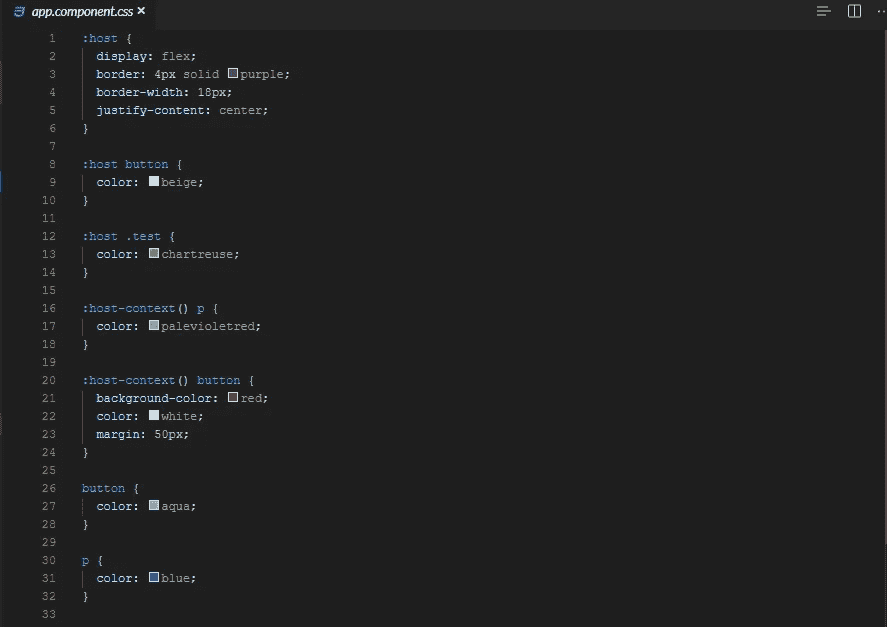
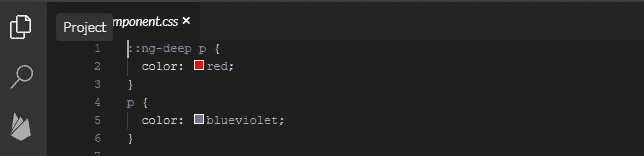

# 如何使用带有特殊选择器的角度组件样式

> 原文：<https://javascript.plainenglish.io/how-to-use-angular-component-styles-with-special-selectors-dc877514372c?source=collection_archive---------14----------------------->

## 在具有独立样式文件的组件基础上为您的 Angular 应用程序添加样式，可以帮助您创建更模块化的设计。

今天，我为你准备了一篇关于 Angular 中组件风格的文章。到目前为止，我已经记住了这实际上是如何工作的，但是就本文而言，我是通过研究样本和理解逻辑进行研究的。所以，我准备了大量的例子来帮助你。我希望你会发现它有用。

在写这篇文章的时候，我使用了安格尔自己的文档。您可以在这里访问[链接。](https://angular.io/guide/component-styles#host-context)

您可以在您的角度应用程序中直接使用 CSS 标准。换句话说，您可以添加任何您知道的关于媒体查询、选择器、规则和 CSS 的信息，并为您的应用程序添加颜色。

在具有独立样式文件的组件的基础上为应用程序添加样式，有助于在将所有组件视为一个整体时创建更模块化的设计。

在安格斯，HTML 和样式定义可以用不同的方式制作。如果您愿意，您可以在`@Component`组件中定义它，或者从 HTML 和 CSS 页面中访问它，比如在通常的布局中。

## **使用组件样式**

**样式范围**

`@Component`元数据中定义的样式仅在该组件中有效。它不能被另一个组件使用。如您在示例中所见，元数据 StartComponent 中定义的`
`样式仅适用于 StartComponent。`Font-weight:`正常不适用于我们在 AppComponent 中定义的另一个`
`。

我想解释当一个文件中有样式定义时，我们为什么要遵循这样的顺序；

*   我们通过组合不同的组件来开发我们的应用程序，即归纳逻辑。由于这允许我们，开发人员，在不扫描所有代码的情况下，找到它所说的地方和内容，这为我们节省了大量的时间来立即找到我们要找的点。如果您想对样式文件进行更改，您可以更改它，而不用担心代码是在哪个组件中编写的。您也不必担心造成不必要的复杂性，或者考虑如果进行更改，会破坏代码的哪些其他部分
*   其中最棒的一点是，我们正在开发一个整洁干净的项目。
*   如果我们编写的代码是在其他组件中定义的，它们之间就不会有交互。但是，当你说我想在组件 A 中使用组件 B 时，事情会有一点变化。我会报道这个问题。

## **1。专用选择器**

`:host`

在组件中，您可以为您定义的结构使用样式。我已经通过 StackBlitz 与您分享了一个示例代码。`:host`可以看到宿主如何影响组件以及组件中的组件。

`:host`选择器是瞄准宿主元素的唯一方法。您不能使用其他选择器从组件内部访问宿主元素，因为它不是组件自身模板的一部分。宿主元素位于父组件的模板中。

角度文档中提供了该定义。

这是你需要被告知的；

`:host`不能从组件中的任何地方访问宿主元素，因为`:host`元素不是组件拥有的结构。`:host`元素是组件模板的祖先。

从我分享的例子中你可以理解`:host`没有为宿主元素定义 id、类，宿主将我写的更改应用到它的结构中。

*作为另一种用法:*

`:host .test {color: red}`

*对于一些你想要定义的结构，你可以使用表单。*

`:host (.test)`可以是`{color: red}`

`:host-context`

在某些情况下，我们希望我们的定义发生变化。最简单的例子是主题变化。在浅色主题中，我们希望按钮是勃艮第的，但是在深色主题中，相同的按钮应该是蓝色的。为此，我们可以使用:`:host-context.`

`:host-context(.theme-light) button {background-color: purple; color:white}`

`:host-context`元素:可视为`:host()`的一种功能状态。当使用另一个选择器时，它会很有用。

`::ng-deep`

它作用于定义它的组件中的 HTML 块。我也再次通过 StackBlitz 分享了它。如果您已经为任何标签连同`::ng-deep`一起定义了 CSS，它将无效。因为`::ng-deep`与使用一起成为全球使用并成为主导。

注意在`::ng-deep`之前不要忘记使用`:host`，如果您忘记了，您定义的 CSS 规则会影响其他组件。
`/deep/, >>> and ::ng-deep`

您应该只在使用[视图封装](https://angular.io/guide/view-encapsulation)时使用它们。

## **2 .加载组件样式**

**2.1。组件元数据中的样式**

您可以使用 Angular CLI 创建内嵌组件；

`ng generate component app-name-inline-style`

`ng g component app-name-inline-style`

**2.2。组件元数据中的样式文件**

如果使用这种样式结构，其他组件不能授予访问权限，也不会影响其他组件。

我们可以创建和定义多个样式文件、样式或`styleUrls`。

使用 Angular CLI 以这种方式创建组件；

`ng generate component my-app`

`ng g component my app`

**2.3。模板内嵌样式**

**2.4。模板链接标签**

**2.5。非 CSS 样式文件**

谢了。

*来源:* [*组件样式*](https://angular.io/guide/component-styles#host-context)

*更多内容请看*[*plain English . io*](http://plainenglish.io/)