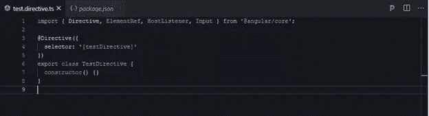
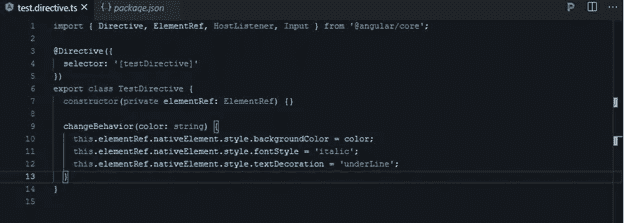
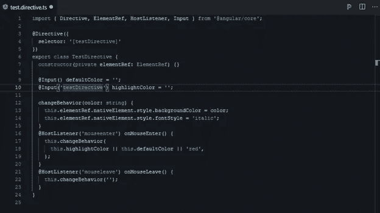
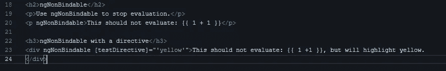

# 如何在类层次结构中使用 Angular 的属性指令

> 原文：<https://javascript.plainenglish.io/how-to-use-angulars-attribute-directives-in-your-class-hierarchy-d3a1d0adac32?source=collection_archive---------9----------------------->

## 使用 Angular CLI 构建属性指令

Photo by [Ivan Bandura](https://unsplash.com/@unstable_affliction?utm_source=medium&utm_medium=referral) on [Unsplash](https://unsplash.com?utm_source=medium&utm_medium=referral)

如果想改变 DOM 元素和角度组件的外观或行为，可以使用属性指令。指令是借助@Directive decorator 创建的类。可以使用 DOM 对象的角度方向来改变其外观、行为或布局。

指令分为三个标题:

组件方向

结构指令

归因参考

## **构建属性指令**

*   我们使用 CLI 创建指令。

`ng generate directive test`

`directive()`装饰器的配置属性指定了指令的 CSS 属性选择器`[testDirective]`

*   从`@angular/core`进口`ElementRef`。`ElementRef`通过其`nativeElement`属性授予对宿主 Dom 元素的直接访问权。
*   在 directives 构造函数()中添加`ElementRef`来注入对宿主 DOM 元素的引用，该元素是您应用了`testdirective`的元素。
*   向 TestDirectives 类添加将背景设置为您的颜色的逻辑

> 指令不支持名称空间

`
Test msg
`

## 应用属性指令

`
Test
`

Angular 创建 TestDirective 类的一个实例，并将对`
`元素的引用注入到指令的构造函数中，该构造函数将`
`元素的背景样式设置为黄色。

## **处理用户事件**

`Import HostListener from '@angular/core'`

使用`@HostListener`装饰器，您可以订阅托管属性指令的 DOM 元素的事件，在本例中是`
`。处理程序委托给一个助手方法`changeBehavior()`，该方法设置宿主 DOM 元素的颜色。

当指针悬停在段落元素上时，背景`color`和`textStyle`出现，当指针移出时，背景消失。

**使用 NgNonBindable 禁用角度加工**

`ngNonBindable`取消模板中的插值、指令和绑定。

将`ngNonBindable`应用于一个元素会停止绑定该元素的子元素。它仍然允许指令在您应用`ngNonBindable`的元素上工作

如果在父元素中使用它，Angular 会对元素的子元素禁用任何类型的插值和绑定，如属性绑定或事件绑定。

## **结构指令**

结构指令用于操作和改变 DOM 对象的结构。它们以“*”号开始。

***ngIf 指令:**允许添加和删除 DOM 元素。

***ngSwitch 指令:**这个指令也允许你添加和删除 DOM 元素。这类似于 C#和类似语言中开关的使用。

***ngFor 指令:** *ngFor 指令用于将可重复的 HTML 部分添加到列表的 HTML 中。

## **属性指令**

属性指令用于改变 DOM 对象的外观和行为。

**ngClass 指令:** ngClass 指令用于向 HTML 元素添加 CSS 类。

**ngStyle 指令:** ngStyle 指令用于给 HTML 元素添加样式，动态改变它们的样式。

## 主机监听器

它是一个声明，允许我们确定我们创建的指令将被分配给哪个事件/事件。

## 主机绑定

该声明将自身绑定到由指令标记的 DOM 对象的属性，根据声明该属性的变量的值将该属性应用于相应的对象。

[*来源*](https://angular.io/guide/attribute-directives)

 [## angular-ivy-9ycjxx - StackBlitz

### 导出到 Angular CLI 的 Angular 应用程序的启动项目

stackblitz.com](https://stackblitz.com/edit/angular-ivy-9ycjxx?file=src/app/test.directive.ts)  [## 如何使用传单地图创建标记和标记簇

### 在活页地图架构中创建标记和图层，然后对标记进行聚类的方法。

javascript.plainenglish.io](/how-to-create-marker-and-marker-cluster-with-leaflet-map-95e92216c391)  [## 使用角状星云在翻转卡中设计图表和日历

### 在活动卡片上创建一个快速、友好的图表和日历。

javascript.plainenglish.io](/chart-and-calendar-design-in-flip-card-using-angular-nebular-db0ffd434d5b)  [## 使用免费的 Vue.js 模板创建卡片设计

### 使用免费主题可能是开发设计和学习的最佳方式之一。

javascript.plainenglish.io](/create-a-card-design-with-the-free-vue-js-template-now-ui-kit-5676a738e518)  [## 如何将角度组件样式与特殊选择器一起使用

### 在具有独立样式文件的组件的基础上，将样式添加到您的 Angular 应用程序有助于您创建一个更…

javascript.plainenglish.io](/how-to-use-angular-component-styles-with-special-selectors-dc877514372c) 

*更多内容请看*[***plain English . io***](http://plainenglish.io/)