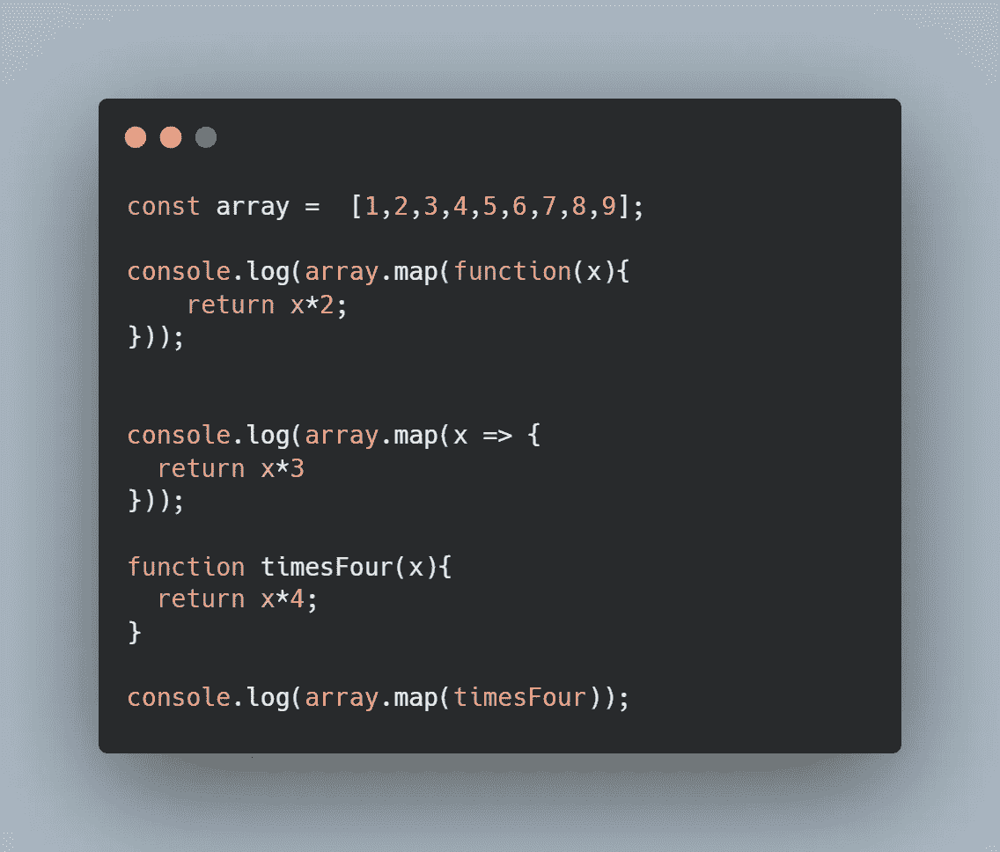
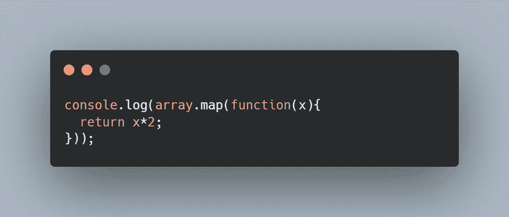
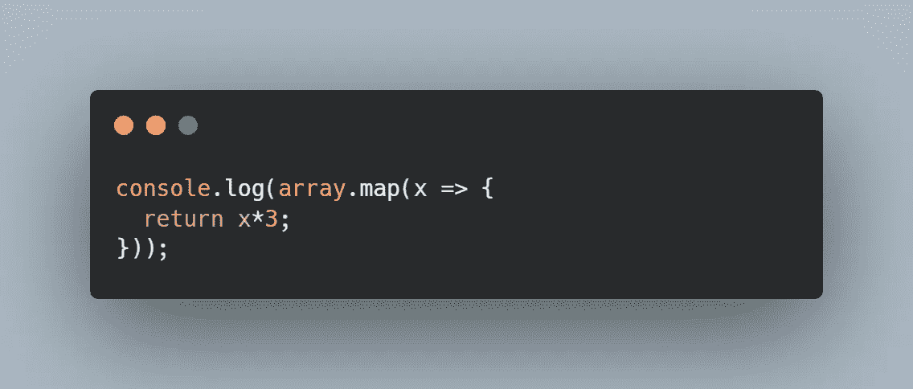
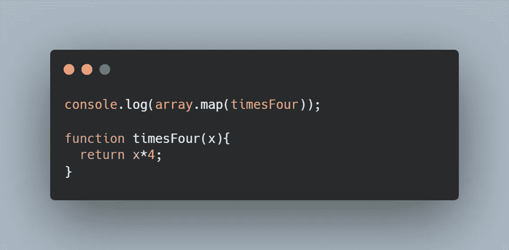
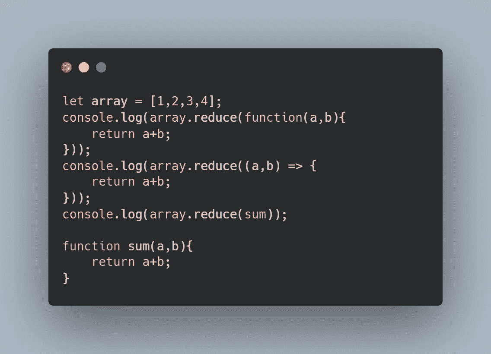
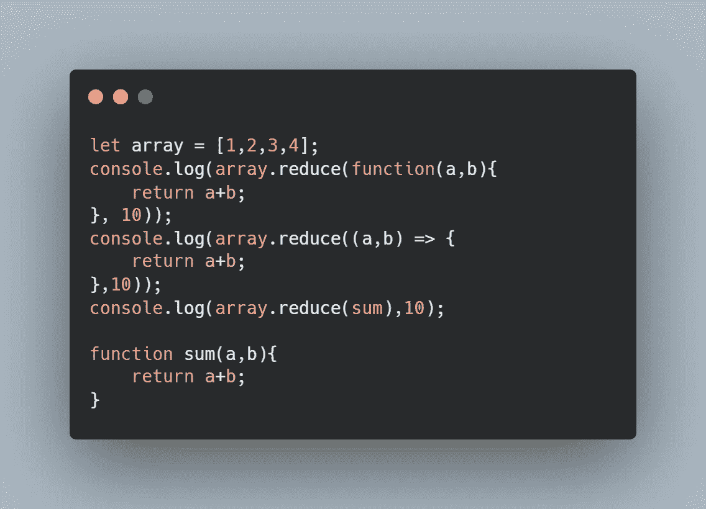
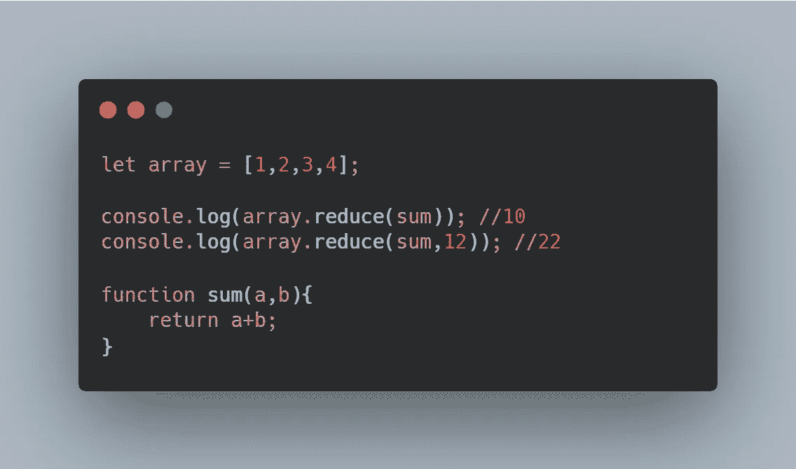
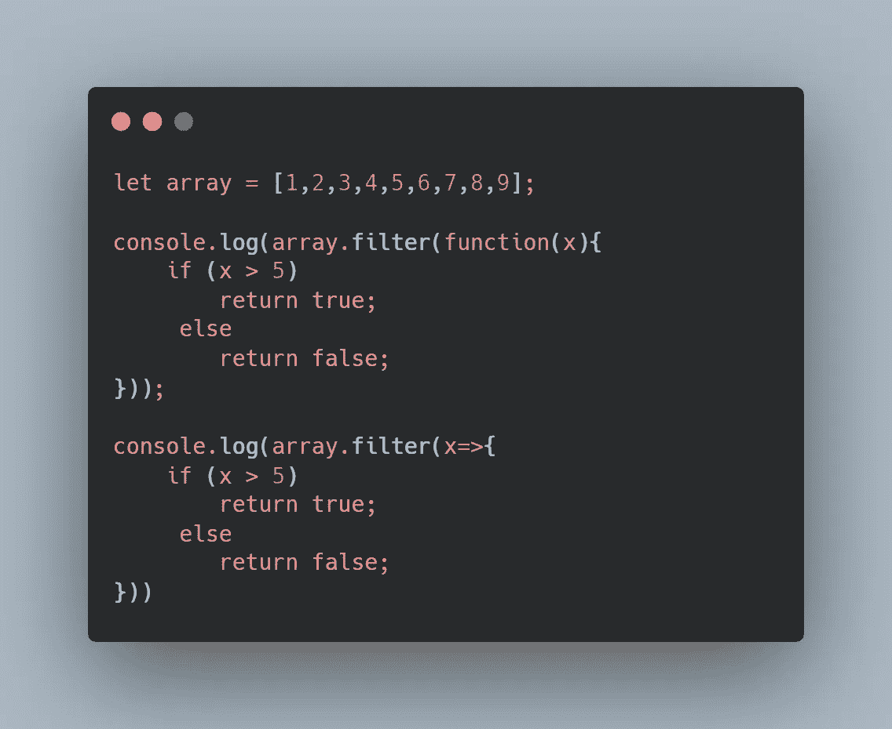

# 如何使用数组方法:映射、归约和过滤(适用于初学者)

> 原文：<https://javascript.plainenglish.io/how-to-use-array-methods-map-reduce-and-filter-for-beginners-565ee4663f29?source=collection_archive---------7----------------------->

## 用通俗易懂的描述和例子来理解数组方法！


Photo By [Dhaval Parmar](https://www.instagram.com/dark_knightt15/)

这三种方法看起来非常可怕，尤其是当它们相互依赖时。因为 JavaScript 程序员可以很容易地使用 for 循环来代替这些方法，所以避免它们是相当容易的。

但是当你的同事、老师和合作者使用它们时会发生什么呢？数组方法非常简单明了。希望这篇文章能告诉你这一点。本文将帮助您在大约五分钟内掌握这些 JavaScript 方法。让我们开始吧。

# 地图功能



显然，我们用数组开始示例代码，因为`map()`是一个数组方法。Map 将接受一个数组作为输入，对其执行操作，并返回一个新的数组(大小相同),该数组是该操作的结果。换句话说，它对数组中的每个元素执行操作，将新值放入一个新数组，然后返回这个新数组。

让我们来分解一下:

你得到你想要用作输入的数组。在示例代码中，我们的数组名是“array”。然后我们将`.map()`添加到我们的数组中，如上所示，产生了`array.map()`。然后，对于 map 方法的参数，我们添加一个函数。

一个函数可以有许多不同的表现方式——这可能是许多人感到困惑的原因。



对于第一种情况，函数如下所示。注意这个函数如何有一个参数`x`。这非常重要。这就是正在发生的事情:

map 方法只是一个接一个地获取数组的每个元素并应用这个函数(因此，return 语句也是必不可少的)。`x` 代表数组中的每个元素。所以这段代码说的是“一个接一个地取数组的每个元素，然后乘以 2。”

有了那个码，[1，2，3，4]就会变成[2，4，6，8]。



在下一个示例中，map 方法的参数采用箭头函数的形式。和上一个是一个思路。在这个表示中，函数有一个参数 x。对于数组中的每个元素，它将把它乘以 3。

[1，2，3，4]会变成[3，6，9，12]

阅读 MDN 文档中关于[箭头功能](https://developer.mozilla.org/en-US/docs/Web/JavaScript/Reference/Functions/Arrow_functions)的更多信息。



对于最后一个，我们将传递一个预定义的函数作为 map 函数的参数。这和前两个想法一模一样。请确保该函数接受一个参数并有一个 return 语句。

最后，需要注意的是以下内容是无效的:

```
console.log(array.map(timesFour()));function timesFour(x){
  return x*4;
}
```

在上面的示例代码中，您正在传递一个函数调用。您要求 timesFour()执行并返回值。如果 timesFour 返回一个我们可以使用的有意义的函数，这是可以接受的。情况并非如此。所以要小心。

另外，注意你的括号。确保每个括号和花括号都有一个伙伴。

# 减少



与 map 方法类似，reduce 方法将一个数组作为输入，它不会改变原始数组。但是，与 map 方法不同，reduce 方法不返回整个数组。reduce 方法返回一个值。如上面的示例代码所示，这对于将数组中的所有值相加非常有用。

因为我们已经分解了函数呈现自己的不同方式，所以我们将跳过这一部分。相反，让我们来讨论一下 reduce 方法的参数。

reduce 方法将函数作为参数，类似于 map 方法。该函数将有两个参数。在本例中，这两个参数是变量 a 和 b。a 是累计总数，b 是一个元素，这可能没有意义，所以让我们深入研究一下。

```
let array = [1,2,3,4];
console.log(array.reduce((a,b) => {
    return a+b;
}));
```

这就是事情发生的过程。你可以把它想象成一个 for 循环。

*   在第一个循环中，第一个元素(在索引 0 处)成为初始值——存储在`a`中。因此，a=1。同样，a 是累计总数。
*   在第二个循环中，第二个元素(在索引 1 处)被分配给`b`。b=2。现在，我们要加上 a+b，也就是 1+2。我们将总和存储在 a 中。a=3。(你可以把它想成 a += b)
*   在第三个循环中，第三个元素(在索引 2 处)被分配给`b`。b=3。我们做 a+b 或者 3+3。我们将总和存储在 a 中。a=6
*   在第四个循环中，我们重复这个过程。a=10。因为我们遍历了整个数组，所以我们完成了。



reduce 方法还让我们做一些特殊的事情。我们可以添加第二个参数来减少。

这就是我们所看到的:

```
arrayName.reduce(function-here);
```

但是我们也可以这样做:

```
arrayName.reduce(function-here, initial-value);
```

还记得前面，索引 0 处的元素被设置为 a 的初始值，索引 0 处的元素被设置为我们运行总和的初始值。通过这样做，我们可以将运行总数的初始值设置为我们想要的任何值。



比较和对比上面的两种减少方法。

*   第一个输出 1+2+3+ 4 = 10
*   第二个输出 12 +1+2+3+ 4 = 22

理解其工作原理的最佳方式是摆弄它。输入不同的值，观察会发生什么。

# 过滤器

过滤是一种有趣的方法。Filter 接受一个数组作为输入，它返回一个新的数组，而不改变原来的数组。与前两种方法类似，filter 需要一个函数参数。

与前面的情况不同，这个函数必须返回 true 或 false 值。



流程是这样的:

过滤器将逐个查看数组的每个元素，并将其用作函数的输入。如果元素被输入到函数中并返回 true，那么该元素将被添加到新数组中。如果数组被输入到函数中并返回 false，它将不会被添加到新数组中。

在上面的示例代码中，过滤器将返回一个元素数大于 5 的新数组。

与前两种方法类似，函数可以采用不同的形式。只需确保您的函数有必要的参数，并且包含 return 语句。

*更多内容请看*[***plain English . io***](http://plainenglish.io/)*。报名参加我们的* [***免费每周简讯这里***](http://newsletter.plainenglish.io/) *。*