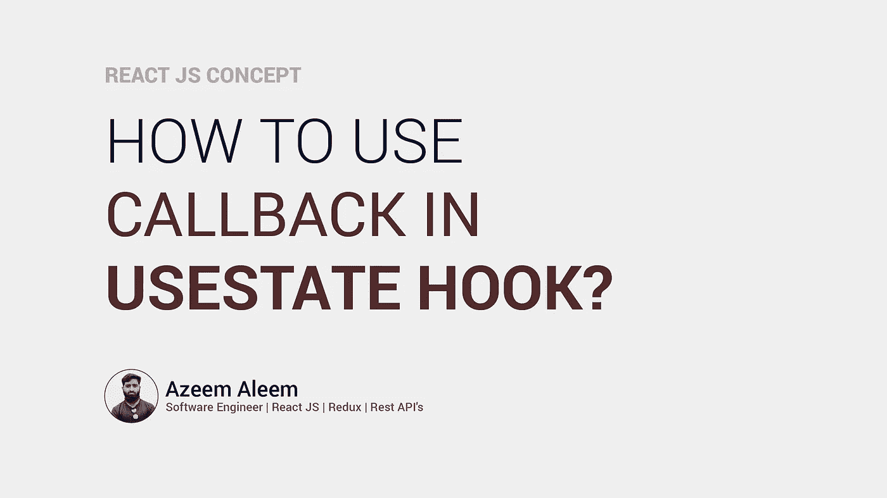

# 如何在 useState()钩子中使用回调？

> 原文：<https://javascript.plainenglish.io/how-to-use-callback-in-usestate-hook-afe4113d9ac0?source=collection_archive---------3----------------------->

**在 React 的 useState()中使用回调函数**



如果您正在 React 中使用类组件，那么您可能熟悉 setState()中的回调函数。

```
setState(updateState, callbackFunction)this.setState({name: “Azeem Aleem”},()=>{
console.log(“State Response”,this.state.name);
})
```

这个回调函数总是在状态更新后调用。但是在功能组件中，情况略有不同。

**我们不能在 useState 钩子中直接使用回调。要在 useState 钩子中使用 callback，我们需要使用在状态更新后触发的 useEffect 钩子，并在此之后调用函数。**

```
const [state, setState] = useState();
useEffect(() => {callbackFunction()}, [state])
```

我们需要在 useEffect 依赖数组中传递状态。状态更新时触发 useEffect，然后立即调用内部函数。

**关注我** [**LinkedIn**](https://www.linkedin.com/in/azeem-aleem-560345148/)

有什么问题吗？请评论
谢谢
问候:Azeem Aleem

*更多内容看* [***说白了. io***](http://plainenglish.io/)