# 如何使用 Chart.js

> 原文：<https://javascript.plainenglish.io/how-to-use-chart-js-8f26208dd050?source=collection_archive---------17----------------------->

## 11 Chart.js 示例

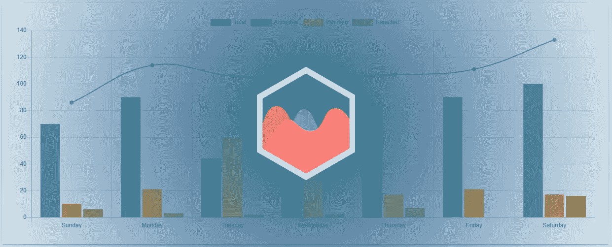

# **什么是 Chart.js？**

Chart.js 是一个开源的数据可视化库。

使用 JavaScript 的 HTML5 图表呈现带有交互式图例和数据点的动画图表。

# **如何使用 Chart.js？**

Chart.js 使用 JavaScript 构建，需要使用 HTML `<canvas>`元素和 js 函数来实例化图表。

然后根据需要将数据集、标注、背景颜色和其他配置添加到函数中。

# **本 Chart.js 教程涵盖了哪些内容？**

我们将讨论以下主题:

1.  [Chart.js 安装](https://www.ordinarycoders.com/blog/article/11-chart-js-examples#installation)
2.  [Chart.js 集成](https://www.ordinarycoders.com/blog/article/11-chart-js-examples#integration)
3.  [Chart.js 图表](https://www.ordinarycoders.com/blog/article/11-chart-js-examples#charts)
4.  [Chart.js 配置](https://www.ordinarycoders.com/blog/article/11-chart-js-examples#configurations)

# **Chart.js 安装——如何安装 Chart.js**

通过 npm 或 bower 安装 Chart.js。

或者使用 CDN 添加缩小的 Chart.js 脚本。

**Chart.js npm**

*如何用 npm 安装 Chart.js】*

```
npm install chart.js --save
```

使用 npm 在命令提示符下安装 chart.js。

**Chart.js Bower**

*如何用 bower 安装 Chart.js】*

```
bower install chart.js --save
```

或者使用 bower 在命令提示符下安装 Chart.js。

**Chart.js CDN**

*如何使用 Chart.js CDN*

```
<!DOCTYPE html>
<html>
  <head>
    <!-- Required meta tags -->
    <meta charset="utf-8">
    <meta name="viewport" content="width=device-width, initial-scale=1.0">
    <title>Title</title>
    <!--Chart.js JS CDN--> 
    <script src="https://cdnjs.cloudflare.com/ajax/libs/Chart.js/2.9.4/Chart.min.js"></script> 
  </head>
  <body> ...

  </body>
</html>
```

虽然文档建议在命令提示符下安装 Chart.js，但是为了轻量级开发，请将 Chart.js CDN 添加到`<head>`元素中。

下面的例子使用了 CDN。

# **集成—如何将 Chart.js 添加到 HTML 文档中**

Chart.js 需要 HTML 和 JavaScript 代码。

HTML 代码使用`<canvas>`元素将图表放在文档中，而 JavaScript 函数实例化图表。

**如何添加 Chart.js <画布>元素**

*如何在 HTML 模板中显示 chart . js*

```
<!DOCTYPE html>
<html>
  <head>
    <!-- Required meta tags -->
    <meta charset="utf-8">
    <meta name="viewport" content="width=device-width, initial-scale=1.0">
    <title>Chart.js Integration</title>
    <!--Chart.js JS CDN--> 
    <script src="https://cdnjs.cloudflare.com/ajax/libs/Chart.js/2.9.4/Chart.min.js"></script> 
  </head>
  <body> <div>
	<canvas id="myChart"></canvas>
    </div>

  </body>
</html>
```

Chart.js 需要一个包含图表的惟一 id 的`<canvas>`元素，以便在 HTML 模板中呈现数据。

这是唯一需要的 HTML 代码。

**如何实例化 Chart.js**

*如何添加 Chart.js JavaScript 函数*

```
<!DOCTYPE html>
<html>
  <head>
    <!-- Required meta tags -->
    <meta charset="utf-8">
    <meta name="viewport" content="width=device-width, initial-scale=1.0">
    <title>Chart.js Integration</title>
    <!--Chart.js JS CDN--> 
    <script src="https://cdnjs.cloudflare.com/ajax/libs/Chart.js/2.9.4/Chart.min.js"></script> 
  </head>
  <body> <div>
	<canvas id="myChart"></canvas>
    </div> <script>
        var ctx = document.getElementById('myChart').getContext('2d');
        var myChart = new Chart(ctx, {

        });
    </script> </body>
</html>
```

然后创建创建图表的脚本。

类型、数据和配置选项将被添加到函数中。

# **图表— 11 个 Chart.js 示例**

Chart.js 提供了九种图表类型。

每个都是可定制的，并且可以在混合图表上组合。

**Chart.js 折线图示例**

*如何制作 Chart.js 折线图*

```
<!DOCTYPE html>
<html>
  <head>
    <!-- Required meta tags -->
    <meta charset="utf-8">
    <meta name="viewport" content="width=device-width, initial-scale=1.0">
    <title>Chart.js Line Chart</title>
    <!--Chart.js JS CDN--> 
    <script src="https://cdnjs.cloudflare.com/ajax/libs/Chart.js/2.9.4/Chart.min.js"></script> 
  </head>
  <body> <div>
	<canvas id="myChart"></canvas>
    </div> <script>
       var ctx = document.getElementById('myChart').getContext('2d');
      var myChart = new Chart(ctx, {
          type: 'line',
          data: {
            labels: ["Sunday", "Monday", "Tuesday", "Wednesday", "Thursday", "Friday", "Saturday"],
            datasets: [{ 
                data: [86,114,106,106,107,111,133],
                label: "Total",
                borderColor: "#3e95cd",
                backgroundColor: "#7bb6dd",
                fill: false,
              }, { 
                data: [70,90,44,60,83,90,100],
                label: "Accepted",
                borderColor: "#3cba9f",
                backgroundColor: "#71d1bd",
                fill: false,
              }, { 
                data: [10,21,60,44,17,21,17],
                label: "Pending",
                borderColor: "#ffa500",
                backgroundColor:"#ffc04d",
                fill: false,
              }, { 
                data: [6,3,2,2,7,0,16],
                label: "Rejected",
                borderColor: "#c45850",
                backgroundColor:"#d78f89",
                fill: false,
              }
            ]
          },
        });
    </script> </body>
</html>
```

将图表类型指定为“折线图”，然后在下面添加数据集属性。

添加带有 y 轴数据点、`label`、`borderColor`、`backgroundColor`和`fill`属性的单个数据集。

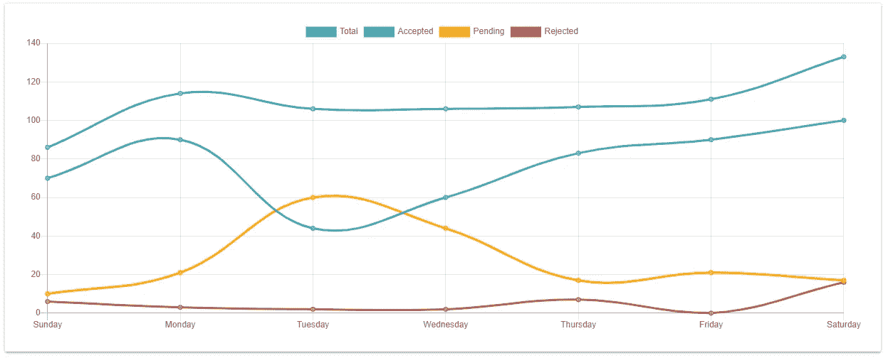

**Chart.js 填充折线图示例**

*如何制作带有背景色的 Chart.js 折线图*

```
<!DOCTYPE html>
<html>
  <head>
    <!-- Required meta tags -->
    <meta charset="utf-8">
    <meta name="viewport" content="width=device-width, initial-scale=1.0">
    <title>Chart.js Filled Line Chart</title>
    <!--Chart.js JS CDN--> 
    <script src="https://cdnjs.cloudflare.com/ajax/libs/Chart.js/2.9.4/Chart.min.js"></script> 
  </head>
  <body> <div>
	<canvas id="myChart"></canvas>
    </div> <script>
       var ctx = document.getElementById('myChart').getContext('2d');
      var myChart = new Chart(ctx, {
          type: 'line',
          data: {
            labels: ["Sunday", "Monday", "Tuesday", "Wednesday", "Thursday", "Friday", "Saturday"],
            datasets: [{ 
                data: [86,114,106,106,107,111,133],
                label: "Total",
                borderColor: "rgb(62,149,205)",
                backgroundColor: "rgb(62,149,205,0.1)",
              }, { 
                data: [70,90,44,60,83,90,100],
                label: "Accepted",
                borderColor: "rgb(60,186,159)",
                backgroundColor: "rgb(60,186,159,0.1)",
              }, { 
                data: [10,21,60,44,17,21,17],
                label: "Pending",
                borderColor: "rgb(255,165,0)",
                backgroundColor:"rgb(255,165,0,0.1)",
              }, { 
                data: [6,3,2,2,7,0,16],
                label: "Rejected",
                borderColor: "rgb(196,88,80)",
                backgroundColor:"rgb(196,88,80,0.1)",
              }
            ]
          },
        });
    </script> </body>
</html>
```

为每个数据集指定`backgroundColor`，或者*删除* `fill:false`或者将其更改为`fill:true`为每个行区域添加背景色。

然而，要知道颜色重叠时会变得模糊。

我们还建议使用 RGB 颜色格式来指定`backgroundColor`的不透明度。

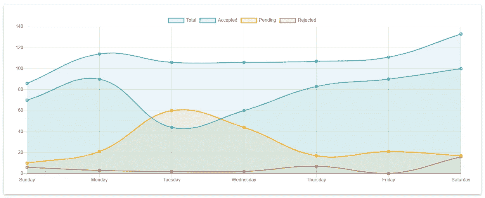

**Chart.js 条形图示例**

*如何制作 Chart.js 条形图*

```
<!DOCTYPE html>
<html>
  <head>
    <!-- Required meta tags -->
    <meta charset="utf-8">
    <meta name="viewport" content="width=device-width, initial-scale=1.0">
    <title>Chart.js Bar Chart</title>
    <!--Chart.js JS CDN--> 
    <script src="https://cdnjs.cloudflare.com/ajax/libs/Chart.js/2.9.4/Chart.min.js"></script> 
  </head>
  <body> <div>
	<canvas id="myChart"></canvas>
    </div> <script>
      var ctx = document.getElementById('myChart').getContext('2d');
      var myChart = new Chart(ctx, {
          type: 'bar',
          data: {
            labels: ["Sunday", "Monday", "Tuesday", "Wednesday", "Thursday", "Friday", "Saturday"],
            datasets: [{ 
                data: [86,114,106,106,107,111,133],
                label: "Total",
                borderColor: "rgb(62,149,205)",
                backgroundColor: "rgb(62,149,205,0.1)",
                borderWidth:2
              }, { 
                data: [70,90,44,60,83,90,100],
                label: "Accepted",
                borderColor: "rgb(60,186,159)",
                backgroundColor: "rgb(60,186,159,0.1)",
                borderWidth:2
              }, { 
                data: [10,21,60,44,17,21,17],
                label: "Pending",
                borderColor: "rgb(255,165,0)",
                backgroundColor:"rgb(255,165,0,0.1)",
                borderWidth:2
              }, { 
                data: [6,3,2,2,7,0,16],
                label: "Rejected",
                borderColor: "rgb(196,88,80)",
                backgroundColor:"rgb(196,88,80,0.1)",
                borderWidth:2
              }
            ]
          },
        });
    </script> </body>
</html>
```

声明`type:"bar"`，然后添加 x 轴标签和数据集。

如果没有给出`backgroundColor`，条的背景颜色将默认为灰色。

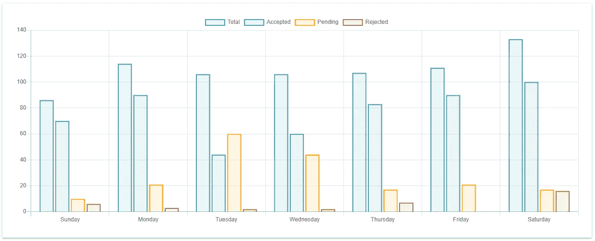

**堆积条形图示例**

*如何制作 Chart.js 堆积条形图*

```
<!DOCTYPE html>
<html>
  <head>
    <!-- Required meta tags -->
    <meta charset="utf-8">
    <meta name="viewport" content="width=device-width, initial-scale=1.0">
    <title>Chart.js Stacked Bar Chart</title>
    <!--Chart.js JS CDN--> 
    <script src="https://cdnjs.cloudflare.com/ajax/libs/Chart.js/2.9.4/Chart.min.js"></script> 
  </head>
  <body> <div>
	<canvas id="myChart"></canvas>
    </div> <script>
      var ctx = document.getElementById('myChart').getContext('2d');
      var myChart = new Chart(ctx, {
          type: 'bar',
          data: {
            labels: ["Sunday", "Monday", "Tuesday", "Wednesday", "Thursday", "Friday", "Saturday"],
            datasets: [{ 
                data: [70,90,44,60,83,90,100],
                label: "Accepted",
                borderColor: "#3cba9f",
                backgroundColor: "#71d1bd",
                borderWidth:2
              }, { 
                data: [10,21,60,44,17,21,17],
                label: "Pending",
                borderColor: "#ffa500",
                backgroundColor:"#ffc04d",
                borderWidth:2
              }, { 
                data: [6,3,2,2,7,0,16],
                label: "Rejected",
                borderColor: "#c45850",
                backgroundColor:"#d78f89",
                borderWidth:2
              }
            ]
          },
          options: {
            scales: {
               xAxes: [{ 
                stacked: true    
               }],
               yAxes: [{
                stacked:true
               }],
             }
           },
        });
    </script> </body>
</html>
```

不要有一个`Totals`数据集，将数据呈现为一个堆叠的条形图。

需要添加将`xAxes`和`yAxes`都设置为`stacked:true`的`scales`选项，这样才能工作。

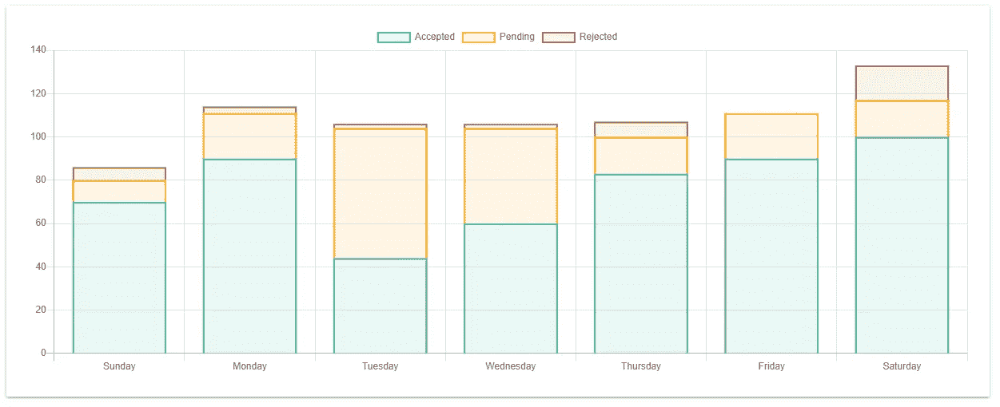

**Chart.js 雷达图示例**

*如何制作 Chart.js 雷达图*

```
<!DOCTYPE html>
<html>
  <head>
    <!-- Required meta tags -->
    <meta charset="utf-8">
    <meta name="viewport" content="width=device-width, initial-scale=1.0">
    <title>Chart.js Radar Chart</title>
    <!--Chart.js JS CDN--> 
    <script src="https://cdnjs.cloudflare.com/ajax/libs/Chart.js/2.9.4/Chart.min.js"></script> 
  </head>
  <body> <div>
	<canvas id="myChart"></canvas>
    </div> <script>
      var ctx = document.getElementById('myChart').getContext('2d');
      var myChart = new Chart(ctx, {
          type: 'radar',
          data: {
            labels: ["Sunday", "Monday", "Tuesday", "Wednesday", "Thursday", "Friday", "Saturday"],
            datasets: [{ 
                data: [86,114,106,106,107,111,133],
                label: "Total",
                borderColor: "#3e95cd",
                backgroundColor: "rgb(62,149,205,0.1)",
                borderWidth:2,

              }, { 
                data: [70,90,44,60,83,90,100],
                label: "Accepted",
                borderColor: "#3cba9f",
                backgroundColor: "rgb(60,186,159,0.1)",
                borderWidth:2,

              }, { 
                data: [10,21,60,44,17,21,17],
                label: "Pending",
                borderColor: "#ffa500",
                backgroundColor:"rgb(255,165,0,0.1)",
                borderWidth:2,

              }, { 
                data: [6,3,2,2,7,0,16],
                label: "Rejected",
                borderColor: "#c45850",
                backgroundColor:"rgb(196,88,80,0.1)",
                borderWidth:2,

              }
            ]
          },
          options: {
             scales: {
               xAxes: [{ 
                  display: false,
               }],
             }
           },
        });
    </script> </body>
</html>
```

如果选择显示雷达图，将`XAxes`和`YAxes`设置为`display: false`，因为阅读该图不需要它们。

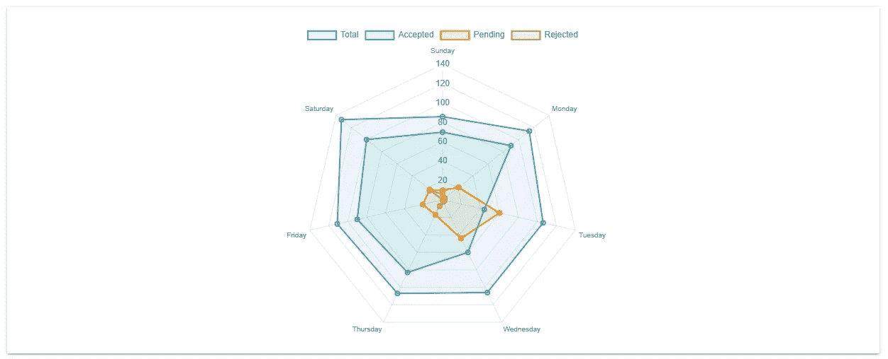

**甜甜圈图表示例**

*如何制作 Chart.js 甜甜圈图*

```
<!DOCTYPE html>
<html>
  <head>
    <!-- Required meta tags -->
    <meta charset="utf-8">
    <meta name="viewport" content="width=device-width, initial-scale=1.0">
    <title>Chart.js Doughnut Chart</title>
    <!--Chart.js JS CDN--> 
    <script src="https://cdnjs.cloudflare.com/ajax/libs/Chart.js/2.9.4/Chart.min.js"></script> 
  </head>
  <body> <div>
	<canvas id="myChart"></canvas>
    </div> <script>
      var ctx = document.getElementById('myChart').getContext('2d');
      var myChart = new Chart(ctx, {
          type: 'doughnut',
          data: {
            labels: ["Accepted","Pending", "Rejected"],
            datasets: [{ 
                data: [70,10,6],
                borderColor:[
                  "#3cba9f",
                  "#ffa500",
                  "#c45850",
                ],
                backgroundColor: [
                  "rgb(60,186,159,0.1)",
                  "rgb(255,165,0,0.1)",
                  "rgb(196,88,80,0.1)",
                ],
                borderWidth:2,
              }]
          },
        options: {
          scales: {
            xAxes: [{ 
               display: false,
            }],
            yAxes: [{
               display: false,
            }],
          }
        }, });
    </script> </body>
</html>
```

圆环图的工作原理类似于雷达图。

此图表不需要轴。

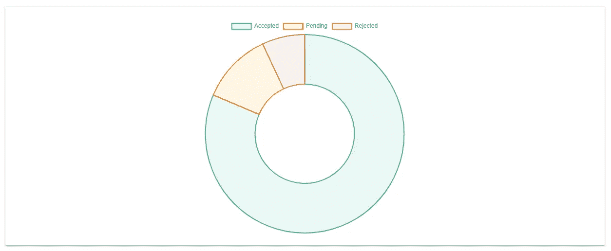

**饼状图示例**

*如何制作 Chart.js 饼状图*

```
<!DOCTYPE html>
<html>
  <head>
    <!-- Required meta tags -->
    <meta charset="utf-8">
    <meta name="viewport" content="width=device-width, initial-scale=1.0">
    <title>Chart.js Pie Chart</title>
    <!--Chart.js JS CDN--> 
    <script src="https://cdnjs.cloudflare.com/ajax/libs/Chart.js/2.9.4/Chart.min.js"></script> 
  </head>
  <body> <div>
	<canvas id="myChart"></canvas>
    </div> <script>
      var ctx = document.getElementById('myChart').getContext('2d');
      var myChart = new Chart(ctx, {
          type: 'pie',
          data: {
            labels: ["Accepted","Pending", "Rejected"],
            datasets: [{ 
                data: [70,10,6],
                borderColor:[
                  "#3cba9f",
                  "#ffa500",
                  "#c45850",
                ],
                backgroundColor: [
                  "rgb(60,186,159,0.1)",
                  "rgb(255,165,0,0.1)",
                  "rgb(196,88,80,0.1)",
                ],
                borderWidth:2,
              }]
          },
        options: {
          scales: {
            xAxes: [{ 
               display: false,
            }],
            yAxes: [{
               display: false,
            }],
          }
        },
      }); </script> </body>
</html>
```

饼图的工作方式类似于圆环图，只是中间没有洞。

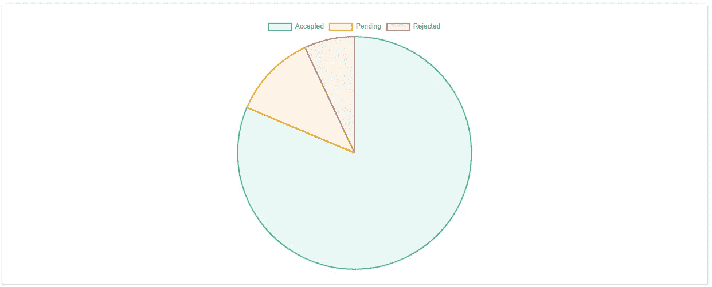

**极区图示例**

*如何制作 Chart.js 极区图*

```
<!DOCTYPE html>
<html>
  <head>
    <!-- Required meta tags -->
    <meta charset="utf-8">
    <meta name="viewport" content="width=device-width, initial-scale=1.0">
    <title>Chart.js Polar Area Chart</title>
    <!--Chart.js JS CDN--> 
    <script src="https://cdnjs.cloudflare.com/ajax/libs/Chart.js/2.9.4/Chart.min.js"></script> 
  </head>
  <body> <div>
	<canvas id="myChart"></canvas>
    </div> <script>
      var ctx = document.getElementById('myChart').getContext('2d');
      var myChart = new Chart(ctx, {
          type: 'pie',
          data: {
            labels: ["Accepted","Pending", "Rejected"],
            datasets: [{ 
                data: [70,10,6],
                borderColor:[
                  "#3cba9f",
                  "#ffa500",
                  "#c45850",
                ],
                backgroundColor: [
                  "rgb(60,186,159,0.1)",
                  "rgb(255,165,0,0.1)",
                  "rgb(196,88,80,0.1)",
                ],
                borderWidth:2,
              }]
          },
        options: {
          scales: {
            xAxes: [{ 
               display: false,
            }],
            yAxes: [{
               display: false,
            }],
          }
        },
      }); </script> </body>
</html>
```

极区图需要与圆环图和饼图相同的数据集格式。

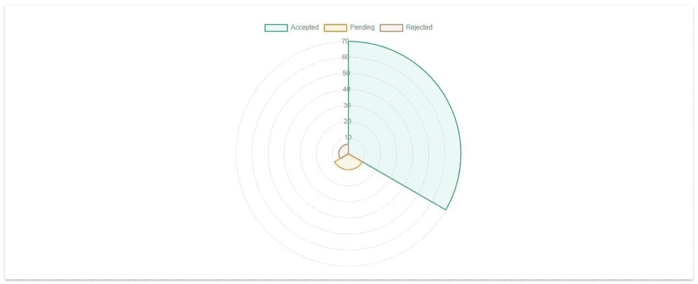

**气泡图示例**

*如何制作 Chart.js 泡泡图*

```
<!DOCTYPE html>
<html>
  <head>
    <!-- Required meta tags -->
    <meta charset="utf-8">
    <meta name="viewport" content="width=device-width, initial-scale=1.0">
    <title>Chart.js Bubble Chart</title>
    <!--Chart.js JS CDN--> 
    <script src="https://cdnjs.cloudflare.com/ajax/libs/Chart.js/2.9.4/Chart.min.js"></script> 
  </head>
  <body> <div>
	<canvas id="myChart"></canvas>
    </div> <script>
      var ctx = document.getElementById('myChart').getContext('2d');
      var myChart = new Chart(ctx, {
          type: 'bubble',
          data: {
            datasets: [{ 
                data: [
                  {x: 17, y: 3, r:11},
                ],
                label: "Blue Team",
                borderColor: "#3e95cd",
                backgroundColor: "rgb(62,149,205,0.1)",
                borderWidth:2,

              }, { 
                data: [
                  {x: 10, y: 3, r:20},
                ],
                label: "Green Team",
                borderColor: "#3cba9f",
                backgroundColor: "rgb(60,186,159,0.1)",
                borderWidth:2,

              }, { 
                data: [
                {x: 4, y: 4, r:30},
                ],
                label: "Yellow Team",
                borderColor: "#ffa500",
                backgroundColor:"rgb(255,165,0,0.1)",
                borderWidth:2,

              }, { 
                data: [
                {x: 14, y: 0, r:9}
                ],
                label: "Red Team",
                borderColor: "#c45850",
                backgroundColor:"rgb(196,88,80,0.1)",
                borderWidth:2,
              }
            ]
          },
          options: {
            scales: {
              xAxes: [{ 
                scaleLabel: {
                  display: true,
                  labelString: '# of wins'
                }
              }],
              yAxes: [{
                scaleLabel: {
                  display: true,
                  labelString: '# of games'
                }
              }],
            }
          },
        }); </script> </body>
</html>
```

对于气泡图，数据集中需要的一组 x 和 y 坐标。

要创建气泡的半径，添加第三个坐标`r`。

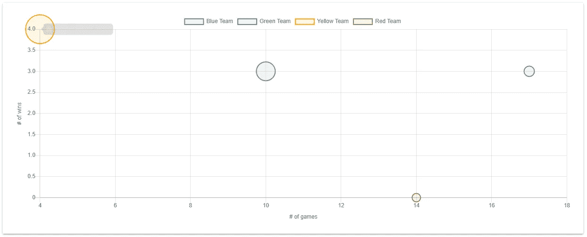

**散点图示例**

*如何制作 Chart.js 散点图*

```
<!DOCTYPE html>
<html>
  <head>
    <!-- Required meta tags -->
    <meta charset="utf-8">
    <meta name="viewport" content="width=device-width, initial-scale=1.0">
    <title>Chart.js Scatter Chart</title>
    <!--Chart.js JS CDN--> 
    <script src="https://cdnjs.cloudflare.com/ajax/libs/Chart.js/2.9.4/Chart.min.js"></script> 
  </head>
  <body> <div>
	<canvas id="myChart"></canvas>
    </div> <script>
      var ctx = document.getElementById('myChart').getContext('2d');
      var myChart = new Chart(ctx, {
          type: 'scatter',
          data: {
            datasets: [{ 
                data: [
                  {x: 17, y: 3},
                ],
                label: "Blue Team",
                borderColor: "#3e95cd",
                backgroundColor: "rgb(62,149,205,0.1)",
                borderWidth:2,

              }, { 
                data: [
                  {x: 10, y: 3},
                ],
                label: "Green Team",
                borderColor: "#3cba9f",
                backgroundColor: "rgb(60,186,159,0.1)",
                borderWidth:2,

              }, { 
                data: [
                {x: 4, y: 4},
                ],
                label: "Yellow Team",
                borderColor: "#ffa500",
                backgroundColor:"rgb(255,165,0,0.1)",
                borderWidth:2,

              }, { 
                data: [
                {x: 14, y: 0}
                ],
                label: "Red Team",
                borderColor: "#c45850",
                backgroundColor:"rgb(196,88,80,0.1)",
                borderWidth:2,
              }
            ]
          },
          options: {
            scales: {
              xAxes: [{ 
                scaleLabel: {
                  display: true,
                  labelString: '# of wins'
                }
              }],
              yAxes: [{
                scaleLabel: {
                  display: true,
                  labelString: '# of games'
                }
              }],
            }
          },
        }); </script> </body>
</html>
```

散点图也需要 x 和 Y 属性。

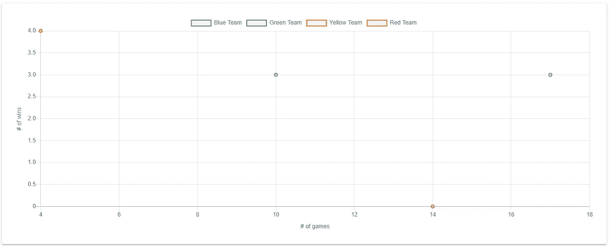

**混合图表示例**

*如何用棒线数据集制作 Chart.js 混合图*

```
<!DOCTYPE html>
<html>
  <head>
    <!-- Required meta tags -->
    <meta charset="utf-8">
    <meta name="viewport" content="width=device-width, initial-scale=1.0">
    <title>Chart.js Mixed Chart</title>
    <!--Chart.js JS CDN--> 
    <script src="https://cdnjs.cloudflare.com/ajax/libs/Chart.js/2.9.4/Chart.min.js"></script> 
  </head>
  <body> <div>
	<canvas id="myChart"></canvas>
    </div> <script>
      var ctx = document.getElementById('myChart').getContext('2d');
      var myChart = new Chart(ctx, {
          type: 'bar',
          data: {
            labels: ["Sunday", "Monday", "Tuesday", "Wednesday", "Thursday", "Friday", "Saturday"],
            datasets: [{ 
                data: [86,114,106,106,107,111,133],
                label: "Total",
                borderColor: "#3e95cd",
                backgroundColor: "rgb(62,149,205)",
                borderWidth:2,
                type: 'line',
                fill:false
              }, { 
                data: [70,90,44,60,83,90,100],
                label: "Accepted",
                borderColor: "#3cba9f",
                backgroundColor: "#3cba9f",
                borderWidth:2
              }, { 
                data: [10,21,60,44,17,21,17],
                label: "Pending",
                borderColor: "#ffa500",
                backgroundColor:"#ffa500",
                borderWidth:2,
              }, { 
                data: [6,3,2,2,7,0,16],
                label: "Rejected",
                borderColor: "#c45850",
                backgroundColor:"#c45850",
                borderWidth:2
              }
            ]
          },
        }); </script> </body>
</html>
```

混合图表将多个 Chart.js 图表类型组合在一个图表上。一种常见的组合是折线图和条形图数据集。

通过向数据集添加`type`来更改数据集。

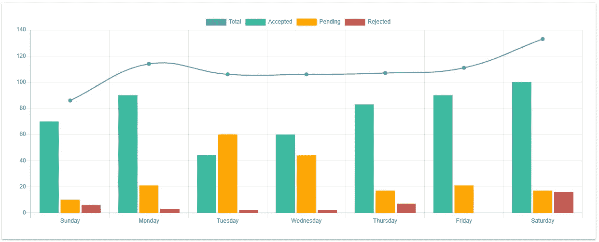

**如何定制 Chart.js — Chart.js 配置**

标题、图例、填充和颜色都是可配置的 Chart.js 属性。大多数是在`options`下申报的。

**Chart.js 标题**

*如何自定义 Chart.js 标题*

```
<!DOCTYPE html>
<html>
  <head>
    <!-- Required meta tags -->
    <meta charset="utf-8">
    <meta name="viewport" content="width=device-width, initial-scale=1.0">
    <title>Chart.js Title</title>
    <!--Chart.js JS CDN--> 
    <script src="https://cdnjs.cloudflare.com/ajax/libs/Chart.js/2.9.4/Chart.min.js"></script> 
  </head>
  <body> <div>
	<canvas id="myChart"></canvas>
    </div> <script>
      var ctx = document.getElementById('myChart').getContext('2d');
      var myChart = new Chart(ctx, {
          type: 'scatter',
          data: {
            ...
          },
          options: {
            title: {
              display: true,
              text: 'Leads over Time',
            },
          }, });
    </script> </body>
</html>
```

*标题作为字符串添加到选项下。*

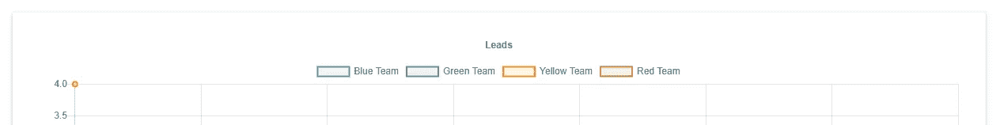

**Chart.js 图例**

*如何放置 Chart.js 图例顶部居中*

```
<!DOCTYPE html>
<html>
  <head>
    <!-- Required meta tags -->
    <meta charset="utf-8">
    <meta name="viewport" content="width=device-width, initial-scale=1.0">
    <title>Chart.js Legend Center</title>
    <!--Chart.js JS CDN--> 
    <script src="https://cdnjs.cloudflare.com/ajax/libs/Chart.js/2.9.4/Chart.min.js"></script> 
  </head>
  <body> <div>
	<canvas id="myChart"></canvas>
    </div> <script>
      var ctx = document.getElementById('myChart').getContext('2d');
      var myChart = new Chart(ctx, {
          type: 'scatter',
          data: {
            ...
          },
          options: {
            legend: {
              display:true,
              position:'left',
              align:'start'
            },
          },
        });
    </script> </body>
</html>
```

`position`设置水平位置，而`align`确定图例的垂直位置。

默认情况下，图例显示在画布的顶部中央。

位置可以是 `'top'`、`'bottom'`、`'left'`或`'right'`。对齐可以是`'start'`、`'center'`或`'end'`。

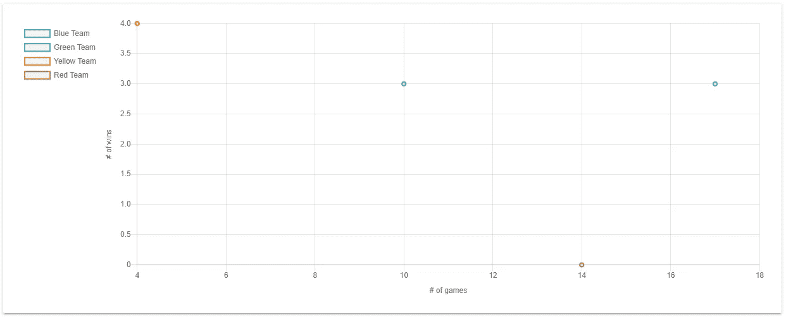

**Chart.js 布局**

*如何给图表添加填充*

```
<!DOCTYPE html>
<html>
  <head>
    <!-- Required meta tags -->
    <meta charset="utf-8">
    <meta name="viewport" content="width=device-width, initial-scale=1.0">
    <title>Chart.js Padding</title>
    <!--Chart.js JS CDN--> 
    <script src="https://cdnjs.cloudflare.com/ajax/libs/Chart.js/2.9.4/Chart.min.js"></script> 
  </head>
  <body> <div>
	<canvas id="myChart"></canvas>
    </div> <script>
      var ctx = document.getElementById('myChart').getContext('2d');
      var myChart = new Chart(ctx, {
          type: 'bar',
          data: {
            ...
          },
          options: {
              layout: {
                 padding: {
                    left: 50,
                    right: 30,
                    top: 3,
                    bottom: 2
                 }
              }
           },
        });
    </script> </body>
</html>
```

填充被添加到`layout`内的图表中。

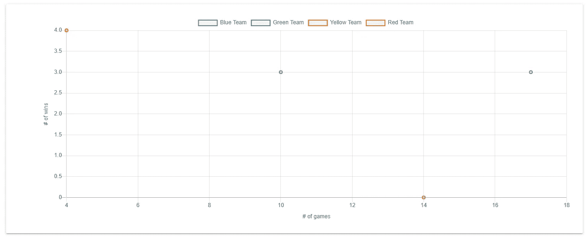

*原载于【https://www.ordinarycoders.com】[](https://www.ordinarycoders.com/blog/article/11-chart-js-examples)**。***