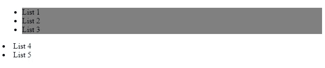
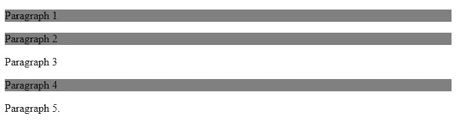
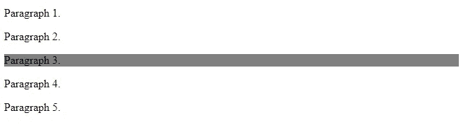
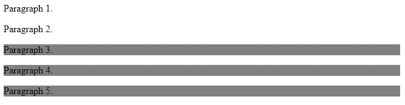

# 如何使用 CSS 组合子选择正确的元素

> 原文：<https://javascript.plainenglish.io/how-to-use-css-combinators-to-select-the-right-elements-e837ecccf5af?source=collection_archive---------17----------------------->

## 用例子解释的 CSS 组合子。

Photo by [Sigmund](https://unsplash.com/@sigmund?utm_source=medium&utm_medium=referral) on [Unsplash](https://unsplash.com?utm_source=medium&utm_medium=referral)

毫无疑问，如今每个 web 开发人员都在使用 CSS。试想一下，如果我们不使用 CSS，一个网站会是什么样子。即使你使用的是 Bootstrap 这样的框架，它仍然可以算作使用 CSS，因为它是用 CSS 制作的。

如您所知，为了给网页元素添加样式，您必须首先使用选择器在 CSS 中选择这些元素。然而，大多数时候我们会有很多相同的 HTML 元素，我们需要选择特定的元素。这就是 CSS 组合子发挥作用的地方。

组合子只是选择器之间的一种关系，允许我们选择 CSS 中的特定元素并为它们添加样式。CSS 中有不同的组合子。这就是为什么在本文中，我们将通过实际例子来了解这些组合子。所以让我们开始吧。

# 后代组合子

CSS 中的两个选择器之间使用了后代组合符(空格)。它允许我们选择和匹配特定元素中的所有元素。

让我们看看下面的例子:

Using the descendant combinator between li and ul.

*输出:*

The output of the code.

如您所见，通过在 CSS 中的两个选择器`ul`和`li`之间使用后代组合符(space ),我们匹配并选择了作为元素`ul`后代的所有列表`li`。应用于`ul`中所有元素的样式。

列表 4 和 5 没有被选中，因为它们不是元素`ul`的后代。因此，如果您想匹配另一个特定元素中的所有元素，请使用这个空间组合符。

# 子组合子(>)

CSS 中的子组合符`>`用于匹配和选择所有元素，这些元素是另一个指定元素的**子元素**。

这里有一个例子:

Child combinator.

*输出:*

Output.

在上面的例子中，我们在 CSS 中的元素`<main>`和`
`之间使用了子组合符`>`。因为这个组合符只匹配指定元素的子元素，所以样式只应用于元素`<main>`的子元素段落。

所以使用子组合子来选择指定元素的子元素。

# 相邻兄弟组合符(+)

相邻兄弟组合符`+`用于选择直接位于特定元素之后**的第一个元素。**

这里有一个例子:

Adjacent Sibling Combinator.

*输出:*

Output.

正如您在上面看到的，相邻的兄弟组合符`+`选择并匹配位于 div 元素之后的第一个段落，在我们的例子中是第 3 段。

# 一般兄弟组合子(~)

CSS 中使用通用的兄弟组合符`**~**` 来选择**所有**元素，它们是另一个指定元素的**兄弟**。

这个例子和上面的一样，但是使用了一般的兄弟组合子:

General Sibling Combinator(~).

*输出:*

Output.

在上面的例子中，一般的兄弟组合符`**~**` 选择**所有**div 元素的兄弟或者位于 div 元素之后的段落。

# 结论

正如你所看到的，CSS 中有 4 个有用的不同的组合子。我们在 CSS 选择器之间使用它们来匹配和选择我们想要的正确元素。所以在 CSS 中使用组合子是非常有用和重要的。

感谢您阅读这篇文章。我希望你觉得有用。

**更多阅读**

 [## 使用这些 JavaScript 方法在数组中添加和移除项目

### 用 JavaScript 在数组中添加和删除项目。

javascript.plainenglish.io](/use-these-javascript-methods-to-add-and-remove-items-from-an-array-fd3cab34aa33) 

*更多内容请看*[***plain English . io***](http://plainenglish.io)