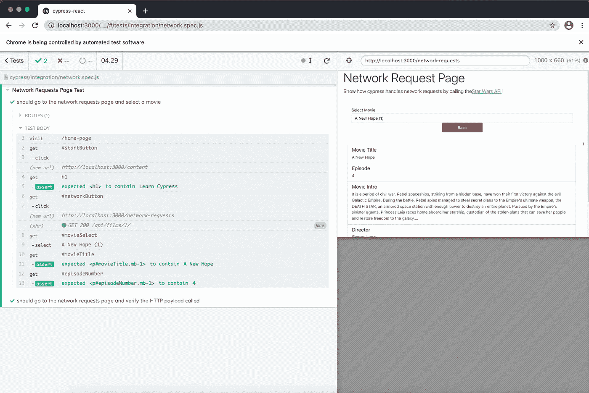

# 如何使用柏树为 E2E 作出反应

> 原文：<https://javascript.plainenglish.io/how-to-use-cypress-for-e2e-with-react-7a3ea4df5ee0?source=collection_archive---------22----------------------->


[*https://pixabay.com/photos/lamp-light-lighting-light-bulb-3489395*](https://pixabay.com/photos/lamp-light-lighting-light-bulb-3489395/)

对于任何前端应用程序，端到端(e2e)测试确实可以改进应用程序的维护和软件开发生命周期(SDLC)。E2E 允许您快速验证更改，还可以记录应用程序中的功能。

今天，E2E 框架有几种选择。 [Cypress](https://www.cypress.io/) 是在您的应用程序中构建 E2E 测试的更新、更令人兴奋的选项之一。

柏树是 E2E 的绝佳选择，因为它:

1.  在与你的前端项目相同的事件循环中运行(而不是像基于 E2E [硒](https://www.selenium.dev/documentation/en/webdriver/)的项目那样从外部“敲门”)
2.  适用于任何前端项目(将 Cypress 作为依赖项安装，测试运行程序将自动检测相应的配置文件)
3.  所有的 E2E 都是用 JavaScript 编写的(不需要有`.feature`或其他相关文件)
4.  Cypress 提供了一个热重载测试运行器，允许您以与本地开发非常相似的方式开发您的测试

Cypress 的唯一限制是，虽然它可以与 Chrome、Firefox、Electron 和 Edge 浏览器兼容，但它计划在未来支持更多的浏览器。然而，值得注意的是，这 4 种浏览器占据了浏览器世界的大部分市场份额，并解决了许多用例。每个项目都有不同的需求，但是这四种浏览器为前端项目提供了很多 E2E 测试的潜在覆盖面。

Cypress 有很多特性，并且有一个很好的社区支持它。我强烈推荐[查看他们的文档](https://docs.cypress.io/guides/overview/why-cypress.html#In-a-nutshell)

在这篇文章中，我将介绍 Cypress，以及如何在 React 中使用它。如果你想继续，我已经创建了一个 GitHub repo，其中包含了我在[https://www.github.com/andrewevans0102/cypress-react](https://www.github.com/andrewevans0102/cypress-react)讨论的所有例子。我使用的例子也是我在帖子[如何开始使用 Cypress](https://www.newline.co/@AndrewEvans/how-to-get-started-with-cypress--0bed3a8b) 中使用的先前项目的重建。

我还创建了一个 YouTube 视频，在这个视频中我演示了同一个示例项目。


# 示例应用程序

在我们开始使用 Cypress 之前，我只想解释一下示例应用程序是如何工作的。你可以在[https://www.github.com/andrewevans0102/cypress-react](https://www.github.com/andrewevans0102/cypress-react)找到示例应用程序。


该应用程序有三个主要部分，其中包含以下示例:

在我们的 Cypress 设置中，我们将对这三个页面进行构建 E2E 测试。

# 安装 Cypress

安装 Cypress 有多种方法。如果你[查看文档](https://docs.cypress.io/guides/getting-started/installing-cypress.html#System-requirements)，你会发现你可以用`npm`、`yarn`安装它，甚至可以手动安装二进制文件。

在我的项目中，我使用了 npm，所以我把它安装成一个`dev dependency`,带有:

```
npm install cypress --save-dev
```

一旦你做了`npm install`，你应该看到一个`cypress`文件夹和一个`cypress.json`文件被创建在你的项目文件夹中:


> *请注意“示例”文件夹，这是我创建的，为了简单起见，我只是将生成的示例文件从* `*integrations*` *复制到他们自己的文件夹中。*


构建的目录和文件包含不同的配置，我们将用 Cypress 构建 E2E。它们都对应于:

*   是你为你的测试建立模拟或者存根响应的地方
*   默认情况下，`integration`是您放置实际测试`.spec.js`文件的地方。
*   `plugins`允许你扩展柏树行为
*   `screenshots`和`videos`是测试运行人员存储测试运行的可视副本的地方(在接下来的章节中会有更多的介绍)
*   `support`允许您定义可在测试中引用的“命令”或沸腾板行为，避免重复启动任务，如登录或类似流程

一旦你安装了 Cypress，你可以通过调用“open”来看到你与 Cypress 的第一次交互:

```
./node_modules/.bin/cypress open
```

# 首次测试


当你第一次安装 Cypress 时，你会注意到在`integrations`文件夹中有一组例子。这些非常有用，因为您可以看到与测试运行人员的第一次交互。这些例子来自 Cypress“kitchen sink”站点，所以运行它们不需要任何配置。如果您想继续使用它们，您可以使用上一节末尾的`cypress open`命令来查看运行中的测试运行程序。

我通常会将“示例”复制到它自己的目录中。假设您已经完成了，下一步就是配置一些脚本来自动使用 Cypress。

我建议创建以下 npm 脚本:

```
{
"scripts": {
    "cypress-open": "./node_modules/.bin/cypress open",
    "cypress-local": "concurrently \"npm run start\" \"npm run cypress-open\"",
    "cypress-run": "./node_modules/.bin/cypress run",
    "cypress-ci": "start-server-and-test \"npm run start\" http://localhost:3000 \"npm run cypress-run\""
}
}
```

让我们来谈谈他们是做什么的:

*   `cypress-open`自行打开测试运行程序
*   `cypress-local`在本地运行测试运行程序和应用程序(交互式)
*   `cypress-run`在 CI (headless)中运行测试运行程序
*   `cypress-ci`在 CI (headless)中运行应用程序和测试运行程序

> *请注意，CI 指的是“持续集成”,仅指构建管道。*

您还需要继续安装[并同时安装](https://www.npmjs.com/package/concurrently)和[启动服务器并测试](https://www.npmjs.com/package/start-server-and-test),包括:

```
npm install concurrently 
npm install start-server-and-test
```

正如我在介绍中提到的，Cypress 与您的应用程序运行在同一个事件循环中。这意味着当您运行 Cypress 测试时，您需要使用一些机制来运行您的应用程序和测试运行程序。使用`concurrently`和`start-server-and-test`允许这种行为。在本地运行时,`concurrently`让您的应用程序与测试运行程序一起运行。当在 CI 中运行时，当测试完成时，使用`start-server-and-test`将关闭您的应用程序和测试运行程序。

让我们编写我们的第一个测试，来看看它的“本地”运行情况。

转到`integrations`文件夹，用以下内容创建一个文件`first_test.spec.js`:

```
describe("First Test", () => {
  it("should visit home page", () => {
    cy.visit("http://localhost:3000/home-page");
  });
});
```

如果你注意到，这是遵循标准的[摩卡](https://mochajs.org/)和[茉莉](https://jasmine.github.io/)语法。这很好，因为如果你熟悉其他测试框架，除了构建你的测试和习惯于`cy` test runner 对象之外，你没有什么可以学习的。

在第一个测试中，我们只是访问示例应用程序的主页。一旦创建了`first_test.spec.js`文件，继续运行`npm run cypress-local`来查看测试运行。


当您第一次运行时，您会注意到默认情况下 Cypress 会打开一个`Chrome`会话来实际测试您的应用程序。然后，测试运行程序会提供每个运行步骤的详细信息，当您单击运行的不同步骤时，您甚至可以进行“时间旅行”。

# 形式测试

现在我们已经运行了第一个测试，让我们继续创建表单页面测试。转到`integrations`文件夹，创建`form.spec.js`，如下所示:

```
describe('Form Test', () => {
  it('should visit home page', () => {
    cy.visit('/home-page');
  });

  it('should visit home page and click start', () => {
    cy.visit('/home-page');
    cy.get('#startButton').click();
    cy.get('h1').should('contain', 'Learn Cypress');
  });

  it('should go to the forms page and enter login information', () => {
    cy.visit('/home-page');
    cy.get('#startButton').click();
    cy.get('h1').should('contain', 'Learn Cypress');
    cy.get('#formsButton').click();
    cy.get("#email").type("HanSolo@gmail.com");
    cy.get("#password").type("password");
    cy.get("#submitButton").click();
    cy.on("window:alert", (str) => {
      expect(str).to.equal(
        "successfully entered input with email HanSolo@gmail.com and password password"
      );
    });
  });
});
```

此外，继续修改`cypress.json`文件，使其具有以下内容:

```
{ "baseUrl": "http://localhost:3000" }
```

我们刚刚在 Cypress 中创建了我们的第一个`environment variable`。`cypress.json`文件允许您创建可以在测试中引用的变量。`baseUrl`是一个内置变量，但是你也可以[创建你自己的自定义变量](https://docs.cypress.io/guides/guides/environment-variables.html#Setting)。通过定义`baseUrl`，我们可以将“访问主页测试”修改为:

```
it('should visit home page', () => {
    cy.visit('/home-page');
  });
```

而不是:

```
it("should visit home page", () => {
    cy.visit("http://localhost:3000/home-page");
  });
```

如果您继续运行`npm run cypress-local`，那么您应该会看到表单测试运行。如果您没有停止 Cypress 或本地应用程序，您应该已经看到 test runner 自动加载文件并重新加载页面。这是 Cypress 最好的部分之一，因为它允许在开发测试时进行“热重装”。


如果您在代码中注意到，我们正在向 Cypress 测试运行器对象`cy`传递命令，如下所示:

```
cy.get('#startButton').click();
```

我们在这里做的是识别页面上的对象，然后将事件传递给它。我们还可以获得信息，正如您在断言中看到的:

```
cy.get('h1').should('contain', 'Learn Cypress');
```

这都是类似于传统的行为:

1.  `arrange` =设置您的测试环境
2.  `act` =运行实际测试
3.  `assert` =验证输出结果

有很多关于如何设置测试和与`cy`对象交互的文档。我建议查看一下关于[编写第一个测试的指南](https://docs.cypress.io/guides/getting-started/writing-your-first-test.html)。

# 列表测试

所以现在我们也可以试着测试一下`lists`页面。在`integrations`文件夹中创建一个文件`list.spec.js`:

```
describe("List Test", () => {
  it("should go to the list page and add a value", () => {
    cy.visit("/home-page");
    cy.get("#startButton").click();
    cy.get("h1").should("contain", "Learn Cypress");
    cy.get("#listsButton").click();
    cy.get("#createInput").type("use the force Luke!");
    cy.get("#createButton").click();
    cy.get("li").eq(4).should("contain", "use the force Luke!");
  });

  it("should go to the list page and delete a value", () => {
    cy.visit("/home-page");
    cy.get("#startButton").click();
    cy.get("h1").should("contain", "Learn Cypress");
    cy.get("#listsButton").click();
    cy.get("#createInput").type("use the force Luke!");
    cy.get("#createButton").click();
    cy.get("li").eq(4).should("contain", "use the force Luke!");
    cy.get(":nth-child(5) > .btn").click();
    cy.get("[data-cy=listValues]").children().should("have.length", 4);
  });
});
```

一旦运行了它，您应该会看到如下所示的内容:


如果您现在运行`npm run cypress-local`，您可以在列表页面上运行测试。这类似于构建表单测试的方式，您会注意到，我们可以通过额外的步骤计算值，如下所示:

```
cy.get(":nth-child(5) > .btn").click();
cy.get("[data-cy=listValues]").children().should("have.length", 4);
```

这只是突出了你可以用`cy`跑步者做的一件很酷的事情。它对列表特别有用，因为你经常需要看到列表的长度，或者一个值是否出现在前端项目的列表中。

# 网络请求

对于任何前端应用程序，网络请求总是任何工作流的关键部分。您需要与后端交互来获取或推送数据。

让我们通过创建一个名为`network.spec.js`的文件，在`integrations`文件夹中创建我们的网络请求测试，如下所示:

```
describe("Network Requests Page Test", () => {
  beforeEach(() => {
    // server starts to listen for http calls
    cy.server();
    // create route that cypress will listen for, here it is the films endpoint of the SWAPI
    cy.route("GET", "https://swapi.dev/api/films/**").as("films");
  });

  it("should go to the network requests page and select a movie", () => {
    cy.visit("/home-page");
    cy.get("#startButton").click();
    cy.get("h1").should("contain", "Learn Cypress");
    cy.get("#networkButton").click();
    cy.get("#movieSelect").select("A New Hope (1)");
    cy.get("#movieTitle").should("contain", "A New Hope");
    cy.get("#episodeNumber").should("contain", 4);
  });

  it("should go to the network requests page and verify the HTTP payload called", () => {
    cy.visit("/home-page");
    cy.get("#startButton").click();
    cy.get("h1").should("contain", "Learn Cypress");
    cy.get("#networkButton").click();
    cy.get("#movieSelect").select("A New Hope (1)");
    // await the response from the SWAPI http call
    cy.wait("@films").then((films) => {
      expect(films.response.body.title).to.equal("A New Hope");
    });
    cy.get("#movieTitle").should("contain", "A New Hope");
    cy.get("#episodeNumber").should("contain", 4);
  });
});
```

如果运行它，您应该会看到以下内容:



在这个测试中，你会注意到我们有一个`beforeEach`模块:

```
beforeEach(() => {
    // server starts to listen for http calls
    cy.server();
    // create route that cypress will listen for, here it is the films endpoint of the SWAPI
    cy.route("GET", "https://swapi.dev/api/films/**").as("films");
  });
```

这是`mocha`和`jasmine`的标准，因为它在实际执行测试之前设置了测试运行器。注意`cy.server`对象的使用。这允许 Cypress 监听网络调用，特别是这个测试寻找“swapi . dev”API 调用:

```
cy.route("GET", "https://swapi.dev/api/films/**").as("films"); });
```

然后在实际的测试运行中，注意有一个`cy.wait`等待 API 调用完成来验证结果:

```
// await the response from the SWAPI http call cy.wait("@films").then((films) => { expect(films.response.body.title).to.equal("A New Hope"); });
```

这是非常强大的，因为它将允许您测试 API 调用的有效负载，并允许测试运行程序足够灵活，不仅可以处理页面上的 DOM，还可以处理 HTTP 调用应该返回的正确有效负载。

# 命令

因此，到目前为止，我们所有的测试都有如下内容:

```
cy.visit("/home-page"); cy.get("#startButton").click(); cy.get("h1").should("contain", "Learn Cypress"); cy.get("#networkButton").click();
```

这就是我所认为的“锅炉板”,因为你总是必须访问主页并点击其中一个按钮来与适用的页面进行交互。

Cypress 允许您通过在`support`文件夹中创建`commands`来减少样板文件。如果你打开文件`cypress/support/commands.js`，你会注意到有一些文件指向[命令指南](https://on.cypress.io/custom-commands)。在 Cypress 中，您可以构建`commands`，它们基本上只是一组步骤的别名。如果您在这里构建了一个命令，那么您可以在您的测试中引用它，避免大量的复制和粘贴。

继续将以下内容添加到`commands.js`文件中:

```
Cypress.Commands.add("start", () => {
  cy.visit("/home-page");
  cy.get("#startButton").click();
  cy.get("h1").should("contain", "Learn Cypress");
  cy.get("#formsButton").should("contain", "Forms");
  cy.get("#listsButton").should("contain", "Lists");
  cy.get("#networkButton").should("contain", "Network Requests");
});
```

在这里，我们创建了一个`start`命令，该命令一直流向`content`页面。然后，它验证按钮标签的值是否正确。

然后，我们可以返回到原始的表单测试文件(`forst.spec.js`)并删除:

```
cy.visit('/home-page'); cy.get('#startButton').click(); cy.get('h1').should('contain', 'Learn Cypress');
```

并补充:

```
before(() => { cy.start(); });
```

这引用了我们创建的`start`命令。现在，如果您运行测试，您将会看到`start`命令，并且测试已经运行，您不需要引用相关的规范文件。


# 词中跑柏

因此，我想介绍的最后一件事是当您在 CI 中运行 Cypress 时会发生什么。在开始部分，您会注意到我们创建了一个名为`cypress run`而不是`cypress open`的`cypress-ci` npm 脚本。这是在你的项目管道中“无头”运行的 Cypress 机制。

如果您继续进行我们到目前为止编写的测试，您可以运行`cypress-ci`来查看输出。首先停止你的应用程序和 Cypress(如果你还没有这样做)，然后运行`npm run cypress-ci`查看以下内容:


这是所有规格文件的运行记录。到目前为止，您将使用测试运行器 GUI 单独运行每个`spec`文件。现在在 CI 中，Cypress 将使用控制台输出运行您的所有规范文件，您可以将这些文件保存在各自的 CI 系统中。

您还会注意到在`videos`文件夹中存储有`mp4`文件:


这些是你的 CI 测试的实时运行。这里最酷的部分是，您可以编写这个过程的脚本，这样您就可以复制这些文件，并将它们发送到一个共享文件夹。这也可以在您进行部署时直接发送给项目的产品所有者。这里有很多选择。

# 结论

我希望你喜欢我的帖子，并对赛普拉斯有所了解。我在几个项目中使用过它，发现它不仅强大，而且有趣。Cypress 的工具和社区支持使它成为一个非常友好的开发工具。对记录和存储测试运行信息的支持也使它成为任何项目团队的强大资产。我建议在 Cypress 网站上查看文档和各种指南。

感谢您阅读我的帖子！请在 [andrewevans.dev](https://andrewevans.dev/) 上关注我，并在推特上关注我，网址是 [@AndrewEvans0102](https://twitter.com/AndrewEvans0102) 。也可以在 [@rhythmandbinary](https://twitter.com/rhythmandbinary) 和 [YouTube 频道](https://www.youtube.com/channel/UCvAKKewP_o2l3XnwDzSxftw)查看 Rhythm 和 Binary 的新 Twitter feed。谢谢！

*原载于*[*https://rhythmandbinary.com*](https://rhythmandbinary.com/post/2021-03-15-how-to-use-cypress-for-e2e-with-react)*。*