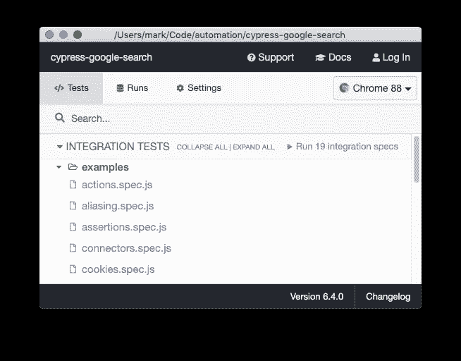
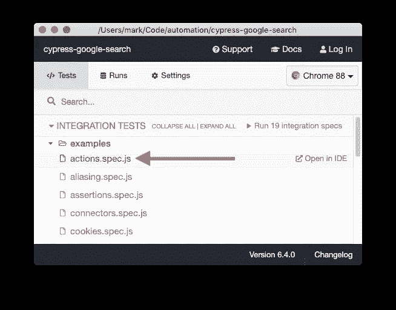
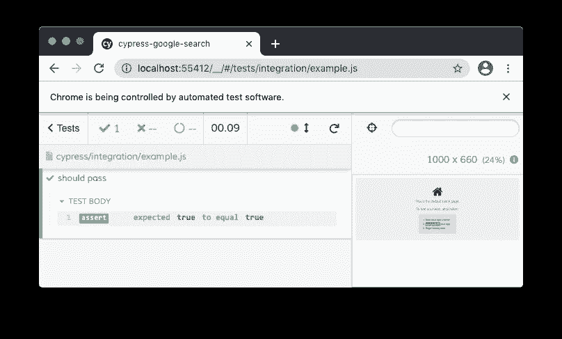
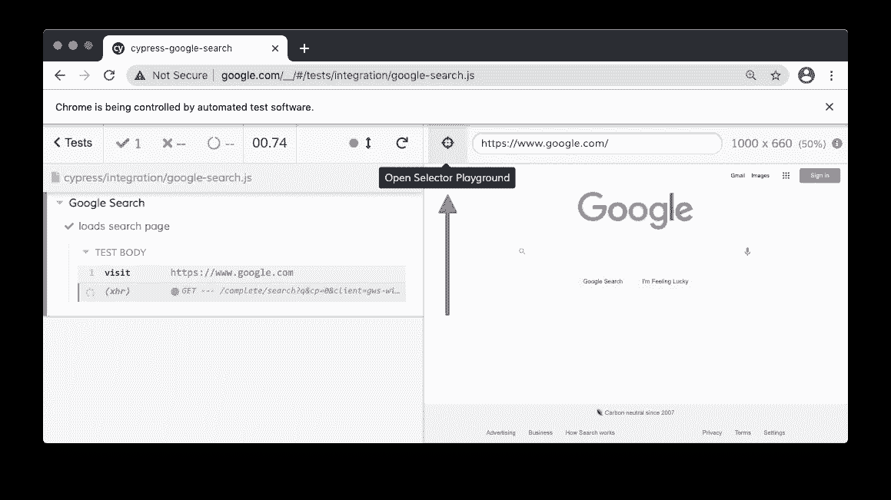
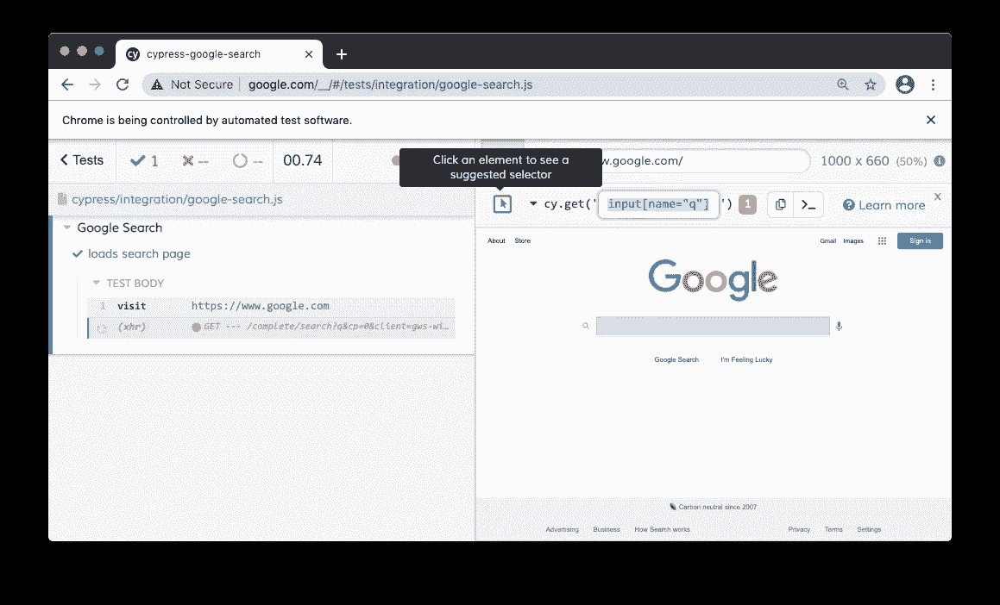
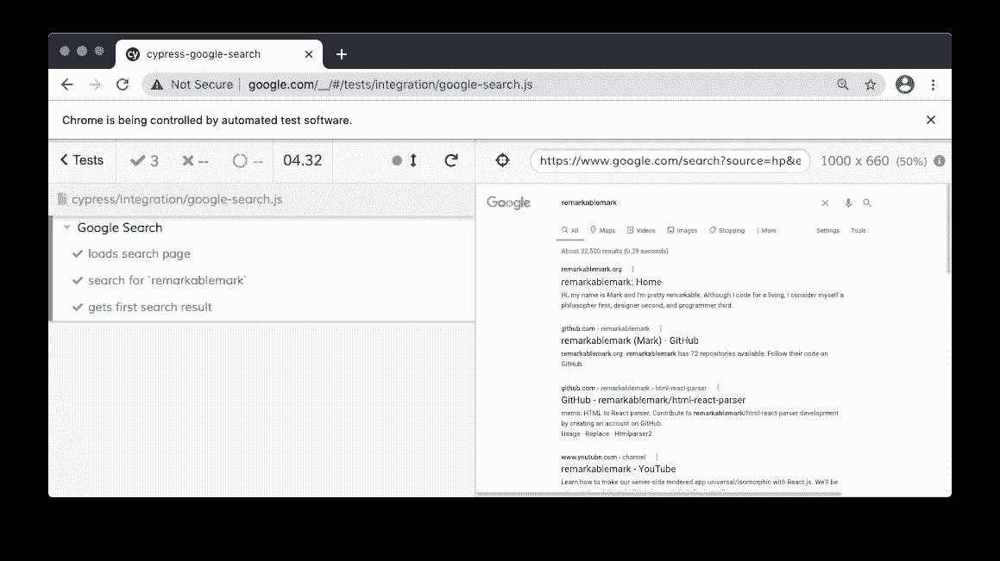

# 如何使用 Cypress 执行谷歌搜索

> 原文：<https://javascript.plainenglish.io/how-to-use-cypress-to-perform-a-google-search-8eadaf416949?source=collection_archive---------3----------------------->


[cypress.io](https://b.remarkabl.org/cypress)

这篇文章讲述了如何使用 [Cypress](https://b.remarkabl.org/cypress) 端到端(E2E)测试运行器执行 Google 搜索。参见 [YouTube 视频](https://b.remarkabl.org/3b7vq1Q):

# 先决条件

*   [Node.js](https://b.remarkabl.org/nodejs-site)

# 安装

用 npm 或纱线安装[柏树](https://www.npmjs.com/package/cypress);

```
$ npm install cypress
```

# 打开

开放柏树:

```
$ npx cypress open
```



Cypress integration tests

将创建目录:

```
$ tree cypress -L 1
cypress
├── fixtures
├── integration
├── plugins
└── support4 directories, 0 files
```

要运行测试，请单击测试文件:



Cypress actions.spec.js

# 例子

创建文件`cypress/integration/example.js`:

```
$ touch cypress/integration/example.js
```

编写测试:

单击测试，使其在新的浏览器窗口中运行:



Cypress example test

Cypress 使用 [Mocha](https://mochajs.org/) 作为测试运行器， [Chai](https://www.chaijs.com/) 作为断言库。

# 谷歌搜索

创建文件`cypress/integration/google-search.js`:

```
$ touch cypress/integration/google-search.js
```

使用`[visit](https://docs.cypress.io/api/commands/visit.html)`打开页面:

使用`[get](https://docs.cypress.io/api/commands/get.html)`选择一个 DOM 元素:

> 查询行为类似于 [jQuery](https://jquery.com/) 的`$()`。

点击`Open Selector Playground`尝试不同的选择器:



Cypress Open Selector Playground

点击一个元素或使用浏览器`Inspect`工具获得一个好的选择器:



Cypress get selector

使用`[type](https://docs.cypress.io/api/commands/type.html)`输入文本和键盘动作:

> `{enter}`键入回车键。

输入回车键的另一种方法是提交表单:

或者单击搜索按钮:

使用`[invoke](https://docs.cypress.io/api/commands/invoke.html)`获取第一个搜索 URL:

> `[then](https://docs.cypress.io/api/commands/then.html)`用于产生承诺值，因为该命令是异步的。

# 密码



Cypress Google search

# 资源

*   [代码](https://b.remarkabl.org/37901uU)
*   [柏树常见问题解答](https://docs.cypress.io/faq/questions/using-cypress-faq.html)

*[本文原载于《remarkablemark.org》2021 年 2 月 13 日。](https://b.remarkabl.org/3doyeL9)*