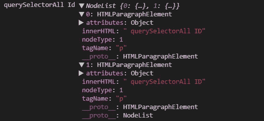

# 如何使用不同的选择器来获取元素

> 原文：<https://javascript.plainenglish.io/how-to-use-different-selectors-to-get-elements-ccc865689571?source=collection_archive---------19----------------------->

## HTML 面试问题 2021:DOM 选择器基础


Photo by [Goran Ivos](https://unsplash.com/@goran_ivos?utm_source=medium&utm_medium=referral) on [Unsplash](https://unsplash.com?utm_source=medium&utm_medium=referral)

在讨论 DOM 选择器之前，让我们先了解一下 DOM 是什么。

## 什么是 DOM？

网页是一个简单的文件，我们可以在浏览器中看到，或者它作为一个 HTML 源。

**文档对象模型(DOM)** 表示这个文档，因此我们可以根据自己的需要操作它。DOM 是任何网页的面向对象的表示。

使用选择器在 DOM 中选择元素有五种不同的方式**。**

*   getElementsByTagName()
*   getElementsByClassName()
*   getElementById()
*   查询选择器()
*   querySelectorAll()

所有这些方法都是文档对象的属性。我们可以这样使用它们:

```
document.getElementsByTagName()
document.getElementsByClassName()
document.getElementById()
document.querySelector()
document.querySelectorAll()
```

让我们创建一个简单的 HTML 页面来理解这些主题。

```
<!-- getElementById -->
<div id="demo1">getElementById</div><!-- getElementsByTagName -->
<p id="demo2">getElementsByTagName</p><!-- getElementsByClassName -->
<div class="intro">
 <p>getElementsByClassName1</p>
 <p>getElementsByClassName2</p>
</div><!-- querySelectorAll -->
<p class="intro1">querySelectorAll Class</p>
<p class="intro1">querySelectorAll Class</p><!-- querySelectorAll ID -->
<p id="test"> querySelectorAll ID</p>
<p id="test"> querySelectorAll ID</p>
```

# getElementsByTagName()

该方法返回指定标签的 HTML 集合。

```
var x = document.getElementsByTagName("p");console.log("getelemetsbytagname", x);
```

当我们看到控制台时，它看起来像这样，


这里我们有七个元素，因为 HTML 有七个<**p**标签。

如果我们想访问第一个元素，可以通过 x[0]来访问。

# getElementsByClassName()

`**getElementsByClassName**`方法返回一个类似数组的对象，包含所有与文档中的类匹配的元素。

```
const y = document.getElementsByClassName("intro");console.log("getelementbyclass", y);
```

控制台看起来会像这样，


这里，我们得到了一个元素，在第 0 个位置，我们可以看到“intro”类，innerHTML 包含了“intro”类的元素。

# getElementById()

返回与方法中定义的字符串匹配的对象。

```
const appDiv = document.getElementById("demo1");console.log("getelemetsbyid", appDiv);
```

控制台看起来会像这样，


当我们需要 HTML 中的一个惟一元素时，将使用这个方法，因为 id 是 DOM 中的一个惟一属性。

# 查询选择器()

它返回第一个匹配的元素。

```
var x2 = document.querySelector("p.intro1");console.log("querySelector", x2);
```

控制台看起来会像这样，


它将给出匹配查询的第一个元素。

# querySelectorAll()

返回所有匹配的元素。

```
var x1 = document.querySelectorAll("p.intro1");console.log("querySelectorAll class", x1);
```

控制台将如下所示:


它将以节点列表的形式返回所有匹配的元素。

我们也可以用这个方法传递 id。

```
var x3 = document.querySelectorAll("#test");console.log("querySelectorAll Id", x3);
```

控制台将如下所示:



你可以点击查看 StackBlitz 链接[。](https://stackblitz.com/edit/js-example-bfay2v)

*更多内容请看*[***plain English . io***](http://plainenglish.io/)