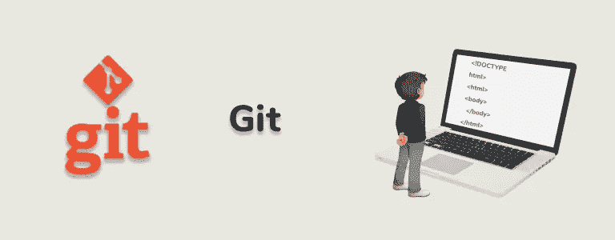

# 对 Git 初学者有帮助的备忘单

> 原文：<https://javascript.plainenglish.io/how-to-use-git-a-starter-guide-for-beginners-d7d4b3508a22?source=collection_archive---------21----------------------->

## 本指南提供了任何人都可以有效使用的有用命令的快速参考。

Source: [W3docs](https://www.w3docs.com/learn-git.html)

Git repo 由一组分支组成。

## git 分支

查看所有分支——git branch 还会突出显示您当前所在的分支

要切换分支:

## git 检验<branch_name></branch_name>

修改文件树的内容以匹配分支的内容

## **git 状态**

以检查储存库状态并获得关于如何继续执行与该状态相关的主要操作的指示。每当您不记得状态或您需要做什么时，请使用此命令。

## 男人饭桶-<command></command>

例如，要查看状态命令
man git-status 的手册页

# 要查看提交列表

## git 日志

每个提交包含:散列(唯一标识它的散列)、作者、主题、提交消息和其他信息。Git 日志向您展示了这些信息。

## git log -p

也可以查看提交的内容(diff)

## git 日志—单行

仅查看每次提交的哈希和主题

## git 日志 <first_commit_hash>~..<last_commit_hash></last_commit_hash></first_commit_hash>

要查看提交时间间隔的日志

## git 日志 <hash_first_commit>~..<hash_first_commit></hash_first_commit></hash_first_commit>

要查看单次提交的日志

或者做同样的事情，但是不可能减少输出中的信息

## git show<hash_commit></hash_commit>

如果没有添加提交散列，那么 git 显示将在分支的头部显示提交。

您可以使用 git tag 命令为每个提交关联一个标记(我们在这些注释中没有看到细节)

## git 日志 <tag>[ <file pattern="">]</file></tag>

打印给定标记之前的所有提交，可能只针对某一组文件

## 例如:

git log v 5.4 block/bfq * # log up to tag v 5.4，仅用于提交 block 文件夹中的文件并以 bfq 开始

## git 日志<branch_name></branch_name>

使用 git log，您还可以打印当前分支之外的分支的日志

要找出某个提交属于哪个内核版本，有一种方法如下:

*   **git log—one line | egrep“commit message”**—这样做可以找到提交的哈希，之后
*   **git tag -l —包含<哈希>** —将报告提交可用的所有标签。

## git clean -fd

*   如果结帐或其他操作中断，也会有所帮助
*   如果你真的有一些额外的文件在树上，要小心
*   仅从当前文件夹开始清理(对于完全清理，您必须位于存储库的根目录)

## git 差异

检查树中与提交不同的地方

## git 复位—硬

针对提交重置树的内容(仅更改存储库中的文件)

## git 复位—硬磁头

从开销提交
或
git 重置中重置—硬

## git 重置—硬头~

重置为前一个提交之前的提交

## git 重置—硬磁头~ n

重置为在头中的提交之前 n 个位置的提交

这在中间暂停操作的情况下也有帮助，有时它必须与 git clean 结合使用。

## git 遥控器

查看远程回购

## git 远程-v

查看远程回购的所有信息

## git 远程添加<name_which_you_want_give_to_repo></name_which_you_want_give_to_repo>

添加远程存储库

## git pull #下载更改

为了与历史已经改变的远程分支同步
#希望 git pull 足够用于同步
#否则:

## 获取 git

git 复位—硬 <name given="" to="" remote="" repository="">/<branch></branch></name>

## git 检验<branch_name_in_remote_repo></branch_name_in_remote_repo>

从远程存储库中检出分支

## git checkout <repo_name_to_to take_branch="">/<branch_name_in_remote_repo></branch_name_in_remote_repo></repo_name_to_to>

如果有多个回购包含同名分支，则应使用以下语法

## git checkout —跟踪 <repo_name_to_to take_branch="">/<branch_name_in_remote_repo></branch_name_in_remote_repo></repo_name_to_to>

如果您还想跟踪远程分支(也就是说，您可以从/向远程分支拉/推)

有时，在多个远程 repos 中存在的远程分支结帐中，您可能会遇到 git log 等命令的问题。

例如，您想要查看某个已签出分支的历史记录，但是出现了另一个同名分支的历史记录。因此，为了确保您引用的是正确的分支，请使用它的长名称。

## 例如:

*   git 日志 <repo_name_to_to take_branch="">/<branch_name_in_remote_repo></branch_name_in_remote_repo></repo_name_to_to>

而不是独自一人

*   git 日志<branch_name_in_remote_repo></branch_name_in_remote_repo>

## git am <patch1><patch2>…</patch2></patch1>

要应用补丁程序

## git am —中止

在破产的情况下，通常是由于冲突

## git am -3 <patch1><patch2>…</patch2></patch1>

在发生冲突的情况下，使用 git 帮助应用一个或多个补丁。—我建议一次应用和管理一个补丁

## git 差异

检查冲突

要解决冲突，请手动编辑受影响的文件。对于 git 强调的每一个冲突，您必须基本上决定两个版本中的哪一个适合我们，或者决定您是否需要与两个提案不同的东西。记住也要从文件中删除 git 标记。

## git 添加<filename></filename>

报告我们认为给定文件上的冲突已经解决

## git am —继续

要使 git am 在解决所有相关文件的冲突后继续

## git am —中止

放弃就放弃

## git checkout -b

要创建当前分支的副本(并选择它作为新的当前分支),该分支将是起始分支的精确副本

## git config-global user . email " you @ example . com "
git config-global user . Name " Your Name "

用户名和电子邮件地址配置(后续步骤需要)。
注意:一个常见的错误是写邮件而不是写电子邮件，git 没有报告这个错误，但它只会出现故障。

## git 提交-a

创建包含所有当前更改的提交

## git 提交身份

创建自签名提交

## git commit -as -m“提交标题”

给出命令行消息(仅标题)

## git 配置—全局 core.editor / usr / bin / vim

为 git commit
之类的命令选择自动启动的编辑器(这也是让 vim 在 OS X 中正常工作的正确选择，例如，如果在正确关闭编辑器之前向 vi 发出错误的命令，可以避免提交操作失败)

## git 添加 <filename_1><filename_2>…</filename_2></filename_1>

创建一个只有部分文件的提交
(添加的文件从未暂存状态变为暂存提交状态)
git commit

## git 差异—缓存

检查提交就绪的更改，即，如果您不带任何选项调用“git commit”命令，那些将被转换为提交的更改

## git 复位<file_path></file_path>

将文件恢复到未暂存状态

# 要仅根据更改创建提交:

1.  git add -p
2.  然后按照说明一次加入一大块。如果您还需要拆分一些块(split 选项)，请注意，git 只能在块没有发生任何变化的行中拆分块。另一方面，如果大块代码由一个单独的修改过的行组成，那么，要打破它，您必须选择 edit 选项，并按照 git 提供的指令操作。
3.  git diff —缓存—检查提交就绪的更改
4.  git reset <file_path>—取消暂存您错误添加了块的文件:</file_path>
5.  git 提交—提交

# 违反承诺

1.  如果您想重用标题和提交消息，请将它们放在一边。
2.  git 重置头~ #删除最后一次提交，不修改工作树
3.  a.git add -p #只添加您想要的文件，或者 b. git add <filename_1><filename_2>… #只添加您想要的文件</filename_2></filename_1>
4.  git commit # commit 部分块

5.对下一次提交重复步骤 3，依此类推

## git commit — amend -a

要更改提交开销

## git 提交—修改

要仅更改头部提交的标题和消息

## git 格式-补丁头~

从开销提交创建补丁

## git 格式-补丁头~ n

为领先的 n 个提交创建补丁

## git 格式-补丁 <sha_commit>~..<sha_same_commit></sha_same_commit></sha_commit>

要创建单个补丁

## git rebase -i<commit-father-to-modify-the-history></commit-father-to-modify-the-history>

改变故事

## git 分支-D<branch name=""></branch>

删除分支

## git 推送<remote repo="" name="">T14:</remote>

要将本地提交“推送”到远程分支，这里有一个复杂但完整的解决方案，它还允许您进行部分推送。

**例如:**

*   git push bfq-mq-remote-repo HEAD ~:dev-bfq-on-5.3—在 bfq-MQ-remote-repo 远程存储库的 dev-bfq-on-5.3 分支上将提交发送到 HEAD 之前的那个

Git push 在我们拥有写权限的远程分支上工作。

除了提交推送之外，还有一个过程控制机制，可以将您的提交提交给我们无权写入的存储库的管理员(或者我们不打算强行写入内容，但我们更愿意同意)。这个过程通常被称为拉请求。

从一个分支中删除这个故事——例如，因为它变得太大，以至于不适合像 Bitbucket 这样的服务托管的回购协议

例如，要获得一个 bfq-mq-private 分支，其中的故事仅从引入 Linux 4.16 版本的提交开始，并将其推送到一个也称为 bfq-mq-private 的远程存储库:

*   git 结账大师
*   git checkout -b master-v4.16 v4.16
*   git check out-orphan temp 0 ADB 32858 b 0 bddf 4 ada 5 f 364 a 84 ed 60 b 196 dbcda # commit Linux 4.16
    git commit-m " Linux 4.16 "
*   git 樱桃挑 622821c94591 ~..c 614 f 6586 FD 8 # bfq-MQ-private 中的 bfq 提交序列
    #如有必要，使用 then 解决冲突
    # git add -u #如果 git diff 仍然给出差异
    # git cherry-pick-continue
*   git branch -D bfq-mq-private #如果 bfq-mq-private 已经存在(破坏性步骤！)
*   git 分支-m 临时 bfq-MQ-私有
*   git push-force-set-upstream bfq-MQ-private bfq-MQ-private
    git branch-D master-v 4.16

如果存在待定的存储库更改，Git 会禁止分支操作(检出、拉取、合并、重置基础等)。所以，要进行这些操作，有各种可能。

*   git 重置——很难——但是，这会破坏所有的更改
*   git commit-a——将所有的更改放在临时提交中

## git 贮藏

有时创建临时提交可能会令人困惑。为了避免创建这样的临时提交，可以使用 git stash。

*   git stash——搁置挂起的更改
*   git stash list——查看待定变更的列表
*   git stash pop —重新应用最后保存的更改，并从列表中删除它们

为了在一个分支中保持仍在开发中的提交，以便不丢失/忘记提交，不影响文件上的提交，并且不必采用更复杂的解决方案(分段、多个分支)，一个简单的技巧是**git revert<commit _ to _ keep>**

这将创建一个新的提交，恢复您想要保留的提交。要继续处理提交，请删除恢复(并解决删除恢复可能导致的任何冲突)。

# 分支更改后的重新编译问题

如果您切换分支，git 会更新所有被更改的文件的时间戳，即使在新的分支中，文件比原来的分支旧。

避免不必要的编译的一个技巧是利用 make——试运行
,然后对实际上可能被改变的文件做一点修改，然后进行实际的编译

这个技巧对某些内核配置不起作用。例如，如果启用了 objtool。

另一个更健壮，但要求更高的系统是使用工作树。基本上，你可以在你的主存储库中做所有的分支切换操作等等，然后，当你最终想要编译的时候，把你想要编译的分支推到那个工作树中。

通过这样做，时间戳将实际上只针对在您执行的新推送和前一次推送之间实际发生变化的文件而改变。

# 两个分支的合并

可能发生合并两个分支的情况如下:

*   为某个内核版本开发补丁
*   然后，您希望在新的内核版本上使用相同的补丁

要解决合并问题，请这样做，假设包含补丁的分支称为 orig:

*   制作原件的备份副本
*   创建一个包含新内核版本的分支，例如，我称之为 newkern
*   假设当前分支是 orig，执行
    git merge newkern

如果合并产生了冲突，那么它会冻结并允许您看到与通常的 git diff 的冲突

*   解决冲突并执行— git add <file where="" you="" resolved="" conflicts="">或— git add -u</file>

此时，要完成合并，请执行— git 提交

除了合并两个分支并将结果放入 orig 之外，git merge 还创建了一个新的提交:所谓的合并提交。如果您删除提交，所有合并都将消失。

## 合并的利与弊

合并的一个优点是它存储了您的冲突解决方案。要查看您是如何解决冲突的，只需 a-git show-m

合并带来的问题是，它在一个分支内创建了两个独立的故事。如果您开始非常频繁地进行合并，这会使您很难理解分支的历史。

此外，使用分支中的许多提交也变得不可能，因为只有当您重复合并提交中存在的冲突解决时，它们才起作用。

最后，与下面两种选择相比，合并通常对冲突更加宽容，因此某些东西可能会溜走。

# 合并的替代方案

有两种选择来合并，以达到(几乎)与合并相同的结果
1。明确表示

## git 精选

从里面新生(然后纽肯将成为里面所有东西的分支)。从 Orig 内部创建一个 git rebase newkern

这两种选择的问题是，您最终为解决冲突所做的更改将成为对导致这些冲突的提交的修改。因此，您将无法单独查看它们。

## 从文件夹树开始创建您自己的存储库

*   cd
*   git 初始化
*   git 添加。#将文件夹的全部内容放入存储库中
*   git commit -m”消息，比如“初始化存储库”

# 在两个不同的分支上工作时有用的命令

## git 检验

转到要进行更改的分支

## git log -p<other_name_branch></other_name_branch>

检查另一个分支中的提交，也有差异

## git 显示 <other_name_branch>:<path_of_file></path_of_file></other_name_branch>

要查看另一个分支中的文件内容

## git 差异<other_name_branch></other_name_branch>

要查看工作分支和其他分支之间的差异

我希望这个列表对你有用。