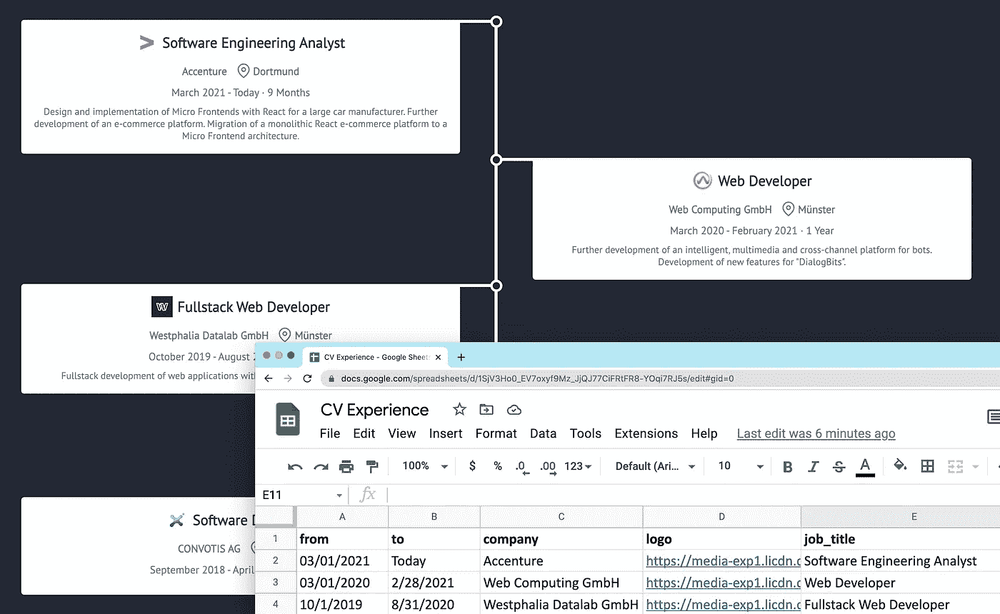
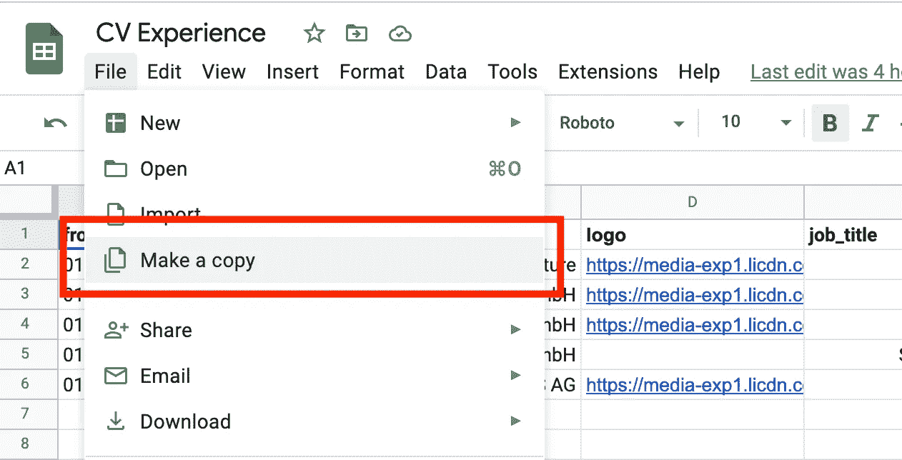
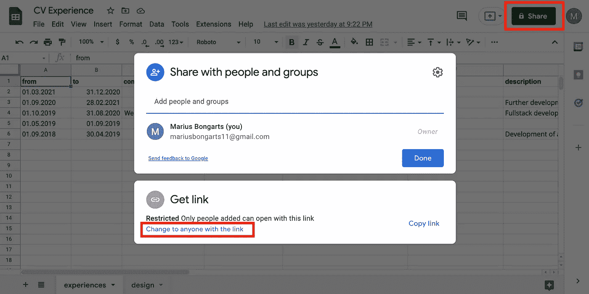
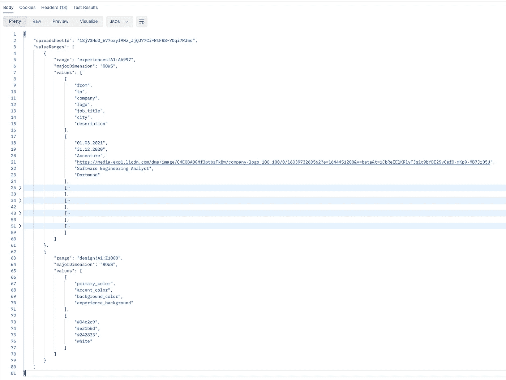

# 使用谷歌工作表作为 CMS 或数据库

> 原文：<https://javascript.plainenglish.io/how-to-use-google-sheets-as-a-cms-or-database-5303f706d30f?source=collection_archive---------1----------------------->

## 使用 Web 组件和 Google Sheets 作为 CMS 来构建您的个人简历体验网站



本文将向您展示如何构建一个 web 应用程序，用 Google Sheets 提供的数据显示 CV 体验时间线。我将向你展示如何通过参考你自己的谷歌电子表格快速建立你的个人简历网站。之后，我将指导您实现 Google Sheets API，并向您展示我如何使用 Web 组件设置前端。

[这里](https://mariusbongarts.github.io/cv-experience/?id=1SjV3Ho0_EV7oxyf9Mz_JjQJ77CiFRtFR8-YOqi7RJ5s)可以看到网站的演示。该网站显示了我简历经历的时间表，并在谷歌表单上提供来自这个[电子表格](https://docs.google.com/spreadsheets/d/1SjV3Ho0_EV7oxyf9Mz_JjQJ77CiFRtFR8-YOqi7RJ5s/edit#gid=0)的数据。稍后，您将创建一个新的电子表格，并将其链接到应用程序以显示您自己的体验。

在我进入指南之前，我想解释为什么使用 Google Sheets 作为内容管理系统(CMS)或数据库可能是有用的。Google Sheets 非常简单易懂。拥有谷歌账户的每个人都可以轻松地从谷歌表单中创建和编辑数据。不仅如此，您还可以与其他人共享电子表格。我不想说它将取代数据库或 CMS，但它是快速建立一个易于配置的网站或 web 应用程序的一个很好的方法。

所以，事不宜迟，让我们开始设置您的可配置简历网站。

[](/fun-with-google-sheets-and-javascript-91a2b027ce92) [## 使用 Google Sheets 和 JavaScript 的乐趣

### 让我们使用 Google Apps 脚本编辑器来构建一些东西。

javascript.plainenglish.io](/fun-with-google-sheets-and-javascript-91a2b027ce92) 

# 设置您的 Google Sheets CMS 网站

你可以通过 4 个简单的步骤建立你的网站。你将在两分钟内完成。显然，你需要一个谷歌账户。如果你没有，可能需要 5 分钟。

## 1.克隆 Google Sheets 电子表格

打开这个[链接](https://docs.google.com/spreadsheets/d/1SjV3Ho0_EV7oxyf9Mz_JjQJ77CiFRtFR8-YOqi7RJ5s/edit#gid=0)，进入我的电子表格。这是为我们的网站提供数据的模板。目前，您只能查看但不能编辑工作表，因为我只授予了查看权限。这就是为什么你需要复制一份来生成你的个人电子表格。点击**文件**->-**制作副本**即可。



## 2.调整数据

因为您已经创建了模板的副本，所以现在可以调整您的数据。注意，该模板包含两张表:**体验**和**设计**。在第一页，你可以加上你的个人经历。第二个可以改变网站的颜色。

## 3.共享您的电子表格

接下来，您需要共享您的电子表格并使其公开。你可以通过点击**分享- >链接**更改为任何人。



现在，互联网上的任何人都可以查看您的电子表格。确保你只授予**观看**的权利。否则，任何人都可以改变你网站的数据。现在，您可以复制如下所示的可共享链接:

> https://docs.google.com/spreadsheets/d/**1 sjv 3 ho 0 _ ev 7 oxy F9 mz _ jjqj 77 cif rtfr 8-yoqi 7 rj 5s**/编辑？usp =共享

只复制中间的**粗体**部分，这是我们的**电子表格 id** 。

## 4.将您的电子表格连接到网站

有两种方法可以将您的电子表格连接到网站。第一个解决方案是将我们的电子表格 id 作为查询参数传递给我们的演示网站。第二种选择是直接使用前端 web 应用程序的 web 组件。

**传递查询参数**

让我们将电子表格 id 作为查询参数传递，以将其连接到演示网站。下面是一个引用我的谷歌电子表格的链接示例:

> [*https://mariusbongarts.github.io/cv-experience/?id=****1 sjv 3 ho 0 _ ev 7 oxy F9 mz _ jjqj 77 cifr TFR 8-yoqi 7 rj 5s***](https://mariusbongarts.github.io/cv-experience/?id=1SjV3Ho0_EV7oxyf9Mz_JjQJ77CiFRtFR8-YOqi7RJ5s)

您只需将 id 替换为您的 id:

> https://mariusbongarts.github.io/cv-experience/?你的扩展页面 ID

就这样。你现在应该可以看到你的个人简历经历网站了。每当您对 Google 电子表格进行更改时，只要您刷新页面，就可以看到这些更改应用到网站上。

**使用 web 组件**

因为我们的演示网站只是呈现一个 web 组件，所以我们也可以将它传递到任何地方。web 组件的一个显著优点是，您可以在每个 Web 应用程序和网页中重用它们。这种易于重用的特性使得它完全独立于特定的前端框架，如 Angular、React 或 Vuejs。

您唯一需要做的就是将这段代码片段传递给任何 HTML:

在这个[密码栏](https://codepen.io/marius2502/pen/KKvxvJe)中检查一下:

Web Component Demo

这不是很棒吗？我是 Web 组件的超级粉丝。如果您有兴趣了解更多，请查看我的其他文章:

[](/will-web-components-replace-frontend-frameworks-535891d779ba) [## Web 组件会取代前端框架吗？

### 它们是为解决不同的问题而构建的。

javascript.plainenglish.io](/will-web-components-replace-frontend-frameworks-535891d779ba) [](/the-complete-web-component-guide-part-1-custom-elements-a627af805df8) [## 完整的 Web 组件指南:自定义元素

### 成为 Web 开发未来的专家(第 1 部分)

javascript.plainenglish.io](/the-complete-web-component-guide-part-1-custom-elements-a627af805df8) [](https://medium.com/@mariusbongarts11/showcase-your-medium-articles-with-web-components-part-1-basics-d2c6618e9482) [## 用 Web 组件构建自己的博客组合:基础

### 第 1 部分—定制元素、阴影 DOM 和 HTML 模板

medium.com](https://medium.com/@mariusbongarts11/showcase-your-medium-articles-with-web-components-part-1-basics-d2c6618e9482) 

# 履行

我希望我能让你相信，在某些用例中，Google Sheets 是 CMS 或数据库的一个很好且简单的替代方案。现在，我想向您展示我是如何处理实现的。首先，我将向您展示如何设置前端。之后，我们将查看负责使用 Google Sheets API 提供正确数据格式的服务器的实现。

## 设置前端

正如我所说的，我正在使用 Web 组件。当然，你也可以使用任何你选择的前端框架/库，比如 React、Angular 或 VueJs。

我正在使用 [Lit](https://medium.com/@mariusbongarts11/build-your-own-blog-portfolio-with-web-components-lit-library-2701dffc735f) 库来简化 Web 组件的开发。让我们来看看根`cv-experience`自定义元素:

在我们的`firstUpdated`生命周期方法中，我们正在获取一个`Config`对象，它是从我们的服务器获得的。这个对象包含一个`Experience`对象的数组。每个条目都是电子表格的体验表中的一行。此外，它还包含一个`Design`对象数组，用于定制应用程序的颜色。

看看相应的界面:

也许你已经注意到了,`Experience`界面的每个键代表我们电子表格中的一列。

在我们的`render()`函数中，您可以看到我们正在为每个体验对象呈现一个`experience-content`定制元素。

在我们继续实现我们的服务器之前，让我们看一下`experience-content`定制元素的代码。该组件负责在 Google Sheet 电子表格中显示我们的每一行经验:

这里是前端的 [Github 库](https://github.com/MariusBongarts/cv-experience)。

## 使用 Google Sheets API

Google Sheets API 是一个 RESTful 接口，允许您用自己喜欢的编程语言读取和修改电子表格的数据。以下是该 API 最常见的用法:

*   创建电子表格
*   读取和写入电子表格单元格值
*   更新电子表格格式
*   管理连接的工作表

对于我们的目的，执行读取操作就足够了，这使得一切都更易于管理，因为我们不需要交换 OAuth 令牌。我们需要提前做的唯一事情是获得一个 API 密钥。

> “有两种方法可以识别您的应用程序:使用 OAuth 2.0 令牌(它也授权请求)和/或使用应用程序的 API 密钥。”— [developers.google](https://developers.google.com/sheets/api/guides/authorizing)

遵循本[指南](https://developers.google.com/sheets/api/guides/authorizing#APIKey)获取和使用 API 密钥。下一步，我们将使用 API 键从电子表格中读取一些数据。你可以在[谷歌的文档](https://developers.google.com/sheets/api/samples/reading)中了解基本的阅读操作。

下面是一个关于如何使用 Google Sheets API 从 Google 电子表格中读取数据的示例请求:

```
GET https://sheets.googleapis.com/v4/spreadsheets/**YOUR_SPREADSHEET_ID**/values/Sheet1?key=**YOUR_API_KEY**
```

在我们的例子中，我们需要一张以上的数据( ***经验*** 和 ***设计*** )。这就是为什么我们使用一个`batchGet`来利用多个范围。因此，我们的请求看起来像这样:

```
GET https://sheets.googleapis.com/v4/spreadsheets/**YOUR_SPREADSHEET_ID**/values:batchGet?ranges=**experiences**&ranges=**design**&key=**YOUR_API_KEY**
```

对该方法调用的响应是一个包含描述范围值的一组`[ValueRange](https://developers.google.com/sheets/api/reference/rest/v4/spreadsheets.values#resource-valuerange)`对象的对象:



Example result of Google Sheets API

下一步是将这些数据映射到我们前端期望的格式——之前的`Config`接口。

为此，我们需要一台服务器来准备我们的数据并安全地存储我们的 API 密钥。我们不应该在我们的前端存储 API 密钥！

为此，我使用 Netlify 创建了一个无服务器 lambda 函数。但是当然，您也可以使用 express 或任何其他服务器来设置 NodeJs 服务器。下面是我的 lambda 函数的类型脚本代码:

我创建了一个`fetchGoogleSheetData(params)`函数，使用 API 键从 Google Sheets API 中获取数据，这个数据是从环境中读取的。之后，`valueRangesToObject(data)`方法负责将数据映射到`Config`接口。

# 最后的想法

使用 Google Sheets 作为 CMS 或数据库对每个人来说都是一个简单易用的解决方案。与 web 组件或任何其他前端框架/库(如 React、Angular 或 VueJs)相结合，这是一种快速设置易于配置的 Web 应用程序的好方法。

我希望你喜欢阅读这篇文章！我总是很乐意回答问题，也乐于接受批评。请随时联系我😊

关注我，不要错过我的下一篇文章。我写了关于 Typescript、Web 组件、前端框架、软件设计模式、Chrome 扩展以及更多的主题！🙏

[**这里是无限制访问媒体**](https://medium.com/@mariusbongarts/membership) 上每一个内容的链接。如果你用这个链接注册，我会赚一小笔钱，不需要你额外付费。

[](https://medium.com/@mariusbongarts/membership) [## 通过我的推荐链接加入 Medium-Marius bong arts

### 作为一个媒体会员，你的会员费的一部分会给你阅读的作家，你可以完全接触到每一个故事…

medium.com](https://medium.com/@mariusbongarts/membership) 

# 关于作者

Marius Bongarts 是埃森哲互动公司的软件工程分析师。他还创建了 [Web Highlights 扩展](https://chrome.google.com/webstore/detail/web-highlights-+-bookmark/hldjnlbobkdkghfidgoecgmklcemanhm)，允许用户在标签和目录的帮助下组织文本亮点和书签。

通过**[**LinkedIn**](https://www.linkedin.com/in/marius-bongarts-6b3638171/)**与我联系。****

**[](/5-skills-you-dont-get-around-to-learn-as-a-fullstack-developer-409f13c394c7) [## 作为全栈开发人员，你应该马上学会的 5 项技能

### 现在就学习吧，你会后悔错过的

javascript.plainenglish.io](/5-skills-you-dont-get-around-to-learn-as-a-fullstack-developer-409f13c394c7) [](/when-you-should-duplicate-code-b0d747bc1c67) [## 何时应该复制代码

### 复制比错误的抽象要便宜得多

javascript.plainenglish.io](/when-you-should-duplicate-code-b0d747bc1c67) [](/design-patterns-with-typescript-examples-factory-method-4d145887b141) [## 带有类型脚本示例的设计模式:工厂方法

### 工厂方法有助于编程接口，而不是实现。

javascript.plainenglish.io](/design-patterns-with-typescript-examples-factory-method-4d145887b141) 

*更多内容请看*[*plain English . io*](http://plainenglish.io/)*。报名参加我们的* [*免费周报在这里*](http://newsletter.plainenglish.io/) *。***