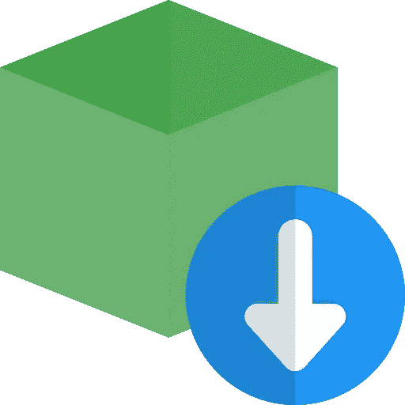

# 在节点应用程序中使用导入而不是要求

> 原文：<https://javascript.plainenglish.io/how-to-use-import-instead-of-require-statements-in-a-node-app-short-f3eff5d3a90d?source=collection_archive---------5----------------------->

## 如何在节点应用程序中使用 Import 而不是 Require 语句

感谢 **Node.js 中 **ESM** 文件的支持，**使用`const something = require('something')`的日子一去不复返了。让我们了解一下在您的新节点 js 项目中切换到使用 **import 语句**是多么容易。



今天我们将制作一个非常简单的 Express API 来演示如何在普通的 NodeJS 应用程序中实现现代导入语法。

# 先决条件

*   对 NodeJS 的基本理解
*   Express 知识不是必需的，但肯定会有所帮助
*   初级命令行经验(知道如何创建一个新目录和改变它)
*   node 的最新版本(在撰写本文时，版本 12 和 14 是 node 的当前 LTS 版本，支持这个特性)

# 我们开始吧

我们将构建一个接受一个路由的 Express API。该路由将位于`/hello`，它将返回一个字符串，表示“**hello world”**。事不宜迟，让我们开始编码吧。

我们要做的第一件事是打开一个终端/PowerShell(取决于您的操作系统),并导航到您想要放置代码的目录。我在机器的根目录下有一个代码目录，我把所有的项目都放在里面，但是任何旧的目录都可以。在到达您选择的目录后，运行这个命令。

```
mkdir esm-modules
```

然后在命令行中导航到它。

```
cd esm-modules
```

一旦进入目录，您将需要运行这个命令。

```
npm init -y
```

这将创建一个空节点项目。

现在运行这个命令，在节点应用程序中安装 Express。

```
npm i express
```

继续打开您的`package.json`,在 JSON 对象内部的某个地方添加一行代码。这将允许我们使用导入/导出语句，因此这非常重要。

```
"type": "module"
```

编辑后，它应该看起来像这样。

*请注意，express 的版本号可能会因您阅读本文的时间而异。*

有了这些，我们现在可以在 NodeJS 应用程序中自由地使用导入/导出语句。

我们将在项目路径中创建一个`app.js`文件，并向其中添加以下代码。

现在添加了这段代码，一切都可以工作了。您可以在命令行中运行下面的命令。

```
node app.js
```

应用程序编译后，您应该能够进入浏览器并导航到以下 URL:

[http://localhost:3000/hello](http://localhost:3000/hello)

# 包扎

就这样了。您现在可以开始在您的节点应用程序中使用现代的 ES 导入/导出语句，而不需要像 Babel 这样的工具。一如既往，如果你有任何问题，请随时留下评论。

*更多内容尽在*[*plain English . io*](http://plainenglish.io/)