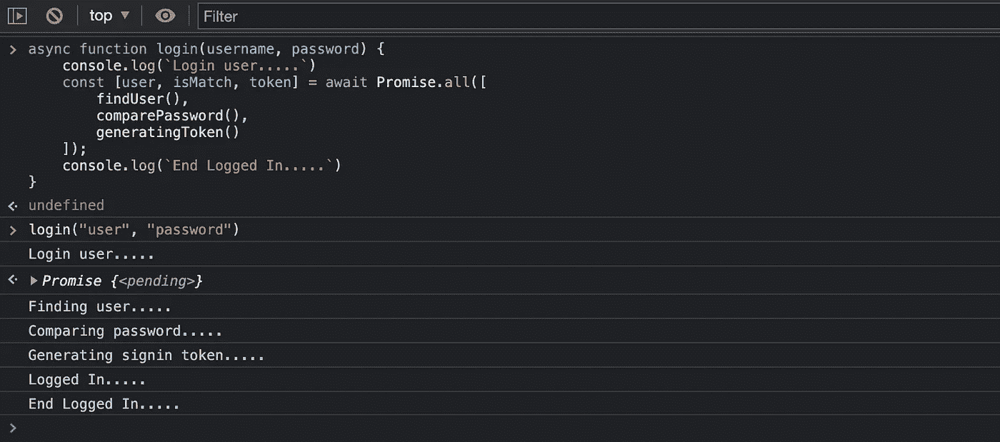

# JavaScript 中的回调 vs 承诺 vs 异步/等待

> 原文：<https://javascript.plainenglish.io/how-to-use-javascript-callback-promises-and-async-await-7970b5292985?source=collection_archive---------5----------------------->

## 如何编写带有回调、承诺和异步/等待的异步 JavaScript


在[的上一篇文章](/understanding-asynchronous-javascript-f43c4cd6a1d9)中，我们了解了 JavaScript 如何异步实现**。web 浏览器提供 Web APIs 环境来运行回调函数并承诺；因此，它不会阻塞用户界面。**

**用 JavaScript 编写异步代码有三种方式。**

**a.回收**

**b.承诺**

**c.异步/等待**

**让我们看看下面的场景。假设我们有一个登录功能来验证用户访问我们的网页。这个函数将调用一个嵌套函数来检查用户是否存在于数据库中。如果是，它将继续比较密码。如果密码有效，它将向前端返回成功。**

```
function findUser(username, password) {
    console.log(`Finding user.....`)
    comparePassword(password, "password")
}function comparePassword(username, password, hashPassword) {
    console.log(`Comparing password.....`)
    generatingToken(username, password)
}function generatingToken(username, password) {
    console.log(`Generating signin token.....`)
}function login(username, password) {
    console.log(`Login user.....`)
    findUser(username, password)
    console.log(`Logged In.....`)
}login("user", "password")
```

****

**目前看起来不错。但是，findUser 方法可能不会立即响应，因为获取 API 需要一些时间来处理。所以，在本教程中，我们使用 setTimeout 来模拟处理时间和回调。**

# **复试**

**当一个函数作为参数传递给另一个函数时，它被称为回调函数。**

```
function findUser(username, password, **callback**) {
    setTimeout(() => {
        console.log(`Finding user.....`)
        **callback**(password, **generatingToken**)
    }, 1000);
}function comparePassword(password, **callback**) {
    setTimeout(() => {
        console.log(`Comparing password.....`)
        **callback**(password)
    }, 1000);
}function generatingToken(password) {
    setTimeout(() => {
        console.log(`Generating signin token.....`)
        console.log(`Logged In.....`)
    }, 1000);
}function login(username, password, **callback**) {
    console.log(`Login user.....`)
    **callback**(username, password, **comparePassword**)
}login("user", "password", **findUser**)
```

****

**我们在这里看到了一个问题。当嵌套的回调函数越来越大时，就很难跟踪和阅读代码。我们把这个 ***叫做回调地狱。*看起来是这样的。****

```
function login(username, password) {
    console.log(`Login user.....`)
    **setTimeout**(() => {
        console.log(`Finding user.....`)
        **setTimeout**(() => {
            console.log(`Comparing password.....`)
            **setTimeout**(() => {
                console.log(`Generating signin token.....`)
                **setTimeout**(() => {
                    console.log(`Another callback.....`)
                    **setTimeout**(() => {
                        console.log(`Again Another callback.....`)

                    }, 1000);
                }, 1000);
            }, 1000);
        }, 1000);
    }, 1000);
}
```

# **承诺**

**承诺是为了简化操作。承诺有三种主要状态。**

**a.**待定** —这是初始状态。这里还没有发生任何事情。**

**b.**已解决** —这是操作已成功完成的状态。**

**c.**拒绝** —这是操作失败的状态。**

**让我们先来看看 Promise 语法。首先，我们创建一个 Promise 对象，并传递一个带有 resolve 和 reject 的回调函数。**

```
const findUser = new **Promise**(function**(resolve, reject)** {
    const userExist = true;
    if (userExist) {
        resolve("User is valid");
    } else {
        reject("User doesn't exist");
    }
});console.log(findUser);
```

****

**从控制台上，我们看到 ***承诺状态*** 返回为 ***“履行完毕”*** 另外，注意它返回一个 **Promise 对象**而不是一个字符串中的结果。**

**现在让我们深入探讨一下 ***承诺链*** 。所以我们不会传递回调函数，而是用`.then`来代替**

```
promise
    .then(function(done) { })
    .then(function(done) { })
```

## **例子**

```
const findUser = function(username, password) {
    return new Promise(function(resolve, reject) {
        setTimeout(() => {
            console.log(`Finding user.....`)
            const userExist = true;
            if (userExist) {
                resolve("User is valid");
            } else {
                reject("User doesn't exist");
            }
        }, 1000);
    });
}
const comparePassword = function(password) {
    return new Promise(function(resolve, reject) {
        setTimeout(() => {
            console.log(`Comparing password.....`)
            const isMatch = true;
            if (isMatch) {
                resolve("Password correct");
            } else {
                reject("Incorrect Password");
            }
        }, 1000);
    });
}
const generatingToken = function(password) {
    return new Promise(function(resolve, reject) {
        setTimeout(() => {
            console.log(`Generating signin token.....`)
            console.log(`Logged In.....`)
            resolve();
        }, 1000);
    });
}
function login(username, password) {
    console.log(`Login user.....`)
    findUser(username, password)
        .then(function(done)  {
            console.log(done)
            return comparePassword()     
        })
        .then(function(done)  {
            console.log(done)
            return generatingToken()  
        })
        .catch(function(error)  {
            console.log(error)    
        })
}
login("user", "password")
```

**让我们试着把`userExist`改成`false`。**

****

**由于在 *findUser promise* 中调用了 reject，链在第一个`.then`处停止处理。**

**我们看到，承诺链允许我们以更合适的方式轻松地处理错误。**

# **异步/等待**

**同样，使用 async/await 有一种更好的方法。 **Async/Await** 允许你同步编写异步代码。**

**我们先来看看语法。需要两个关键字 ***async*** 来告诉引擎这个方法是一个异步代码。 ***await*** 告诉引擎在进入下一个代码之前等待响应。 **await** 必须在 **async** 函数中使用，所以不能在全局中使用 await。**

**我们可以将**承诺链**重写为下面的代码片段。**

```
**async** function login(username, password) {
    console.log(`Login user.....`)
    const user = **await** findUser(username, password)
    console.log(user)
    const isMatch = **await** comparePassword(password, "password")
    console.log(isMatch)
    const token = **await** generatingToken(password)
}
```

****

**为了处理错误，我们需要手动创建一个 try-catch 块。我们试着把`userExist`改成`false`。**

```
**async** function login(username, password) {
    try {
        console.log(`Login user.....`)
        const user = **await** findUser(username, password)
        console.log(user)
        const isMatch = **await** comparePassword(password, "password")
        console.log(isMatch)
        const token = **await** generatingToken(password)
    } catch (err) {
        console.log(err)
    }
}
```

****

**从上面的例子中，我们看到代码很容易理解为同步的。代码似乎是按顺序一个接一个运行的。**

**从我们之前学习的例子中，一个 API 调用依赖于另一个 API 调用。然而，在某些场景中，我们可能希望并行调用多个异步 API，并且仅当所有异步 API 调用都有结果返回时才返回。**

# **承诺。所有**

**所有的承诺都有助于达到预期的结果。在下面的代码中，封装在 **Promise.all** 中的异步函数可以运行，而无需等待彼此返回结果。但是，console.log("已登录…. ")将仅在所有异步已经完成时被触发。**

```
**async** function login(username, password) {
    console.log(`Login user.....`)
    const [user, isMatch, token] = await **Promise.all**([
        findUser(),
        comparePassword(),
        generatingToken()
    ]); console.log(`End Logged In.....`)
}
```

****

**挑战自己，将*更改密码*功能的计时器更新为 2 秒，然后观察日志。**

**你会注意到*“生成登录令牌…..*“是之前打印的”*对比密码…..*"这是因为**承诺。所有**将并行启动异步函数，而不等待函数完成。**

**在本教程中，我们学习了如何使用回调、承诺和 async/await 编写异步函数。此外，我们学会了使用 **Promise.all** 来运行多个并行异步调用。**

# **了解更多信息**

*   **[什么是异步 JavaScript](https://enlear.academy/what-is-asynchronous-javascript-310426783ef1)**
*   **[异步 JavaScript 的传奇:回调](https://enlear.academy/the-saga-of-async-javascript-callbacks-6f56b3490f4d)**
*   **[AWS SQS 如何工作](https://enlear.academy/asynchronous-request-handling-with-aws-sqs-c4df33ae9717)**

***更多内容请看*[***plain English . io***](https://plainenglish.io/)*。报名参加我们的* [***免费周报***](http://newsletter.plainenglish.io/) *。关注我们关于*[***Twitter***](https://twitter.com/inPlainEngHQ)[***LinkedIn***](https://www.linkedin.com/company/inplainenglish/)*[***YouTube***](https://www.youtube.com/channel/UCtipWUghju290NWcn8jhyAw)*[***不和***](https://discord.gg/GtDtUAvyhW) *。对增长黑客感兴趣？检查* [***电路***](https://circuit.ooo/) *。*****