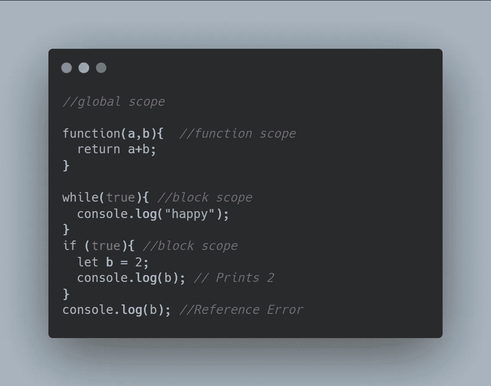
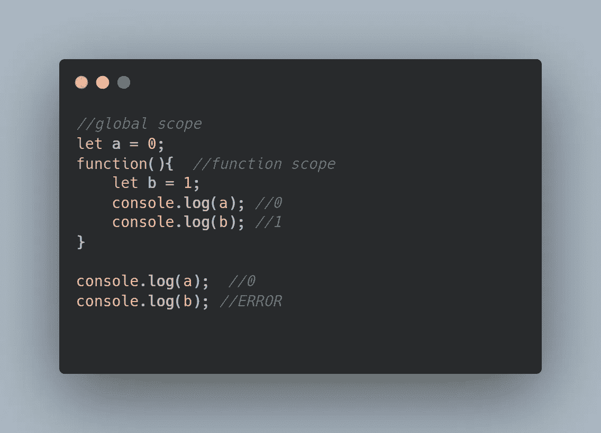
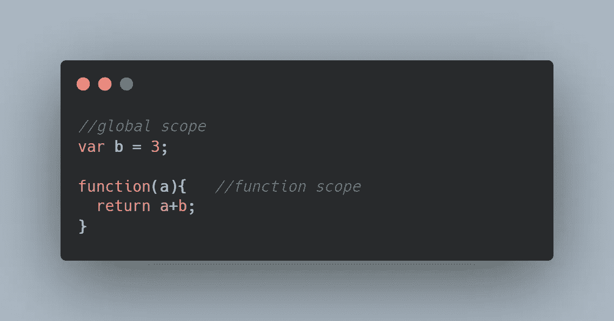
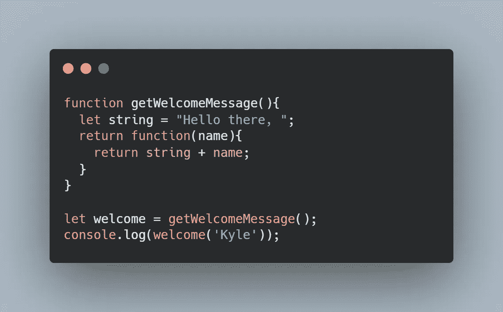
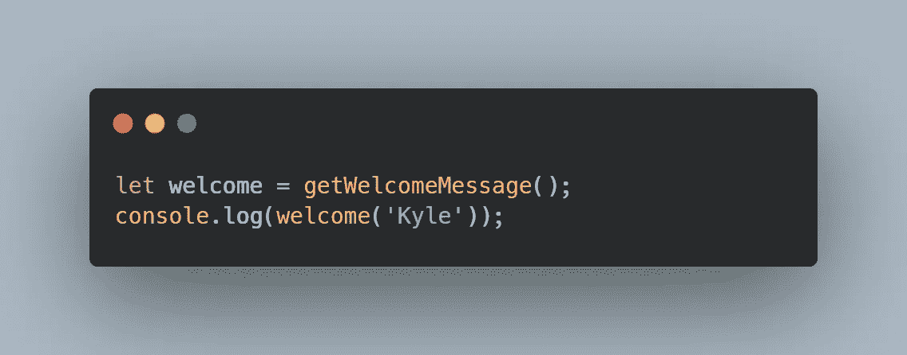

# 如何在 5 分钟内使用 JavaScript 闭包

> 原文：<https://javascript.plainenglish.io/how-to-use-javascript-closures-in-5-minutes-a28deddd3920?source=collection_archive---------1----------------------->

## 在下次面试前掌握 JavaScript 闭包！


Photo by [Paul Esch-Laurent](https://paulisaweso.me/)

如果你在网上搜索 JavaScript 面试问题，闭包几乎每次都会出现——而且理由充分。闭包可以用作数据封装的工具。如果开发人员想创建只能由函数访问的变量，闭包是一个不错的选择。

但是闭包还不止于此。闭包如此常见，你很可能已经尝试过了。接下来的五分钟我们来讨论一下。

# 首先，让我们定义什么是闭包。

## 领域

要理解闭包，您需要理解 JavaScript 中的作用域。(如果你已经理解了作用域，可以跳过这一小节。)



在 JavaScript 中，我们有三个作用域:全局作用域、函数作用域和块作用域。全局范围是第一级、祖先到所有范围。整个脚本中只有一个全局范围。函数作用域是每次创建函数时创建的作用域。块作用域是为条件和循环创建的作用域。更多信息，请查看 [W3 学校](https://www.w3schools.com/js/js_scope.asp)。

如果您曾经尝试过 JavaScript，您会记得嵌套函数、嵌套循环和嵌套条件是存在的。这意味着您可以将作用域嵌套在作用域中，从而创建父作用域和子作用域。

对于作用域，最重要的经验是理解变量的可访问性。在 JavaScript 中，子作用域不仅可以访问自己的局部作用域，还可以访问属于父作用域的变量。



例如，在这个示例代码中，函数作用域是全局作用域的子作用域。在函数中，它使用在父作用域中定义的变量“a”。这是 JavaScript 允许的。子作用域可以访问外部作用域中声明/初始化的变量。

然而，如最后一行所示，父作用域不能访问子作用域中的可用数据。最后一行，b 在全局范围内不存在。

同样，要了解更多关于示波器的信息，请查看 [W3 学校](https://www.w3schools.com/js/js_scope.asp)。

## 关闭

现在，我们可以讨论闭包了。

上面的示例代码是闭包的一个非常基本的例子。任何时候，当一个函数访问在函数作用域之外声明或初始化的变量时，就会发生闭包。换句话说，就是当它们访问在父作用域、父作用域等等中找到的变量时。



在本例中，该函数将两个变量相加并返回总和。该函数在其局部范围内已经有了变量“a”。但是，变量“b”不在局部范围内。当函数实现它时，它将在外部范围内搜索 b。幸运的是，b 存在于父作用域中，因此函数将使用该值。如果在外部作用域中找不到 b，它将简单地返回一条错误消息，说明 b 不存在。

让我们来看一个更复杂的闭包例子——这可能是大多数人想到闭包时想到的。



当大多数人想到闭包时，他们可能会想到嵌套在函数中的函数。我们来分解一下。

我们从外部函数 **getWelcomeMessage()开始。**这个外部函数包含一个变量和一个返回语句——这是闭包的通用模板。闭包通常包含数据(变量)并返回一个函数。

注意变量**字符串**总是包含在外部函数中。任何在 **getWelcomeMessage()** 范围之外的 JavaScript 代码都不能访问这个变量。这是数据封装的一个例子。这种想法认为，对敏感数据的访问应该仅限于真正需要使用它的关键人物。因此，如果在 **getWelcomeMessage()** 范围之外的另一个函数或代码行想要访问这些敏感数据，它将无法访问。它应该不能够。

还要注意函数 **getWelcomeMessage()的返回语句。return 语句返回一个函数，并定义该函数(以及参数和指令)。**



这是前面代码示例的后半部分。我们来分解一下。在第一行中，我们创建了一个名为 welcome 的变量。我们在这个变量中存储了什么？我们正在存储将从函数调用 **getWelcomeMessage()返回的值。**从前面我们知道，这将返回一个函数。

现在，请确保您理解以下内容之间的区别:

```
let welcome = getWelcomeMessage();
let welcome = getWelcomeMessage;
```

第一个是函数调用，意味着函数将实际执行并返回值。第二个基本上是将 welcome 转换成与函数 **getWelcomeMessage 相同的函数。**名称不同，功能相同。我们想要第一个。我们希望函数执行并返回一个函数。

所以现在，在第一行代码之后，welcome 是一个函数。它是从外部函数 **getWelcomeMessage()返回的函数。**


让我们分解返回的函数(第 3 行)。所以返回的函数只有一个参数，就是一个名字。返回的函数返回“Hello there”加上参数中提供的输入。注意变量**字符串**是如何从未命名函数的父函数中取出的。这再次说明了数据封装。只有 **getWelcomeMessage** 的子作用域可以访问该字符串。

当我们调用这个函数时:

```
welcome('Kyle'); 
```

…它将返回“你好，凯尔”。这一点很重要，因为 welcome()显然在 **getWelcomeMessage()** 的范围之外，它仍然可以访问该字符串。这就是为什么闭包是特殊的，知道它是非常重要的。

如果你想玩代码，这里是:

```
function getWelcomeMessage(){
  let string = "Hello there, ";
  return function(name){
    return string + name;
  }
}let welcome = getWelcomeMessage();
console.log(welcome('Kyle'));
```

我还将提供其他例子，你可以玩。感谢您的阅读！

样本 1

```
function plusFive(){
  let x=5;
  return function(y){
    return x + y;
  }
}let addFive = plusFive();
console.log(addFive(4));
console.log(addFive(9));
```

样本 2

```
let x = 200;function foo(y){
  return function(z){
    return x + y + z;
  }
}let bar = foo(51);
console.log(bar(945));
```

样本 3

```
function foo(y){
  let x =  420;
  return (z) => {return x+y+z};
}let bar = foo(320);
console.log(bar(2));
```

样本 4

```
function foo(){
  let lastName = "Smith";
  return (firstName) => {return firstName + " " + lastName};
}let bar = foo();
console.log(bar("Will"));
console.log(bar("Jada-Pinkett"));
console.log(bar("Jaden"));
console.log(bar("Willow"));
console.log(bar("Trey"));
```

*更多内容请看*[*plain English . io*](http://plainenglish.io/)*。在这里注册我们的* [*免费周报*](http://newsletter.plainenglish.io/) *。*