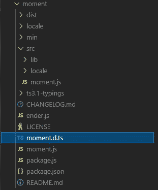

# 如何在 Angular 项目中使用 JavaScript 库

> 原文：<https://javascript.plainenglish.io/how-to-use-javascript-libraries-in-angular-project-c6d58a9aa9ca?source=collection_archive---------6----------------------->


Photo by [Christina @ wocintechchat.com](https://unsplash.com/@wocintechchat?utm_source=medium&utm_medium=referral) on [Unsplash](https://unsplash.com?utm_source=medium&utm_medium=referral)

在 Angular 项目中使用 JavaScript 库不像在 Angular JS 或普通 JavaScript 项目中那样简单。在一个普通的 JavaScript 项目中，您可以将这个库包含在您的`index.html`的`script`标签中，然后这个库就可以使用了。

但是在 Angular 项目中，遵循相同的步骤可能实际上不起作用。事实上，编译器可能会在库的使用上抛出一个错误。为了包含和使用这个库，标准的方法是使用 npm 安装这个库，然后寻找它的类型声明文件`(*.d.ts)`。该库的类型声明文件可能是也可能不是其源代码的一部分。如果不存在，则需要单独安装。

# 什么是类型声明文件？

TypeScript 是一种类型化语言，声明文件向非类型化的 JavaScript 代码添加必要的类型。简而言之，类型声明文件为编译器提供了关于导入成员的信息，以及它所期望的参数、数据类型、返回值等等。,

为了进一步理解，请看下面的例子:

这里有一个名为`person`的函数，它接受一个`Array` 并返回一个`Object`。

这个函数的声明文件是:

声明文件只包含类型信息，不包含函数实现。这些被称为**环境声明。**

关于类型脚本声明需要注意的几点:

*   声明文件中没有函数/类/变量实现。
*   函数没有默认参数。
*   *declare* 关键字用来告诉这个函数/类/变量的实际实现存在于别处。
*   仅对导出的成员或打算从此文件中使用的函数/类/变量使用 *declare* 关键字。不要在函数内部的局部变量上使用它。
*   VS 代码添加了必要的智能感知，并在包含了`.d.ts`文件后显示正确的自动完成建议。从而使开发变得容易并提前识别错误。

要为 JavaScript 文件创建声明文件，请使用以下命令:

```
npx typescript script.js --declaration --allowJs --emitDeclarationOnly --outDir types
```

上面的命令创建了一个`types/script.d.ts`文件。

要为类型脚本文件创建声明文件，请使用命令:

```
tsc script.ts -d
```

一旦创建了声明文件，您就可以将它们包含在 Angular 项目中并开始使用它们。您必须包括源代码及其声明文件。

# 如何在 Angular Project 中使用库？

如果您在 Angular 项目中安装了一个 JavaScript 库，您一定注意到了源文件夹包含一个扩展名为`.d.ts`的文件。有些库没有内置的 typings 文件夹，相反，你必须通过 npm 使用`@typings`手动安装它们。

让我们以一个流行的 JS 库为例: [Moment.js](https://momentjs.com/)

```
npm install moment --save
```

现在，检查`node_modules`文件夹中的`moment`库。



Moment.js library

Moment.js 附带了一个名为`moment.d.ts`的打字文件。现在我们可以通过使用`ts`文件中的`import`语句直接使用该库。

```
import moment from ‘moment’;date = moment().format('MMM Do YY');
```

这将显示当前日期。

我们将尝试添加另一个库， [CryptoJS](https://www.npmjs.com/package/crypto-js) 。

```
npm install crypto-js --save
```

安装后，如果您试图使用`CryptoJS` 方法，编译器将抛出一个错误，要求安装`CryptoJS`的类型声明文件。这个库没有它的类型声明文件。我们需要单独安装它。

感谢[明确类型化的](https://github.com/DefinitelyTyped/DefinitelyTyped)社区为库发布类型。

```
npm i @types/crypto-js --save-dev
```

一旦安装了类型声明文件，编译器就会识别它，您就可以开始使用这些方法了。

```
import * as CryptoJS from 'crypto-js'
```

现在您可以开始使用库方法了。

app.component.ts with Moment.js and CryptoJS libraries.

绑定 HTML 页面中的变量以查看它们。

Binding the component value to HTML

# 结论

*   要在 Angular 项目中使用 JavaScript 库，请通过 npm 安装该库并检查其类型声明文件。
*   从@types/ <library-name>安装类型声明文件，如果它不是源代码的一部分。</library-name>
*   将库导入到组件中，并开始使用它。

这是一个可行的 StackBlitz 示例:

[](https://stackblitz.com/edit/js-lib-angular?embed=1&file=library-example/src/app/app.component.ts) [## 角度堆栈

### 编辑描述

stackblitz.com](https://stackblitz.com/edit/js-lib-angular?embed=1&file=library-example/src/app/app.component.ts) 

## 参考

[https://www . typescriptlang . org/docs/handbook/2/type-declarations . html](https://www.typescriptlang.org/docs/handbook/2/type-declarations.html)

仅此而已！

希望这篇文章有用！

*更多内容请看*[*plain English . io*](http://plainenglish.io/)