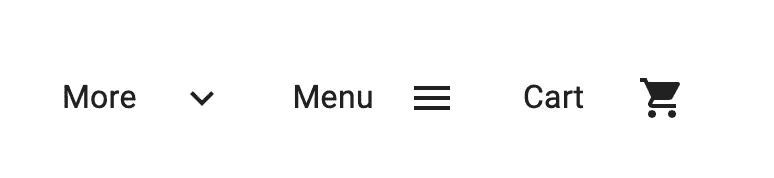
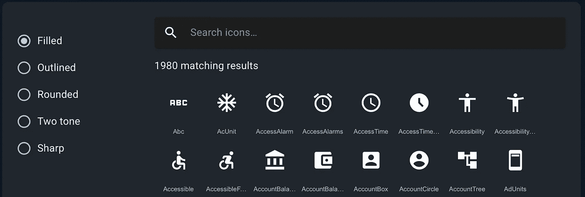
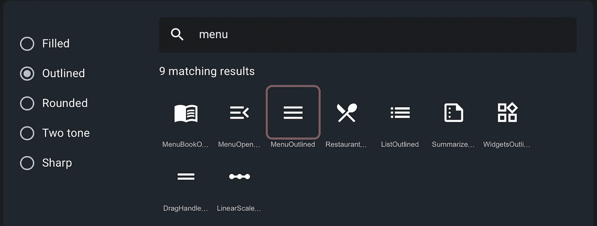
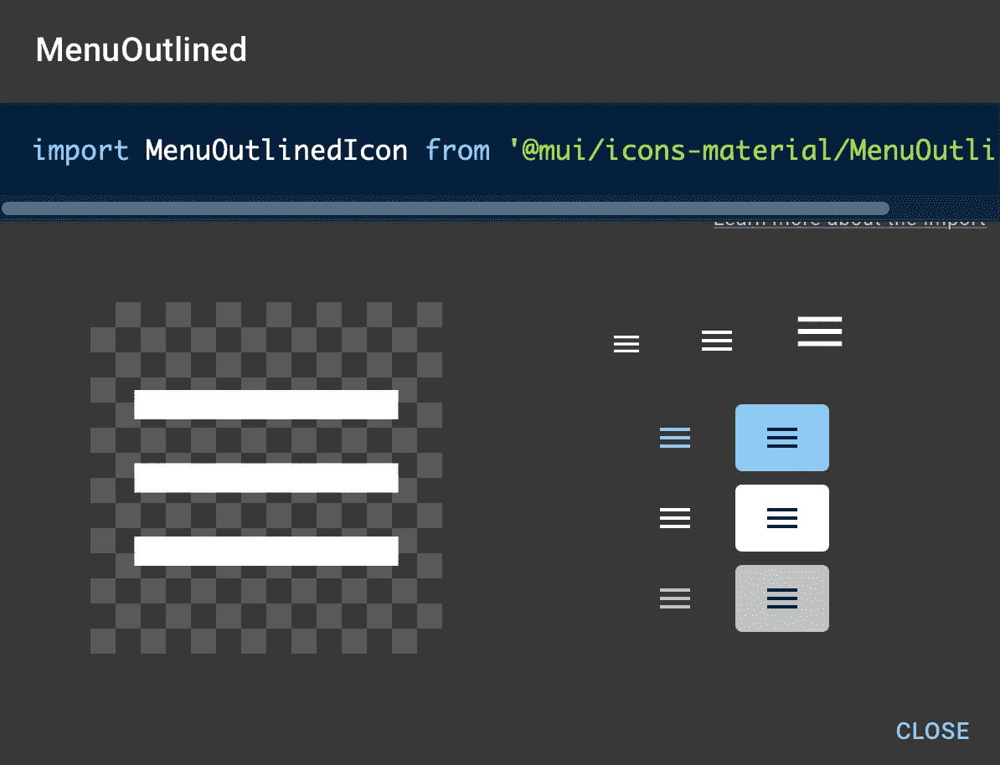

# 如何在 React 中使用材质 UI (MUI)图标

> 原文：<https://javascript.plainenglish.io/how-to-use-material-ui-mui-icons-in-react-976911a2c7bb?source=collection_archive---------5----------------------->


无论是简单的登录页面、电子商务应用平台还是公司的内部仪表板，使用预制图标和组件库都非常有益。还有许多其他的图标库可以简化你的工作，但其中最大和最流行的是材料用户界面(或最近命名为 MUI)图标库。

如果您不熟悉 Material UI library，它为您提供了强大的、可定制的、可访问的高级组件，使您能够构建自己的设计系统并更快地开发 React 应用程序。这包括一个巨大的材料图标列表。

基于谷歌制定的[材质设计](https://material.io/design)指南，材质 UI 图标或 MUI 目前有超过 1900 个图标。因此，让我们看看如何在 React 应用程序中使用它们。我们开始吧！

# React 应用程序中的材质图标入门

让我们用 React 应用程序使用材质图标(MUI)包的一些实际编码来弄脏我们的手。

# 我们会做什么？

我们的演示将是非常基础的。基本上，一个组件，其中我们显示了在一个典型的网页中常见的三个项目；



如你所见，我们有三个项目:

1.  “更多”下拉项目。
2.  “菜单”汉堡项目。
3.  “购物车”图标。

这里我们在文本旁边使用材料图标。

**第一步:启动一个新的 React 项目**

确保您的系统上安装了[node . js](https://docs.npmjs.com/downloading-and-installing-node-js-and-npm/)，然后运行以下命令:

```
npx create-react-app mui-demo
cd mui-demo
npm start
```

由于使用了 [Create React App](https://create-react-app.dev/) 工具，这将引导一个新的 React 应用程序，并在默认浏览器中运行 [http://localhost:3000/](http://localhost:3000/) 上的默认应用程序。

**第二步:安装素材 UI(MUI)包**

在我们开始添加这些图标之前，我们需要核心的 MUI 包，因为所有这些图标都使用 MUI `[SvgIcon](https://mui.com/api/svg-icon/#main-content)` 组件来呈现每个图标的 SVG 路径。对于每个 SVG 图标，我们从@mui/icons-material 包中导出各自的 React 组件。

从终端运行以下命令:

```
npm install @mui/material @emotion/react @emotion/styled
```

或者，如果您使用的是纱线:

```
yarn add @mui/material @emotion/react @emotion/styled
```

**第三步:安装材质图标包**

现在我们可以用下面的命令安装图标包

```
// with npm
npm install @mui/icons-material// with yarn
yarn add @mui/icons-material
```

**第四步:开始使用 MUI 图标！**

只需转到 *app.js* 文件，删除所有现有代码。我们将从头开始写所有的东西。

让我们从 responsive `[Grid](https://mui.com/components/grid/#main-content)` layout 组件开始，它将包含我们所有的元素。这对于使用 [CSS Flexbox](https://www.w3.org/TR/css-flexbox-1/) 的不同屏幕尺寸和方向非常有用。

所以在`return()`法下，我们应该有`<Grid>` 的成分。它可以有自己的道具或自定义样式:

```
<Grid container></Grid>
```

现在我们需要六个新的子组件来保存带有文本标签的图标(三个组件各一个)。确保你把`item`道具传给他们每个人。

```
<Grid item xs={1}></Grid>
```

在其中的每一个中，我们都有一个保存文本标签的 `[<Typography>](https://mui.com/api/typography/#main-content)`组件

```
<Typography>More</Typography>
```

至于实际的 MUI 图标组件，我们将创建一个重复的子`<Grid>`项，但是这里唯一改变的是实际的图标组件名称。到目前为止，我们应该有以下代码:

```
import * as React from "react";
import Grid from "@mui/material/Grid";
import Typography from "@mui/material/Typography";export default function App() {
  return (
    <Grid container sx={{ color: "text.primary" }} >
      <Grid item xs={1}>
        <Typography>More</Typography>
      </Grid>
    </Grid>
  );
}
```

让我们看看如何从 MUI 网站找到我们需要的图标:

1.  前往[材料图标网页](https://mui.com/components/material-icons/)。
2.  这里您将看到图标列表:



正如你所看到的，它有 5 种类型的图标:填充、轮廓、圆形、双色和锐利。对于本演示，我们只想使用概述的一个。

1.  现在，让我们按名称搜索四个图标，比如菜单图标:



1.  如果您单击选定的图标，您将看到以下弹出窗口:



在这里，您可以获得图标组件的名称以及一些变体。

1.  最后，让我们复制您在上面的模态中看到的`import`语句，以便我们可以在 React 应用程序中使用它。

在第二个子组件`<Grid>`中，我们现在可以安全地添加选定的图标组件，如下所示:

```
import MenuIcon from "@mui/icons-material/Menu";<Grid item xs={1}>
  <MenuIcon />
</Grid>
```

用于上述演示的其他图标组件有:`ExpandMoreOutlinedIcon`和`ShoppingCartIcon.`
如果您成功实现了上述步骤，您应该有以下代码:

```
import * as React from "react";
import Grid from "@mui/material/Grid";
import Typography from "@mui/material/Typography";
import ExpandMoreOutlinedIcon from "@mui/icons-material/ExpandMoreOutlined";
import MenuIcon from "@mui/icons-material/Menu";
import ShoppingCartIcon from "@mui/icons-material/ShoppingCart";export default function SvgMaterialIcons() {
  return (
    <Grid container sx={{ color: "text.primary" }} style={{ margin: "10rem" }}>
      <Grid item xs={1}>
        <Typography>More</Typography>
      </Grid>
      <Grid item xs={1}>
        <ExpandMoreOutlinedIcon />
      </Grid>
      <Grid item xs={1}>
        <Typography>Menu</Typography>
      </Grid>
      <Grid item xs={1}>
        <MenuIcon />
      </Grid>
      <Grid item xs={1}>
        <Typography>Cart</Typography>
      </Grid>
      <Grid item xs={1}>
        <ShoppingCartIcon />
      </Grid>
    </Grid>
  );
}
```

这应该可以了！如果您仔细按照上面的步骤操作，您可以在浏览器中看到 React 正在根据需要呈现相应的 MUI 图标。

使用实体 UI 图标的一个好处是，它支持所有主流平台和浏览器，如果你被卡住了，你可以查看他们的 GitHub repo。如果这还不够的话，他们还有一整页的内容专门介绍[对](https://mui.com/getting-started/support/)的支持。

因此，继续尝试在您的项目中使用其他图标。希望这个简短的指南有所帮助。

或者你也可以浏览一些我们的[预建的 react 模板](https://www.wrappixel.com/templates/category/react-templates/)，它们反应灵敏，具有交互性，并且加载了所有重要的材质 UI 图标。

*更多内容看* [***说白了就是***](http://plainenglish.io/) ***。*** *报名参加我们的* [***免费每周简讯这里***](http://newsletter.plainenglish.io/) ***。***