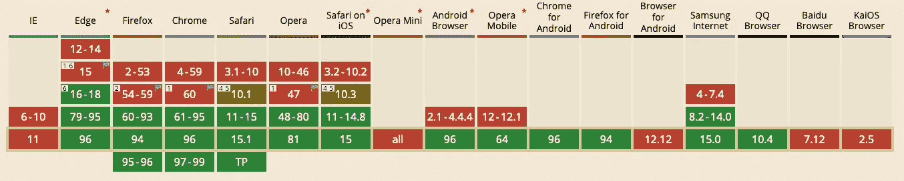
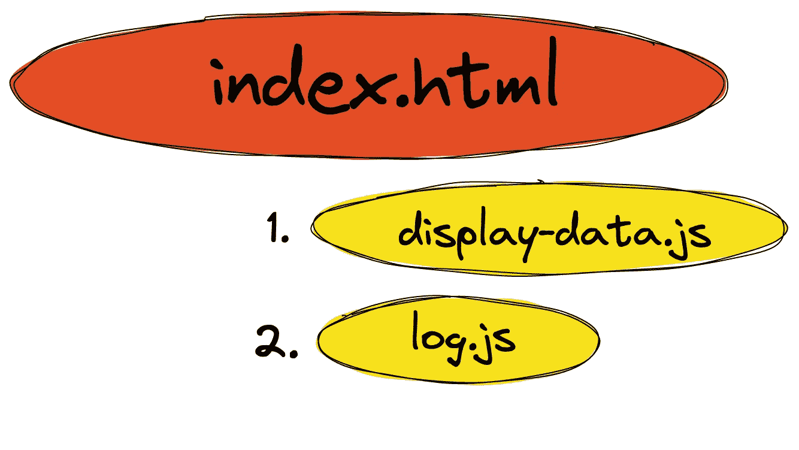
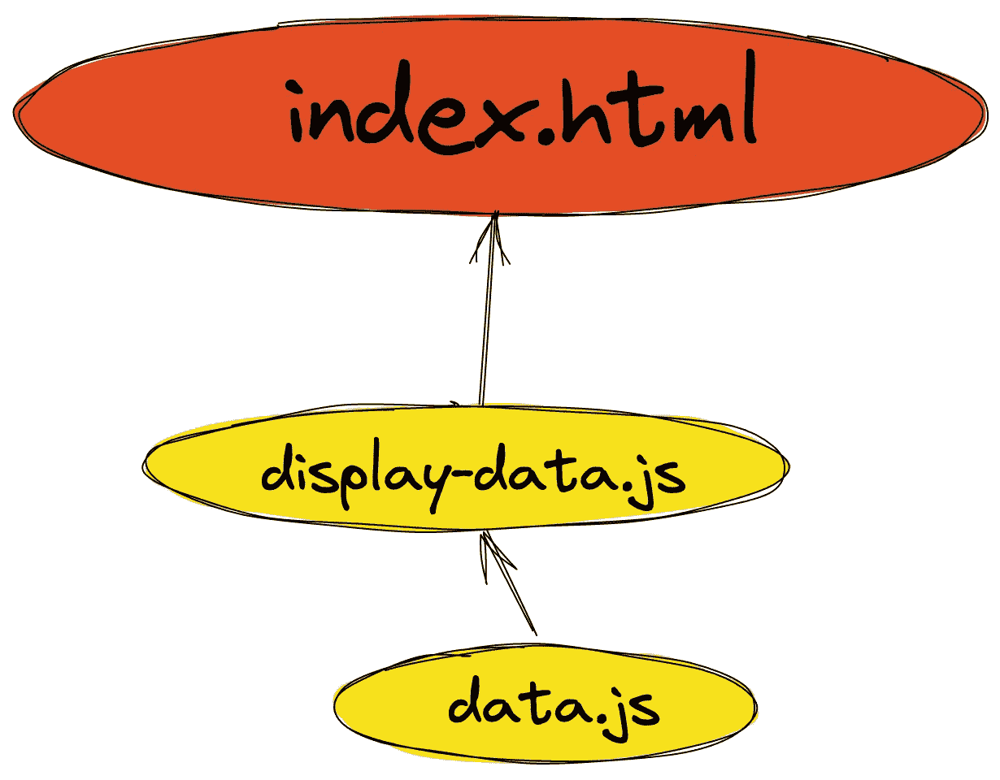
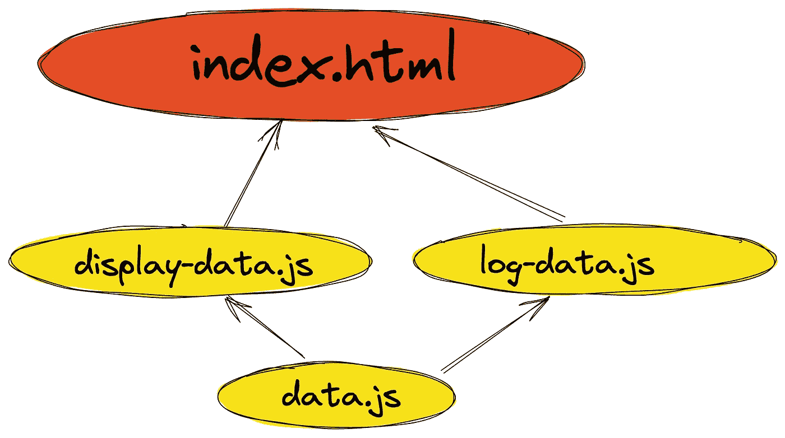
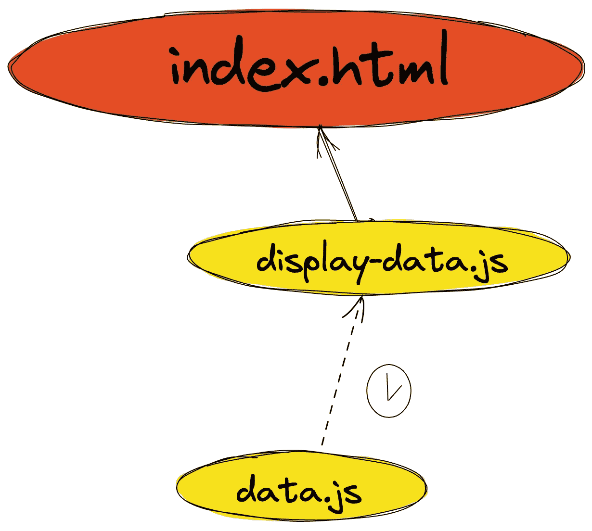

# 如何使用本地 ES 模块

> 原文：<https://javascript.plainenglish.io/how-to-use-native-es-modules-8bce37435753?source=collection_archive---------20----------------------->

本文将展示 ECMAScript (ES)模块的例子——您可以用它们实现什么，以及在哪里会遇到一些限制。2018 年 5 月之后发布的所有浏览器都支持 ES 模块，所以你可以假设它们在大多数情况下都可以安全使用。



[source](https://caniuse.com/es6-module)

# 不带 ES 模块的编码

在我们有 ES 模块之前，所有的 JS 都必须全局导入。每个文件都可以访问先前导入的文件中设置的变量和函数。导入的顺序很重要，特别是因为在名称冲突的情况下，后来导入的内容可能会覆盖早先导入的内容。运行中的老派导入看起来如下:

```
// display-data.js:
document.body.innerHTML = “lorem ipsum”;// log.js:
console.log("Some test info");// index.html:
<html>
  <head>
    <meta http-equiv="content-type" content="text/html; charset=utf-8" />
    <title>No modules</title>
    <link rel="shortcut icon" href="#" />
  </head><body>
    <script src="./display-data.js"></script>
    <script src="./log.js"></script>
  </body>
</html>
```



Imports without modules

[行动中的榜样](https://how-to-js.github.io/es-modules/no-modules/)。

# 问题

这种方法有两个主要问题:

1.  它污染了全球范围。如果有几个文件定义了相同的值，那么它们会相互冲突并覆盖。祝你好运找到并修复它可能导致的错误。示例:

```
// data-1.js:
var data = “lorem ipsum”;// data-2.js:
var data = “sin dolor”;// index.html:
<html>
  <head>
    <meta http-equiv="content-type" content="text/html; charset=utf-8" />
    <title>Name collision</title>
    <link rel="shortcut icon" href="#" />
  </head>

  <body>
    <script src="./data-1.js"></script>
    <script src="./data-2.js"></script>
    <script>
      document.body.innerHTML = data;
    </script>
  </body>
</html>
```

[本码直播](https://how-to-js.github.io/es-modules/name-collision/)。最常见的解决方法是使用立即调用的函数表达式。这隔离了代码块，防止了全局范围的污染，但同时也使代码更加混乱。

2.任何依赖都必须手动管理和解决。如果一个文件依赖于另一个文件，那么您必须确保以正确的顺序导入这些文件。例如:

```
// log-data.js:
console.log(data);// data.js:
const data = ‘some data’;// display-data.js:
document.html = data;// index.html:
<html>
  <head>
   <meta http-equiv="content-type" content="text/html; charset=utf-8" />
   <title>File order</title>
   <link rel="shortcut icon" href="#" />
  </head>

  <body>
   <script src="./log-data.js"></script>
   <script src="./data.js"></script>
   <script src="./display-data.js"></script>
  </body>
</html>
```

正如您在这里看到的，显示数据部分按预期工作，而记录数据失败。

# ES 模块在运行

如果我们对 ES 模块做同样的事情，会有什么不同？首先，您在代码级别定义依赖关系。所以，如果你想在一个文件中得到另一个文件的值，你只需要在同一个文件中指定它。这种方法有所不同，尤其是在阅读代码时:您只需打开一个文件，通过阅读它就可以了解它所使用的所有上下文。

那么我们如何使用 ES 模块呢？

```
// data.js:
export const data = "lorem ipsum";// display-data.js:
import { data } from "./data.js";

document.body.innerHTML = data;// index.html:
<html>
  <head>
    <meta http-equiv="content-type" content="text/html; charset=utf-8" />
    <title>Simple modules</title>
    <link rel="shortcut icon" href="#" />
  </head>

  <body>
    <script type="module" src="./display-data.js"></script>
  </body>
</html>
```

这段代码的主要变化是:

1.  在 HTML 文件中添加`type=”module”`到`<script>`导入。
2.  在 JS 文件中使用 export 和 import 关键字来定义和加载模块。



Simple ES module import

[运行实例](https://how-to-js.github.io/es-modules/simple-modules/)。

# 多个文件导入同一文件

我们可以通过两次导入相同的文件来使我们的例子更有趣。因为我们需要每个文件相互独立，所以导入将被添加两次——分别添加到每个文件中。浏览器正确地管理导入，并且只加载文件一次。

```
// data.js:
export const data = "lorem ipsum";// display-data.js:
import { data } from "./data.js";

document.body.innerHTML = data;// log-data.js:
import { data } from "./data.js";

console.log(data);// index.html:
<html>
  <head>
    <meta http-equiv="content-type" content="text/html; charset=utf-8" />
    <title>Shared import</title>
    <link rel="shortcut icon" href="#" />
  </head>

  <body>
    <script type="module" src="./display-data.js"></script>
    <script type="module" src="./log-data.js"></script>
  </body>
</html>
```



Import shared between 2 files

[举个例子](https://how-to-js.github.io/es-modules/shared-import/)

# 惰性负载

惰性加载延迟了应用程序的加载部分，直到代码是必需的。这是一种比一次加载所有内容更复杂的优化技术，但是它可以更好地控制何时加载什么内容。在下面的例子中，我在半秒钟的延迟后加载并显示数据:

```
// display-data.js:
setTimeout(
  () =>
    import("./data.js").then(({ data }) => {
      document.body.innerHTML = data;
    }),
  500
);// data.js:
export const data = "lorem ipsum";// index.html:
<html>
  <head>
    <meta http-equiv="content-type" content="text/html; charset=utf-8" />
    <title>Lazy load</title>
    <link rel="shortcut icon" href="#" />
  </head>

  <body>
    <script type="module" src="./display-data.js"></script>
  </body>
</html>
```



Lazy import of data.js

[懒加载示例](https://how-to-js.github.io/es-modules/lazy-load/)

# es 模块是否涵盖了我们在现代 JS 中需要的所有内容？

尽管原生 ES 模块极大地改进了以前包含内容的模型，但是它们缺少一些现代 JavaScript 开发的基本特性。现在，您不能执行以下操作:

1.  导入 JS 以外的类型。其他一些文件正在准备中 [JSON](https://tc39.es/proposal-json-modules/) ，但是要在浏览器中看到它们还需要很长时间。
2.  以类似 Node.js 的方式导入第三方库。您可以在构建过程中复制文件，并从`node_modules`中的某个位置导入它们，但这感觉比仅仅从`import “library”`中导入要复杂得多。
3.  没有蒸腾作用。许多现代 JS 是用其他语言编写的——例如，TypeScript。即使纯 JS 也需要 transpilation 来支持旧的浏览器或使用最新的语言特性。

由于这些原因，在大多数项目中，您会看到 JS bundlers，一种为部署准备构建的编译器。如果你对捆绑器感兴趣，请在评论中告诉我，并查看链接。

# 链接

*   [范例库](https://github.com/how-to-js/es-modules)
*   [所有例子](https://how-to-js.github.io/es-modules/)
*   [我的 esbuild 视频课程](https://bit.ly/esbuild-course)
*   [我的 Webpack 视频课程](https://bit.ly/WebpackCourse)

# 摘要

在这篇文章中，我们浏览了 es 模块的关键用例。下一步是建立一些 JS 捆绑器来克服本地模块的限制。

*最初发布于*[*https://how-to . dev*](https://how-to.dev/how-to-use-native-es-modules)*。*

*更多内容看* [***说白了. io***](http://plainenglish.io/) ***。*** *报名参加我们的* [***免费每周简讯点击这里***](http://newsletter.plainenglish.io/) ***。***