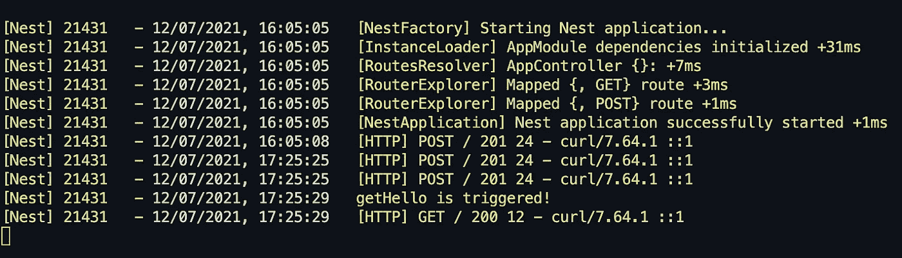

# 如何使用 NestJS 记录器

> 原文：<https://javascript.plainenglish.io/how-to-use-nestjs-logger-2a9cb107bce9?source=collection_archive---------2----------------------->

## NestJS 中记录器的两大用例


Photo by [Markus Spiske](https://unsplash.com/@markusspiske?utm_source=medium&utm_medium=referral) on [Unsplash](https://unsplash.com?utm_source=medium&utm_medium=referral)

在任何严肃的开发体验中，日志记录都是一个非常重要的方面。这在开发阶段至关重要，因为它有助于识别 bug。

但是日志在生产阶段也很重要，尤其是当涉及到 **cron 作业和其他异步任务**时。这是因为您需要关注服务器上发生的事情。如果 cron 工作不正常，您应该第一个知道。

在本教程中，我们将研究如何为您的应用程序实现 NestJS 记录器。

您基本上想在两个级别使用日志: **HTTP 请求级别**和**服务级别**。

让我们开始吧！😄

PS:本教程也有视频形式:)

# 1.安装 NestJS 记录器

NestJS 有一个内置的日志记录器作为一个公共包。所以你不需要安装任何东西。可以对其进行定制，但在这一点上，我们只需按原样导入即可。您可以通过以下方式导入记录器服务:

```
import { Logger } from '@nestjs/common';
```

我们可以使用任何其他日志记录器，如 Morgan 或 Winston，但由于 NestJS 已经有了一个，所以让我们使用它，不要让外部日志记录器(如 Winston 或 morgan)使我们的生活变得复杂。

# 2.在模块中使用 NestJS 日志记录器来记录业务逻辑

记录器最常见的用例是在服务内部。当一些业务逻辑被执行时，或者当一个服务被启动或破坏时，记录值可能是有用的。

在这个例子中，我们实例化 logger 对象，并在 getHello()函数中记录一个字符串。

这非常简单，同样的过程可以用于嵌套控制器或任何支持**依赖注入**的文件。

我发现服务记录器在处理 cronjobs 时特别有用。

# 3.在中间件中使用 NestJS logger 来记录传入的请求

记录器最常见的用例之一是 HTTP 请求记录。您想要查看关于向您的服务器发出的 API 请求的信息。为了记录请求，我们需要将日志逻辑 [**放在中间件**](https://docs.nestjs.com/middleware) 中。

中间件**在防护器之前运行，防护器在拦截器**之前运行。因此，这是一个在请求被拒绝之前记录所有传入请求的绝佳位置。


下面是如何做到这一点:

## 1.创建一个日志中间件

为了记录请求，我们首先要创建一个日志记录中间件。我们这里用快递。如果您使用的是 fastify，您需要检查 fastify 的具体实现。

## 2.将中间件导入 AppModule

一旦创建了日志中间件，就需要将其导入到应用程序的主模块 AppModule 中。

你可以直接在 main.ts 中导入日志作为一个全局模块，但是我不推荐这样做。如果您在 main.ts 中导入它，您将失去在 logger 中间件中使用依赖注入的能力。这总是有用的。

开始了。我们现在可以记录请求。



# 结论

日志记录是一个非常有用的特性，但是使用 NestJS 做好它需要一些技巧。

我已经上传了包含代码的存储库，因此如果有些地方不适合您，您可以查看一下:

[](https://github.com/vladwulf/nestjs-logger-tutorial) [## vladwulf/nestjs-logger-教程

### 一个渐进式 Node.js 框架，用于构建高效且可伸缩的服务器端应用程序。嵌套框架类型脚本…

github.com](https://github.com/vladwulf/nestjs-logger-tutorial) 

如果你喜欢这篇文章，可以考虑加入我的简讯[](https://vladimiragaev.substack.com/embed)****并在 Twitter 上关注我的 [**以获得最新内容。**](https://twitter.com/home)****

# ****你可能想读的其他文章****

****[](https://www.codewithvlad.com/blog/nestjs-caching-with-redis) [## NestJs 缓存与 Redis |代码与 Vlad 博客

### 恭喜你！您已经部署了一个越来越受欢迎的 NestJs 应用程序！很多用户都在使用你的应用程序…

www.codewithvlad.com](https://www.codewithvlad.com/blog/nestjs-caching-with-redis) [](/10-things-every-nest-js-developer-should-know-911dec32f66a) [## 每个 Nest.js 开发者都应该知道的 10 件事

### 如何像坏蛋一样使用 Nest.js

javascript.plainenglish.io](/10-things-every-nest-js-developer-should-know-911dec32f66a) 

*更多内容请看*[***plain English . io***](http://plainenglish.io/)****