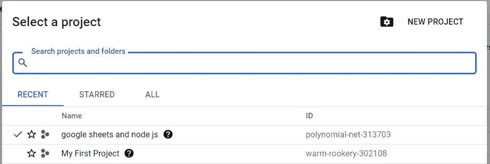

# 如何在 Google Sheets 中使用 Node.js

> 原文：<https://javascript.plainenglish.io/how-to-use-node-js-with-google-sheets-c256c26e10fc?source=collection_archive---------1----------------------->

## 在本教程中，我们将介绍如何使用 Google Sheets API 和 Node.js 在 Google Sheets 中进行基本的数据读写。

注意:我们要让事情变得简单。我们将通过使用 Google Sheets API 和 Node.js 来读写我们的 Google Sheets 中的数据。


Photo by [Arnold Francisca](https://unsplash.com/@clark_fransa?utm_source=medium&utm_medium=referral) on [Unsplash](https://unsplash.com?utm_source=medium&utm_medium=referral)

# 启用 Google Sheets API

1.  登录[谷歌开发者控制台](https://console.developers.google.com/)。
2.  在您的仪表板上，点击位于 Google Cloud Platform 旁边的“我的第一个项目”(名称可以不同)。


image by author

将出现一个弹出框，在右上角单击“新建项目”


image by author

输入您选择的项目名称。

保持“位置”字段不变。

输入名称后，单击“创建”。


image by author

创建项目后，单击“我的第一个项目”,然后选择您刚刚创建的新项目。



image by author

3.选择项目后，单击“启用 API 和服务”。


image by author

4.搜索“Google sheets”并选择它。在 Google sheets 页面上，点击“启用”。


image by author

我已经启用了它，这就是它显示“管理”的原因，您的应该显示“启用”。

启用后，单击“管理”。

5.点击“管理”后，您将被重定向至您的控制面板。

在“APIs & Services”下，单击“Credentials”。


image by author

6.在凭据页面上，单击“创建凭据”，然后单击下拉列表中的“服务帐户”。


image by author

7.输入“服务名称”，它可以是您喜欢的任何名称。输入姓名后，点击“创建”。


image by author

对于“可选”字段，只需单击“继续”。

现在，在您的控制面板上，您将看到刚刚在“服务帐户”下创建的服务帐户


image by author

复制电子邮件地址，我们稍后会用到它。

8.点击电子邮件地址，将出现一个页面，在这个页面上，我们必须点击“键”。


image by author

在“密钥”列下，单击“添加密钥”，然后选择“创建新密钥”。


image by author

选择“创建新密钥”后，会出现一个弹出框。选择“JSON”并单击“创建”。


image by author

您的服务帐户的私钥将被下载到您的机器上。**不要与任何人共享此密钥，因为这会让他们访问您的服务帐户。**

这样，我们启用了我们的 Google Sheets API，创建了一个我们将在项目中使用的私钥。现在我们将深入编码部分。

在进入编码部分之前，我希望大家创建一个包含一些数据的 Google 电子表格。对于本教程，我将使用截图中给出的电子表格。


image by author

点击右上角的“分享按钮”。输入我们在步骤 7 中复制的电子邮件。

该角色应为“编辑”并取消选中“通知人员”选项。然后点击“分享”。


image by author

现在 Google 工作表已经与我们的服务帐户共享，我们可以开始在 NodeJS 项目中使用这个 Google 工作表了。

# 用 Node.js 读取电子表格

1.  在你的机器上创建一个空的目录，它可以在任何地方，你想叫它什么都可以。对于这个项目，我把我的目录叫做‘Google _ sheets _ and _ nodejs’。


image by author

2.在任何你喜欢的文本编辑器中打开这个目录。我正在使用“Visual Studio 代码”。如果你想让事情和我一模一样，你可以在这里下载。

3.粘贴我们在步骤 8 中下载的私钥文件，因为它位于目录的根目录中。将文件重命名为您喜欢的任何名称，我将把它命名为“credentials.json”。


image by author

4.打开“VS 代码”中的集成终端或机器终端。如果您使用计算机的终端，首先导航到工作目录，然后运行命令:

```
npm init -y
```

该命令将初始化目录，并创建一个“package.json”文件，该文件将记录我们所有的依赖项。

5.现在，我们将安装项目所需的依赖项。只有两个，我们想要的，即'快递'，和'谷歌 API '。运行下面的命令来安装它们。

```
npm i express googleapis
```

运行该命令后，我们将获得“package-lock.json”文件和“node_moldules”文件夹。

6.我们还将安装' nodemon '，当我们保存文件时，服务器将自动重启。我们将“nodemon”安装为一个开发依赖项，因为我们只是希望它用于本地开发和测试。

```
npm i nodemon -D
```

在“package.json”文件中，创建一个名为“dev”的脚本，其值为“nodemon server”。这将允许我们使用以下命令再次运行开发服务器:

```
npm run dev
```

完成上述步骤后，您的“package.json”文件应该如下所示:


image by author

页（page 的缩写）s:依赖关系版本可能会有所不同。

7.创建一个“server.js”文件，我们将在其中编写所有代码。要创建该文件，请在终端中运行以下命令:

```
touch server.js
```

8.打开“server.js”文件，调用我们刚刚安装的依赖项。


image by author

初始化 express 并在端口 3000(可以是任何数字)上监听服务器。


image by author

下面的代码允许我们解析传入的 JSON 数据。

```
app.use(express.json())
```

9.我们将创建一个名为“authentication”的函数，因为读取数据(get 请求)和写入数据(post 请求)是很常见的。

“authentication”应该是一个“async”函数，因为我们将在其中使用 promise“async”将允许我们在函数中使用“await”。您也可以使用“then”和“catch”块来处理承诺，但我更喜欢“async await”。你可以在[这里](https://developer.mozilla.org/en-US/docs/Learn/JavaScript/Asynchronous/Async_await)阅读更多关于“异步等待”的内容。


image by author

auth 变量将使用 credentials.json 文件验证我们的凭证。scopes 的属性告诉我们将使用哪个 Google API，并且我们既可以读取数据也可以向工作表中写入数据。

→一旦我们的详细信息在“auth”变量中得到验证，“client”变量将存储来自“ **auth.getClient()** ”方法的客户端(我们的服务帐户)详细信息。

→变量“sheets”将创建 Google Sheets 的一个实例，然后我们将使用该实例从我们的帐户中使用 sheet id 访问特定的 sheet。' google.sheets '有两个属性:I) 'version '的值是' v4 ',因为这是我们正在使用的；II)' auth '的值是我们创建的' client '变量的值。它说获取这个客户的 google sheets 详细信息。

→最后我们会返回一个‘sheets’的对象。

10.现在，我们将创建一个“get”请求来从我们的电子表格中读取数据。


image by author

确保将“get”请求的回调函数设置为“async”。

→我们将等待“认证”功能，因为它包含“await”。


image by author

→然后我们将从函数中析构“sheets”变量。如果你不知道 JavaScript 中的析构是什么，你可以在这里了解更多。

→在“get”请求外创建一个名为“id”的变量。我们将它存储为一个全局变量，因为我们将在“get”和“post”请求中使用它。带红色下划线的文本是电子表格 id:


image by author


image by author

11.现在，我们将读取电子表格中的行。


image by author

→确保将所有代码放在“try catch”块中，因为这样可以轻松处理错误。你可以在这里了解更多关于[的信息。](https://www.w3schools.com/js/js_errors.asp)

→“sheets . spread sheet . value . get”总共有 5 个参数，其中 2 个参数是必需的，即“spreadsheetId”和“range”，这 2 个参数称为路径参数。“spreadsheetId”将具有电子表格的 id,“range”将具有工作表的名称。我们还可以限制工作表的范围，只需用'！'分隔工作表名称并输入列范围。例如:“Sheet1！一个:D。

→其他 3 个可选参数是——I)“major dimension”表示是按行还是按列获取数据，默认为“rows”。II)“valueRenderOption”告诉获取数据，就像它已经被输入到 google sheet 中一样，或者只是作为一个字符串。III) 'dateTimeRenderOption '告诉时间、日期和持续时间应该如何在输出中表示。你可以在这里阅读更多关于他们[的信息。](https://developers.google.com/sheets/api/reference/rest/v4/spreadsheets.values/get)

response 变量将存储我们指定的 google 工作表。最后，我们将从收到的响应中发送“response.data”。我们将使用“Postman”来测试我们的请求。这是一个很棒的工具&不需要前端就可以免费测试请求。如果还没有安装，你可以在这里下载[。](https://www.postman.com/downloads/)

→打开 postman，输入‘http://localhost:3000(您指定的端口号)/’，点击‘发送’。结果会是这样的:


image by author

→“值”数组会因电子表格中的数据不同而有所不同，但格式应该是相同的。

→这样，我们就成功地从电子表格中读取了数据。

# 使用 Node.js 将数据写入电子表格

1.  在文本编辑器中创建新的“发布”请求。


image by author

确保 post 请求的回调函数为“async ”,因为我们将在其中使用“await”。

2.现在，我们将数据写入电子表格。


image by author

→确保将所有代码放在“try catch”块中，因为这样可以更有效地处理错误。你可以在这里了解更多关于‘try catch’模块[的信息。](https://www.w3schools.com/js/js_errors.asp)

→首先，从“req.body”对象中析构“newName”和“newValue”变量。这也将要求用户输入新的名称和值。

→然后从“认证”功能中析构“sheets”变量。请确保将“await”关键字放在“authentication”之前。

→“sheets . spreadsheets . value . append”将数据添加到电子表格中。它主要接受 4 个参数，即:“spreadsheetId”、“range”、“valueInputOption”和“resource”。“spreadsheetId”和“range”在“读取数据”的第 11 点中解释。

另一方面，“资源”是一个带有“值”属性的对象，“值”是一个数组。这个数组保存我们想要插入到电子表格中的新数据。要插入的数据也应该是一个数组。

“valueInputOption”决定了 Google Sheets 如何解释输入数据。“USER _ ENTERED”意味着用户输入的值将被解析，就像用户将它输入到 Google Sheets 中一样。你可以在这里了解更多关于“价值输入选项”对[的选择。](https://developers.google.com/sheets/api/reference/rest/v4/ValueInputOption)

→其他 4 个参数可能对您的应用有用。您可以在“查询参数”标题下的处查看这些参数[。](https://developers.google.com/sheets/api/reference/rest/v4/spreadsheets.values/append)

我们将追加请求的响应存储在一个名为“writeReq”的变量中。

→现在，我们正在检查“writeReq”的状态，如果“writeReq.status”评估为 200，这意味着一切顺利，我们将返回一条消息，说明“电子表格已成功更新”。这条消息可以是任何内容。

“if”块外的“return”语句只有在“writeReq”状态的计算结果不是 200 时才会执行。您可以通过对变量执行' **console.log** '来检查' writeReq '上可用的各种其他选项。

“catch”块将在出现错误时执行，因为我们正在执行“ **console.log(e)** ”，所以调试错误会更容易。

3.现在，打开“Postman”，创建一个新的“POST”请求到“http://localhost:3000(您的端口号)/”。


image by author

→点击‘Body’>‘raw’>‘JSON’。


image by author

→输入如图所示的数据,“新名称”和“新值”键的名称应该相同。您可以根据自己的意愿为这些键输入值(例如:您可以写除 Mark 之外的任何名称&除 75 之外的任何其他“新值”)。

→输入数据后，点击“发送”。单击 send 后，响应应该是这样的。


image by author

→您的 Google 表单现在会更新。


image by author

# 结论

这样，我们成功地读取了数据，并将数据插入到电子表格中。希望这篇文章值得你花时间，如果你还在读这篇文章，非常感谢你抽出时间来读这篇文章！

*更多内容尽在*[*plain English . io*](http://plainenglish.io/)