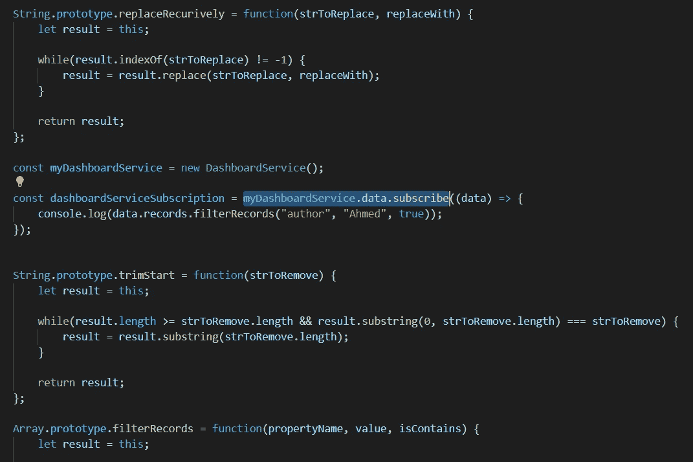

# 如何在普通 JavaScript 中使用 Observables

> 原文：<https://javascript.plainenglish.io/how-to-use-observables-with-vanilla-javascript-aca40a7590ff?source=collection_archive---------2----------------------->

## 提示和技巧

## 没有使用框架，只是纯香草 JavaScript。

当我只是为了好玩而做兼职项目时，我想写一个 JavaScript 脚本来调用 REST API，并最终在网页上做一些很酷的东西。它是纯粹的普通 JavaScript，没有使用花哨的框架甚至库。

首先，我想到用**承诺**打电话，这对我来说很容易。我已经做过无数次了。然而，这给了我很大的打击——为什么我不用 **Observables？**我知道普通的 JavaScript 本身不支持 Observables。但是我不能自己实现吗？我就是这么做的。

 [## 订阅艾哈迈德的时事通讯？

### 订阅艾哈迈德的时事通讯📰直接获得最佳实践、教程、提示、技巧和许多其他很酷的东西…

medium.com](https://medium.com/subscribe/@eng_ahmed.tarek) 

# 这是我思考问题的方式

1.  可观察对象本身是一种新的对象类型，称为 **Subject。**
2.  这个**主题**对象应该公开`subscribe`和`next`函数。
3.  `subscribe`应被观察者调用，订阅可观察的数据流。
4.  `next`应由**主题**所有者调用，以便在任何可用的时候推送/发布新数据。
5.  此外，我希望**主题**的所有者能够知道何时没有观察者对其数据感兴趣。这将使**主题**所有者能够决定他是否仍然想要获取数据。
6.  此外，**主题的所有者应该能够知道至少一个观察者何时开始对其数据感兴趣。这将给予主题所有者对其数据流和任何相关操作的更多控制。**
7.  现在回到**观察者**。他应该可以在任何时候从主题中取消订阅。
8.  这就引出了一个新的对象类型，叫做 **Subscription。**
9.  这个**订阅**对象应该公开一个`unsubscribe`函数。
10.  `unsubscribe`应由**观察者**在他想要停止监听来自**主体**的数据流时调用。

遵循这些规则，我提出了下面的实现。

# 履行

## 签署

注意**订阅**只是在`unsubscribe`函数被调用时通知**主体**。

## 科目

## 在主题所有者的某个地方

## 在观察者的某个地方

就这样，一切都很顺利，我为自己的成就感到骄傲。

所以，妙语是用普通 JavaScript 编码并不总是等于写无聊的代码，你可以让它变得更有趣😃

# 希望这些内容对你有用。如果您想支持:

如果您还不是**中型**会员，您可以使用 [**我的推荐链接**](https://medium.com/@eng_ahmed.tarek/membership) ，这样我就可以从**中型**中获得您的一部分费用，您无需支付任何额外费用。订阅
[**我的简讯**](https://medium.com/subscribe/@eng_ahmed.tarek) 将最佳实践、教程、提示、技巧和许多其他很酷的东西直接发送到您的收件箱。

# 其他资源

这些是你可能会感兴趣的其他资源。

 [## 如何设置 JavaScript 承诺超时

### 只是不要永远等待承诺的实现，你需要设定自己的条件。

javascript.plainenglish.io](/how-to-set-javascript-promise-timeout-7d51c87bc38e)  [## 使用 JavaScript 用户脚本定制网页用户界面/行为

### 即使你不拥有这个网页，你仍然可以附上你的 JavaScript 用户脚本。

javascript.plainenglish.io](/how-to-customize-webpages-ui-behavior-using-javascript-userscripts-7b6a090e0135)  [## 如何在你的 Slack 频道上获得自由职业者的新项目通知

### 这是一个设置用户脚本的问题，我将为您提供。

javascript.plainenglish.io](/how-to-get-freelancers-new-projects-notifications-on-your-slack-channel-69c9c74d3220)  [## 用 Node.js 和 TypeScript 构建一个 Twitter 自动转发机器人

### 了解如何创建一个 Twitter 机器人来转发任何带有特定关键字或标签的推文

better 编程. pub](https://betterprogramming.pub/twitter-auto-retweet-bot-with-node-js-and-typescript-4d6eaf24c0ab)  [## 分页/分区—简化这一过程的主要等式

### 最后，这是您理解分页/分区主要等式并学习如何在代码中应用它们的机会。

levelup.gitconnected.com](https://levelup.gitconnected.com/paging-partitioning-main-equations-to-make-it-easy-44fe89d5290b) 

希望你觉得读这个故事和我写它一样有趣。

*更多内容请看*[***plain English . io***](http://plainenglish.io/)