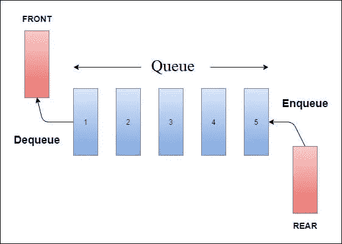

# 如何使用队列

> 原文：<https://javascript.plainenglish.io/how-to-use-queues-33370a0c8f3b?source=collection_archive---------4----------------------->

我发现继续我上一篇关于栈的文章的最好方法是写一篇关于队列的文章。队列和堆栈经常被放在一起谈论，因为它们是相似的，尽管它们的用途和实现是不同的。我将回顾队列的基本概念，就像我的其他文章一样，我将回顾一个 LeetCode 问题来展示它们是如何使用的。LeetCode 问题:[无法吃午餐的学生人数](https://leetcode.com/problems/number-of-students-unable-to-eat-lunch/)。这个问题听起来很严峻，但这是一个展示如何使用队列的好问题。

# 什么是队列？

就像堆栈一样，队列是一种线性抽象数据类型，可以包含一长串元素。然而，队列的结构完全不同。队列是先进先出(FIFO)的数据结构。只能从队列的前面删除元素，并且只能将元素插入到队列的末尾。这是与堆栈的重要区别，堆栈是一种后进先出(LIFO)的数据结构。



Image from [https://www.tutorialandexample.com/wp-content/uploads/2020/05/Queue-in-DS-1.jpg](https://www.tutorialandexample.com/wp-content/uploads/2020/05/Queue-in-DS-1.jpg)

我们可以把它想象成杂货店的结账队伍。顾客排队等候结账。第一个排队的人把他们的食品扫描并打包，付给收银员，然后离开。因此，将队伍向上移动，以便下一个顾客结账。

# 操作

队列和堆栈捆绑在一起的另一个原因是因为它们有相似的功能。我们可以添加或删除一个元素。将一个元素添加到队列末尾的操作是`enqueue()`函数。它的行为很像`push()`方法。从队列前面删除一个元素的操作是`dequeue()`函数。其作用很像`shift()`方法。

# 大 O

插入和删除元素的时间复杂度为 O(1)时间，常数时间。

搜索和访问一个元素需要 O(n)时间，线性时间。

# 履行

与堆栈非常相似，队列可以通过使用链表或数组来实现。最后提供的参考资料详细介绍了如何在数组和链表中编写队列。在我讨论的 LeetCode 问题中，我们使用数组实现。

# **无法吃午餐的学生人数**

**说明:**

学校食堂在午休时间提供圆形和方形三明治，分别用数字 0 和 1 表示。所有学生站成一排。每个学生要么喜欢方形三明治，要么喜欢圆形三明治。

自助餐厅里三明治的数量等于学生的数量。三明治被放在一个**堆里**。在每一步:

*   如果排在队伍前面的学生**喜欢**最上面的三明治，他们就会**拿着它**离开队伍。
*   否则，他们将**离开它**并转到队列的末尾。

这种情况一直持续到没有一个排队的学生想拿最上面的三明治，从而无法进食。返回无法吃饭的学生人数。

**示例:**

```
Input: students = [1,1,0,0], sandwiches = [0,1,0,1]Output: 0
```

我们看到索引为 0 的学生不想要第一个三明治，所以我们想把这个学生移走，让他们排到队伍的末尾。学生:`[1,1,0,0] -> [1,0,0,1]`。我们再次检查，发现索引为 0 的学生也不想要第一个三明治。我们把它们移除，然后再放到最后。学生:`[1,0,0,1] -> [0,0,1,1]`。我们现在有了三明治和学生的匹配。我们从他们的数组中移除三明治和学生。

学生= `[0,1,1]`，三明治= `[1,0,1]`

我们可以看到模式。如果学生和三明治的号码匹配，我们就把它们都删除。如果他们不匹配，我们就把学生移走，把他们排到队伍的末尾。我们想这样做，直到没有学生了，或者没有学生喜欢的三明治了。我们可以通过使用 while 循环来检查 students 数组的长度，并使用布尔检查来查看 students 数组和 sandwich 数组的第一个索引是否匹配。

按照这种模式，每个学生都有一个匹配，我们返回输出 0。

这是我用 JavaScript 写的解决方案。我希望这个演练是有帮助的！

关于队列的更多资源，我建议看看这些有用的链接。

[https://medium . com/basecs/to-queue-or-not-to-queue-2653 bcde 5b 04](https://medium.com/basecs/to-queue-or-not-to-queue-2653bcde5b04)

[https://medium.com/swlh/stacks-and-queues-f281aa5462cf](https://medium.com/swlh/stacks-and-queues-f281aa5462cf)

***链接 LeetCode 问题:***[https://leet code . com/problems/number-of-students-unable-to-eat-lunch/](https://leetcode.com/problems/number-of-students-unable-to-eat-lunch/)

**我的 stacks 文章:**[https://medium . com/JavaScript-in-plain-English/stack-of-pancakes-solving-remove-all-adjacent-duplicates-in-string-c3ace 240 F4 f 7](https://medium.com/javascript-in-plain-english/stack-of-pancakes-solving-remove-all-adjacent-duplicates-in-string-c3ace240f4f7)