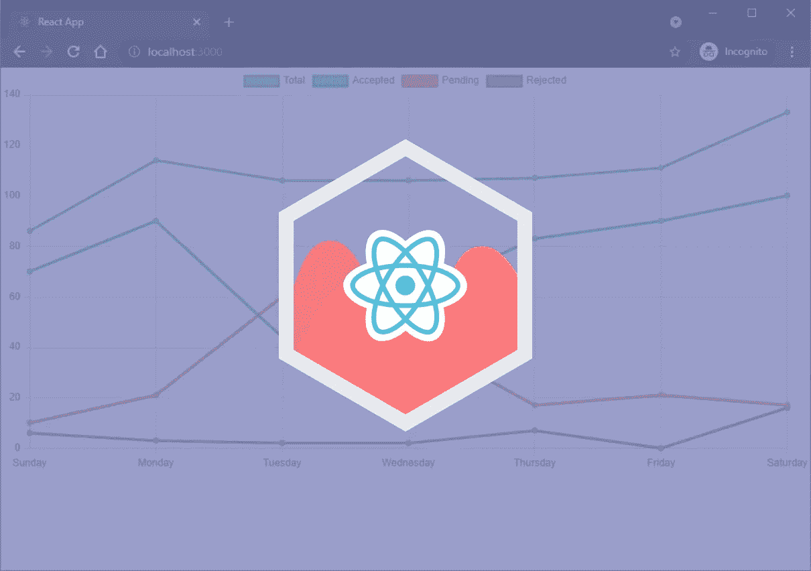
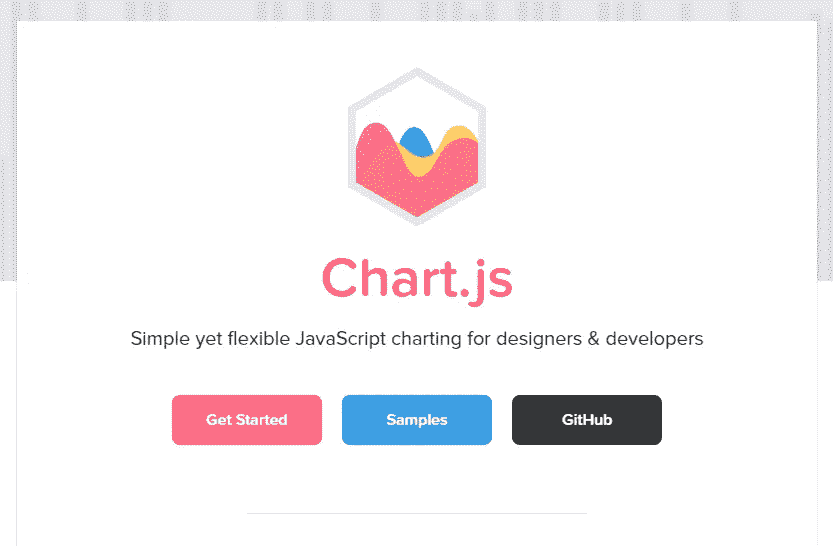
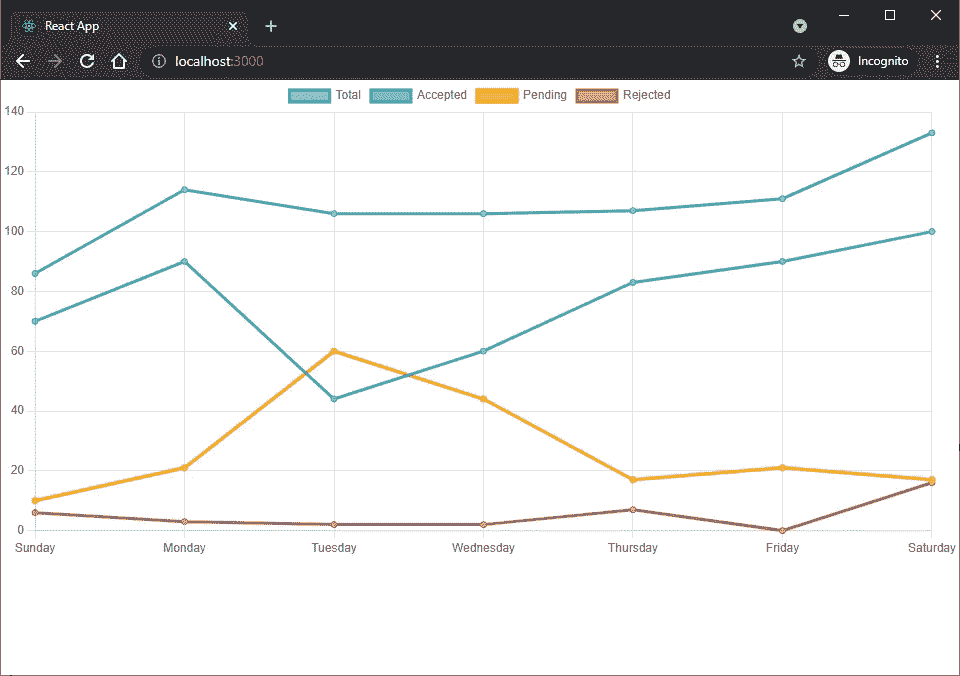

# 如何使用 React 和 Chart.js

> 原文：<https://javascript.plainenglish.io/how-to-use-react-and-chart-js-87015d4a98f3?source=collection_archive---------7----------------------->



使用 Chart.js 向任何 React 项目添加图表和图形。

# **React Chart.js 包**

有像 react-chartjs-2 这样的包将 Chart.js 与 react 集成在一起。

尽管可以随意使用这些包，但是在本教程中，我们将集成 Chart.js 并自己维护更高级别的 Chart.js 定制。

# **什么是 React？**


React 是一个由脸书开发和维护的 JavaScript 库。开源，React 用于构建可重用的 UI 组件和用户界面。

**创建一个 React 应用**

*Windows 命令提示符*

```
C:\Users\Owner\desktop\react> npx create-react-app react-chartjs
```

首先，创建一个 React 应用。使用官方`create-react-app`项目入门，命名 app `react-chartjs`。

如果您是新手，请在继续之前参考[初学者指南](https://www.ordinarycoders.com/blog/article/reactjs-beginners-tutorial)。使用 React 需要安装一些必要的软件包。

**启动 React app**

*Windows 命令提示符*

```
C:\Users\Owner\desktop\react> cd react-chartjs
C:\Users\Owner\desktop\react\react-chartjs> npm start
```

一旦安装过程完成，`cd`或进入新创建的项目目录`react-chartjs`。

然后运行命令`npm start`来运行在包的脚本对象中指定的预定义命令。

如果你很好奇，这个脚本位于*react-chart js>package . JSON*中，并在被调用时运行命令`react-scripts start`。

```
...
  "scripts": {
    "start": "react-scripts start",
    "build": "react-scripts build",
    "test": "react-scripts test",
    "eject": "react-scripts eject"
  },...
```

**终止 React 应用的批处理作业**

*Windows 命令提示符*

```
Terminate batch job (Y/N)? yC:\Users\Owner\Desktop\react\react-chartjs>
```

`Ctrl + C`并键入`y`以终止作业并让命令提示符重新出现。

# **什么是 Chart.js？**



Chart.js 是一个使用`canvas`元素来呈现动画、响应图表的包。Chart.js 有九种不同类型的图表，每种都可以自定义。

**安装 Chart.js**

*Windows 命令提示符*

```
C:\Users\Owner\Desktop\react\react-chartjs>npm install chart.js
```

安装 Chart.js。

# **如何使用 Chart.js 和 React**

安装完成后，是时候配置项目了。

**创建折线图类组件**

*react-chart js>class = " lazy " data-src>(新文件夹)组件>(新文件)LineChart.js*

```
import React, { Component } from 'react';
import Chart from 'chart.js/auto';export default class LineChart extends Component { }
```

在文本编辑器中打开项目目录。然后新建一个名为*组件*的文件夹。

接下来，创建一个名为 *LineChart.js* 的新文件。

导入`React`和`Component`，然后导入`import Chart form 'chart.js/auto'`。

这是从 Chart.js 导入和注册所有控制器、元素、标尺和插件的一行解决方案。

现在创建一个名为`LineChart`的新组件。

让我们在同一行中导出和定义组件。

**向折线图类组件添加图表**

*react-chart js>class = " lazy " data-src>components>line chart . js*

```
import React, { Component } from 'react';
import Chart from 'chart.js/auto';export default class LineChart extends Component { chartRef = React.createRef(); componentDidMount() {
		const ctx = this.chartRef.current.getContext("2d"); new Chart(ctx, {

			},
		});
	}
	render() {
		return (
			<div>
				<canvas
				id="myChart"
				ref={this.chartRef}
				/>
			</div>
			)
	}
}
```

继续，创建一个名为`chartRef`的新变量，并将其设置为等于`React.createRef()`。

`React.createRef()`用于将元素的当前状态设置为从`ComponentDidMount()`接收的实例，方法是允许访问 render 方法中创建的元素，在本例中是`canvas`元素。

在这种情况下，添加`ComponentDidMount()`并在方法中创建一个新图表。

然后添加`render()`并返回一个嵌套在 division 元素中的`canvas`元素。

为`<canvas />`提供一个 id，并通过`ref`属性将`React.createRef()`附加到该元素。

**向图表线类组件添加数据**

*react-chart js>class = " lazy " data-src>components>line chart . js*

```
import React, { Component } from 'react';
import Chart from 'chart.js/auto';export default class LineChart extends Component { chartRef = React.createRef(); componentDidMount() {
		const ctx = this.chartRef.current.getContext("2d");

		new Chart(ctx, {
			type: "line",
			data: {
				labels: ["Sunday", "Monday", "Tuesday", "Wednesday", "Thursday", "Friday", "Saturday"],
				datasets: [{ 
					data: [86,114,106,106,107,111,133],
					label: "Total",
					borderColor: "#3e95cd",
					backgroundColor: "#7bb6dd",
					fill: false,
				}, { 
					data: [70,90,44,60,83,90,100],
					label: "Accepted",
					borderColor: "#3cba9f",
					backgroundColor: "#71d1bd",
					fill: false,
				}, { 
					data: [10,21,60,44,17,21,17],
					label: "Pending",
					borderColor: "#ffa500",
					backgroundColor:"#ffc04d",
					fill: false,
				}, { 
					data: [6,3,2,2,7,0,16],
					label: "Rejected",
					borderColor: "#c45850",
					backgroundColor:"#d78f89",
					fill: false,
				}
				]
			},
		});
	}
	render() {
		return (
			<div>
				<canvas
				id="myChart"
				ref={this.chartRef}
				/>
			</div>
			)
	}
}
```

初始文件设置完成后，我们可以添加图表的类型和数据。

参考[如何使用 Chart.js](https://www.ordinarycoders.com/blog/article/11-chart-js-examples) 获取不同类型图表和可用定制选项的示例。

上面的 React 和 Chart.js 示例是一个折线图。

请随意通过 props 传递您自己的数据，而不是使用上面的硬编码值。

**更新 App.js**

*react-chart js>class = " lazy " data-src>app . js*

```
import LineChart from "./components/LineChart.js";export default function App() {
    return (
      <div>
        <LineChart />
      </div>
    );   
}
```

所需的最后一点配置在 *App.js* 中完成。

从*组件> LineChart.js* 文件中导入组件`LineChart`。

然后在一行中导出并声明`App`功能组件。

返回`<LineChart />`。

保存文件。

**浏览器中 React Chart.js 示例**

*浏览器窗口*



当然，最后一步是在浏览器窗口中看到它的呈现。

*最初发表于*[*【https://ordinarycoders.com】*](https://www.ordinarycoders.com/blog/article/react-chartjs)*。*

当然，最后一步是在浏览器窗口中看到它的呈现。

*更多内容请看*[*plain English . io*](http://plainenglish.io/)