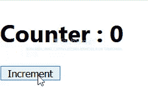

# 如何将 React 上下文与 Hooks & TypeScript 一起使用

> 原文：<https://javascript.plainenglish.io/how-to-use-react-context-with-hooks-typescript-a21b1460feb6?source=collection_archive---------3----------------------->

## 简单明了

Photo by [mohammadtkh](https://unsplash.com/@mohammadtkh) on [Unsplash](https://unsplash.com/s/photos/context)

虽然我并不总是使用 React 上下文，但在一些用例中，它可能是一个很好的工具。最近，我不得不在一个带有钩子的 TypeScript 项目中使用它们，为此挣扎了一下。

# 计数器上下文

我将演示如何用一个`Counter`组件以一种简洁明了的方式编写一个 React 上下文。该组件的工作方式如下:

从 [React 文档](https://fr.reactjs.org/docs/context.html)中，我们首先需要使用`createContext`来定义一个上下文(带有默认值)。当我们使用 TypeScript 时，我们还需要定义它的形状。

让我们创建一个`CounterContext.tsx`文件:

一旦定义完毕，我们就可以创建一个`CounterContextProvider`，它将负责:

*   存储计数器状态。
*   处理增量操作。

让我们编写并导出它:

现在我们可以创建一个带有`Counter`组件的`Counter.tsx`文件，并在我们的应用程序中添加`Counter`和`CounterContextProvider`。

对于反应堆:

然后我们可以用最简单的方法用 [useContext](https://fr.reactjs.org/docs/hooks-reference.html#usecontext) 实现我们的`Counter`组件:

## 结论

我们做到了！希望您现在知道如何更好地使用 React 上下文。感谢阅读！

 [## 关于我——泰迪·莫林

### 嗨，我是泰迪，一个反应的爱人🚀。

morintd.medium.com](https://morintd.medium.com/about-me-teddy-morin-9fb1d65fe24e) 

*   **【1】上下文—反应:**[https://fr.reactjs.org/docs/context.html](https://fr.reactjs.org/docs/context.html)
*   **【2】钩子 API 引用—React(use context):**[https://reactjs.org/docs/hooks-reference.html#usecontext](https://reactjs.org/docs/hooks-reference.html#usecontext)