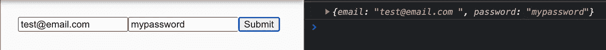
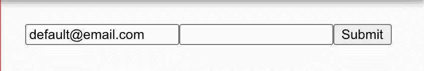
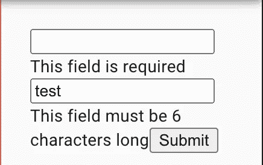
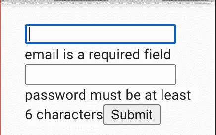

# 如何在 TypeScript 中使用 React Hook 表单

> 原文：<https://javascript.plainenglish.io/how-to-use-react-hook-form-with-typescript-2cf597c0c45f?source=collection_archive---------3----------------------->

## 为您的 Web 应用程序构建高性能、简洁的表单


Photo by [Jessica Lewis](https://www.pexels.com/@thepaintedsquare?utm_content=attributionCopyText&utm_medium=referral&utm_source=pexels) from [Pexels](https://www.pexels.com/photo/ball-point-pen-on-opened-notebook-606541/?utm_content=attributionCopyText&utm_medium=referral&utm_source=pexels)

处理表单输入对于任何现代 web 应用程序来说都是绝对必要的。React 也不例外。我们可以用多种方式处理表单。但是确保可重用性和性能对于表单尤其重要。

因为表单是一些最动态的组件，如果处理不当，用户会感觉到使用缓慢的应用程序的痛苦。

今天，我们将看看一个名为`[react-hook-form](https://react-hook-form.com/)`的令人敬畏的库，它使我们能够创建干净和高性能的表单组件。

# 但是其他的解决方案呢？

好问题。还有其他像`Formik`和`Redux Form`这样的图书馆以不同的方式做着几乎相同的事情。但是，React 钩子形式在几个方面更好。

*   较少样板文件
*   与其他产品相比，渲染较少
*   更好地支持模式验证。

# 我们要建造什么？

今天，我们将构建一个简单的身份验证表单，用户可以

*   给`Email`和`Password`作为输入
*   将有`validation`用于过滤数据。

我们将从简单开始，看看我们如何一步一步地前进。

## 第一步。安装依赖项

让我们首先安装依赖项

```
yarn add react-hook-form
```

## 第二步。导入挂钩

从库中导入`useForm`钩子。这个钩子为我们的表单导出所有必要的控件。

```
import { useForm } from "react-hook-form";
```

## 第三步。为数据定义接口

当我们使用类型脚本时，我们应该利用类型系统。最好的部分是，如果您有任何打字错误，它会在编译时捕获错误。

type.ts

## 第四步。构建表单

下面是我们表单的完整代码。这里我们从钩子中提取两个控件。

`register` - >这是将我们的表单输入绑定到库中所必需的。

`handleSubmit` - >这是标准的提交功能。

这里需要注意的一点是，我们在 onSubmit 函数中以对象的形式获取值。像下面这样:



after the submit is clicked

## 第五步。添加默认值

有时我们想在表单字段中添加默认值。在这些场景中，您可以像下面这样添加`defaultValue`属性

```
<input *defaultValue*='default@email.com' {...register('email')} />
```

现在，您的表单将如下所示:



Default email

## 第六步。确认

一位著名的哲学家曾经说过:*“没有验证的形式是什么？”*

现在我们来看看如何在表单中添加验证。有几个现成的验证可供我们使用

*   `required`(强制填写字段)
*   `min`(用于数字)
*   `max`(用于数字)
*   `minLength`(为字段的长度)
*   `maxLength`(用于字段的长度)
*   `pattern`(用于有效密码/电子邮件等模式匹配)

你可以在这里阅读更多关于他们的信息

现在，我们将确保我们的用户只需输入他们的电子邮件，密码必须是 6 个字符长。

form.ts

好了，我们已经将该字段设置为必填字段，但是如何捕捉错误呢？为此，我们需要从钩子内部导入`errors`

```
const {register,handleSubmit,*formState*: {errors}} =useForm<*Inputs*()
```

最后，我们的表单看起来像这样

form-with-validation.ts

现在，当你试图提交没有填写电子邮件的错误就会出现。



validation

## 第七步:让我们做更多的清理工作

我个人不喜欢将验证逻辑传递到输入本身。此外，我们得到的默认控制并不广泛。

在这种情况下，我们可以使用某种**模式验证**库，比如真正流行的`Yup`。

要使用它，我们首先需要安装依赖项

```
yarn add @hookform/resolvers yup
```

然后构建模式验证器。

并将模式传递给`useForm`钩子

resolver.ts

现在我们的表单将比以前干净得多:

所以现在我们的表单和错误处理都变得更干净了。做着和以前一样的工作。



validation

## 结论

这就是了。我们已经看到了如何使用`react-hook-form`库来编写干净和高性能的表单组件，而没有样板文件的麻烦。祝您愉快！

**有话要说？通过**[**LinkedIn**](https://www.linkedin.com/in/56faisal/)联系我