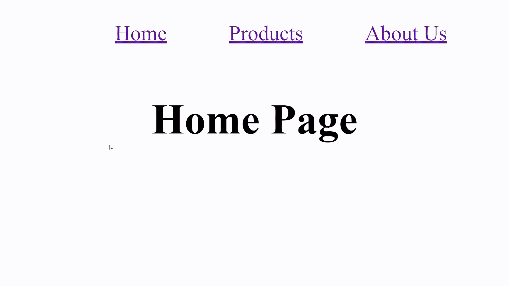
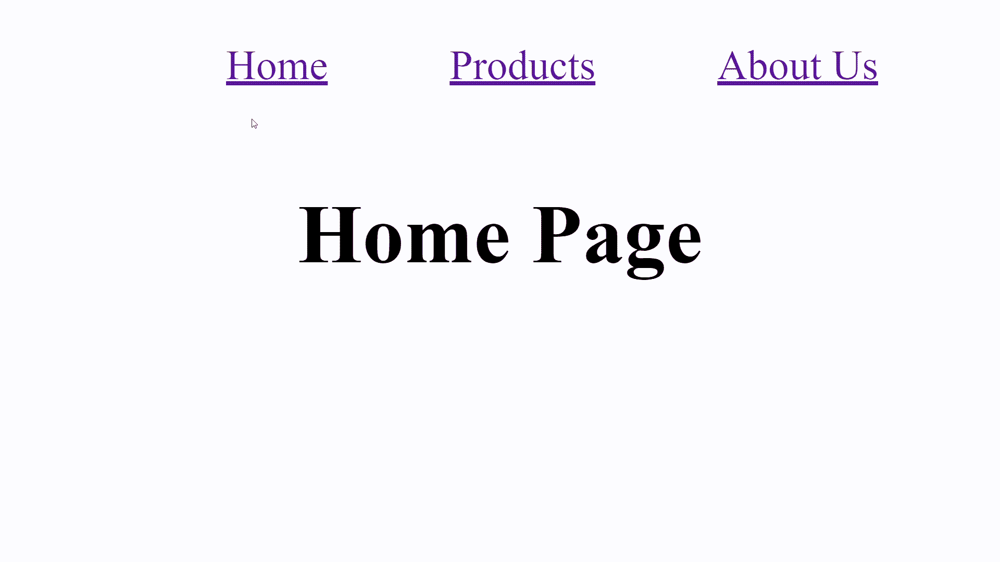
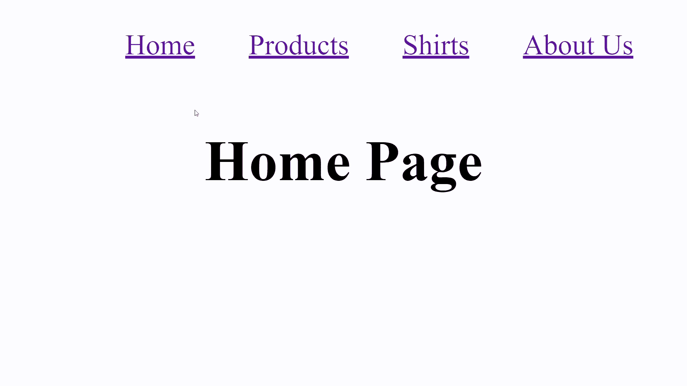
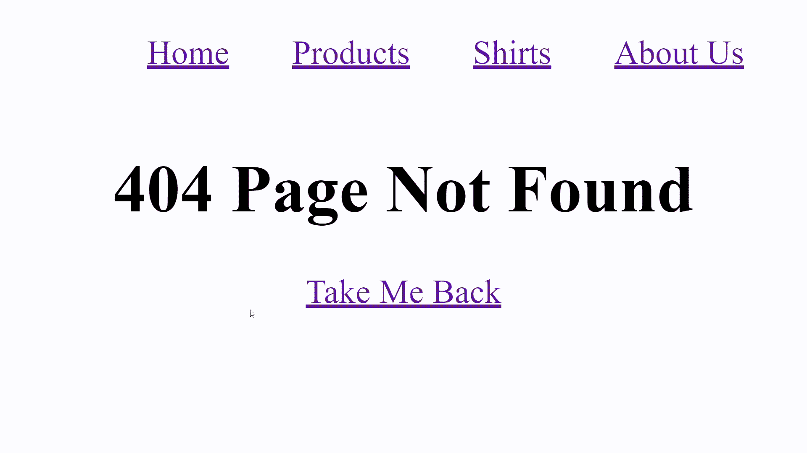

# 如何像专业人士一样使用 React 路由器

> 原文：<https://javascript.plainenglish.io/how-to-use-react-router-like-a-pro-6b32e2e7e9c6?source=collection_archive---------15----------------------->

## 了解如何使用 React Router 将您的 web 应用程序转变为 SPA。

Photo by [delfi de la Rua](https://unsplash.com/@delfidelarua7?utm_source=unsplash&utm_medium=referral&utm_content=creditCopyText) on [Unsplash](https://unsplash.com/s/photos/map?utm_source=unsplash&utm_medium=referral&utm_content=creditCopyText)

如果您刚刚开始使用 React，那么您可以做的最好的事情之一就是学习如何使用 React 路由器。React Router 允许我们将一个基本的 React web 应用程序变成更加用户友好的东西。这个概念一开始可能很难理解，但是我在这里解释如何在您的应用程序中实现 React Router。

事不宜迟，我们开始吧！

# 什么是 React 路由器？

React Router 简化了我们在应用程序中不同组件之间导航的方式。它由基于当前 URL 路径动态呈现的导航组件组成。它将我们的基本 React web 应用程序转换成一个 [**SPA**](https://en.wikipedia.org/wiki/Single-page_application) (单页应用程序)。

你会发现今天你遇到的大多数现代 web 应用程序都是 SPAs。 [Twitter](https://twitter.com/) 、[脸书](https://www.facebook.com/)和 [Gmail](https://www.google.com/gmail/about/#) 是现代水疗的绝佳范例，你可能在生活中的某个时刻使用过。这些应用程序消除了每次我们需要更新或修改现有 HTML 内容时启动页面刷新的需要。

反过来，这提供了一个流畅且响应迅速的用户体验。我知道您可能急于了解 React 路由器是如何工作的，所以让我们直接进入代码吧！

# React 路由器基础知识

为了真正理解如何在我们的应用程序中实现 React Router，我们必须先回顾一下基础知识。为此，我们需要用`npx create-react-app my-web-app`设置一个新的 React web 应用程序。接下来，我们要确保用`npm i react-router-dom`安装 React 路由器库。

然后，我们想用下面的代码替换我们的`App.js`文件:

我们还必须确保创建其他组件，`Home`、`Products`和`About`。这些将作为我们在应用程序中导航到的单独页面或路径。

此时，您可以随心所欲地设计您的 web 应用程序。我已经对下面显示的`index.css`文件做了一些样式上的修改。

完成后，我们可以用`npm start`运行我们的应用程序。如果你已经设法正确地遵循了一切，你的应用程序应该显示如下:

React Router demo

请注意，每当我们选择顶部的一个链接时，我们的文档就会显示该页面的内容。您可能还注意到，每当我们分别选择这些导航链接时，我们在 URL 栏中的路径都会发生变化。

这样，我们就可以呈现新的页面内容，而不必启动刷新。让我们更深入地探究使这成为可能的方法。

# React 路由器如何工作

让我们从上面开始分解我们的`App.js`文件的主体。

在 React 路由器中，有四个主要组件我们应该熟悉:`BrowserRouter`、`Switch`、`Link`和`Route`。

*   **浏览器**——我们用它来包装我们的整体导航。这使得我们的内容与 URL 保持同步。
*   **开关—** 用于将`Route`与当前 URL 路径匹配。在我们的示例中，默认情况下，这会呈现我们的`Home`组件。这与 JavaScript 中的`switch()`方法的工作方式相同。
*   **路由** —这是 React 路由器最重要的组件。我们用它来呈现与当前路径匹配的组件内容(即`/`渲染`Home`，`/products`渲染`Products`。
*   **Link** —这个组件的行为就像 HTML 中的`<a>`标签，但是它告诉 React 当我们的导航链接被点击时应该去哪个路径。

现在您可能想知道`Switch`组件中的路线顺序是否重要，答案是肯定的。

让我告诉你我的意思。

# 秩序至关重要

如果我们改变组件呈现的顺序(如上所示)，你会发现我们遇到了一个小问题。

React Router ordering

请注意，每当我们选择任何导航链接时，呈现的内容都保持不变。这是为什么呢？

`Switch`渲染第一个与当前路径松散匹配的`Route`。这意味着我们主页的路径将匹配任何以`/`开头的路径。当我们导航到`/products`时，`Switch`从上到下检查**以找到匹配的路径。由于`/products`是以`/`开头的，而且家乡路由是第一位的，所以 React 路由器会渲染首页。**

这种在其他人之前知道哪些路线的方式可能会有点混乱。幸运的是，React 路由器有一种方法可以缓解这种头痛。

# 路径与精确路径

假设我们想在产品路线中添加一个名为`shirts`的子路线。为此，我们需要在我们的`App.js`文件中添加一个额外的`Route`和`Link`，如下所示:

React Router path vs. exact path

在重新编译并再次运行我们的应用程序后，您会注意到一切都正常，除了一件事…

React Router sub-routes

当我们单击衬衫页面时，它会呈现产品页面的内容。这个问题很像我们之前提到的那个问题。当我们把衬衫路线放在产品路线之前，这就解决了我们的问题。虽然这解决了这个问题，但是这种实现的缺点是，每当我们想要向`Products`添加一个子路由时，我们必须确保我们的路由每次都处于正确的顺序。

最好的方法是像这样在我们的父路由上使用`exact`属性。

React Router exact path

当我们再次运行我们的示例时，我们看到选择衬衫链接呈现了正确的内容。

如果我们想添加一个裤子页面，我们所要做的就是添加新的`Route`和`Link`组件，剩下的由`Switch`负责。如果您需要向父路由添加子路由，最好更新父路由以使用精确的路径。

如果我们试图导航到一条不存在的路径会发生什么？现在我们还没有为这个条件设置任何东西，所以让我们现在就做。

# 添加 404 页面

Photo by [Erik Mclean](https://unsplash.com/@introspectivedsgn?utm_source=unsplash&utm_medium=referral&utm_content=creditCopyText) on [Unsplash](https://unsplash.com/s/photos/404?utm_source=unsplash&utm_medium=referral&utm_content=creditCopyText)

啊，可怕的 404 页！尽管这可能是用户最不喜欢的页面，但当必须导航回站点的主要内容时，它会派上用场。它的好处是很容易安装。

首先，我们需要创建一个名为`NotFound.js`的新文件。让我们用以下内容替换该文件:

React Router 404 page

接下来，让我们将`NotFound`组件添加到`App.js`文件中`Switch`组件的底部，如下所示。

我们还应该注意到，home route 应该用一个确切的路径来更改，否则如果路径不可用，React Router 将呈现我们的主页内容。

React Router 404 page demo

如果我们重新运行我们的应用程序并尝试导航到路径`/products/pants`，您会注意到我们的`NotFound`组件正如预期的那样被呈现。在我们的 404 页面中添加一个`Link`组件有助于将用户重定向回主页。

这就是全部了。我觉得很简单。

# 最后的想法

我们刚刚看到了如何使用 React 路由器将我们的基本 React web 应用程序转变为现代 SPA。我们讨论了基本的 React 路由器实现，理解了路径和精确路径之间的区别，甚至添加了我们自己的 404 页面。

React 路由器是实现流畅、响应迅速的用户体验的首选解决方案。现在您已经知道如何使用它，我鼓励您在未来的应用中使用它。

如果你想了解更多关于 React 路由器的信息，你可以阅读文档[这里](https://reactrouter.com/web/guides/quick-start)。

感谢您的阅读，下一期再见。

*更多内容尽在*[***plain English . io***](http://plainenglish.io/)