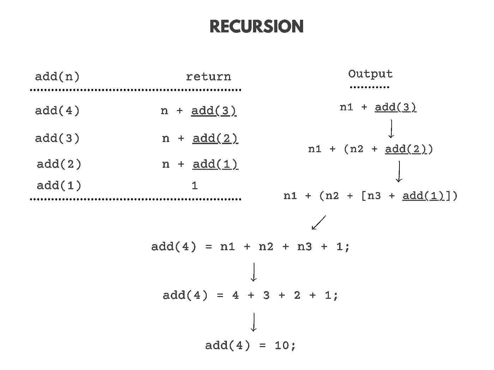
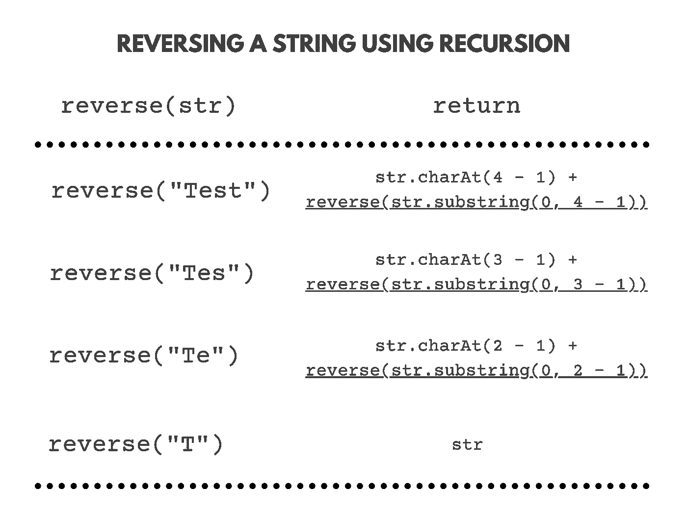
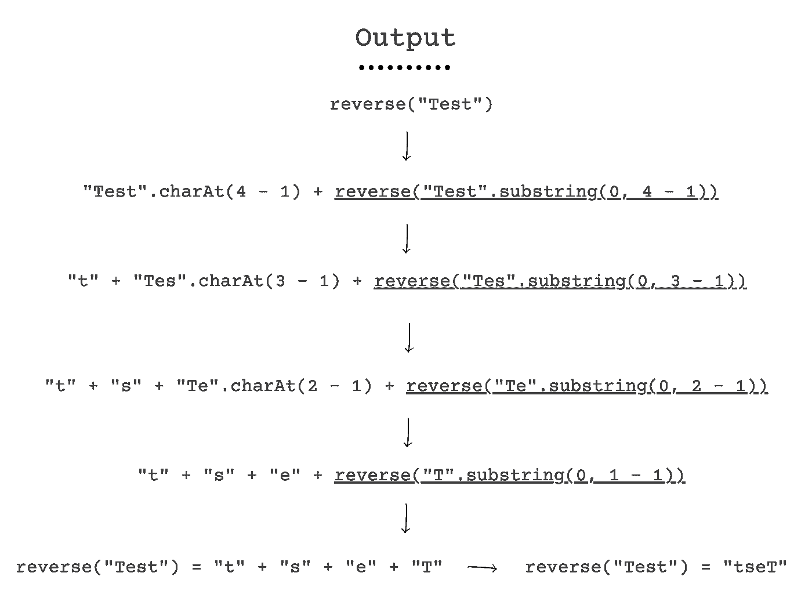
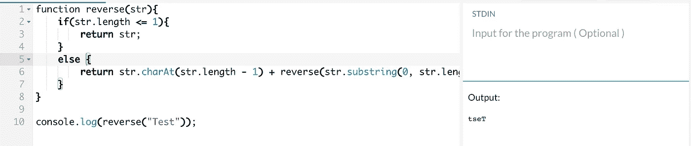

# 如何在 JavaScript 中使用递归来反转字符串

> 原文：<https://javascript.plainenglish.io/how-to-use-recursion-to-reverse-a-string-in-javascript-875c1082ab0d?source=collection_archive---------1----------------------->


Photo by [Tine Ivanič](https://unsplash.com/@tine999?utm_source=unsplash&utm_medium=referral&utm_content=creditCopyText) on [Unsplash](https://unsplash.com/s/photos/loop?utm_source=unsplash&utm_medium=referral&utm_content=creditCopyText)

在本文中，我们将学习如何在 JavaScript 中使用递归来反转字符串。首先，我们需要理解递归，以及它在字符串反转中的作用。

> 注意:如果你已经知道递归，你可以跳过文章的“什么是递归”部分，阅读“反转字符串概述”部分。

# **什么是递归？**

递归是指一个方法调用自己，直到满足终止条件。让我们用一个例子来理解它。

## 例子

我们有一个函数:`add(n)`。该功能将把从`n`开始的所有数字加到 1。如果`n`是 4，那么`add`函数返回的结果将是 4 + 3 + 2 + 1 = 10。

```
function add(n){
    if(n == 1){ 
        return 1; 
    } 
    else { 
        return n + add(n - 1) //the function calls itself.
     } 
}
```

上述函数在调用自身时使用递归。

## 上述功能的解释

起初，`add()`功能可能会令人困惑。因此，为了更好地理解它，让我们创建一个跟踪表来显示函数调用:`add(4)`



A trace table of the recursive function call: add(4);

第一次执行该功能时，`n`为 4。`if`语句为假，因此函数返回`n + add(n - 1)`，即`4 + add(3)`。接下来，函数`add(3)`被调用，并且`n`现在变成 3。`if`语句为假，因此，函数返回`n + add(n - 1)`，即`3 + add(2)`。我们可以把 ***先返回*** 语句形象化为:`4 + (3 + add(2))`。接下来，调用函数`add(2)`，现在`n`变为 2。`if`语句为假，因此函数返回`n + add(n - 1)`，即`2 + add(1)`。我们可以把 ***先返回*** 语句形象化为:`4 + (3 + [2 + add(1)])`。再次调用函数`add(1)`，现在`n`变为 1。`if`语句为真，因此函数返回`1`。我们可以把 ***先返回*** 语句形象化为:`4 + (3 + [2 + 1])`。 ***首先返回*** 语句的答案是`4 + 3 + 2 + 1 = 10`，因此`10`是由原函数调用返回的:`add(4)`

# 反转字符串

反转的字符串是其反转形式的字符串。比如我们有一个字符串，“reverse”。这个字符串的反过来应该是:“esrever”。有一些字符串，反过来看，和原来的字符串是一样的。比如那串，“lol”。它的反过来也是:“lol”！

因此，我们将使用 JavaScript 中的递归来反转字符串。让我们想象一下，我们将如何反转绳子。

首先，我们将创建一个名为`reverse()`的函数

```
function reverse() {}
```

功能`reverse()`将用于反转字符串。我们将向函数传递一个参数，以接收字符串。

```
function reverse(str) {}
```

为了反转字符串，我们需要将字符串的最后一个字符*设为第一个字符*。因此，我们可以使用`length`属性和`charAt()`函数来检索*的最后一个字符*。**

```
*return str.charAt(str.length - 1);*
```

*上面的代码也可以用来检索倒数第二个值！这是怎么发生的？我们可以子串字符串的最后一个字符；因此，倒数第二个值成为最后一个值。*

*例如:“测试”:`“Test”.substring(0, “Test”.length)` = `“Tes”`*

```
*str.charAt((str.substring(0, str.length - 1).length) - 1);*
```

*上面的代码给出了倒数第二个字符的位置。因此，return 语句变成:*

```
*return str.charAt(str.length - 1) + str.charAt((str.substring(0, str.length - 1).length) - 1);*
```

*因此，`reverse()`的功能代码是:*

```
*function reverse(str) { 
        return str.charAt(str.length - 1) + str.charAt((str.substring(0, str.length - 1).length) - 1);
}*
```

*如果我们执行`reverse(“Test”)`，我们会得到值:`ts`。这是不正确的，因为我们想要的是“Test”的反义词，即“tseT”。那么，缺少什么呢？*

*我们使用递归了吗？不要！缺少递归。因此，代码不会多次执行以返回反转的字符串。*

*应该加什么条件才能使函数递归？如果我们仔细观察，我们会发现字符串的长度发生了变化(substring 删除了最后一个字符，因此长度变化了 1)。因此，我们可以使用字符串的长度来终止递归函数。*

```
*if(str.length <= 1){
     return str;
}else { 
     return str.charAt(str.length - 1) + str.charAt((str.substring(0, str.length - 1).length) - 1); 
}*
```

*现在可以将上述代码添加到函数`reverse()`中*

```
*function reverse(str){
     if(str.length <= 1){
          return str;
     } else { 
          return str.charAt(str.length - 1) + str.charAt((str.substring(0, str.length - 1).length) - 1); 
     }
}*
```

*如果我们执行`reverse(“Test”)`，我们得到的值:`ts`。这是不正确的，因为我们想要的是“Test”的反义词，即“tseT”。那么，缺少什么呢？*

*再次…递归在哪里？我们刚刚添加了终止条件，但是我们又在哪里调用了`reverse()`函数呢？*

*让我们在 return 语句中添加`reverse()`函数。逻辑上，reverse 函数返回最后两个字符。我们可以像这样在 return 语句中再次调用 reverse 函数:*

```
*function reverse(str){
    if(str.length <= 1){
        return str;
    }
    else {
        return str.charAt(str.length - 1) + reverse(str.substring(0, str.length - 1));
    }
}*
```

*return 语句:`return str.charAt(str.length — 1) + reverse(str.substring(0, str.length — 1));`返回最后一个字符，用新字符串再次调用 reverse 函数。新字符串是通过`substring`功能删除了最后一个字符的字符串。现在，让我们通过一个例子来可视化这个递归调用。*

# *可视化反向函数*

*我们举个例子。我们用字符串“Test”调用函数`reverse()`。*

****

*A trace table of the recursive function call: reverse(“Test”);*

*第一次执行该功能时，`str`为`"Test"`。`if`语句为假，因此函数返回`str.charAt(str.length — 1) + reverse(str.substring(0, str.length — 1));`，即`"t" + reverse("Tes")`。接下来，调用函数`reverse("Tes")`并且`str`现在变成`“Tes”`。if 语句为假，因此函数返回`"s" + reverse("Te")`。*

*我们可以把 ***先返回*** 语句形象化为:`"t" + ("s" + reverse("Te"))`。接下来，调用函数`reverse("Te")`，此时`str`变为`“Te”`。if 语句为假，因此函数返回`"e" + reverse("T")`。我们可以把 ***先返回*** 语句形象化为:`"t" + ("s" + ["e" + reverse("T")])`。*

*再次调用函数`reverse("T")`，现在`str`变为`“T”`。`if`语句为真，因此函数返回`"T"`。我们可以把 ***先返回*** 语句形象化为:`"t" + ("s" + ["e" + "T" ])`。 ***第一个返回*** 语句的答案是`"t" + "s" + "e" + "T" = "tseT"`，因此`“tseT”`是由原函数调用返回的:`reverse(“Test”)`。*

**

*An image showing the output of the `reverse` function.*

*下面是递归函数实际工作方式的简单可视化:*

*Visualizer link: [https://recursion.vercel.app/](https://recursion.vercel.app/)*

# *测试上述功能*

*让我们测试一下这个功能。这里有一些测试案例:递归，JavaScript。*

```
*Input: Recursion         Input: JavaScript
Output: noisruceR        Output: tpircSavaJ*
```

*功能运行完美！*

*最终代码:*

# *结论*

*感谢您阅读这篇文章。希望你觉得有用。如果有，一定要留下评论让我知道。*

**更多内容请看*[***plain English . io***](https://plainenglish.io/)*