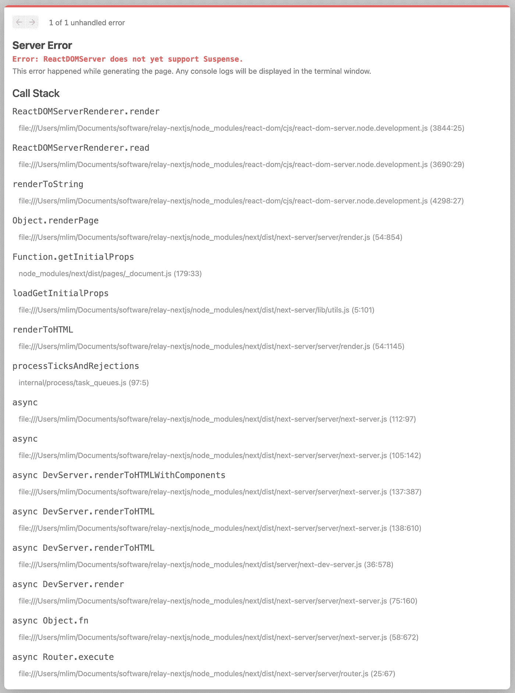
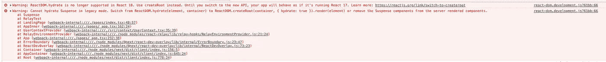

# 如何在 Next.js 和 TypeScript 中使用 Relay

> 原文：<https://javascript.plainenglish.io/how-to-use-relay-with-nextjs-and-typescript-40d7a00a137b?source=collection_archive---------5----------------------->

# 问题是

如果您有这样的一些中继代码:

```
import { Suspense } from "react";
import { graphql } from "relay-runtime";
import { useLazyLoadQuery } from "react-relay";const RelayTestQuery = graphql`
  query RelayTestQuery {
    viewer {
      id
    }
  }
`;function RelayTestInner() {
  const data = useLazyLoadQuery(RelayTestQuery, {
    variables: {},
  }); return <div>hi</div>;
}export default function RelayTest() {
  return (
    <Suspense fallback={<div>Loading</div>}>
      <RelayTestInner />
    </Suspense>
  );
}
```

你把它渲染成这样:

```
export default function Home() {
  return (
    <RelayEnvironmentProvider environment={RelayEnvironment}>
      <RelayTest />
    </RelayEnvironmentProvider>
  );
}
```

那么您将得到以下错误:



ReactDOMServer does not yet support Suspense.

# 解决方案

## **动态导入**

要解决这个问题，您可以使用`RelayTestDynamic`来代替:

```
import dynamic from "next/dynamic";const RelayTestDynamic = dynamic(() => import("./RelayTest"), {
  ssr: false,
});export default RelayTestDynamic;
```

虽然这样做有点烦人，如果使用 Relay 的组件在初始加载时是可见的(它们可能是可见的)，这对性能是不利的(现在浏览器需要对 JS 发出另一个请求，而这个请求可能已经在初始响应中发送了)。

## **Alpha 版本**

或者，你可以使用`react`和`react-dom`的 alpha 版本。

```
yarn add react@alpha react-dom@alpha
```

对于 alpha 版本，不再需要动态导入。它会导致一些警告，但似乎工作正常。



# 关于 TSConfig

[https://github . com/relay-tools/relay-compiler-language-typescript # typescript](https://github.com/relay-tools/relay-compiler-language-typescript#typescript)提到了以下内容:

还要确保将 TypeScript 编译器配置为传输到`es2015`模块，并使用以下`tsconfig.json`设置将传输到`commonjs`模块的任务留给 Babel:

我发现那是不必要的。不确定为什么，可能用中继钩的时候不适用？

查看这些回购的例子。

*   [https://github.com/arcticmatt/relay-nextjs-typescript](https://github.com/arcticmatt/relay-nextjs-typescript)
*   [https://github.com/arcticmatt/relay-nextjs](https://github.com/arcticmatt/relay-nextjs)

***https://github.com/reactwg/react-18/discussions/9:****要么使用动态导入要么使用 React 18 alpha*[](https://github.com/reactwg/react-18/discussions/9)

**更多内容请看*[***plain English . io***](https://plainenglish.io/)*。**

**报名参加我们的* [***免费周报***](http://newsletter.plainenglish.io/) *。关注我们关于*[***Twitter***](https://twitter.com/inPlainEngHQ)，[***LinkedIn***](https://www.linkedin.com/company/inplainenglish/)*，*[***YouTube***](https://www.youtube.com/channel/UCtipWUghju290NWcn8jhyAw)*，以及* [***不和***](https://discord.gg/GtDtUAvyhW) ***。****

****有兴趣缩放你的软件启动*** *？检查* [***电路***](https://circuit.ooo?utm=publication-post-cta) *。**

# *进一步阅读*

*[](/typescript-made-easy-a-guide-to-your-first-type-safe-app-with-next-js-wundergraph-and-prisma-e197a59e2b30) [## 轻松编写类型脚本:使用 Next.js、WunderGraph 和 Prisma 编写第一个类型安全应用程序的指南

### 是时候抛开恐惧，学习 TypeScript 了。让我们给你第一次“发现！”瞬间通过建立一个完整的…

javascript.plainenglish.io](/typescript-made-easy-a-guide-to-your-first-type-safe-app-with-next-js-wundergraph-and-prisma-e197a59e2b30)*