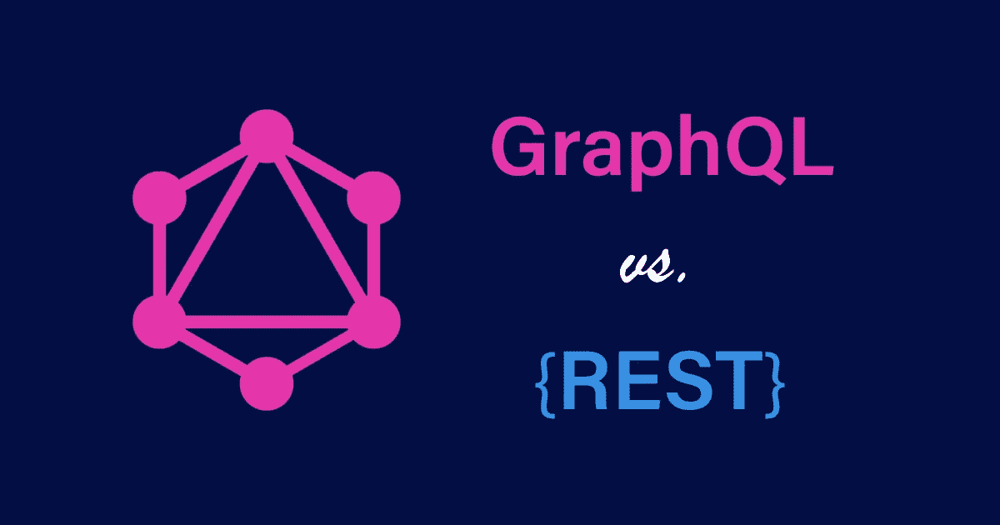

# 如何在 React/Next.js 应用程序上将 REST API 与 Apollo 客户端和 GraphQL 结合使用

> 原文：<https://javascript.plainenglish.io/how-to-use-rest-api-with-apollo-client-and-graphql-on-a-react-nextjs-app-7d23cc8625f3?source=collection_archive---------1----------------------->



Photo by designveloper.com

Apollo Client 是一个类似 Redux 的状态管理库，它允许您在客户端编写 GraphQL 查询。如果您正在使用 GraphQL 服务器构建应用程序，Apollo Client 是最合适的状态管理库之一，因为它有一个惊人的缓存机制。

在本教程中，我将从 OMDb Rest API 获取数据，通过用 Apollo Client 实现它来获取电影，以演示 Rest API 如何与 GraphQL 并行使用。

# 入门指南

## **创建 Next.js 应用**

```
npx create-next-app <YOUR-APP-NAME>
```

在 React 的情况下，使用 create-react-app。

## **安装阿波罗客户端和任何** `**peerDependencies**`

```
npm i @apollo/client apollo-link-rest graphql qs graphql-anywhere
```

## **创建 HTTP 链接**

这是您已经存在的 GraphQL 端点。

```
import { HTTPLink } from "apollo-link";

const httpLink = **new HttpLink**({
  **uri**: 'https://server.myapp.com/graphql',
  *// other link options...*
});
```

## **创建休息链接**

在我们的例子中，它是一个获取电影的 OMDB API。

```
import { RestLink } from ‘apollo-link-rest’;const restLink = **new RestLink**({
  **uri**: “https://www.omdbapi.com/", 
   *// other link options...*
});
```

## 设置我们的阿波罗客户端

现在我们已经配置了 Rest 和 HTTP 链接，我们可以在 Apollo 客户机中设置它们了。

```
import { ApolloClient, InMemoryCache, ApolloLink } from ‘@apollo/client’;const client = **new ApolloClient**({ **link**: ApolloLink.split(operation => operation.getContext().clientName === "rest",

    *// The string "rest" and "clientName" can be anything you want* restLink, *// Apollo will send to this if clientName is "rest"*

    httpLink*// Otherwise will send to this*
  ), **cache:** new InMemoryCache() *// other options...*
});
```

## **编写我们的 GraphQL 查询**

注意，有两个 OMDb 端点。第一个用于获取单部电影的数据，第二个用于获取电影列表。

1.  https://www.omdbapi.com/?i=tt0371746&API key =
2.  http://www.omdbapi.com/?s=iron&API key =

**注意:[https://www.omdbapi.com/apikey.aspx](http://www.omdbapi.com/apikey.aspx)你可以生成你的 API 密匙**

我们必须知道，Apollo 客户端基于`**typenames**` 对缓存数据进行规范化，因此我们必须执行*类型名修补*。

我们可以在编写`**gql**`查询时直接执行类型名修补。但是对于包含子字段的字段，建议直接在 Apollo 客户机中添加 typename，稍后我将对此进行说明。

**根据电影 ID 获取单个电影结果**

```
import { gql } from '@apollo/client'; export const getMovieQuery = gql` query($imdbID: String!) { movie(imdbID: $imdbID) **@rest**(**type**: "**Movie**", path: "?i={**args.imdbID**}&apikey=<*YOUR_API*>") { Error imdbID imdbRating Title Year Runtime Genre Director Country Plot Poster } }`;
```

这里，`**Movie**`是作为类型名分配的。`**imdbID**` 用作变量自变量，这样它的值可以通过`**useQuery**` 钩子传递。

**通过搜索参数和页码获取电影结果**

```
import { gql } from '@apollo/client'; export const getMoviesQuery = gql` query($search: String!, $page: Int!) { movies(search: $search, page: $page) **@rest**(**type: "Movies"**, path: "?s={**args.search**}&apikey=<*YOUR_API*>&page={**args.page**}") { Error totalResults Search { Title Year imdbID Poster } } }`;
```

这里，`**Movies**`是作为类型名分配的。`**search**`****`**page**`**被用作变量自变量，这样它们的值就可以通过`**useQuery**` 钩子传递。******

****请注意，`**Search**` 字段包含子字段，因此我们必须为这个字段附加一个 typename。我们可以使用`@type(name: "Movie")`指令直接将 typename 附加到查询本身的`**Search**` 字段，但是建议改为修改 Rest 链接。****

## ******修改我们的休息链接******

```
***// ... same as previous*const restLink = new RestLink({ uri: "https://www.omdbapi.com/", *// Extra code to be added:* **typePatcher**: { **Movies**: data => { if (data.Search != null) { data.Search = 
          data.Search.map(search => ({ 
            __typename: "Movie", ...search              
         }));
     } return data;
   }
 }
});**
```

******注:** `**Movies**` 是我们查询取的数据的类型名。因此请记住，该名称应与`**gql**`中使用的名称相同****

## ****使用 useQuery 钩子在我们的 UI 中获取数据****

```
**import { useQuery } from ‘@apollo/client’;*// ...React/NextJS function*const {loading, error, data} = **useQuery**(getMoviesQuery, { variables: { search, page: 1 },
  **context: { clientName: 'rest' }**});if(loading) return 'Loading...';if(error) return 'No results found';console.log(data.movies);**
```

****同样的，****

```
**import { useQuery } from ‘@apollo/client’;*// ...React/NextJS function*const {loading, error, data} = **useQuery**(getMovieQuery, { variables: { imdbID: id },
  **context: { clientName: 'rest' }**});if(loading) return 'Loading...';if(error) return 'No results found';console.log(data.movie);**
```

****请注意，我们可以像平常一样使用 GraphQL 端点，即没有任何`**context**` 对象。****

*******就是这样。我们都完了！*******

# ****结论****

****我们知道 GraphQL 为我们的客户机-服务器应用程序提供了一种令人惊奇的方法，但这并不意味着它阻止我们使用已经存在的 REST APIs。REST 和 GraphQL 应该总是并行存在。****

# ****参考****

****[](https://www.apollographql.com/docs/react/api/link/apollo-link-rest/) [## 休息链接

### 从 GraphQL 客户端调用 REST APIs 为更多人带来了 GraphQL 的好处，无论是:您是在前端…

www.apollographql.com](https://www.apollographql.com/docs/react/api/link/apollo-link-rest/) [](https://www.jamalx31.com/tech-posts/using-apollo-with-multiple-graphql-endpoints) [## 在多个 Graphql 端点上使用 Apollo

### 如果您正在使用 Graphql，您可能已经面临这个问题，您有自己的 Graphql 服务器，还需要…

www.jamalx31.com](https://www.jamalx31.com/tech-posts/using-apollo-with-multiple-graphql-endpoints) 

*更多内容请看*[***plain English . io***](https://plainenglish.io/)****