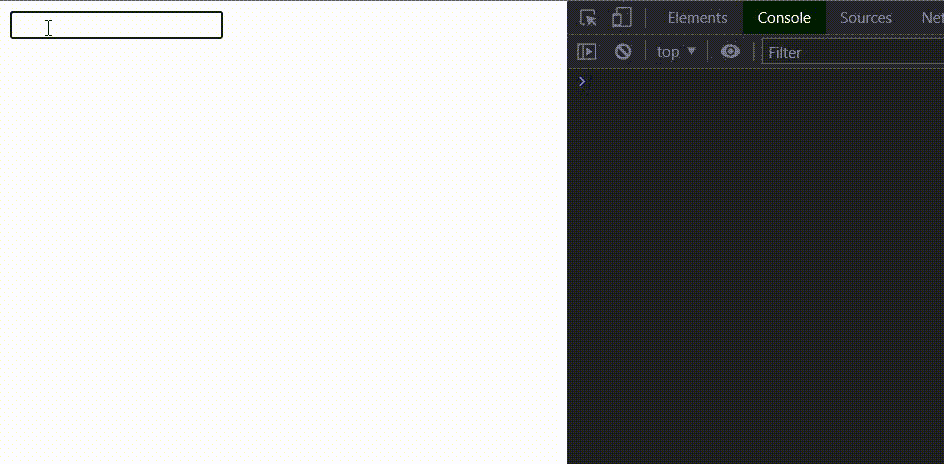
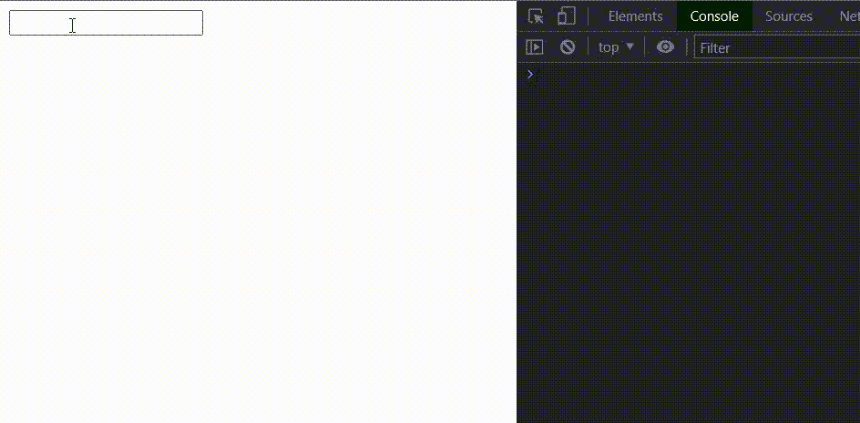

# 如何将 RxJS 去抖时间与 Angular 配合使用

> 原文：<https://javascript.plainenglish.io/how-to-use-rxjs-debouncetime-with-angular-15270c7d720f?source=collection_archive---------4----------------------->


Photo by Tudor Baciu

RxJS 是目前前端开发中非常热门的话题。它是一个强大的库，打开了反应式编程的大门。RxJS 库使用 observables 来处理异步数据调用、回调、事件等。如果您曾经使用过 RxJS，您很可能听说过 observables、observer、subscribe 等术语。在进入主题之前，让我们快速了解一下这些概念。

## 可观察量

我们可以把一个可观测值看作是一段时间内发生的数据流。数据可以同步或异步返回。

## 观察者

观察器的作用是在观察器返回一些数据、错误或报告完成时执行一些功能。

## 签署

观察者需要监听可观察对象，以检测可观察对象返回的数据、错误或完整性。这是通过使用 subscribe 方法的**订阅**完成的。

我们可以用程序化的方式展示。

```
Observable.subscribe(
    data => {
    },
    error => {
    },
    complete => {
    }
);
```

我们正在通过 subscribe 方法监听可观测数据的变化。subscribe 方法中的一切都是观察者。如果从可观测的 ***数据中得到某个值= > {}*** 函数将被调用。如果返回一个错误 ***error = > {}*** 将被调用。

理论说够了！让我们进入我们的主题。

## 什么是去抖时间？

去抖时间是 RxJS 的一个运算符。RxJS 库中有很多操作符可用。如果有人问你，为什么 RxJS 如此强大，那是因为 RxJS 操作符。这些将为我们的应用程序提供一些有趣的功能。无论如何，由于 RxJS 中有许多操作员，你应该在选择合适的操作员方面进行一些练习。

那么，在哪些用例中我们可以使用去抖时间呢？我举个简单的例子。

*Imaging 您的应用程序包含搜索功能，每当用户键入要搜索的内容时，它就会从后端获取数据。那么，您打算在什么时候向后端发送请求呢？基本上，我们可以做两件事。*

1.  *每次击键都向后端发送一个 HTTP 请求。*
2.  *键入要搜索的内容，并要求用户按 Enter 或单击应用程序中的按钮。*

第一种方法似乎不太好，因为它发送了大量的后端调用，这会降低应用程序的性能。

第二种方法没有问题，但是用户在输入内容后必须做一些额外的工作。

如果我们可以在用户输入后自动进行后端调用，会怎么样？这可能吗？

是的，当然。这时去抖时间操作员来帮我们了。

## 去抖时间是如何工作的？

我们可以定义去抖时间的延迟，如下图所示。延迟应以毫秒为单位。

```
debounceTime(500)
```

因此，如果半秒钟内没有发生任何事情，它将发出值**。换句话说，它在用户完成输入半秒钟后返回值。**

## 角度变化时的去抖时间

让我们看看如何用 Angular 实现去抖时间。请记住，这不仅仅是有角度的。RxJS 操作符可以在任何 JavaScript 框架或库中使用。概念是相似的，只是语法不同。

这就是它的工作原理。



如果使用角度反应形式，可以执行以下操作。

这是输出。



如果需要，可以使用 *onInit* 生命周期钩子代替*afterconetenit。*取消订阅可观察的组件销毁是一个很好的做法。

回到我们的搜索示例，用户需要做的唯一事情就是，键入内容并等待结果。它将在我们在去抖时间中定义的时间之后发送请求到后端。这就是 RxJS 的妙处。所以，只要有可能，总是喜欢在你的应用程序中使用 RxJS，这会让你的应用程序更智能。

编码快乐！

**参考文献**

[](https://www.learnrxjs.io/learn-rxjs/operators/filtering/debouncetime) [## 去抖时间

### 丢弃输出间隔时间小于指定时间的发出值

www.learnrxjs.io](https://www.learnrxjs.io/learn-rxjs/operators/filtering/debouncetime) [](https://www.learnrxjs.io/learn-rxjs/concepts/rxjs-primer) [## RxJS 底漆

### 单播。如果你更喜欢一个会议谈话场景-一个可观察的，许多观察者-你会采取不同的…

www.learnrxjs.io](https://www.learnrxjs.io/learn-rxjs/concepts/rxjs-primer) 

*更多内容请看**[***说白了. io***](http://plainenglish.io/) ***。*** *报名参加我们的* [***免费每周简讯这里***](http://newsletter.plainenglish.io/) ***。****