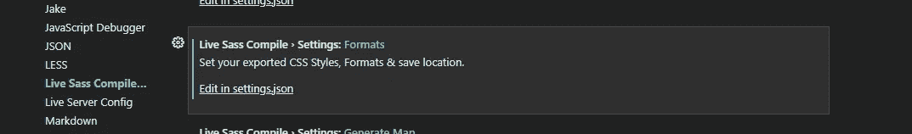

# 如何使用 Sass，享受动态结构的 CSS

> 原文：<https://javascript.plainenglish.io/how-to-use-sass-and-enjoy-css-with-dynamic-structure-900ea2adddf7?source=collection_archive---------7----------------------->

## 由于 CSS 是一个静态结构，我们必须不断重复代码。我们用 Sass 为 CSS 代码带来了动态结构。


Photo by [Eilis Garvey](https://unsplash.com/@eilisgarvey?utm_source=medium&utm_medium=referral) on [Unsplash](https://unsplash.com?utm_source=medium&utm_medium=referral)

Sass 是为使用 CSS 中没有的特性而开发的预处理器。它有两种不同的用法。 **SCSS** 和**缩进语法。**

这是两者的区别。


萨斯和 SCSS 的功能特征是相同的。唯一的区别是花括号和分号的使用。

## **我为什么选择使用 SCSS？**

我求助于 SCSS，因为我需要写长而重复的 CSS 代码，用 CSS 做一些计算，使用循环和 if-else。

## **使用 Visual Studio 代码和 Sass**

安装**实时 Sass 编译器**


Live Sass Compiler for VS Code

安装后，进入设置/实时 Sass 编译器



我们需要改变*设置. json* 文件。

```
“liveSassCompile.settings.formats”: [ { “format”: “expanded”, “extensionName”: “.css”, “savePath”: “dist/css” }],
```

将`savePath = null`改为`savePath = "your css folder location"`

我们必须开始**手表萨斯**，用`ctrl + shift + p`组合

通过这些过程，我们在。scss 文件被编译到。css 文件。如果我们有错误或任何警告，我们可以看到**输出。**

## SCSS 到 CSS

我们在编写 CSS 代码时都会用到的重置状态的例子。


可以在同一个文件中定义或者用`@import`调用

定义的变量；


您可以在根元素下定义它的变量，就像在 CSS 中定义它一样。你可以在第 10 行之前看到这个例子。在*里看起来也一样。编译后的 css* 文件。

当使用 Sass 时，我们用 **$** 定义变量。我们不需要用花括号把它写在 root 里。

这样定义后，我们可以在**选择器**中将其用作`$var_name`。在*中。css* 文件编译后，直接输出我们定义的变量。变量声明状态不会在*中再次出现。css* 。

因此，使用 Sass 变量提供了更多的跨浏览器兼容性。

嵌套；


如你所知，对于嵌套选择器，我们在*中使用`.main .main__text {..}`。css* 文件。

因为。我们可以像这样使用

`.main { .main__text { ... }}`

或者

`.main { &__text { ... }}`

**&** 等于父级，所以是**主**的快捷方式。

或者

`.main { #{&}__text { ... }}`

如果你要使用两个或更多的“与”符号，就需要“手段”。

正如您在示例中看到的，通过 Sass，使用嵌套结构变得非常容易。

使用 Mixins


`@mixin`是一个防止我们经历代码重复的指令。凭借其可重用性，它节省了我们的时间、性能和复杂性。

我们可以在任何我们想去的地方使用我们用`@include`创建的东西。

在编译器之后，我们的`@mixin`和*选择器*特性被组合在. css 中

使用扩展


`@extend`指令支持我们在选择器之间共享属性

在类似的结构中使用它是有用的。

[](https://bestte.medium.com/subscribe) [## 可以订阅了解文章。

### 可以订阅了解文章。注册后，如果您还没有，您将创建一个中型帐户…

bestte.medium.com](https://bestte.medium.com/subscribe) 

如您所见，Sass 允许我们动态构建 CSS 代码。更像是编程语言。如果你被困在。萨斯或者。scss，你可以选择你习惯的。

*更多内容请看*[***plain English . io***](http://plainenglish.io/)

[](/how-to-use-angular-component-styles-with-special-selectors-dc877514372c) [## 如何将角度组件样式与特殊选择器一起使用

### 在具有独立样式文件的组件的基础上，将样式添加到您的 Angular 应用程序有助于您创建一个更…

javascript.plainenglish.io](/how-to-use-angular-component-styles-with-special-selectors-dc877514372c) [](/how-to-avoid-runtime-errors-for-frontend-development-d24741df4a52) [## 如何避免前端开发的运行时错误

### 作为开发人员和测试人员，我们经常会遇到我们没有注意到的运行时错误。我们可以用…来摆脱它们

javascript.plainenglish.io](/how-to-avoid-runtime-errors-for-frontend-development-d24741df4a52) [](/how-to-use-the-composition-api-to-get-data-from-service-with-vue-js-4da1eca19ad6) [## 如何使用组合 API 通过 Vue.js 从服务中获取数据

### 通过使用组合 API 而不是选项 API，可以使服务结构更加可用。

javascript.plainenglish.io](/how-to-use-the-composition-api-to-get-data-from-service-with-vue-js-4da1eca19ad6) [](/how-to-use-angulars-attribute-directives-in-your-class-hierarchy-d3a1d0adac32) [## 如何在类层次结构中使用 Angular 的属性指令

### 使用 Angular CLI 构建属性指令

javascript.plainenglish.io](/how-to-use-angulars-attribute-directives-in-your-class-hierarchy-d3a1d0adac32) [](/how-to-create-marker-and-marker-cluster-with-leaflet-map-95e92216c391) [## 如何使用传单地图创建标记和标记簇

### 在活页地图架构中创建标记和图层，然后对标记进行聚类的方法。

javascript.plainenglish.io](/how-to-create-marker-and-marker-cluster-with-leaflet-map-95e92216c391)