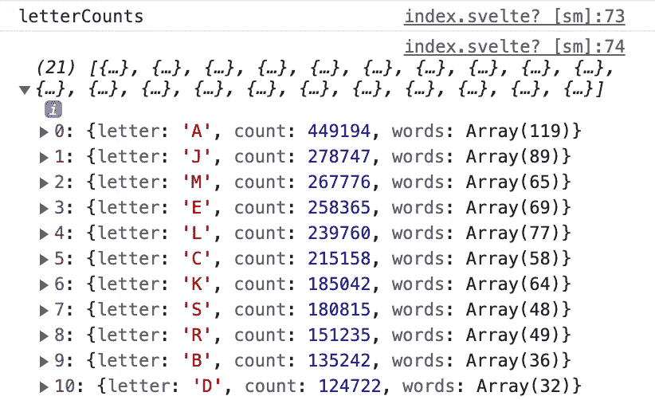
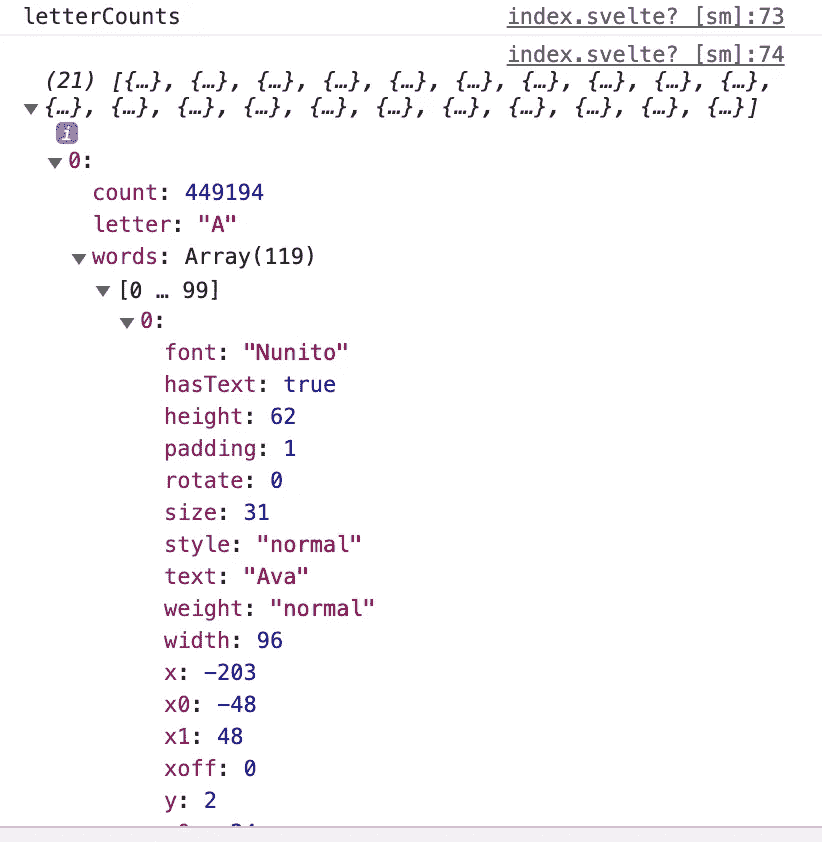

# 如何使用 Svelte 和 D3 创建一个交互式数据可视化

> 原文：<https://javascript.plainenglish.io/how-to-use-svelte-and-d3-to-create-an-interactive-data-visualisation-d52e848fd995?source=collection_archive---------3----------------------->

## 分析婴儿名字:条形图+单词云

Image by author

在过去的 10 年里，D3 一直是在 web 上创建交互式数据可视化的头号工具。现在，Svelte 在所有类型的 web 应用程序中越来越受欢迎，尤其是在在线数据可视化领域。

本文提供了一个例子，说明如何将 Svelte 和 D3 结合起来创建一个定制的数据可视化。数据是来自美国社保的[婴儿名字数据](https://www.ssa.gov/oact/babynames/limits.html)；可视化是一个带有单词云的条形图，在条形图上显示最受欢迎的名字。在上一篇文章中，我解释了如何“使用 d3.js 和 100 行 JavaScript”创建这样的图表。

 [## 带有单词云填充条的条形图

### 使用 D3.js 和仅仅 100 行 JavaScript

russelllim22.medium.com](https://russelllim22.medium.com/bar-chart-with-word-cloud-filled-bars-695947f35874) 

在这里，我使用 Svelte 来呈现 SVG 图表，并添加了一些交互性:一个下拉框，允许用户选择年份，然后立即用该年的婴儿姓名数据更新图表。

下面是一个显示交互式图表的动画截图:

关键步骤是

*   获取并准备数据
*   生成 SVG 条形图
*   生成单词云

# 获取并准备数据

我将 fetch 调用放在 HTML `select`元素的[事件处理程序](https://svelte.dev/tutorial/inline-handlers)中，使用 Svelte 的[双向绑定](https://svelte.dev/tutorial/select-bindings)来立即更新`selectedYear`变量:

即使您以前从未使用过 Svelte，但是熟悉 HTML，您也可能已经对上面的代码有了大致的了解。

第 12 到 14 行的`{#each}`代码块是使用循环编写 HTML 的简单语法。在这种情况下，它需要一个年份数组，并将每一年作为`select`下拉列表中的一个`option`。

功能`showBars()`在同一个`.svelte`文件的`<script>`标签中定义。它使用 D3(以与我的前一篇文章相似的方式)将数据准备为一个对象数组。每个条目包含一个`letter`，一个那年出生的婴儿的`count`，以及一个名为`words`的数组，其中包含单词 cloud 的所有必要数据。

# 生成 SVG 条形图

下面是将条形渲染为 SVG 矩形的简单代码。同样，如果你熟悉 HTML 和 SVG，看起来应该很熟悉。

第 4 行的`{#if}`语句是用于条件渲染的简单语法；只有当数据数组`letterCounts`不为空时，它才会尝试呈现条形。

使用 D3 标度设置矩形的尺寸。

动画是用一个[纤细的过渡](https://svelte.dev/tutorial/in-and-out)完成的:

`in:fly=”{{ x: -1000, duration: 1000, delay: 1000*i}}`

在这种情况下，我希望小节一个接一个地飞入，每个小节之间有 1000 毫秒。1000 毫秒的异常长延迟的原因是，为每个条形生成单词云的函数需要一些时间来运行。每个云只有几百毫秒，所以我可以通过使用 Svelte 的`{#await}`语法在每个单词云准备好的时候渲染它来加快速度。但我认为每个条形之间的时间间隔一致看起来不错。

# 生成单词云

我以 1000 毫秒的时间间隔对每个条形运行`d3-cloud`函数。该函数给出一个名为`words`的数组，其中包含每个婴儿名字的数据(字体大小、位置等。)需要生成单词云。

然后，我没有使用 D3 将单词 cloud 附加到 DOM，而是使用 Svelte 将单词作为 SVG 文本节点放置，如下所示。我遵循 Amelia Wattenberger 在本次峰会演讲中的建议，使用 D3 来帮助准备数据、计算比例和元素位置，然后让 Svelte 处理 DOM 的更新。

苗条默认是反应性的。因为上面的标记使用了`letterCounts`变量，Svelte 会观察这个变量，并检查当`letterCounts`变量改变时 DOM 是否需要更新。关于 Svelte 如何识别数组和对象的变化的更多细节，请参见[这里的](https://svelte.dev/tutorial/updating-arrays-and-objects)。

# 响应窗口大小调整

Svelte 的另一个便利特性是能够立即响应浏览器窗口宽度的变化。

`<svelte:window bind:innerWidth={width}/>`

包含上述语句后，每当窗口宽度改变时(例如，如果移动用户旋转他们的设备)，任何包含`width`变量的 HTML 标记都将被重新呈现。

# 数据可视化的优势

这张图表的完整代码可以在[这里](https://gist.github.com/russelllim22/00b621bd7bfbb2e18913de5d14a0c655)找到。这是一个有大约 160 行代码的单个`.svelte`文件，包括 JavaScript、HTML 和一些基本的 CSS。这是一个非常小的例子，显然可以不用 svelet 来构建，但我认为它仍然展示了 svelet 在数据可视化方面的一些优秀特性。

“苗条”是由里奇·哈里斯创造的，当时他正在《纽约时报》从事数据可视化工作，目的是“搔自己的痒处”。10 年前，Mike Bostock 在相同的环境下创建了 D3。两个令人难以置信的有影响力的开源软件的极好例子，它们开始于一个人的激情项目。

Svelte 允许 web 开发人员用更少的代码完成更多的工作。更少的代码也意味着更少的错误和更容易的调试。

Svelte 的语法非常用户友好，在 HTML、CSS 和 JavaScript 的熟悉基础上增加了它的反应“魔力”。在 HTML 标记中包含 HTML 元素的条件逻辑使其易于理解，也便于新手学习。

Svelte 也是一个非常轻量级和高性能的框架，因为它将`.svelte`文件编译成纯 HTML、CSS 和 JavaScript / Typescript。

最后，随着围绕 Svelte 的势头和生态系统的增长，从社区中找到组件库、插件、灵感和支持变得越来越容易。现在 Svelte 得到了 Vercel 的资金支持，这一势头无疑将继续增强。

我期待在接下来的一年里更深入地了解苗条身材！

 [## 动画三角学测验

### 由身材苗条的初学者建造

medium.com](https://medium.com/geekculture/animated-trigonometry-quiz-88958b0ac206)  [## 数学网络——数据可视化

### 调查数学研究中的联系

www.cantorsparadise.com](https://www.cantorsparadise.com/the-web-of-mathematics-a-data-visualisation-baa5d478d908)  [## 2021 年 YouTube 上的热门视频

### 按国家、月份和类别查看最受欢迎的 YouTube 视频。

russelllim22.medium.com](https://russelllim22.medium.com/top-trending-videos-on-youtube-in-2021-d576fa1f4c34) 

*更多内容看* [*说白了. io*](http://plainenglish.io/) *。报名参加我们的* [*免费周报*](http://newsletter.plainenglish.io/) *。在我们的* [*社区*](https://discord.gg/GtDtUAvyhW) *获得独家写作机会和建议。*