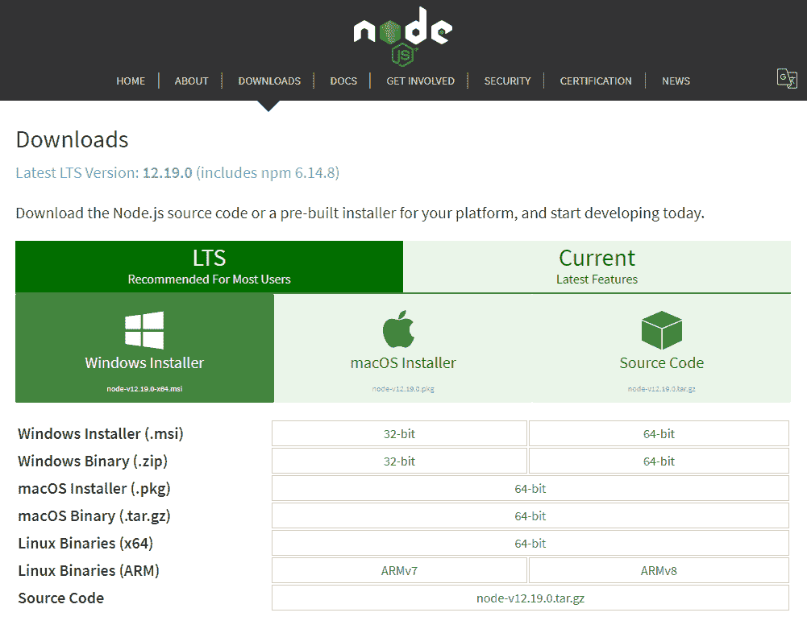
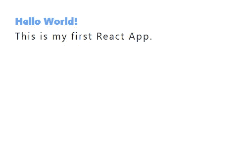

# 如何在 React 应用程序中使用 Tailwind CSS

> 原文：<https://javascript.plainenglish.io/how-to-use-tailwind-css-with-a-react-app-baf7ff494122?source=collection_archive---------10----------------------->


让我们设置一个顺风 CSS React 应用程序。

这是一个简单的过程，只需要一些安装和一些配置。

# **安装 Node.js**



**安装 Node.js 和 npm**

访问[节点安装程序](https://nodejs.org/en/download/)来安装 Node.js 和 npm。选择您系统的安装包并完成安装过程。

**检查您的 Node.js 版本**

*命令行(Windows)*

```
C:\Users\Owner>node -v
v12.13.1
```

注意，顺风 CSS 需要 Node.js 12.13.0 或更高版本。所以检查一下你的版本是否符合这个要求。

# **创建 React 应用**

**创建一个新的 React App 项目**

create-react-app 是由脸书创建的 Github repo。

它附带了预配置的文件和包，包括一个 live dev 服务器，CSS、JS 和 React 文件的自动编译，以及用于错误警报的 ESLint。

*命令行(Windows)*

```
C:\Users\Owner\desktop> npx create-react-app tw-react
```

要使用这个项目，只需运行命令`npx create-react-app <name>`。

我创建了一个名为 *tw-react* 的项目，很容易将其识别为 Tailwind CSS React。

**等待项目被创建**

*命令行(Windows)*

```
C:\Users\Owner\desktop> npx create-react-app tw-react
...

Created git commit.

Success! Created tw-react
Inside that directory, you can run several commands:

  npm start
    Starts the development server.

  npm run build
    Bundles the app into static files for production.

  npm test
    Starts the test runner.

  npm run eject
    Removes this tool and copies build dependencies, configuration files
    and scripts into the app directory. If you do this, you can’t go back!

We suggest that you begin by typing:

  cd tw-react
  npm start

Happy hacking!
```

等待项目安装包并创建 React 应用程序。

这将需要几分钟时间。

当你听到“成功”的时候，你就知道已经完成了！在命令提示符下创建了 tw-react”消息。

**启动 React 开发服务器**

*命令行(Windows)*

```
C:\Users\Owner\desktop> cd tw-react
C:\Users\Owner\desktop> npm start
...
```

现在我们遵循命令行中的建议。

1.`cd tw-react`(进入 React 项目)

2.`npm start`(运行 React 开发服务器)

**在浏览器中查看 React 项目**

*浏览器窗口*


运行`npm start`后，React 应用将自动在新的浏览器窗口中打开。

# **通过 npm** 安装顺风 CSS

**安装顺风 CSS 及其依赖关系**

*命令行(Windows)*

```
(ctrl + c)
Terminate batch job (Y/N)? y
C:\Users\Owner\desktop\tw-react> npm install -D tailwindcss@npm:@tailwindcss/postcss7-compat @tailwindcss/postcss7-compat postcss@^7 autoprefixer@^9
...
```

Ctrl + c 或 command + c，这取决于您的操作系统，并在必要时键入`y`来终止批处理作业。

然后，命令提示符将再次出现。

运行上面的命令来安装 Tailwind CSS 及其所有依赖项。

这同样需要几秒钟来安装。

**安装 CRACO**

*命令行(Windows)*

```
C:\Users\Owner\desktop\tw-react> npm install @craco/craco
...
```

接下来，安装 CRACO 或创建 React 应用程序配置覆盖。这是 create-react-app 的配置层，允许我们覆盖 PostCSS 配置。

**配置 CRACO**

*tw-react>package . JSON*

```
{
...
 "scripts": {
    "start": "craco start",
    "build": "craco build",
    "test": "craco test",
    "eject": "react-scripts eject"
  },
...
}
```

安装完成后，在文本编辑器中打开项目，在根目录中找到 *package.json* 。

将`"react-scripts start"`替换为`"craco start"`，`"react-scripts build"`替换为`"craco build"`，`"react-scripts test"`替换为`"craco test"`。

将更新保存到文件中。

**创建一个 CRACO 配置文件**

*tw-react >(新文件)craco.config.js*

```
// craco.config.js
module.exports = {
  style: {
    postcss: {
      plugins: [
        require('tailwindcss'),
        require('autoprefixer'),
      ],
    },
  },
}
```

在根目录下新建一个名为 *craco.config.js* 的文件， *tw-react* 。

添加`tailwindcss`和`autoprefixer`作为 PostCSS 的插件。

**创建一个 TailwindCSS 配置文件**

*命令行(Windows)*

```
C:\Users\Owner\desktop\tw-react> npx tailwindcss init

   @tailwindcss/postcss7-compat 2.0.4

   ✅ Created Tailwind config file: tailwind.config.js
```

返回到命令提示符，使用命令`npx tailwindcss init`在根目录下创建另一个名为 *tailwind.config.js* 的文件。

**配置新的 TailwindCSS 配置文件**

*tw-react>tailwind . config . js*

```
// tailwind.config.js
module.exports = {
  purge: ['./src/**/*.{js,jsx,ts,tsx}', './public/index.html'],
  darkMode: false, // or 'media' or 'class'
  theme: {
    extend: {},
  },
  variants: {
    extend: {},
  },
  plugins: [],
}
```

用新的清除路径更新 *tailwind.config.js* 文件。

更新清除选项使 Tailwind CSS 能够从生产版本的所有组件中清除未使用的样式。

# **将顺风 CSS 添加到你的 CSS 中**

**用顺风 CSS 指令更新 CSS 文件**

*tw-react>src>index . CSS*

```
@tailwind base;
@tailwind components;
@tailwind utilities;
```

转到位于 *tw-react > src* 目录下由 create-react-app 生成的 *index.css* 文件。

用包含`base`、`components`和`utilities`样式的`@tailwind`指令替换 CSS 文件。

**导入 index.js 中的 CSS 文件**

*tw-react>src>index . js*

```
import React from 'react';
import ReactDOM from 'react-dom';
import './index.css';
import App from './App';
import reportWebVitals from './reportWebVitals';

ReactDOM.render(
  <React.StrictMode>
    <App />
  </React.StrictMode>,
  document.getElementById('root')
);

// If you want to start measuring performance in your app, pass a function
// to log results (for example: reportWebVitals(console.log))
// or send to an analytics endpoint. Learn more: https://bit.ly/CRA-vitals
reportWebVitals();
```

最后，转到 *index.js* 文件，仔细检查 *index.css* 是否在文件顶部导入。

**给组件添加顺风 CSS**

*tw-react>src>app . js*

```
import logo from './logo.svg';
import './App.css';

function App() {
  return (
    <div className="App" class="p-6 items-center justify-center">
        <h1 class="text-blue-400 font-extrabold">Hello World!</h1>
        <p class="tracking-widest">This is my first React App.</p>
    </div>
  );
}

export default App;
```

转到 *App.js* 文件，用上面的顺风 CSS 快速替换现有代码，仔细检查安装和配置是否正常。

**在浏览器中查看 React 项目**

*浏览器窗口*



再次运行 npm start 来查看 CSS 更新。

访问前三个 CSS 框架的[顺风 CSS 章节](../../../blog/article/top-3-css-frameworks#tailwind-css)进行基础组件前端开发，访问 [17 顺风 CSS 卡片示例](../../../blog/article/17-tailwindcss-cards)进行卡片参考。

【https://www.ordinarycoders.com】最初发表于[](https://www.ordinarycoders.com/blog/article/reactjs-tailwindcss)**。**

**更多内容请看*[***plain English . io***](http://plainenglish.io/)*