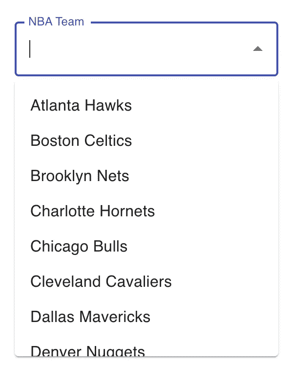
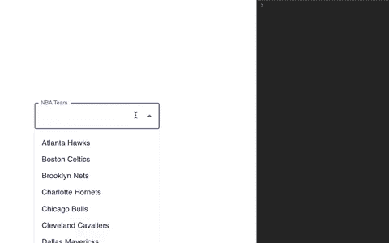

# 如何使用 Material-UI 中的自动完成组件

> 原文：<https://javascript.plainenglish.io/how-to-use-the-autocomplete-component-in-material-ui-11a7132d2b71?source=collection_archive---------1----------------------->

## 使用建议选项列表增强您的文本输入


Photo by [Christian Wiediger](https://unsplash.com/@christianw?utm_source=medium&utm_medium=referral) on [Unsplash](https://unsplash.com?utm_source=medium&utm_medium=referral)

[Material-UI](https://material-ui.com/) 是我最喜欢的 React UI 组件库。几乎所有您想用 React 构建的东西都有组件。

我最近使用的一个组件是自动完成组件。Material-UI 文档将自动完成描述为*“一个由一组建议选项增强的普通文本输入。”*

有两种版本的自动完成功能可供使用:

*   组合框—文本输入的值必须从一组预定义的值中选择。
*   Free solo —文本输入可以包含任何值，但建议从可能值的列表中选择。

在本文中，我们将通过构建一个组合框来看看 Material-UI 中的自动完成组件。尽管这个组件仍然是实验室的一部分，但它是我能为 React 找到的最好的自动完成组件。

# 建立

对于这个例子，我们将在一个`create-react-app`项目中工作。

第一步是在项目中安装 Material-UI 核心包。

```
// with npm
npm install @material-ui/core

// with yarn
yarn add @material-ui/core
```

我们还需要安装材料界面实验室。Material-UI lab 托管的组件还没有准备好移动到核心包中。

```
// with npm
npm install @material-ui/lab

// with yarn
yarn add @material-ui/lab
```

然后我们将从实验室导入`Autocomplete`组件，从核心包导入`TextField`组件。

```
import React from 'react';
import TextField from '@material-ui/core/TextField';
import Autocomplete from '@material-ui/lab/Autocomplete';
import { nbaTeams } from './nbaTeams';
```

接下来，我们将创建一个数据数组，用作预定义的一组允许值。对于这个例子，我有一个单独的文件，其中包含一个带有 id 号和球队名称的 NBA 球队数组。请随意复制或添加您想要使用的任何数据。只要确保数据是一个数组。

# 呈现自动完成组件

我们现在将把[自动完成](https://material-ui.com/components/autocomplete/)组件呈现到我们的屏幕上。对于这个例子，我创建了一个名为`Autocomplete.js`的新文件。在这个文件中，我创建了一个名为`NbaAutocomplete`的功能组件。

```
const NbaAutocomplete = () => {
  return (
    <Autocomplete
    />
  );
};
```

如果我们像上面那样呈现自动完成组件，我们在屏幕上还看不到任何东西。这是因为我们需要通过一些必需的道具。

## 小道具

*   **选项** *(必选)* —选项数组。
*   **渲染输入** *(必需)* —渲染输入。一个常见的用途是从 Material-UI 呈现`TextField`组件。然后我们可以把`label``variant`之类的道具传递给这个组件。
*   **getOptionLabel** —用于确定给定选项的字符串值。这是必要的，因为我们的选项数组是一个对象数组。这将决定在输入中显示什么值。
*   **id** —这个属性用于帮助实现可访问性逻辑。

```
const NbaAutocomplete = () => {
  return (
    <*Autocomplete* ***id="nba teams"******options*={nbaTeams}
      *renderInput*={*params* => (
        <*TextField* {...params} *label*="NBA Team" *variant*="outlined" />**
      ***getOptionLabel*={*option* => *option*.name}**
      ***style*={{ width: 270 }}**
      )}
    />
  );
};
```

我还在组件中添加了宽度为 270 的样式，让事情看起来更好一些。

如果我们开始我们的项目，我们现在应该看到下面的组件。



# 处理值

为了使用我们选择的数据，我们将使用 React 中的`useState`钩子把它变成一个受控输入。

首先，从 React 导入`useState`钩子。然后初始化一个名为`selectedTeam`的状态变量。我们将默认值设置为`null`。

```
const [selectedTeam, setSelectedTeam] = useState(null);
```

然后，在 Autocomplete 组件中，我们可以再添加两个道具。

*   **值** —自动完成的值。
*   **onChange** —值改变时触发回调。该函数将一个事件和一个选项值作为参数。我们将把`selectedTeam`变量设置为选项值。

```
<*Autocomplete
  id*="nba teams"
  *options*={nbaTeams}
  *renderInput*={*params* => (
    <*TextField* {...params} *label*="NBA Team" *variant*="outlined" />
  )}
  *getOptionLabel*={*option* => *option*.name}
  *style*={{ width: 270 }}
  ***value*={selectedTeam}
  *onChange*={(*_event*, *newTeam*) => {
    setSelectedTeam(*newTeam*);
  }}**
/>
```

为了检查我们是否获得了`selectedTeam`变量中的信息，让我们将这个值记录到控制台中。

```
console.log(selectedTeam);
```



# 附加道具

如果您有一个更复杂的用例，有许多其他的属性可以传递给 Autocomplete 组件。点击查看他们的文档[。](https://material-ui.com/api/autocomplete/)

以下是我过去用过的一些有用的道具列表:

*   **disableClearable** —如果为真，输入不能被清除。
*   **freeSolo** —如果为 true，则自动完成是 freeSolo，这意味着用户输入不绑定到提供的选项。
*   **groupBy** —如果提供，选项将在返回的字符串下分组。
*   **multiple** —如果为真，该值必须是一个数组，菜单将支持多选。
*   **输入值** —输入值。*(如果需要将值和文本输入值状态分开时有用)*
*   **onInputChange** —当输入值改变时触发回调。*(如果需要将值和文本输入值状态分开时有用)*

# 结论

感谢阅读！我希望这篇文章对您开始使用 Material-UI 的自动完成组件有所帮助。

您可以查看我们在下面创建的组件的完整源代码。

查看下面的文章，了解另一个材质 UI 组件——骨架。

[](https://levelup.gitconnected.com/improve-ux-with-the-skeleton-component-in-react-and-material-ui-c0b14a446f26) [## 用 React 和 Material-UI 中的骨架组件改进 UX

### 在加载数据之前显示内容的占位符预览

levelup.gitconnected.com](https://levelup.gitconnected.com/improve-ux-with-the-skeleton-component-in-react-and-material-ui-c0b14a446f26) 

## 进一步阅读

[](https://bit.cloud/blog/extendable-uis-how-to-build-better-uis-for-developers-l1jkl1pc) [## 可扩展的 UI 组件

### 我最近受命为 bit.cloud 平台构建一个用户卡组件。我还负责建造…

比特云](https://bit.cloud/blog/extendable-uis-how-to-build-better-uis-for-developers-l1jkl1pc) 

*更多内容请看*[***plain English . io***](https://plainenglish.io/)*。报名参加我们的* [***免费周报***](http://newsletter.plainenglish.io/) *。关注我们关于*[***Twitter***](https://twitter.com/inPlainEngHQ)[***LinkedIn***](https://www.linkedin.com/company/inplainenglish/)*[***YouTube***](https://www.youtube.com/channel/UCtipWUghju290NWcn8jhyAw)***，以及****[***不和***](https://discord.gg/GtDtUAvyhW) *对成长黑客感兴趣？检查* [***电路***](https://circuit.ooo/) ***。*****