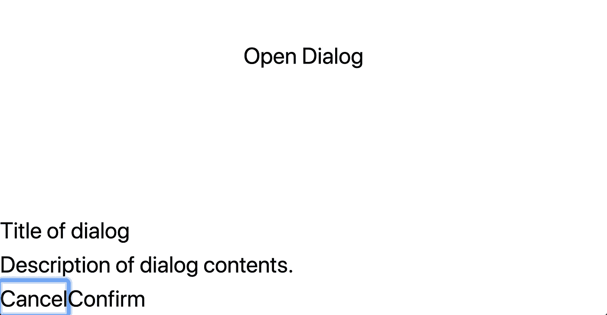
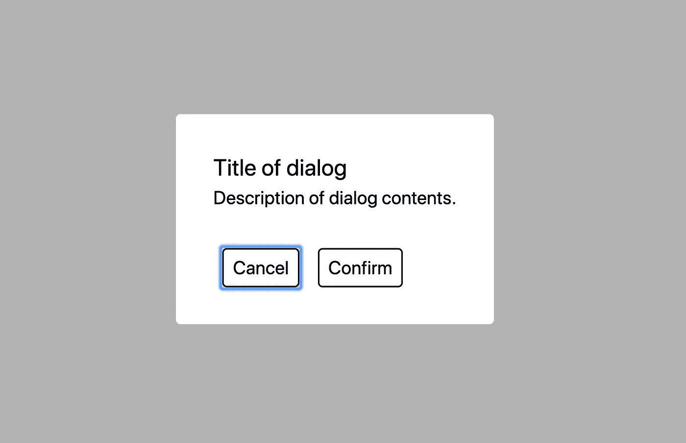

# 如何在无头 UI 和顺风 CSS 中使用对话框组件

> 原文：<https://javascript.plainenglish.io/how-to-use-the-dialog-component-with-headless-ui-and-tailwind-css-f8f11edcaf06?source=collection_archive---------4----------------------->

## 使用 Tailwind CSS 轻松创建对话框组件


Photo by [Mike Petrucci](https://unsplash.com/@mikepetrucci?utm_source=medium&utm_medium=referral) on [Unsplash](https://unsplash.com?utm_source=medium&utm_medium=referral)

在设计 React 应用程序时，Tailwind CSS 是最受欢迎的选项之一。您可以使用实用程序类轻松地向组件添加样式，而不是创建外部 CSS 文件。

如果您是 Tailwind CSS 的新手，请查看下面的文章开始学习。

[](/introduction-to-using-tailwind-css-with-next-js-d609be5b6e91) [## 将 Tailwind CSS 用于 Next.js 的介绍

### 为什么应该在 Next.js 应用程序中使用 Tailwind CSS

javascript.plainenglish.io](/introduction-to-using-tailwind-css-with-next-js-d609be5b6e91) 

Tailwind 有助于基本的样式，但是有时你需要创建更复杂的组件，比如对话框。Tailwind 的团队没有从头开始创建新的组件，而是发布了 [Headless UI](https://headlessui.dev/) 。

Headless UI 是一个包含以下内容的库:

> "完全非风格化的，完全可访问的 UI 组件，设计成完美地与 Tailwind CSS 集成."

他们目前支持 React 和 Vue 项目的以下 9 个组件:

*   菜单(下拉菜单)
*   列表(选择)
*   开关(切换)
*   公开
*   对话框(模态)
*   波普沃
*   无线电组
*   过渡
*   制表符

在本文中，我们将看看对话框(模态)组件，并学习如何在 React 项目中使用它。

# 建立

对于这个例子，我将从`create-react-app`开始在一个基本的 React 应用程序中工作。

不要忘记将[无头 UI](https://www.npmjs.com/package/@headlessui/react) 也安装到您的项目中。

```
# npm
npm install @headlessui/react

# Yarn
yarn add @headlessui/react
```

在`App.js`文件中，我将创建一个名为`isOpen`的状态值。该值将控制对话框是打开还是关闭。

```
const [isOpen, setIsOpen] = useState(false);
```

在这个组件中，我将呈现一个按钮。这个按钮将有一个`onClick`处理程序，当点击时，它将设置`isOpen`值为真。

```
<button onClick={() => setIsOpen(true)}>Open Dialog</button>
```

然后，我将渲染另一个名为`ModalDialog`的组件。*别担心，我们还没有创建这个组件，所以现在你会看到一个错误。*我们将传递两个道具给这个组件:`open`和`setIsOpen`。

我们的`App`组件目前应该看起来像这样。

```
const App = () => {
  **const [isOpen, setIsOpen] = useState(false);**return (
    <div className="flex flex-col h-screen justify-center items-center">
      **<ModalDialog isOpen={isOpen} setIsOpen={setIsOpen} />
      <button onClick={() => setIsOpen(true)}>Open Dialog</button>**
    </div>
  );
};
```

# 什么是对话框组件？

> 一个完全管理的、无渲染的对话框组件，具有辅助功能和键盘功能，非常适合为您的下一个应用程序构建完全自定义的模式和对话框窗口

让我们来看看[对话框](https://headlessui.dev/react/dialog)组件。它由 4 个组件构成:

*   `Dialog` —可以设置`open`状态和操作`onClose`功能的主要部件。
*   `Dialog.Overlay` —用于创建对话框的覆盖图。点击覆盖将关闭对话框。
*   `Dialog.Title` —对话框的标题。它将设置对话框上的`aria-labelledby`。默认元素是一个`<h2>`。
*   `Dialog.Description` —对话框的描述。它将设置对话框上的`aria-describedby`。默认元素是一个`<p>`。

# 如何使用对话框组件？

我将创建一个名为`ModalDialog.js`的新文件。在这个文件中，我将创建我们之前添加到`App.js`文件中的`ModalDialog`组件。

在这个文件中，我将首先从 Headless UI 导入`Dialog`组件。

```
import { Dialog } from '@headlessui/react';
```

然后，我将创建`ModalDialog`组件。记住，这个组件带了两个道具，`isOpen`和`setIsOpen`。我将渲染基本的`Dialog`组件，并将以下两个道具传递给`Dialog`组件:

*   `open` —控制对话框是否打开的布尔值。
*   `onClose` —对话框关闭时调用的功能。

```
const ModalDialog = ({ isOpen, setIsOpen }) => {
  return (
    **<Dialog open={isOpen} onClose={() => setIsOpen(false)}>**
      ...dialog contents
    **</Dialog>**
  );
};
```

接下来，我将在主`Dialog`组件中添加`Dialog.Overlay`、`Dialog.Title`、`Dialog.Description`和两个按钮。

```
const ModalDialog = ({ isOpen, setIsOpen }) => {
  return (
    <Dialog open={isOpen} onClose={() => setIsOpen(false)}>
      **<Dialog.Overlay />
      <Dialog.Title>Title of dialog</Dialog.Title>
      <Dialog.Description>
        Description of dialog contents.
      </Dialog.Description>
      <button onClick={() => setIsOpen(false)}>Cancel</button>
      <button onClick={() => setIsOpen(false)}>Confirm</button>**
    </Dialog>
  );
};
```

# 样式化对话框组件

如果我们启动项目并打开对话框，我们将会看到类似这样的内容。



对话框内容将显示在屏幕的左下角。我们可以通过使用 Tailwind CSS 添加一些实用程序类来轻松解决这个问题。

首先，我们可以添加一个透明的深色背景，这在模式对话框中很常见。

```
<Dialog.Overlay **className="fixed inset-0 bg-black opacity-30"** />
```

然后，我们可以给对话框内容添加样式。要设置对话框内容的样式，您可以像其他组件一样操作。在下面的例子中，我添加了一个包装器`<div>`来居中显示对话框的内容。我还在标题和按钮上添加了一些基本的样式。

```
<div **className="flex items-center justify-center min-h-screen"**>
  <Dialog.Overlay className="fixed inset-0 bg-black opacity-30" />
  <div **className="relative bg-white rounded max-w-sm mx-auto p-8"**>
    <Dialog.Title **className="text-xl"**>
      Title of dialog
    </Dialog.Title>
    <Dialog.Description>
      Description of dialog contents.
    </Dialog.Description>
    <button
      **className="border-black border-solid border rounded mx-2 mt-8 py-1 px-2"**
      onClick={() => setIsOpen(false)}
    >
      Cancel
    </button>
    <button
      **className="border-black border-solid border rounded mx-2 mt-8 py-1 px-2"**
      onClick={() => setIsOpen(false)}
    >
      Confirm
    </button>
  </div>
</div>
```

现在，如果我们打开对话框，我们可以看到内容在屏幕上居中，并且有一个透明的背景。



当你点击对话框的叠加时，它会为我们调用`onClose`函数。无头 UI 也解决了可访问性问题。这些是使用这些组件而不是试图从头构建它们的一些好处。

您可以在下面查看该组件的完整源代码。

# 结论

感谢阅读！我希望这篇文章对你在无头 UI 中使用对话框组件有所帮助。我一直喜欢用 Tailwind CSS 设计我的应用程序，但是创建一些更复杂的组件可能会很困难。这就是无头 UI 组件可以使事情变得容易得多的地方。

我计划在以后的文章中研究更多的无头 UI 组件，敬请关注！

如果你想学习如何使用顺风将黑暗模式添加到项目中，请查看下面的文章。

[](/how-to-add-dark-mode-to-your-next-js-project-using-tailwind-css-3d460a768d1c) [## 如何使用 Tailwind CSS 将黑暗模式添加到 Next.js 项目中

### 修复“文档未定义”错误的简单技巧。

javascript.plainenglish.io](/how-to-add-dark-mode-to-your-next-js-project-using-tailwind-css-3d460a768d1c) 

*更多内容尽在*[***plain English . io***](http://plainenglish.io/)