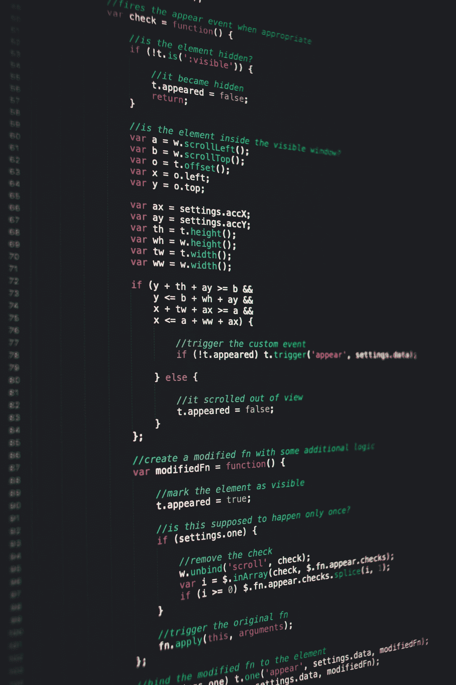

# 如何在 JavaScript 中使用 Fetch API:用励志名言解释

> 原文：<https://javascript.plainenglish.io/how-to-use-the-fetch-api-in-javascript-explained-with-inspirational-quotes-7d8f05665296?source=collection_archive---------7----------------------->



Photo by [Markus Spiske](https://unsplash.com/@markusspiske?utm_source=medium&utm_medium=referral) on [Unsplash](https://unsplash.com?utm_source=medium&utm_medium=referral)

JavaScript 中的 Fetch API 是一个通过互联网获取资源的简单接口。Fetch 使我们更容易发出 web 请求和处理响应。这个特性是作为基于承诺的 JavaScript API 构建的，用于以与旧的 XMLHttpRequest (XHR)相同的方式发出异步 HTTP 请求。Fetch 是从服务器获取资源的一种简单而强大的方法。

在这篇文章中，我想分享一下我对此的理解。因为早些时候，我发现 Fetch 真的很难理解。但实际上，这并不像有些人想象的那么难。要使用 Fetch，您需要安装一个名为“node-fetch”的软件包。使用下面的命令轻松安装它:

```
npm i node-fetch --save
```

在那之后，我发现一个 HTTP 服务器给了我一个 JSON 格式的很大的“鼓舞人心的报价”作为回应。这里是[环节](https://type.fit/api/quotes)。如果您访问该链接，您将看到如下内容:


我们可以通过使用 Fetch 函数来摆弄它。要获得所有数据，您可以使用这几行代码。

如您所见，在第一行中，我们需要使用之前安装的“节点获取”。接下来，我们只编写三行代码，如下所示:

*   获取→与服务器通信(看看这是否可行)
*   然后((响应)…) →得到响应为 JSON。
*   然后((数据)…) →打印数据。

那么你能猜出产量吗？是的，它会打印出网站上的 JSON 数据，就像这样。


就像上面的网站一样吗？

为了让它更有趣，我改进了上面的代码，以随机的方式获取一个报价。你能猜出怎么做吗？

嗯，我希望你能猜到。我只是使用了`Math.random()`函数来随机获取报价。实际上，大约有 1600 个报价可用，但我只是将其随机化，直到 1000 个。输出应该是这样的:


我们仍然可以改进报价，这样我们就可以得到这样的结果。


## 结论

因此，我们来到这篇文章的结尾。Fetch API 真的有很棒的特性，我认为如果每个开发人员都理解它，他们就可以改进自己的工作。正如这句名言所说:

> 胜利属于最坚持不懈的人

这篇文章可能不会让你成为 JavaScript 的大师，但我始终相信，我们永远不会因为什么都不做而成为任何事情的大师。这只是成为 JavaScript 高手的一小部分。

别忘了编码，感谢阅读。

最后，祝你有愉快的一天！

*更多内容尽在*[*plain English . io*](http://plainenglish.io/)