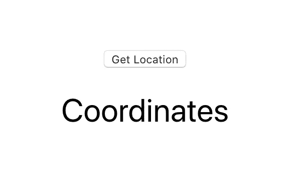
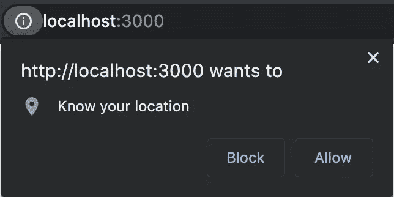
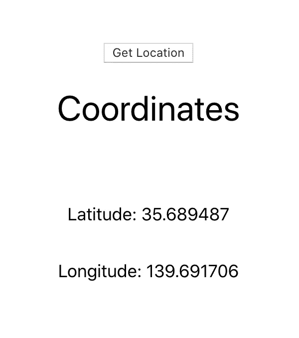

# 如何在 React 应用中使用地理定位 API

> 原文：<https://javascript.plainenglish.io/how-to-use-the-geolocation-api-in-your-react-app-54e87c9c6c94?source=collection_archive---------1----------------------->

## 获取用户的坐标，并在下一个 React 应用中使用它们


Photo by [Denise Jans](https://unsplash.com/@dmjdenise?utm_source=medium&utm_medium=referral) on [Unsplash](https://unsplash.com?utm_source=medium&utm_medium=referral)

我目前正在 React 中构建一个地图应用程序，需要使用地理定位 API 来获取用户的当前位置。我想分享一下我是如何实现它的，这样你也可以在你的应用中使用它。在我们的示例中，我们将构建一个简单的应用程序，在单击按钮时显示用户当前的纬度和经度坐标。

如果你有兴趣了解更多关于地理定位 API 的信息，你可以在[这里](https://en.wikipedia.org/wiki/W3C_Geolocation_API)阅读。让我们开始吧！

# 入门指南

我们将使用 create-react-app 构建我们的应用程序。

在 App.js 文件中，使用`useState`钩子为`lat` `lng`和`status`声明状态变量。`lat`和`lng`会存储用户所在位置的经纬度坐标。`status`将用于跟踪装载和错误。

```
const [lat, setLat] = useState(null);
const [lng, setLng] = useState(null);
const [status, setStatus] = useState(null);
```

我们将保持返回语句简单，显示一个 

```
<div className="App">
  <button onClick={getLocation}>Get Location</button
  <h1>Coordinates</h1>
  <p>{status}</p>
  {lat && <p>Latitude: {lat}</p>}
  {lng && <p>Longitude: {lng}</p>}
</div>
```

我们应该有一个基本的应用程序设置，看起来像这样。



# 地理定位 API

接下来，让我们实现地理定位 API 来获取用户的当前位置坐标。你可以在这里查看更多关于地理定位 API 的信息。

我们将在我们的 App 组件中创建一个新的函数，名为`getLocation`。该功能将首先检查您的网络浏览器是否支持`navigator.geolocation`。在很大程度上，它应该兼容所有的浏览器，除了一些非常旧的版本。

一旦我们检查了这个，我们就可以调用`navigator.geolocation.getCurrentPosition`方法。这个函数获取用户的当前位置，接受 3 个参数；成功回调函数、错误回调函数(可选)和位置选项对象(可选)。

如果成功，我们将设置纬度和经度。这些值存储在`position.coords.latitude`和`position.coords.longitude`中。

如果出现错误，我们会将状态设置为显示错误。

在位置选项对象中，您可以启用高精度、设置超时或设置缓存的位置年龄。在我们的例子中，我们将省略这些。

```
const getLocation = () => {
  if (!navigator.geolocation) {
    setStatus('Geolocation is not supported by your browser');
  } else {
    setStatus('Locating...');
    navigator.geolocation.getCurrentPosition((*position*) => {
      setStatus(null);
      setLat(position.coords.latitude);
      setLng(position.coords.longitude);
    }, () => {
      setStatus('Unable to retrieve your location');
    });
  }
}
```

然后，我们将为按钮设置一个`onClick`监听器，每当单击按钮时，这个监听器将运行`getLocation`方法。第一次单击该按钮时，您需要获得 web 浏览器的许可。我正在使用谷歌浏览器，它看起来像这样。根据您使用的 web 浏览器，这可能会有所不同。



点击允许，你现在应该可以看到你的纬度和经度坐标。(顺便说一下，这些是日本东京的默认坐标！)



这个`App.js`文件看起来会像下面这样。

# 包扎

感谢阅读！如果你想看源代码，你可以在这里查看我的 GitHub repo。现在您已经有了用户的纬度和经度坐标，您可以继续将它用于您的应用程序。

在我们结束这篇文章之前，这里有三个你可以使用地理定位 API 构建的东西的想法。

## 天气应用程序—显示用户所在位置的当前天气

[](https://openweathermap.org/api) [## 天气 API

### 简单快速和免费的天气 API，你可以访问当前的天气数据，每小时，5 天和 16 天…

openweathermap.org](https://openweathermap.org/api) 

## 搜索应用——搜索用户位置周围的商家

[](https://www.yelp.com/developers) [## Yelp 开发者

### 面向开发者的 Yelp——用 Yelp 构建

www.yelp.com](https://www.yelp.com/developers) 

## 地图应用程序-在地图上显示用户的当前位置

[](https://developers.google.com/maps/documentation/javascript/overview) [## 概述|地图 JavaScript API | Google 开发者

### 开始之前:在您开始使用 Maps JavaScript API 之前，您需要一个带有计费帐户和…

developers.google.com](https://developers.google.com/maps/documentation/javascript/overview)