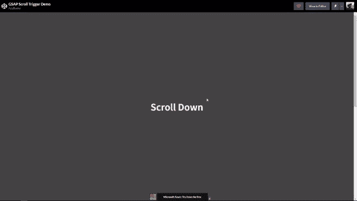

# 如何在 GSAP 使用滚动触发插件

> 原文：<https://javascript.plainenglish.io/how-to-use-the-scroll-trigger-plugin-in-gsap-36ecbef854a?source=collection_archive---------13----------------------->

## 如何使用 GSAP 创建基于滚动的动画

Photo by [Pontus Wellgraf](https://unsplash.com/@wellgraf?utm_source=medium&utm_medium=referral) on [Unsplash](https://unsplash.com?utm_source=medium&utm_medium=referral)

今天我们将使用 GSAP 和 GSAP 插件 *ScrollTo* 和 *Scroll Trigger* 来创建下面看到的令人敬畏的动画。

Example of Animation

添加基于滚动的动画可以很好地给一个枯燥的网站增加一些刺激。作为网站开发人员，我们的工作是*而不是*仅仅创建一个功能性网站

但也很有趣。

我不知道你是怎么想的，但是在网站上看到一点点动画都会让我更加难忘。

说够了

让我们直接进入制作动画。

*在文章的最后有一个完整代码的链接*

# 添加 HTML

创建动画的第一步是以 HTML 的形式添加一些标记。

没有任何 HTML，GSAP 就没有任何东西可以制作动画。

把 GSAP 想象成厨师，把 HTML 想象成配料。

如果没有配料，厨师再好也没用！

下面我提供了我们需要的 HTML:

由于 GSAP 是一个外部包，默认情况下不会随我们的项目一起提供，我们必须找到一种方法来导入它。

我们将通过使用 CDN 并使用脚本标签将其添加到我们的项目中来实现这一点。

下面的代码应该放在我们添加的 HTML 的之后的*:*

# 添加 CSS

现在我们已经添加了 HTML，接下来是下一步:

添加 CSS

为了继续我们的厨师类比，CSS 就像阻止配料(HTML)尝起来平淡无味的调味品。

如果你现在看这个项目，它会有点无聊，但是下面的 CSS 会让它变得有趣一点:

# 创建实际的动画

现在我们已经建立了我们的项目，是时候开始制作真正的动画了。

这方面的第一步将是使用 GSAP 时间线来创建动画。

如果你不知道 GSAP 的时间线是什么，这是一种将许多 GSAP 动画串联起来的方式。将动画链接在一起允许我们连续运行动画。

这允许一个包含许多 HTML 元素的大动画。

这方面的代码如下:

# 添加“滚动到”功能

如果你现在看一下这个项目，你会看到标题为“向下滚动”的 h1 元素。

我们现在将使用 ScrollToPlugin 来允许我们单击 HTML 元素并滚动到动画。

这方面的代码如下:

# 结论

在这里可以找到[**到 CodePencan 的链接**](https://codepen.io/azizbooker/pen/LYxmLJQ)

感谢你阅读完我的文章**“如何在 GSAP 使用滚动触发插件”**。我希望你有美好的一天。以下是我的一些进一步的文章供你阅读:

 [## 如何使用 GSAP 制作基于滚动的 JavaScript 动画

### 如何使用 GSAP 动画库来制作动画？

javascript.plainenglish.io](/how-to-make-scroll-based-animation-in-javascript-using-gsap-cfd65e7cc81f)  [## 作为一名网络开发者，你需要 7 个 Chrome 扩展

### 让你的开发者生活更美好的扩展。

javascript.plainenglish.io](/7-chrome-extensions-you-need-as-a-web-developer-b5521025fb90)  [## 启动你的计算机科学职业生涯的 5 大资源

### 如果让我重来一次，我会选择的路。

javascript.plainenglish.io](/5-great-resources-to-kick-start-your-computer-science-career-ffb243ec8e6d) 

*更多内容看*[***plain English . io***](http://plainenglish.io/)