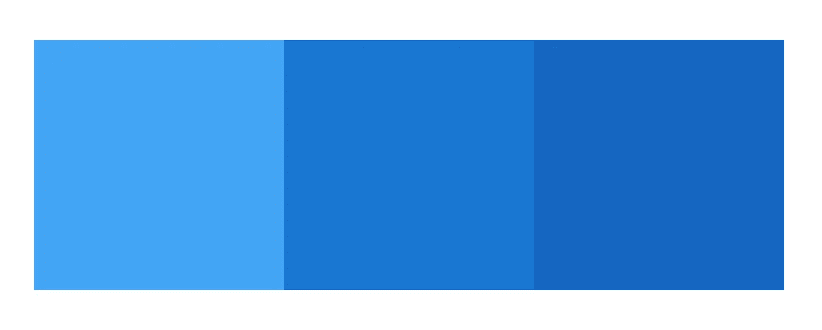

# 如何在材质界面版本 5 中使用“sx”道具

> 原文：<https://javascript.plainenglish.io/how-to-use-the-sx-prop-in-material-ui-version-5-e4d8018e297c?source=collection_archive---------3----------------------->

## sx prop 是定义可以访问主题的自定义样式的快捷方式


Photo by [Ferenc Almasi](https://unsplash.com/@flowforfrank?utm_source=medium&utm_medium=referral) on [Unsplash](https://unsplash.com?utm_source=medium&utm_medium=referral)

Material-UI，现在更名为 MUI，上周发布了第 5 版。如果你想获得新内容的概要，可以看看下面的文章。

[](/whats-new-in-material-ui-version-5-5ebfaea0eba6) [## Material-UI 版本 5 的新特性

### Material-UI 现在是 MUI！

javascript.plainenglish.io](/whats-new-in-material-ui-version-5-5ebfaea0eba6) 

这个版本中最大的变化之一是从 JSS 到情感的转变。

在版本 4 中，样式化 Material-UI 组件最简单的方法是使用`makeStyles`函数。但是，在版本 5 中，这种做法已被否决。

如果您使用的是 Material-UI 的第 4 版，请查看下面的文章以了解`makeStyles`函数。

[](/the-easiest-way-to-style-your-material-ui-components-the-makestyles-function-a66ab7b9fe01) [## 样式化你的材质 UI 组件的最简单的方法:makeStyles 函数

### 如何在 Material-UI 中使用 makeStyles 函数

javascript.plainenglish.io](/the-easiest-way-to-style-your-material-ui-components-the-makestyles-function-a66ab7b9fe01) 

随着从 JSS 到情感的迁移，引进了`sx`道具。

# 什么是`sx`道具？

`sx`道具是定义可以访问主题的自定义样式的快捷方式。向组件添加样式是一个简单的解决方案，不必像使用样式化组件那样命名它们。

所有 MUI 组件上都有`sx`道具。

在本文中，我们将了解如何使用`sx`道具执行以下操作:

*   向任何组件添加 CSS 属性和选择器
*   使用主题感知属性
*   定义与主题中定义的断点相对应的响应值

# 向任何组件添加 CSS 属性和选择器

要向任何 MUI 组件添加样式，请向`sx` prop 传递一个要应用于该组件的 CSS 属性对象。

例如，我将使用`sx` prop 向 Box 组件添加以下 CSS 属性。

```
<*Box* ***sx*={{
    minHeight: '100vh',
    width: '100%',
    display: 'flex',
    justifyContent: 'center',
    alignItems: 'center',
  }}**
>
  <*Box
   *** *sx*={{
      backgroundColor: '#42a5f5',
      padding: '80px',
    }}**
  />
  <*Box* ***sx*={{
      backgroundColor: '#1976d2',
      padding: '80px',
    }}**
  />
  <*Box* ***sx*={{
      backgroundColor: '#1565c0',
      padding: '80px',
    }}**
  />
</*Box*>
```

然后我们会有一个看起来像这样的应用程序。



这里可以使用任何有效的 CSS，包括伪选择器、媒体查询和嵌套选择器。

您还可以对一些 CSS 属性使用快捷键。例如:

*   `m`为*余量*
*   `p`用于*填充*

您可以在这里看到所有定制系统属性的列表[。](https://mui.com/system/properties/)

# 使用主题感知属性

我们也可以在`sx`道具中访问 MUI 主题。

下面的代码相当于上面的例子。

```
<*Box
  sx*={{
    minHeight: '100vh',
    width: '100%',
    display: 'flex',
    justifyContent: 'center',
    alignItems: 'center',
  }}
>
  <*Box
    sx*={{
      **bgcolor: 'primary.light',
      p: 10,**
    }}
  />
  <*Box
    sx*={{
      **bgcolor: 'primary.main',
      p: 10,**
    }}
  />
  <*Box
    sx*={{
      **bgcolor: 'primary.dark',
      p: 10,**
    }}
  />
</*Box*>
```

如您所见，对于每个盒子的背景颜色，我们没有使用标准颜色，而是传递了`primary.main`。这将相当于`theme.palette.primary.main`。

我们也使用简写`p`来表示*填充*。值`10`将等于`theme.spacing(10)`。

您还可以访问其他属性的主题，包括:

*   边界
*   显示
*   格子
*   调色板
*   位置
*   阴影
*   胶料
*   间隔
*   排印

你可以点击查看完整名单[。](https://mui.com/system/the-sx-prop/#theme-aware-properties)

# 定义与主题中定义的断点相对应的响应值

`sx` prop 上的所有属性也支持为特定断点定义值。

您可以将对象中的断点作为值添加到属性中。

```
<*Box
  sx*={{
    minHeight: '100vh',
    width: '100%',
    display: 'flex',
    justifyContent: 'center',
    alignItems: 'center',
  }}
>
  <*Box
    sx*={{
      **bgcolor: {
        xs: 'primary.light',
        sm: 'secondary.light',
      },**
      p: 10,
    }}
  />
  <*Box
    sx*={{
      **bgcolor: {
        xs: 'primary.main',
        sm: 'secondary.main',
      },**
      p: 10,
    }}
  />
  <*Box
    sx*={{
      **bgcolor: {
        xs: 'primary.dark',
        sm: 'secondary.dark',
      },**
      p: 10,
    }}
  />
</*Box*>
```

现在，我们的盒子将有主要的颜色变化(蓝色)，直到我们变得比小断点(600 像素)大。那么盒子将会有第二种颜色变体(紫色)。


# 结论

感谢阅读！我希望这篇文章对你开始在 MUI 中使用`sx`道具有所帮助。

我还在适应这个新的造型方案，但是到目前为止，我已经很喜欢这个体验和新版本的 MUI 了！

**也读作:**

[](/i-made-my-first-open-source-contribution-to-material-ui-bf89345ccec2) [## 我对 Material-UI 做了第一次开源贡献

### 你也可以！

javascript.plainenglish.io](/i-made-my-first-open-source-contribution-to-material-ui-bf89345ccec2) 

## 进一步阅读

[](https://bit.cloud/blog/how-to-build-material-ui-components-with-bit-l3isiibs) [## 如何用 Bit 构建 React 材质 UI 组件

### Material UI 是一个流行的开源()UI 组件库，它将材质设计与 React 结合在一起。材料 UI 是…

比特云](https://bit.cloud/blog/how-to-build-material-ui-components-with-bit-l3isiibs) 

*更多内容请看*[***plain English . io***](https://plainenglish.io/)*。报名参加我们的* [***免费周报***](http://newsletter.plainenglish.io/) *。关注我们关于*[***Twitter***](https://twitter.com/inPlainEngHQ)[***LinkedIn***](https://www.linkedin.com/company/inplainenglish/)*[***YouTube***](https://www.youtube.com/channel/UCtipWUghju290NWcn8jhyAw)***，以及****[***不和***](https://discord.gg/GtDtUAvyhW) *对成长黑客感兴趣？检查* [***电路***](https://circuit.ooo/) ***。*****