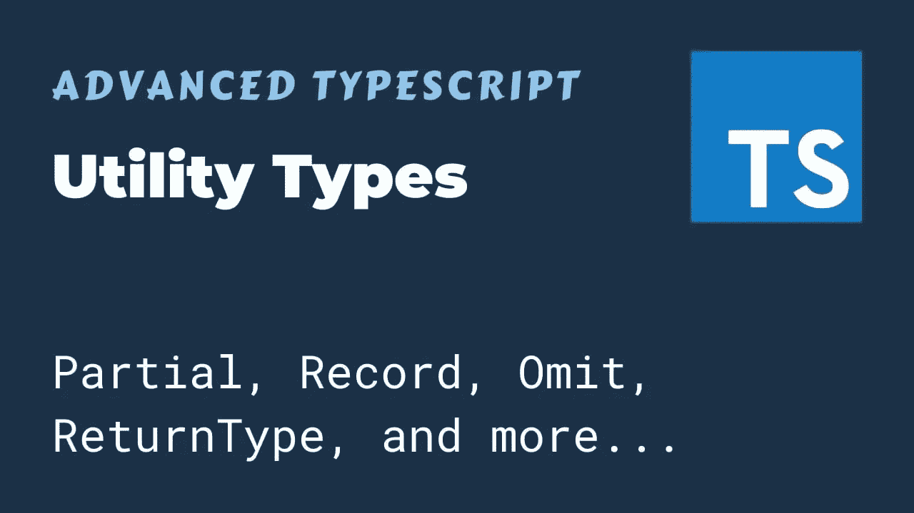

# 如何使用实用工具类型来转换 TypeScript 类型

> 原文：<https://javascript.plainenglish.io/how-to-use-utility-types-for-transforming-typescript-types-d916bbb99362?source=collection_archive---------21----------------------->



TypeScript 提供了一些内置的实用工具类型，有助于将类型从一种形式转换为另一种形式。

这些实用程序全球通用。它们在各种情况下都很方便。

# 类型脚本泛型

在理解 TypeScript 实用工具类型之前，理解类型别名和泛型非常重要。您可以为 TypeScript 中的任何现有类型创建类型别名。

```
type MyString = string;let helloWorldMessage: MyString = 'Hello Wisdom Geek';
```

类型泛型用于创建可重用的类型别名。假设我们有一个身份函数，它返回传入的任何值:

类型泛型用于创建可重用的类型别名。假设我们有一个身份函数，它返回传入的任何值:

```
const identity = (arg: string): string => arg;
```

如果我们想对一个数字使用这个函数呢？我们可以用任何类型替换特定类型。

```
const identity = (arg: any): any => arg;
```

但是这减少了参数的类型信息，从而失去了使用 TypeScript 的全部好处。我们希望以一种可以用来表示返回类型的方式来捕获参数的类型。这就是泛型的用武之地。我们将使用一个作用于类型而不是值的类型变量。

```
const identity = (arg: Type): Type => arg;
```

我们在调用函数时指定函数的类型:

```
const output = identity<string>("Hello Wisdom Geek");
```

现在我们知道了这些基础知识，让我们深入研究 TypeScript 中内置的实用程序类型函数。

# TypeScript 中的内置实用工具类型

在我们进入实用程序类型之前，有一点很重要，那就是从 4.0 版本开始，这些都是可用的，不需要任何额外的包。

# 部分的

Partial 构造一个类型，该类型的所有属性都是可选的。例如:

```
type BlogPost = {
  title: string;
  author: string;
}type PartialBlogPost = Partial<BlogPost>;
/* same as {
  title?: string;
  author?: string;
} */
```

这种情况的一个常见用例是在更新项目时，您可能希望提供已更改属性的子集，而不是所有属性。

# 需要

这是 Partial 的反义词。它使得输入类型的所有属性都是必需的。

```
type PartialBlogPost = {
  title?: string;
  author?: string;
}type BlogPost = Required<PartialBlogPost>;
/* same as {
  title: string;
  author: string;
} */
```

这种情况的一个用例是，部分代码需要所有成员都存在，但它们在其他地方可以是可选的。在需要它们的地方，您可以显式地使用所需的内置实用程序类型来确保这些值已经初始化，并且您不必在该代码块中处理空值检查。

# 只读

这将构造一个输入类型的所有属性都设置为只读的类型。不能重新分配返回类型的属性。

```
type BlogPost = {
  title: string;
  author: string;
}type BlogPost = Readonly<PartialBlogPost>;
/* same as {
  readonly title: string;
  readonly author: string;
} */
```

这个的用法有点明显，冻结一个对象并防止编辑。

# 挑选

这是一种更高级的实用程序类型。它只允许从输入类型中选择指定的键。

```
type Point3D = {
  x: number,
  y: number,
  z: number,
};type Point2D = Pick<Point3D, 'x' | 'y'>;
/* same as {
  x: number,
  y: number
} */
```

# 省略

省略了 Pick 反义词。它允许排除不需要的属性。

```
type Point3D = {
  x: number,
  y: number,
  z: number,
};type Point2D = Omit<Point3D, 'z'>;
/* same as {
  x: number,
  y: number
} */
```

# 记录

给定一组由键和相应的属性值指定的属性，得到的类型是键-值对的记录。因此，记录<keys type="">将提供一种机制，通过将键中指定的所有单元类型映射到指定的类型作为其值的类型来创建接口。</keys>

```
type BlogPost = Record<'title'| 'author', string>/* same as {
  title: string;
  author: string;
} */
```

如果所有类型都有相同的值，那么声明的记录版本会更简洁，可读性更好，因为很明显它们都有相同的类型。

# 提取

这通过仅包括在两个给定类型中都存在的键来提取类型。

```
type T0 = Extract<"a" | "b" | "c", "a" | "f">;
     // type T0 = "a"
type T1 = Extract<string | number | (() => void), Function>;  
     // type T1 = () => void
```

可以认为是两种类型的交集。在您想要找到两种类型的公共基础的情况下，它会很有用。

# 排除

这是提取的反义词。它不包括给定类型中重复的键。

```
type T0 = Exclude<"a" | "b" | "c", "a">;
     // type T0 = "b" | "c"type T1 = Exclude<string | number | (() => void), Function>;
     // type T2 = string | number
```

# 不可空

这是从类型值中排除 null 和 undefined 的简单方法。

```
type T0 = NonNullable<string | number | undefined>;
     // type T0 = string | numbertype T1 = NonNullable<string[] | null | undefined>;
     // type T1 = string[]
```

# 结论

这些是转换 TypeScript 类型最常用的实用工具类型。还有一些其他类型，如 Parameters、ConstructorParameters、ReturnType 和 InstanceType，它们存在但不经常使用。如果你有兴趣，你可以在这里查看它们的用法。

如果你对这些类型的用法有任何疑问，请在下面留言。

*原载于 2021 年 5 月 20 日 https://www.wisdomgeek.com**的* [*。*](https://www.wisdomgeek.com/development/web-development/typescript/using-utility-types-for-transforming-typescript-types/)

*更多内容请看*[*plain English . io*](http://plainenglish.io/)